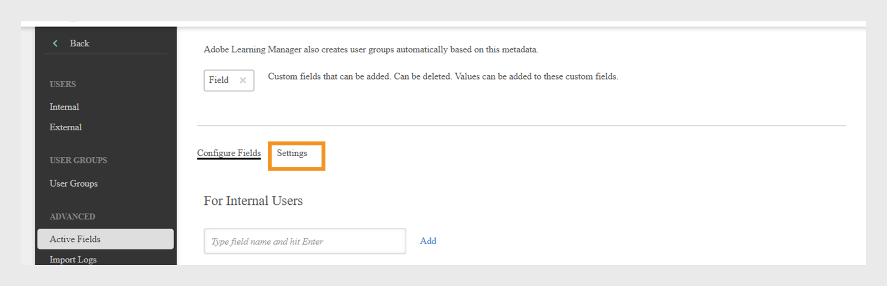
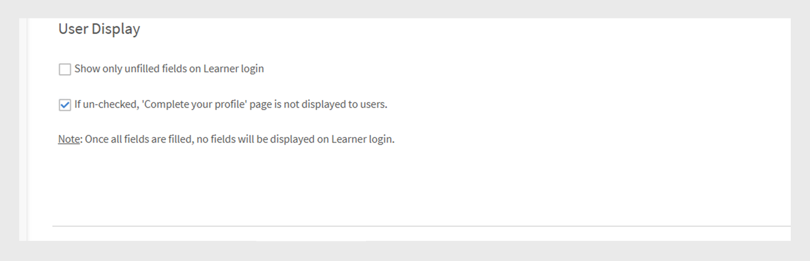

# Campos ativos

Os campos ativos no Adobe Learning Manager são atributos personalizados do usuário que ajudam os administradores a organizar e gerenciar usuários com eficiência. Eles permitem que você capture informações adicionais sobre o usuário, como departamento, local ou cargo. Os administradores podem usar esses dados para criar grupos de usuários, personalizar o aprendizado e filtrar relatórios com mais eficiência.

Atributos de usuário são informações como nome, sobrenome e endereço de email do usuário. Esses atributos ajudam os administradores a:

* Identificar usuários
* Agrupar usuários
* Gerenciar permissões de usuário e restrições de acesso

Adicionando atributos personalizados aos perfis de usuário, os campos ativos capturam informações adicionais relevantes para sua organização.

>[!INFO]
>
>Assista a este treinamento do ALM Academy para saber como adicionar, personalizar e configurar campos ativos.  

## Adicionar campos ativos

Os campos ativos se aplicam a alunos internos e externos, permitindo que as organizações definam e gerenciem atributos de usuário personalizados para todos os usuários.

Para adicionar ou gerenciar campos ativos para usuários internos:

1. Selecione **Usuários** na home page do administrador.

2. Selecione **Campos Ativos**.

3. Digite o nome do campo ativo e selecione **Adicionar**. O processo para adicionar campos ativos para alunos externos é o mesmo que para alunos internos.

   
   _Campo para inserir o nome de um novo atributo personalizado para usuários_

4. Selecione **Salvar**.

## Adicionar valores personalizados a campos ativos

Os campos ativos podem incluir valores predefinidos ou personalizados que correspondam à estrutura da sua organização. A adição de valores personalizados ajuda a capturar detalhes específicos de seus usuários internos, como nomes de departamentos, níveis de cargo ou escritórios regionais.

Para adicionar valores personalizados para usuários internos:

1. Selecione **Exibir Valores** na seção **Campo Ativo**.
2. Na caixa de diálogo **Valores em Campos Personalizados**:

   * Selecione um campo ativo na lista suspensa **Selecionar Campo**.
   * Digite os valores do campo ativo no campo **Novo Valor**.

   
   _Caixa de diálogo para inserir valores personalizados para um campo ativo específico_

3. Selecione **Concluído** e selecione **Salvar** para aplicar as alterações.

## Definir configurações de campo ativo

Personalize campos ativos para ajudar com o gerenciamento de usuários e tarefas de relatório e configure as propriedades dos campos ativos:

* **Agrupável**: esta opção permite agrupar alunos com base em valores de campo ativos.
* **Relatável**: esta opção permite criar um grupo de usuários de relatórios com base no valor do campo ativo e habilita o filtro de relatórios para o campo nos relatórios do painel.
* **Configurável pelo aluno**: esta opção permite que os alunos configurem o campo por conta própria.
* **Exportável**: esta opção inclui o campo ativo nos relatórios de grupos de usuários exportados.
* **Valores Múltiplos**: esta opção oferece suporte a vários valores para o campo ativo.

Para definir configurações de campos ativos:

1. Selecione a guia **Configurações** e navegue até a seção **Exibição do Usuário**.

   
   _Selecione a guia Configurações para personalizar os campos ativos_

2. Selecione uma ou ambas as opções, conforme necessário.:

   * **Mostrar apenas campos não preenchidos no logon do aluno:** quando selecionado, os alunos verão apenas os campos ativos que ainda não preencheram. Isso solicita que o usuário conclua seu perfil, ajudando a garantir que os dados do usuário sejam precisos e atualizados. A exibição desses campos suporta perfis completos do aluno e permite experiências de aprendizado personalizadas.
   * **Se essa opção estiver desmarcada, a página &#39;Concluir seu perfil&#39; não será exibida aos usuários:** Quando essa opção estiver desabilitada, os alunos não verão a página **Concluir seu perfil** após o logon. Eles não serão solicitados a atualizar ou preencher quaisquer informações de perfil e podem acessar a plataforma diretamente.

   
   _Interface de configurações para controlar como e quando os campos ativos são exibidos_

3. Selecione **Salvar** para aplicar suas alterações.

>[!NOTE]
>
>A atribuição de uma nova função não afetará os grupos de usuários personalizados. No entanto, isso afetará grupos de usuários gerados automaticamente, como Todos os administradores, Todos os autores e grupos semelhantes baseados em funções.

## Campos ativos de valores múltiplos

Os campos ativos de valores múltiplos permitem atribuir vários valores a um único atributo de usuário, como locais, cargos ou equipes de projetos. Isso ajuda a capturar informações mais detalhadas e flexíveis do usuário.

Você pode configurar até três campos ativos de valores múltiplos por conta. Elas estão disponíveis para usuários internos e externos. Depois que um campo é definido como valores múltiplos, essa configuração não pode ser alterada de volta.

Para atribuir vários valores a um campo ativo:

1. Selecione **Usuários** e selecione **Campos Ativos**.
2. Na guia **Configurações**, selecione **Valores múltiplos**.

_Interface de configurações para controlar como e quando os campos ativos são exibidos_

É possível adicionar vários valores por meio do CSV ou da interface do usuário. Depois que o campo de valores múltiplos é usado em um grupo de usuários, ele não pode ser alterado para valor único.

## Adicionar campos ativos carregando um CSV

Adicione campos ativos ao fazer upload de usuários por CSV incluindo cabeçalhos correspondentes para cada campo definido. Os administradores podem fazer upload de usuários em massa usando um arquivo CSV. O CSV deve incluir os novos campos ativos que definem os usuários a serem importados. Certifique-se de que os nomes de cabeçalho no arquivo correspondam exatamente aos campos ativos configurados no sistema para que os dados sejam mapeados corretamente. Carregue o arquivo CSV da seção **Usuários**.

Exiba este [artigo](/help/migrated/administrators/feature-summary/add-users-user-groups.md) para obter mais informações sobre como adicionar usuários em massa.

## Restringir valores para campos CSV

A opção **Restringir Seleção** em **Valores em Campos Personalizados** controla se os usuários que importam dados por meio de arquivos CSV só podem selecionar valores predefinidos para campos personalizados. Quando ativado, os usuários devem escolher na lista de valores definida, garantindo a consistência dos dados e evitando entradas novas ou inesperadas. Se desativada, os usuários podem inserir qualquer valor, oferecendo mais flexibilidade, mas menos controle sobre a precisão dos dados.

_Caixa de seleção para habilitar a restrição de valor durante o carregamento de CSV_

## Gerenciar campos ativos ausentes na importação de CSV do usuário

Em alguns casos, os administradores preferem que os alunos preencham manualmente determinados campos ativos quando fazem logon no Adobe Learning Manager. Isso é compatível com usuários importados por meio de um arquivo CSV. Consulte este [artigo](/help/migrated/administrators/feature-summary/add-users-user-groups.md) para saber como adicionar usuários em massa. Os usuários são adicionados automaticamente a campos ativos ou grupos baseados em função com base nos valores de campo do Box FTP. Eles não podem ser adicionados aos Grupos personalizados.

Se um arquivo CSV não incluir todos os campos ativos, o administrador deverá inserir manualmente os valores ausentes após a importação.

Por padrão, cada campo ativo deve ser mapeado para um campo correspondente no CSV de origem. No entanto, se não quiser mapear um campo ativo específico para qualquer coluna no CSV, você pode selecionar o valor **DontImportFromSource** na lista suspensa durante os processos de importação do Box e do FTP. Essa opção está disponível ao importar usuários por meio de conectores FTP ou Box. Consulte este [artigo](https://experienceleague.adobe.com/en/docs/learning-manager/using/integration/connectors) para obter mais informações sobre os conectores.

