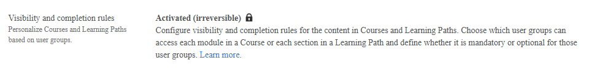

# Cursos adaptáveis no Adobe Learning Manager

Os cursos adaptáveis no Adobe Learning Manager permitem que você forneça um curso a vários públicos controlando quais módulos cada aluno vê e quais são necessários, com base nos grupos de usuários aos quais pertencem.

Em vez de criar cursos separados para cada função, região ou perfil de conformidade, um único curso adaptável apresenta dinamicamente o conteúdo certo para o aluno certo.

## Quais cursos adaptativos a problemas resolver

As organizações que treinam forças de trabalho grandes e diversas enfrentam um desafio comum: a privacidade de dados, a ética do local de trabalho e a segurança devem chegar aos alunos com diferentes funções, locais ou obrigações de conformidade.

Isso cria duplicação: os autores mantêm vários cursos quase idênticos, os relatórios são fragmentados e, quando o conteúdo principal é alterado, cada cópia precisa ser atualizada.

Um curso adaptável resolve isso permitindo que os autores configurem regras de visibilidade e conclusão no nível do módulo, vinculadas a grupos de usuários. Um curso atende a cada público simultaneamente.

### Cenários comuns

- Um curso de conformidade tem um módulo principal para todos os funcionários, além de módulos de adendo específicos da jurisdição. Cada aluno vê apenas os adendos que se aplicam ao seu local.
- Um curso de nova contratação mostra módulos diferentes para funcionários, gerentes e prestadores de serviço. Cada função vê apenas o que é relevante para eles.
- Um curso de segurança adiciona um novo módulo obrigatório no meio do ano. Os administradores acionam uma conclusão de atualização, portanto todos os alunos concluídos anteriormente devem fazer o novo módulo para permanecer em conformidade.

### Exemplo do mundo real

Uma organização implementa um curso obrigatório de conformidade para toda a sua força de trabalho. O curso contém sete módulos:

- Dois módulos se aplicam a todos os funcionários.
- Dois módulos se aplicam apenas a gerentes de pessoas.
- Dois módulos se aplicam apenas a colaboradores individuais em funções técnicas.
- Um módulo se aplica somente a diretores sênior e acima.

## Como funcionam a visibilidade e a conclusão do módulo

Cada módulo de conteúdo em um curso adaptável tem duas configurações:

**Visível para:** grupos de usuários que podem ver o módulo. Os alunos desses grupos veem o módulo no curso e podem acessá-lo, mas isso não conta para a conclusão, a menos que também estejam em **Obrigatório para**.

**Obrigatório para:** grupos de usuários para os quais o módulo é necessário para concluir o curso. Um módulo listado em **Obrigatório para** é automaticamente visível para esses grupos; não é necessário adicionar os mesmos grupos a ambas as configurações.

Um módulo está em um dos três estados de qualquer aluno específico a qualquer momento:

| Estado | Como é determinado | Conta para a conclusão? |
|---|---|---|
| Obrigatório | O aluno está em um grupo de usuários listado em **Obrigatório para** | Sim - deve ser concluído |
| Opcional | O aluno está em um grupo em **Visível para**, mas não é **obrigatório para** | Não - visível e acessível, mas não obrigatório |
| Oculto | O aluno não está em nenhum grupo em nenhuma das configurações | Não visível para o aluno |

## Características de um curso adaptativo

A característica definidora dos cursos adaptáveis é que o curso avalia o perfil do aluno continuamente, não apenas na inscrição.

Quando o grupo de usuários de um aluno muda enquanto ele está inscrito:

- Os módulos que não estão mais visíveis no novo grupo de usuários desaparecem imediatamente.
- Se um módulo recém-visível for obrigatório para seu novo grupo de usuários, ele será adicionado ao seu requisito de conclusão.
- Se um módulo obrigatório anterior não for mais obrigatório, ele será removido de seu requisito de conclusão.
- Os módulos concluídos anteriormente permanecem concluídos. Uma alteração de perfil não redefine o trabalho já feito.

### Cancelamento automático de inscrição

Se uma alteração no grupo de usuários remover todos os módulos obrigatórios de um aluno, a inscrição do aluno será automaticamente cancelada no curso.

### Completamento automático

Se uma alteração do grupo de usuários remover todos os módulos obrigatórios incompletos restantes de um aluno em andamento, o curso será concluído automaticamente para esse aluno.

Se uma alteração de perfil resultar em novos módulos obrigatórios que o aluno não concluiu, um administrador pode acionar uma conclusão de atualização para reverter a conclusão existente e exigir que o aluno conclua os novos módulos.

## O que se adapta e o que permanece o mesmo

As regras adaptativas aplicam-se apenas a **módulos de conteúdo**. As instruções a seguir se aplicam a todos os alunos inscritos, independentemente do grupo de usuários:

- **Módulos de pré-trabalho:** mostrados a todos os alunos antes do início do conteúdo principal.
- **Módulos de teste:** disponíveis para todos os alunos; ao concluir um teste, o curso é concluído, independentemente do status do módulo de conteúdo.
- **Pré-requisitos:** se um curso tiver pré-requisitos configurados, todos os alunos devem atender a esses pré-requisitos antes de se inscreverem, independentemente do grupo de usuários. Os pré-requisitos não são adaptáveis e não podem ter escopo definido para grupos de usuários específicos.

As ajudas de tarefa e os recursos anexados ao curso também não são adaptativos. Eles são visíveis para todos os alunos inscritos.

Habilidades, pontos de gamificação e medalhas são concedidos com base na primeira conclusão do curso do aluno e não são afetados por reconclusões resultantes de alterações no perfil.

>[!NOTE]
>
>Quando um curso adaptável faz parte de um OA de ordem superior que é compartilhado externamente, o curso adaptável será copiado como um curso regular na conta da criança.

## Disponibilidade de recursos

O recurso adaptável do curso é controlado por um sinalizador de nível de conta em dois níveis. Entre em contato com a equipe da sua conta de Adobe para ativar esse recurso para sua conta.

Quando o sinalizador de conta estiver ativado:

- Uma alternância de **Regras de conclusão e visibilidade** fica disponível ao criar ou editar um curso.
- Ativar a alternância ativa o painel de configuração adaptável.

**Cuidado:** a habilitação do sinalizador de recurso adaptável é **irreversível**. Uma vez ativado no nível da conta, não pode ser desativado.

## Compartilhamento de catálogo

Os cursos adaptativos podem ser adicionados aos catálogos da sua conta. Quando um catálogo é compartilhado externamente para uma conta entre parceiros, os cursos adaptáveis são excluídos automaticamente do conteúdo compartilhado.

>[!NOTE]
>
>Quando um caminho de aprendizado ou uma certificação que contém um curso adaptável é compartilhado externamente, a conta de recebimento vê o caminho de aprendizado ou a certificação no catálogo, mas o curso adaptável dentro dele não é exibido. O objeto de aprendizado não é totalmente excluído; apenas o componente adaptável do curso é removido da versão compartilhada. Os autores na conta de recebimento devem estar cientes de que o Objeto de aprendizado compartilhado pode ter menos módulos do que a versão de origem.

>[!NOTE]
>
>Quando um curso adaptativo é configurado como um pré-requisito de outro curso e esse curso pai é compartilhado com uma conta de recebimento por meio do compartilhamento do catálogo, o curso de pré-requisito adaptativo não é compartilhado com a conta de recebimento. Isso se aplica se o pré-requisito for definido diretamente no curso ou por meio de um Objeto de aprendizado de ordem superior, como um Caminho de aprendizado ou certificação.
>
>Na conta receptora, o curso pai está disponível, mas o pré-requisito adaptativo está ausente. Os alunos na conta de recebimento não são afetados pelo pré-requisito ausente porque a dependência de pré-requisito não é imposta para o conteúdo que chega pelo compartilhamento de catálogo sem seus pré-requisitos presentes.
>
>Não configure cursos adaptáveis como pré-requisitos para o conteúdo que pretende compartilhar externamente.

## Configurações compatíveis

| Configuração | Compatível? |
| --- | --- |
| Curso adaptativo em um caminho de aprendizado normal | Sim (veja a nota abaixo) |
| Curso adaptável em um caminho de aprendizado flexível | Sim |
| Curso adaptável em um caminho de aprendizado adaptável | Não |
| Curso adaptativo em uma certificação | Sim (não recomendado para certificações recorrentes) |
| Várias inscrições | Não |
| Troca de instância | Sim |
| Compartilhamento de catálogo (entre contas) | Não |
| Regras de visibilidade nos módulos de pré-trabalho ou de teste | Não |
| Regras de visibilidade nos principais módulos de conteúdo | Sim |
| Curso adaptável em um caminho de aprendizado flexível | Sim |

>[!NOTE]
>
>Ao baixar o **PDF do relatório de participação** para uma sessão em um curso adaptável que faz parte de um caminho de aprendizado do Flex, os alunos na lista de espera aparecem na seção Ativo do PDF. A interface do Caminho de aprendizado não tem uma seção de lista de espera dedicada, portanto, não existe nenhum bucket de lista de espera separado na exportação do PDF. Para identificar com precisão os alunos da lista de espera, verifique **Administrador > [Curso adaptável] > Lista de espera** antes de marcar a participação.

A coluna **Incorporado em** no relatório de lista de espera identifica as instâncias do Caminho de Aprendizado do Flex que contêm esse curso adaptativo como um constituinte. Ela mostra o nome do Caminho de aprendizado e a ID do Objeto de aprendizado. Não tem a intenção de mostrar caminhos de inscrição individuais do aluno. Para cursos adaptativos aninhados em um subcaminho de aprendizado que está dentro de um caminho de aprendizado pai, somente o caminho de aprendizado pai direto aparece nessa coluna.

Quando o curso adaptável faz parte de uma **certificação recorrente**, a conclusão da atualização se aplica somente à inscrição do aluno no ciclo de certificação raiz. Os ciclos recorrentes subsequentes contêm uma instância separada do curso adaptativo que não é afetada pela atualização. Os alunos inscritos em um ciclo recorrente não veem as atualizações do módulo nem têm as conclusões revertidas. Se a sua organização usa cursos adaptáveis em certificações recorrentes, comunique essa limitação aos administradores antes de acionar a conclusão da atualização.

>[!NOTE]
>
>Quando um curso adaptável é incluído em um caminho de aprendizado **ordenado**, os alunos que não têm módulos visíveis no curso adaptável, porque seu grupo de usuários não corresponde a nenhuma regra de visibilidade do módulo, não podem concluir esse curso. Em um caminho de aprendizado ordenado, isso impede que todos os itens subsequentes se tornem acessíveis. Para evitar isso, certifique-se de que cada aluno inscrito no Caminho de Aprendizado pertença a pelo menos um grupo de usuários que tenha visibilidade de pelo menos um módulo em qualquer curso adaptável no caminho.

Além disso, não incorpore um caminho de aprendizado que contenha um curso adaptável em um caminho de aprendizado de ordem superior (aninhado). Nessa configuração, se um aluno não tiver módulos visíveis ou obrigatórios no curso adaptável, o reprodutor incorporado pode ficar sem resposta, impedindo a navegação pelo conteúdo restante. Esse comportamento está sendo tratado em uma versão futura.

>[!NOTE]
>
>Quando um aluno é cancelado automaticamente em um curso adaptável dentro de um caminho de aprendizado **regular**, porque uma alteração de grupo de usuários removeu todos os módulos visíveis, o caminho de aprendizado pai permanece em um estado inscrito. O Caminho de aprendizado não cancela a inscrição automaticamente. O aluno verá o Caminho de aprendizado como inscrito na transcrição, mesmo que o curso adaptável dentro dele não esteja mais acessível. Se o caso de uso exigir que o Caminho de Aprendizado pai também cancele a inscrição quando o curso adaptável, considere o uso de um **Caminho de Aprendizado adaptável** em vez de um Caminho de Aprendizado comum para conter o curso adaptável.

## Ativar cursos adaptáveis para sua conta

Ative o aprendizado adaptável para que os autores possam criar cursos que mostram módulos diferentes para diferentes alunos com base na associação a um grupo de usuários.

## Antes de ativar

- **Permanente:** depois de habilitado, o Aprendizado Adaptável não pode ser desativado para a conta.
- **Afeta os cursos e os Caminhos de Aprendizado simultaneamente:** o mesmo sinalizador que habilita os cursos adaptáveis também habilita os Caminhos de Aprendizado adaptáveis.
- **Os cursos existentes não foram alterados:** somente os cursos recém-criados podem se tornar adaptáveis. Nenhum curso regular existente é convertido automaticamente.
- **Os autores veem a opção imediatamente:** assim que você salva, o tipo de curso adaptável aparece no fluxo de trabalho de criação.
- **Provisionamento em duas camadas:** se sua conta foi provisionada para aprendizado adaptável, você verá a opção habilitada e bloqueada. Não pode ser alterado na interface do usuário. Se a conta não tiver sido provisionada, a configuração não estará visível. Entre em contato com o Adobe para solicitar provisionamento.

## Ativar cursos adaptáveis

1. Faça logon no Adobe Learning Manager como administrador.
2. Selecione **Configurações** no painel de navegação esquerdo.
3. Selecione **Geral**.
4. Navegue até a seção **Regras de visibilidade e conclusão**. Se o aprendizado adaptável tiver sido ativado para sua organização, a opção aparecerá como bloqueada, conforme mostrado:

O aprendizado adaptável agora está ativo para sua conta. Os autores podem criar cursos adaptáveis e caminhos de aprendizado adaptáveis imediatamente.

## O que muda após a ativação

Depois de ativar o aprendizado adaptável:

- Os autores veem uma opção de **Visibilidade de conteúdo e regras de conclusão** ao criar um curso, além do tipo de curso regular existente.
- Cada módulo de conteúdo em um curso adaptável pode ser configurado com regras **opcionais** e **obrigatórias** para grupos de usuários.
- Os alunos inscritos em um curso adaptável veem apenas os módulos que seus grupos de usuários tornam visíveis.
- Todos os cursos regulares existentes permanecem inalterados.

## Solução de problemas

- **A seção de regras de Visibilidade e conclusão não está visível em Configurações:** O recurso deve ser provisionado no back-end antes que a alternância apareça. Entre em contato com seu representante da conta Adobe ou com o Suporte Adobe para solicitar acesso.
- **A alternância já está habilitada e parece bloqueada:** O aprendizado adaptável foi habilitado quando sua conta foi provisionada. Nenhuma ação é necessária. Os autores já podem criar cursos adaptáveis.
