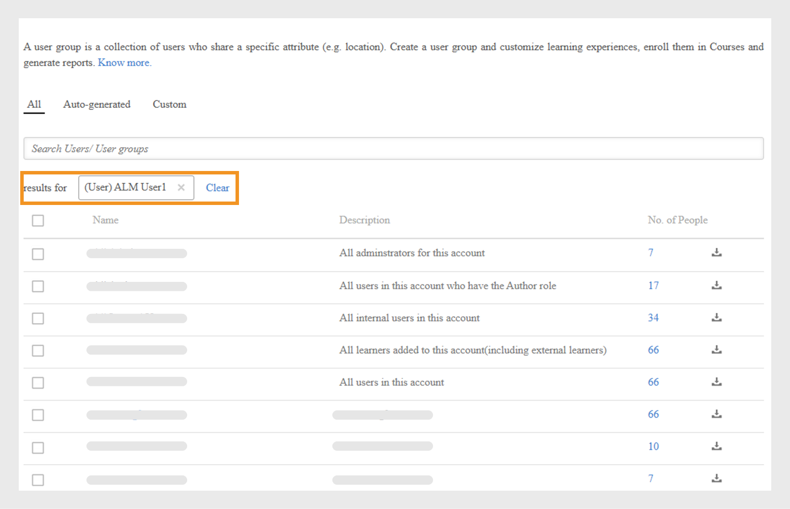

# Adicionar usuários no Adobe Learning Manager

No Adobe Learning Manager, os usuários são pessoas que usam a plataforma para aprendizado ou treinamento. Há dois tipos de usuários: usuários internos e usuários externos.

Usuários internos são funcionários ou membros da equipe de sua organização.

Usuários externos são pessoas de fora da empresa, como clientes, parceiros, fornecedores ou clientes, que podem acessar o conteúdo de aprendizado.

O Adobe Learning Manager (ALM) permite que os administradores integrem e gerenciem usuários internos e externos usando vários métodos, incluindo entrada manual, upload de CSV, autorregistro e integrações de sistema.

## Usuários internos

Usuários internos no Adobe Learning Manager se referem a funcionários ou membros da equipe na sua organização. Você pode adicioná-los manualmente, carregá-los em lote ou importá-los por meio de integrações de sistema. Depois de adicionar esses usuários, você pode organizá-los em grupos, atribuir cursos e monitorar seu progresso de aprendizado.

Os usuários no Adobe Learning Manager podem assumir diferentes responsabilidades e gerenciar várias tarefas com base em suas funções atribuídas. Cada função, incluindo administrador, autor, professor e administrador de integração, oferece um conjunto de recursos específicos personalizados para dar suporte às responsabilidades do usuário na plataforma.

O Adobe Learning Manager oferece suporte às seguintes funções de usuário:

* **Administrador**: gerencia usuários e grupos de usuários, atribui funções e configura preferências de todo o sistema, como fontes de dados, domínios permitidos e opções de exibição. Os administradores também são responsáveis por criar e organizar o conteúdo de aprendizado, monitorar o progresso do aluno, gerar relatórios e configurar integrações com sistemas externos.
* **Autor**: cria e gerencia conteúdo, incluindo módulos e cursos.
* **Gerente**: supervisiona as atividades de aprendizado da equipe, nomeia os membros da equipe para os cursos, aprova solicitações e fornece feedback.
* **Administrador de Integração**: gerencia integrações de sistema e conexões de dados entre o ALM e plataformas externas.
* **Funções personalizadas**: os administradores podem criar funções personalizadas para fornecer aos usuários acesso personalizado com base em suas responsabilidades. Consulte este artigo para obter mais informações sobre as funções personalizadas.

### Métodos para adicionar usuários internos

Os administradores podem adicionar usuários internos usando os seguintes métodos:

* **Adicionar um único usuário**: adicione manualmente um usuário por vez.
* **Perfil de autorregistro**: permite que os alunos se registrem como alunos no Adobe Learning Manager usando um link de registro criado pelo administrador.
* **Upload em massa via CSV**: faça upload de um arquivo CSV para adicionar vários usuários ao mesmo tempo.

### Adicionar manualmente um usuário interno

Os administradores podem adicionar usuários individuais manualmente inserindo seu nome, ID de e-mail, identificador exclusivo e nome do gerente. O Identificador exclusivo no Adobe Learning Manager é um identificador obrigatório que os administradores atribuem ao criar um usuário. Ele deve ser exclusivo para cada usuário e servir como uma referência consistente em todo o sistema.

>[!INFO]
>
>Assista a este treinamento do ALM Academy para saber mais sobre como adicionar usuários únicos no Adobe Learning Manager.  

Para adicionar um único usuário ao Adobe Learning Manager:

1. Faça logon como administrador.
2. Selecione **Usuários** e selecione **Internos**.
3. Selecione **Adicionar** e selecione **Usuário Único**.

   
   _Interface do administrador mostrando a opção de adicionar manualmente um único usuário interno_
4. No prompt **Adicionar usuário**, digite o **Nome**, o **Email** e o **Perfil** (cargo) do usuário.

   
   _Campos para inserir nome, email, identificador exclusivo e perfil para um novo usuário_
5. Procure o gerente do usuário e selecione o nome na lista de gerentes.
6. Selecione **Adicionar**.
O usuário recebe um e-mail de boas-vindas contendo um URL de logon para acesso.

### Permitir autorregistro para usuários internos

O autorregistro é um processo de integração de autoatendimento em que os usuários podem visitar um URL de registro, inserir seus detalhes e se inscrever automaticamente na plataforma. Esse método minimiza o esforço administrativo, permitindo que os usuários se registrem por meio do URL fornecido.

Para criar um URL de autorregistro para um usuário:

1. Faça logon como administrador.
2. Selecione **Usuários** e selecione **Internos**.
3. Selecione **Adicionar** no canto superior direito e selecione **Autorregistro.**

   
   _Menu suspenso para selecionar a opção de autorregistro_
4. No prompt **Adicionar Perfil de Autorregistro**, digite o perfil no campo **Nome do perfil** (cargo do usuário).
5. Selecione o gerente do usuário procurando pelo gerente no campo **Nome do Gerente**. O gerente atribuído ao perfil de autorregistro deve ser um usuário registrado no Adobe Learning Manager.

   
   _Campos de entrada para definir o cargo e atribuir um gerente a um perfil de autorregistro_
6. Selecione uma imagem usando a opção **Adicionar Imagem**. Essa imagem ficará visível para os alunos na seção de perfil.
7. Selecione **Salvar**.

   O Adobe Learning Manager cria um perfil de usuário e gera um URL de autorregistro, que pode ser compartilhado com os usuários para concluir o registro.

   
   _Mensagem de confirmação indicando criação bem-sucedida de uma URL de autorregistro_
8. Compartilhe o URL com os usuários que desejam se registrar.

   O URL pode ser compartilhado com vários usuários para registro. Por exemplo, você pode gerar uma URL para o perfil de **Associado de Vendas** e compartilhá-la com a equipe de Associados de Vendas para que eles possam se registrar.

_O link de autorregistro abre uma página de inscrição_

### Exibir a lista de URLs de autorregistro

Para exibir a lista de URLs de autorregistro:

1. Selecione **Usuários** e selecione **Internos**.
2. Selecione **Autorregistro**.

   Os administradores podem ver a lista de URLs de autorregistro.

_Exibição de lista que mostra URLs de autorregistro existentes disponíveis para usuários internos_

### Upload em massa de usuários internos

O Adobe Learning Manager permite que os administradores adicionem vários usuários de uma vez fazendo upload de um CSV que contém as informações do usuário, incluindo nome, ID de e-mail e nome do gerente. Esse recurso de upload em massa economiza tempo e esforço em comparação à adição de usuários individualmente.

>[!INFO]
>
>Assista a este treinamento do ALM Academy para saber como adicionar usuários em massa por meio de um CSV.   

Para adicionar vários usuários:

1. Faça logon como administrador.
2. Selecione **Usuários** e selecione **Internos**.
3. Selecione **Adicionar** no canto superior direito e selecione **Carregar um CSV**.

   
   _Opção para carregar um arquivo CSV para importação de usuário em massa_

4. Prepare um arquivo CSV com os seguintes campos:

   * Nome do funcionário*
   * E-mail do funcionário*
   * Perfil/Designação do Funcionário
   * ID/E-mail do gerente\
     (*) Campos obrigatórios.

5. Antes de adicionar a ID de e-mail de um gerente para qualquer funcionário, certifique-se de que o gerente já esteja incluído como um funcionário no arquivo CSV. Por exemplo, consulte o funcionário Howard Walters na captura de tela abaixo.

   
   _Imagem de CSV de amostra com todos os campos_

6. Faça upload do arquivo CSV e mapeie os campos de dados adequadamente.

   
   _Interface de mapeamento de CSV para alinhar colunas de planilha com campos do sistema_
7. Selecione **Salvar** para importar os usuários.

   Uma mensagem de confirmação é exibida após o upload bem-sucedido.

   
   _A imagem mostra o status de carregamento CSV como bem-sucedido_

>[!NOTE]
>
>Mantenha um CSV mestre para todas as adições e exclusões. Não é possível atualizar e reenviar um arquivo CSV existente.

Ao carregar um arquivo CSV para adicionar usuários, é importante incluir todas as informações relacionadas na ordem correta. Se você atribuir a ID de e-mail de um gerente a um funcionário, os detalhes do gerente deverão ser exibidos anteriormente no arquivo CSV. Isso garante que o sistema reconheça o gerente como um usuário existente antes de vinculá-lo aos membros de sua equipe. Por exemplo, se Howard Walters for gerente, inclua todos os detalhes do usuário no CSV antes de listar os funcionários que se reportam a ele.

### Gerenciar registro de usuário

Depois de adicionar usuários individualmente ou em massa, você precisa registrá-los para ativar suas contas. Isso permite que os usuários acessem o Adobe Learning Manager e comecem a usar a plataforma.

Para registrar os usuários:

1. Selecione **Usuários** na home page do administrador.
2. Marque as caixas de seleção ao lado dos nomes dos usuários que deseja registrar.
3. Selecione **Ações** e selecione **Registrar**.

   
   _Botão Registrar para ativar os usuários selecionados no Adobe Learning Manager_

4. Selecione **Sim** para ativar o usuário.

Um email de verificação é enviado ao usuário. O usuário deve selecionar o link no email para ativar sua conta e começar a usar o Adobe Learning Manager.

## Usuários externos

O Adobe Learning Manager permite adicionar usuários fora da empresa, como clientes, parceiros, fornecedores ou clientes, para acessar o conteúdo de aprendizado. Depois de adicionados, você pode agrupá-los, atribuir cursos e acompanhar seu progresso na aprendizagem.

A adição de usuários externos no Adobe Learning Manager envolve as seguintes etapas:

* Criar um perfil de registro externo
* Ativar o perfil de registro
* Compartilhar o link de registro com usuários externos
* Pause ou retome o perfil quando necessário

A Adobe Learning Manager oferece suporte à inscrição desses usuários por meio de perfis de registro externos.

Para criar um usuário externo, siga estas etapas:

1. Faça logon como administrador.
2. Selecione **Usuários** e selecione **Externos**.
3. No canto superior direito, selecione **Adicionar** para criar um registro para um usuário externo.
4. Na caixa de diálogo **Adicionar Perfil de Registro Externo**, forneça o seguinte:

   * **Nome do Perfil:** digite o nome da organização parceira que deseja acessar o Adobe Learning Manager
   * **Email do gerente:** digite o endereço de email do gerente do usuário.
   * **Limite de vagas:** defina o número máximo de inscrições permitidas.
   * **Expiração:** defina a última data para novos registros. Depois que ele expirar, o link não funcionará para o registro de um novo usuário.

   
   _Caixa de diálogo para inserir nome de perfil, email do gerente, limite de vagas e expiração_

5. Selecione uma imagem usando a opção **Adicionar Imagem**. Essa imagem ficará visível para os alunos na seção de perfil.
6. Selecione a seção **Configurações Avançadas** para expandi-la e digite os detalhes necessários:
   * **Requisito de Logon:** digite o número de dias. Se os alunos permanecerem inativos durante todo o período, eles serão removidos automaticamente.
   * **Domínios permitidos:** digite uma lista separada por vírgulas dos domínios de email permitidos. Somente usuários com endereços de email de domínios aprovados podem se inscrever.
   * **Verificação de email necessária:** selecione esta opção para aplicar a verificação de email durante o registro.

   
   _Painel Configurações avançadas para definir requisitos de logon, domínios permitidos e verificação de email_

7. Selecione **Salvar**.

Um URL de registro é gerado.

### Ativar o perfil externo

Para ativar o perfil externo:

1. Localize o perfil recém-criado na lista de perfis externos.

2. Selecione o botão de alternância **Status** para habilitá-lo.

O administrador pode compartilhar esse URL com o parceiro externo para que ele possa se inscrever e fazer logon no Adobe Learning Manager usando-o.

_Selecione a opção para habilitar o perfil externo_

### Copiar e compartilhar o URL de registro do perfil externo

A URL de registro de um perfil externo pode ser copiada da seção **Usuários Externos**.

_Copiar a URL de registro de um perfil externo_

### Principais diferenças entre registros de usuários internos e externos

Existem algumas diferenças entre registros internos e externos:

| Usuários internos | Usuários externos |
|---|---|
| É possível fazer logon usando as credenciais do Adobe ID ou SSO. | É possível fazer logon usando qualquer ID de email. |
| A gamificação está disponível. | Gamificação disponível. O administrador deve habilitar a gamificação para alunos externos nas [Configurações de gamificação](https://experienceleague.adobe.com/pt-br/docs/learning-manager/using/admin/gamification). |

### Pausar perfil de registro externo

No Adobe Learning Manager, os administradores podem gerenciar o registro de usuários externos pausando seus perfis. Isso é útil quando você deseja pausar temporariamente novos usuários para não ingressarem usando um perfil de usuário externo específico. Pausar um perfil impede que os usuários que receberam convites, mas ainda não se registraram, concluam o processo de inscrição. Esta ação não afeta os usuários que já concluíram seu registro.

Para pausar um perfil externo:

1. Selecione **Ações** no canto superior direito da página **Usuários Externos**.
2. Selecione **Pausar** para pausar o perfil de usuário externo.

Isso bloqueia o processo de registro para usuários que ainda não aceitaram seus convites. Observe que essa ação afeta apenas os usuários que ainda não concluíram o registro.

_Opção para pausar um perfil de usuário externo existente no menu Ações_

### Retomar perfil de registro externo

Se um perfil externo tiver sido pausado anteriormente, os administradores poderão retomá-lo para permitir que novos usuários concluam seu registro. Isso reativa o processo de registro para usuários que foram convidados, mas não concluíram a inscrição.

Para retomar um usuário externo:

1. Selecione **Ações** no canto superior direito da página.
2. Selecione **Retomar** para retomar o acesso de um parceiro pausado.

_Opção para retomar um perfil de usuário externo pausado anteriormente_

### Monitorar o uso de estações externas

Os administradores podem rastrear o número de usuários adicionados a cada perfil externo no Adobe Learning.

Para verificar os assentos usados:

1. Selecione **Vagas usadas** na lista de perfis externos.

Você pode ver o número de alunos adicionados à organização do parceiro e se eles estão ativos.

## Gerenciar usuários

Os administradores podem editar detalhes do usuário, excluir usuários, atribuir funções e remover funções. Isso ajuda a garantir que cada usuário tenha o acesso e as tarefas certos.

>[!INFO]
>
>Assista a este treinamento do ALM Academy para saber como atribuir e remover funções, enviar um email de boas-vindas e excluir e remover usuários. [![botão]](https://content.adobelearningmanageracademy.com/app/learner?accountId=98632#/course/7555586) 

### Editar um usuário

Use a opção **Editar Usuário** no Adobe Learning Manager para atualizar as informações de perfil de um usuário, como nome, endereço de email, identificador exclusivo, perfil e nome do gerente. Os administradores podem fazer essas alterações para garantir que os dados do usuário permaneçam precisos e atualizados.

Para editar um usuário:

1. Selecione **Usuários** na home page do administrador.
2. Selecione o usuário que deseja editar na lista **Usuários**.
3. Selecione **Editar Perfil**.

   
   _Opção Excluir usuário no menu Ações para remover um usuário da plataforma_

4. Selecione **Sim** para excluir o usuário.

Uma mensagem de confirmação é exibida quando o usuário é excluído com sucesso.

## Atribuir uma função a um usuário

As funções de usuário no Adobe Learning Manager definem quais ações cada pessoa pode executar no sistema. Cada função vem com permissões específicas com base nas responsabilidades do usuário.

Para atribuir funções a usuários:

1. Selecione **Usuários** na home page do administrador.
2. Selecione o usuário ao qual você deseja atribuir uma função.
3. Selecione **Ações** no canto superior direito.
4. Selecione **Atribuir Função**.
5. Selecione a função necessária.

   
   _As opções de menu Atribuir Função exibem as funções disponíveis para o usuário selecionado_

6. Selecione **Sim** na caixa de diálogo de confirmação.

## Remover uma função

A remoção de uma função de usuário revoga as permissões concedidas por essa função.

Para remover funções de usuários:

1. Selecione **Usuários** na home page do administrador.
2. Selecione os usuários cujas funções você deseja remover.
3. Selecione **Ações** e selecione **Remover Função**.

   
   _Opção para remover funções atribuídas de um usuário no menu Ações_

4. Selecione **Sim** na caixa de diálogo de confirmação.
<!--# Add users and create user groups

Learn how to add users or user groups in Learning Manager application.

<!---->

<!--## Overview {#overview}

In Adobe Learning Manager, you can assume the following roles:

* **Administrator:** An Administrator defines the training strategy for the organization. An Administrator can add learners, search required skills for learners, manage and assign courses, create learning plans, certifications, and learning programs, and manage reports for the entire organization.
* **Author:** Authors are Instructional Designers and content creators. An Author can add modules and courses to Learning Manager.
* **Manager:** A Manager manages the learning activities of a team. A Manager can nominate team members to take a course, approve requests from team members, and provide feedback on performance of their team members post-completion of training. Managers can also view reports for their team to track their performance.
* **Learner:** Learners can access courses, learning programs, and certifications assigned to them. Learners can also browse through all the available courses by using a catalog and enroll themselves for either courses, learning programs, or certifications.

As an Administrator, you can add users in three ways:

* Internal
* External
* User groups

## Add a single user {#addasingleuser}

Add internal learners to the Adobe Learning Manager using a single user option.

>[!INFO]
>
>In this training, you will learn how to add internal learners to the Adobe Learning Manager.    

If you're unable to launch the training, write to <almacademy@adobe.com>.

To add users,

1. Log into Adobe Learning Manager as an Administrator. 
1. On the home page, click **[!UICONTROL Add Users]**. On this page, you can add a single user or multiple users at a time using a CSV. You can also create a self-registration link for internal employees or create an external learner profile.
1. To add a single user, click **[!UICONTROL Add]** on the upper-right corner and choose the option **[!UICONTROL Single User]**.

1. To add a single user, click **[!UICONTROL Add]** on the upper-right corner and choose the option **Single User**.

   
   *Add a single internal user*

1. On the **[!UICONTROL Add User]** dialog, enter the details of the learner. For the field **[!UICONTROL Manager's Name]**, pick the name of an existing user in the system.

   
   *Add user dialog box*

1. To add the new user in Learning Manager, click **[!UICONTROL Add]**. After the user is added, the user receives a verification mail. The Learner then activates the account and starts using Learning Manager. This workflow is helpful if you need to add limited number of learners to your Learning Manager Account. But if you're planning to enroll all the employees of a large organization, you can add them in a singe attempt. For more information, see the next section.

## Add users in bulk {#addusersinbulk}

Typically, most organizations work with an HR Management System (HRMS), which maintains all employee records, such as, designation, location, date of joining, or employee hierarchy. You can export this data in a CSV format. To import a CSV, follow the steps below:

1. Click **[!UICONTROL Add]** on the upper-right corner, and choose the option **[!UICONTROL Upload a CSV]**.

   
   *Upload a CSV to add users in bulk*

1. The CSV that you upload consists of the fields, as shown below:

   
   *Structure of the CSV*

   You must maintain a master CSV and perform perform all additions and deletions on the master CSV. The master CSV contains the following fields:

   * name &#42;
   * email &#42;
   * profile
   * manager

   (&#42;) Required field.

1. After you click the option **[!UICONTROL Upload a CSV]**, the following dialog displays.

   
   *Upload a CSV dialog*

1. Choose the CSV or drag-and-drop the file. After you've chosen the file, map the data fields with the ones in the CSV file. Click the required drop-down and choose the right field.

   
   *Map fields in CSV*

1. To start importing the users, click **[!UICONTROL Save]**. You can see a confirmation message.

   
   *Confirmation message for successful upload of the CSV*

1. The new users are now added to your Adobe Learning Manager account. To select the new users, select the check-box next to the names so that everybody is selected. 

   
   *New users added*

>[!NOTE]
>
>For more information, see the FAQ, [Add users in bulk](../add-users-in-bulk.md).

>[!INFO]
>
>In this training, you will learn how to add users in bulk through a CSV.    

If you're unable to launch the training, write to <almacademy@adobe.com>.

## Register a user {#registerauser}

With the user selected, click **[!UICONTROL Actions]** on the upper-right corner and click **[!UICONTROL Register]**.

The selected users receive a Welcome email. If the learners have an existing Adobe ID, they can click this link. If they don't have an existing Adobe ID, they can go ahead and click the Welcome link to create an Adobe ID and link it to their Learning Manager account.

### Manage users

In this training, you will learn how to assign and remove roles, send a welcome email, and delete and purge users. 

If you're unable to launch the training, write to <almacademy@adobe.com>.

## Assign a role {#assignarole}

After adding learners to the Adobe Learning Manager account, if you want to change their roles, click Actions on the upper-right corner of the page. Choose the option **[!UICONTROL Assign Role]**. Here you can decide whether you want to give Author access or Admin access to the learner. After you have assigned a role, this learner has Author access to the account and can add modules and create courses. 

*Assign a role to a user*

## Remove a role {#removearole}

You can also remove Author or Admin access for the users. Select one or more learners, click **[!UICONTROL Actions]**, and select **[!UICONTROL Remove Role]**. Choose an option, for example, **[!UICONTROL Remove Author]**, and the author access gets revoked for this learner. 

>[!NOTE]
>
>You cannot manually assign a Manager role to someone in the system. They automatically get access to the Manager dashboard when one or more employees are added under them.

## Delete a user {#deleteauser}

To delete a user, click **[!UICONTROL Actions]**, and choose **[!UICONTROL Delete User]**. On the confirmation dialog, click **[!UICONTROL Yes]**, and the learner gets deleted.

*Confirmation message to delete a user*

## Edit a user {#editauser}

On the list of users, choose a user, and click the user. On the user details, click the **[!UICONTROL Edit]** ( ) button. On the **[!UICONTROL Edit User]** dialog, make the necessary edits and to save the changes, click **[!UICONTROL Save]**.

*Edit User dialog*

## Active fields

Active Fields in Adobe Learning Manager are customizable metadata fields used to store and manage user-specific information. These fields help define key attributes or characteristics associated with each user in the system.

### Manage user attributes

>[!INFO]
>
>In this training, you will learn how to add, customize, and configure Active Fields.    

If you're unable to launch the training, write to <almacademy@adobe.com>.

Adobe Learning Manager preserves the case sensitivity of the user attribute and its value. **For example**, the case sensitivity of a user attribute is 'location' and its value as 'PARIS' will be preserved and displayed in the same manner. In case of any issues, the Administrator can now edit the attribute name and values to correct any case sensitivity errors. 

The Administrator can do this by visiting **[!UICONTROL Admin app]** > **[!UICONTROL Users]** > **[!UICONTROL User groups]** and clicking on the group name.  

An Admin can add and update allowed attribute values for a learner through UI.

Types of active fields:

* Groupable: Learners would get grouped on the basis of the Values
* Reportable: Reporting user groups would be created based on the active fields
* Exportable: The fields will be seen in exported in user group report.

## Create a self-registration link {#createaselfregistrationlink}

You can also enable employees in your organization to register themselves as Learners to Adobe Learning Manager Account, without taking help from you as an administrator. The administrator can create a Self-Registration link and share with the employees, who can further register to Learning Manager using their Adobe credentials.

On the upper-right corner of the page, click **[!UICONTROL Add]**, and select **[!UICONTROL Self-Registration]**.

*Create link to self-register as learner*

The **[!UICONTROL Add Self-Registration Profile]** dialog appears. Give this profile a name. Then add the manager's name. It's important to know that the manager must already be registered learner in Learning Manager.

*Add profile for self-registration*

After you click **[!UICONTROL Save]**, a URL gets generated, which you can share with the learners, so that they can click the URL and self-register themselves.

## Enroll external learners {#enrollexternallearners}

In Adobe Learning Manager, you can also create Registration links for external partners or agencies with limited access to your account and provide them learning material.

There are a few differences between internal and external registrations.

<table>
 <tbody>
  <tr>
   <td>
    
<b>Internal users</b>
</td>
   <td>
    
<b>External users</b>
</td>
  </tr>
  <tr>
   <td>
    
Log in using Adobe ID or SSO credentials.
</td>
   <td>
    
Log in using any email ID.
</td>
  </tr>
  <tr>
   <td>
    
Gamification is available.
</td>
   <td>
    
Gamification is available. The admin must enable gamification for external learners in the Gamification settings.
</td>
  </tr>
  <tr>
   <td>
    
Learner hierarchies are available.
</td>
   <td>
    
Learner hierarchies are not available.
</td>
  </tr>
 </tbody>
</table>

To enroll external users, follow the steps below:

1. In the left navigation pane, click **[!UICONTROL External]**.

   
   
   *Enroll external users*

1. On the upper-right corner of the page, click **[!UICONTROL Add]**.

1. On the **Add External Registration Profile** dialog, add the following details:

   * The profile name of the partner organization.
   * The email address of the manager of the partner organization.
   * Seat limit for external enrollment for this partner.
   * Expiry date to set a deadline to stop allowing new registrations to this group. After the Expiry date, only the existing registered users can access this training.

   

   *Add External Registration Profile dialog*

   * In the **[!UICONTROL Advanced Settings]** section, enter the following:

     * **[!UICONTROL Login Requirement]:** Specify a value in days. Learners get deleted if they do not login for the above duration.
     * **[!UICONTROL Allowed Domains]:** A comma-separated list of whitelisted email domain names.
     * **[!UICONTROL Email Verification Required]:** Select this option to make email verification mandatory for a learner.

   

   *Enter the details in the Advanced Settings section* 

1. After you click **[!UICONTROL Save]**, you can see the following confirmation message. You must share the URL with your external partner.

   

## Enable an external profile {#enableanexternalprofile}

After an external profile has been created, you must enable its status. From the list of external profiles, choose the required profile, and toggle the status button.

*Enable an external profile*

This enables the External Enrollment link. A welcome email is automatically be sent to the partner. You can also copy the link and share with them by clicking the Copy URL icon (), or you can resend the welcome email to the partner organization by clicking the Mail icon ().

The partner manager can share the link with the employees who must take the training in PrLearning Managerime. When they click the link, they can self-enroll themselves after filling out some details to create their profile on Learning Manager. These users will not appear on the Learners tab along with the internal employees. You can see their names under the **[!UICONTROL External Learners]** tab.

## Pause an external profile {#pause}

After adding an external user group to Learning Manager, you can also pause the external users' registration process. When you pause, the external users' registration process is blocked. However, this process works only when the users haven't registered yet by accepting the invitation.

To pause the external user groups, choose a group or groups, click **[!UICONTROL Actions]** from the upper-right corner of the page, and click **[!UICONTROL Pause]**.

## Resume an external profile {#resumeanexternalprofile}

At any time, you can always revoke the paused state of an external partner and resume normal services. Click **[!UICONTROL Actions]** at the upper-right corner of the page and select **[!UICONTROL Resume]**.

The following states are applicable for external users:

* **Inactive state** - In this state, the external users' registration is expired. Administrators set the expiry date for the external users while adding them through the add user workflow.
* **Active state** - In this state, the external users can register to the Learning Manager application, and log in to the application.
* **Pause** - In this state, the registration process for external users is blocked. However, the existing users can continue to log in.

## Check used seats {#checkusedseats}

On the list of external profiles, click **[!UICONTROL Seats Used]**. You can view the number of learners in the partner organization who have been added.

*Check used seats*

## Delete a user {#Deleteauser-1}

Choose a user, and from the upper-right corner, click **[!UICONTROL Actions]** > **[!UICONTROL Delete User]**.

## Change profile {#changeprofile}

To move a user to another external profile, choose a user, from the upper-right corner, click **[!UICONTROL Actions]** > **[!UICONTROL Change Profile]**. From the list of profiles, choose a profile, and click **[!UICONTROL Change]**.

## Assign a role {#Assignarole-1}

Choose a user, and from the upper-right corner, click **[!UICONTROL Actions]** > **[!UICONTROL Assign Role]** > **Make `<role>`**. The user gets a new role.

## Remove a role {#Removearole-1}

Choose a user, and from the upper-right corner, click **[!UICONTROL Actions]** > **[!UICONTROL Remove Role]** > **Remove `<role>`**. The selected role gets removed from the list of roles that were assigned to the user.

>[!NOTE]
>
>Assigning a new role will not affect custom user groups. However, it will impact auto-generated user groups such as All Admins, All Authors, and similar role-based groups.

## Create user groups {#createusergroups}

A User Group is a set of users who are related to a category. User Groups help administrators to select learners in their organization based on their attributes, and then assign learning content to them. Also, these User Groups enable administrators to assign customized logos and catalogs to learners and show customized reports on their progress.

To access User Groups, on the left navigation pane, click **[!UICONTROL User Groups]**.

*Create user groups*

### Manage user groups

>[!INFO]
>
>In this training, you will learn how to create a user group by names, email IDs, and combining multiple auto-generated user groups.    

If you're unable to launch the training, write to <almacademy@adobe.com>.

There are two types of groups in Adobe Learning Manager, Custom and Auto-generated. When you add learners to your account, some groups are automatically created based on their common properties.

To see the automatically created groups, click the tab **[!UICONTROL Auto-generated]**.

*View Auto-generated groups*

You can see that there are different groups, like All Internal Users, All Managers, groups based on the Cost Center, based on the department, and based on the teams of the managers.

In addition to Auto-generated groups, you can create Custom groups. To add a new Custom Group, on the upper-right corner, click **[!UICONTROL Add]**. 

1. Enter the name, and description for the group.
1. Enter user name or profile in search-as-you-type field and select from the drop-down list, to add users.

1. To add more learners, click **[!UICONTROL Add More Users]**.

1. To create the user group, click **[!UICONTROL Save]**.

This Custom Group is now created and added to the profile. The User Groups that you create are dynamic in nature. If new users are added with similar attributes, they're automatically added to the User Group.

To view the list of groups a user belongs to, navigate to **[!UICONTROL User]** > **[!UICONTROL User Groups]**, search for the user's name, and select it. This will display all the groups the user is part of.

### Download the list of users in a user group

To download the list of users in a specific user group, navigate to **[!UICONTROL User]** > **[!UICONTROL User Groups]**, select the **[!UICONTROL Download icon]** next to the group. This will generate a CSV file containing the list of users in that group.

 

## Exclusion of user groups

At times you would want to exclude a small set of users from a large user group. This is required to enroll this specific set of users into training via Learning Plans or to setup the correct visibility of catalogs. In this release of Learning Manager, you can exclude learners or User Groups when you create a custom user group. In the Add User Group dialog, the Exclude Learners section enables you to achieve so.

*Exclude user groups*

For example, if you want to set up a Learning Plan so that all users belonging to location = California except Store-5 (located in California) get enrolled. 

## Advanced settings {#advancedsettings}

### Data Sources {#datasources}

You can use this feature when you want to import/sync the users or learning data from your organization's database in to the Learning Manager application. You can also set up the frequency of this sync. 

Click **[!UICONTROL Data Sources]** on the left pane under **[!UICONTROL Advanced]** section. 

*Data sources to iport or sync users*

Choose the data source type from the **[!UICONTROL Source]** drop-down, select the update frequency, and click **[!UICONTROL Sync now]** if you need to sync immediately or click **[!UICONTROL Save].** Data source types are SFDC, FTP, and so on for internal users. 

You can add multiple data sources. 

### Active Fields {#activefields}

This feature enables administrators to add more active fields in addition to what has been provided during user registration. 

Click **[!UICONTROL Active Fields]** available inside users page. Learners can only choose from the values given in custom values.

*Active fields*

### Configure Fields {#configurefields}

**Internal users**

You can add custom value for user fields for internal users.

To add  custom values, follow these steps:

1. Click  **[!UICONTROL Modify Values]** for an Internal user. 

   
   *Modify values for internal users*

1. The **Values in Custom field** dialog box appears.

   
   *Values in Custom Fields dialog box*

1. Select the value to add from the **[!UICONTROL Select Field]** drop-down menu.
1. Enter new values in the **[!UICONTROL New Value]** field.
1. Click **[!UICONTROL Done]**. 
1. Click Save on the top right corner to **[!UICONTROL Save]** changes.

**External users**

Add custom values similar to that for internal users.

*Modify values for external users*

### Settings {#settings}

**User Display**

If the option **Show only unfilled fields on Learner login** is enabled, a user only sees the blank fields upon login.

*Show unfilled fields*

Using this option, an Administrator can decide whether he/she wants to show the fields or hide them once these have been populated.

## Restrict Active Fields in reports {#restrictactivefields}

Learning Manager 27.7 introduces two new options- **[!UICONTROL Reportable]** and **[!UICONTROL Exportable]**, for Active Fields.

*Options in Active Fields*

For CSV fields and manually added fields, if an Active Field is marked as **[!UICONTROL Reportable]**, the Active Field becomes searchable in a filter inside a dashboard report.

*Filters in a dashboard report*

If an Active Field is marked as **[!UICONTROL Exportable]**, then the Active Field appears in the Excel file upon downloading any Excel report.

These options appear for both internal and external Active Fields.

You can only delete a custom Active Field.

## User Display

You can hide the entire 'Complete your profile' page from the learners. The page will not pop up once the learner logs in.

Note that the existing default behavior does not change. This is an optional capability now available to Administrators. 

Enable the options below:

*User Display section*

## Support for manual CSV fields by FTP and Box connectors {#import-connector}

Often, users want Active fields to be manually provided when a learner logs in to Learning Manager. This is possible in Learning Manager at present, when the user imports a CSV manually.

The CSV may not contain all the Active fields. For all the Active fields that are not updated in the uploaded CSV, the user needs to enter the data for such Active fields.

Presently, all Active fields must be mapped to some field from the source CSV.

It so happens that sometimes a user does not want to map an Active field to a field specified in the CSV. In such cases, the user can map the Active field to the value **[!UICONTROL DontImportFromSource]**. Select this value from the drop-down list, when importing users from FTP and Box connectors.

## Custom Roles {#customroles}

Add any field of your choice as part of your user information and click **[!UICONTROL Save]**. After adding the fields, you can also cross check the availabilities of the fields in the **[!UICONTROL Edit users]** dialog. 

After adding the fields, you can notice that the fields marked with tick mark are sourced from data source or CSV as mentioned in the below snapshot. Administrator can edit these sourced fields by enabling or disabling the fields. 

**Values for active fields in Learning Manager**

The values for active fields are fetched in the following ways: 

1. Learning Manager application imports metadata from data sources associated with your account. 
1. Metadata captured from the manually imported CSV file. 
1. Learners fill up metadata when they log in
1. Administrator enters data for the users. 

>[!NOTE]
>
>Learning Manager application creates user groups automatically, from these metadata. 

**Add custom value**

You can add custom value for user fields in the Internal and External user fields.

To add  custom values, follow these steps:

Custom fields can be added and deleted, they are applicable to all users. CSV fields can be enabled or disabled, they come into effect only when you upload CSV after making the modifications in Active fields. All internal active fields are applicable to all types of Internal users. External fields are applicable only to external users. If a custom field is present in CSV, on next upload it gets converted to a CSV field automatically and it is enabled. 

## Values for CSV fields {#valuesforcsvfields}

Users can only choose from predefined fields for CSV fields if the **[!UICONTROL Restrict Selection]** check-box is enabled.

*Restrict selection check-box*

## Import Logs {#importlogs}

In this space, you can view the CSV import history for the users the administrator has added using bulk import feature. You can also click **[!UICONTROL Add]** at the upper-right corner of the page to add users using CSV upload feature. 

## Multi-valued Active Fields

With this feature, you can have more than one field for an active field. In an account, there can be at most three multi-valued active fields. The multi-valued active fields are available for both external and internal users.

Once you mark an active field as multi-valued, you cannot convert it back to single valued. This is irreversible.

An existing single valued field cannot be marked as multi-valued field.

To create a multi-valued active field, follow the steps below:

1. Add an active field.

   
   *Add an active field*

1. Click Add.
1. In the Settings tab, mark the new field as multi-valued.

   
   *Mark as multi-valued*

   There is another checkbox, **[!UICONTROL Learner Configurable]**, which when disabled, the learner will not be able to see the field on the Profile page.

1. Add the values using a CSV or by clicking Modify Values.

   
   *Add values*

1. Click [!UICONTROL **Done**].

>[!NOTE]
>
>Once is the user group is created and the field is populated, multi values cannot be converted to single values, and vice versa.

### Add multi-valued active field via CSV

Follow the steps below:

1. Create a CSV with the new active fields as columns (comma-separated or single values).
1. Import the CSV.
1. Mark the fields as multi-valued in the Values in Custom Fields dialog.
1. Import the CSV again.

The CSV must have a column with the same name as that of an active field that was marked as multi-valued.

The CSV contains the fields:

* **[!UICONTROL User]**: User groups created as roles.
* **[!UICONTROL Roles]**: Multi-valued active field with values.

If the CSV is re-uploaded with new values or deleted values, the active fields and groups also get updated accordingly.

### Reports

All reports include the multi-valued active fields and their values.

The Administrator can add auto-generated active fields, and configure user activity and training reports.

The Learner Transcript report contains all the active fields and comma-separated values. The Administrator can then filter the data accordingly.

## User group report

Adobe Learning Manager's new User Group Report helps manage user groups by providing visibility into groups left unmanaged when admins left. Admins can access the reports under the **[!UICONTROL Users]** > **[!UICONTROL User Group]** section. It provides detailed information about each group, including:

* User group type
* Group name
* Description
* Created by (Name)
* Created by (Email)
* Created on (UTC Timezone)
* Number of Users

To download the report, follow these steps:

1. Log in as an **[!UICONTROL Admin]**.
2. Select **[!UICONTROL Users]** > **[!UICONTROL User Group]**.
3. Select **[!UICONTROL Actions]** > **[!UICONTROL Download User Group Report]**.

 
_Download the User Group report_

## Frequently Asked Questions {#faq}

+++How to register users in Learning Manager?

After adding a user and assigning a role to the user, you can register the user by performing the steps below:

1. With the user or users selected, click **[!UICONTROL Actions]** on the upper-right corner, and click **[!UICONTROL Register]**.

1. On the pop-up window, click **[!UICONTROL Yes]**.

The selected user(s) receive a Welcome email. If the learners have an existing Adobe ID, they can click this link. If they don't have an existing Adobe ID, they can go ahead and click the Welcome link to create an Adobe ID and link it to their Learning Manager account.

Clicking one of these links in the email is mandatory for the learners as it helps Learning Manager to verify the learner's account.

+++

+++How to edit user data?

To edit a user, follow the steps below:

1. In the list of users, click the user for who you want to edit the data.
1. Click the pencil icon, as shown below.

In the **Edit User** dialog, update the fields accordingly. To save the changes, click **[!UICONTROL Save]**.

+++

+++How to pause and resume an external user in Learning Manager?

In the list of External Users, choose the user that you want to delete. On the upper-right corner, click **[!UICONTROL Actions]** > **[!UICONTROL Pause]**.

For more information, see [Pause an external profile](add-users-user-groups.md#pause).

After you pause a profile, the external profile displays the status as ***Paused***.

+++

+++How to send welcome email to newly created external profile?

When adding an external user, in the **[!UICONTROL Add External Registration Profile]** dialog, enter the email of the external manager. When you click Save, a welcome email also gets sent to the email address that you had specified. If you want to send the welcome mail again, click the envelope icon, as shown below:

+++

+++How to create Custom User Groups?

Click **[!UICONTROL Users]** > **[!UICONTROL User Groups]** and on the User Groups page, click **[!UICONTROL Add]**. In the Add User Group dialog, add the users both individually and as a team.

+++

+++How to disable already filled active fields?

If you want learners to only see the active fields that are not filled by them, then follow the steps below:

1. Click **[!UICONTROL Users]** > **[!UICONTROL Active Fields]**.  

1. Click **[!UICONTROL Settings]** and enable the option **[!UICONTROL Show only unfilled fields on Learner login]**.

1. Click **[!UICONTROL Save]**.

+++

+++How to prevent learners from entering random values in the active fields.?

You can restrict the selection for learners so that they can only select the values that are pre-defined and not enter any random values. Follow the steps below:

1. Click **[!UICONTROL Users]** > **[!UICONTROL Active Fields]**.
1. Enable the option **[!UICONTROL Restrict Selection]**.
1. Click **[!UICONTROL Done]**.

+++

+++How do I differentiate CSV active fields and Custom Active fields?

You can only enable or disable CSV active fields, but cannot delete them. On the other hand, you cannot enable or disable custom active fields.

+++-->