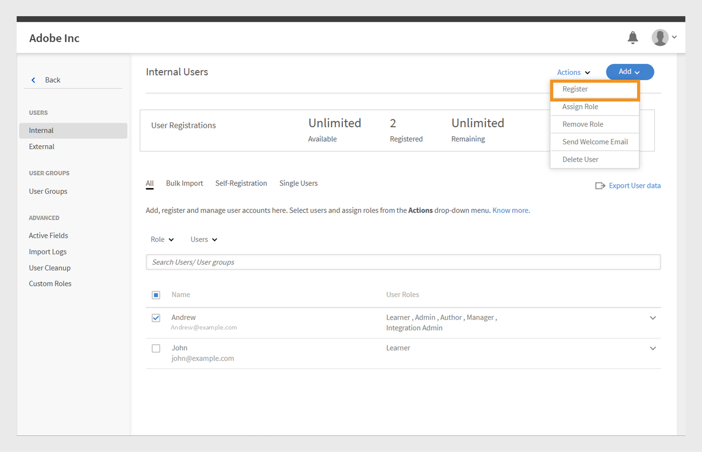

# Adicionar usuários no Adobe Learning Manager

No Adobe Learning Manager, os usuários são alunos que usam a plataforma para aprendizado ou treinamento. Há dois tipos de usuários: usuários internos e usuários externos.

Usuários internos são funcionários ou membros da equipe de sua organização.

Usuários externos são alunos fora da sua empresa, como clientes, parceiros, fornecedores ou clientes, que podem acessar o conteúdo de aprendizado.

O Adobe Learning Manager (ALM) permite que os administradores integrem e gerenciem usuários internos e externos usando vários métodos, incluindo entrada manual, upload de CSV, autorregistro e integrações de sistema.

## Usuários internos

Usuários internos no Adobe Learning Manager se referem a funcionários ou membros da equipe na sua organização. Você pode adicioná-los manualmente, carregá-los em lote ou importá-los por meio de integrações de sistema. Depois de adicionar esses usuários, você pode organizá-los em grupos, atribuir cursos e monitorar seu progresso de aprendizado.

Os usuários no Adobe Learning Manager podem assumir diferentes responsabilidades e gerenciar várias tarefas com base em suas funções atribuídas. Cada função, incluindo administrador, autor, professor e administrador de integração, oferece um conjunto de recursos específicos personalizados para dar suporte às responsabilidades do usuário na plataforma.

### Métodos para adicionar usuários internos

Os administradores podem adicionar usuários internos usando os seguintes métodos:

* **Adicionar um único usuário**: adicione manualmente um usuário por vez.
* **Perfil de autorregistro**: permite que os alunos se registrem como alunos no Adobe Learning Manager usando um link de registro criado pelo administrador.
* **Upload em massa via CSV**: faça upload de um arquivo CSV para adicionar vários usuários ao mesmo tempo.

### Adicionar manualmente um usuário interno

Os administradores podem adicionar manualmente um usuário fornecendo seu nome, email, identificador exclusivo e nome do gerente. O Identificador exclusivo no Adobe Learning Manager é um identificador obrigatório que os administradores atribuem ao criar um usuário. Ele deve ser exclusivo para cada usuário e servir como uma referência consistente em todo o sistema.

>[!INFO]
>
>Assista a este treinamento do ALM Academy para saber mais sobre como adicionar usuários únicos no Adobe Learning Manager.  

Para adicionar um único usuário ao Adobe Learning Manager:

1. Faça logon como administrador.
2. Selecione **Usuários** e escolha **Internos**.
3. Selecione **Adicionar** e escolha **Usuário Único**.

   
   _Interface do administrador mostrando a opção de adicionar manualmente um único usuário interno_
4. No prompt **Adicionar usuário**, digite o **Nome**, o **Email** e o **Perfil** (cargo) do usuário.

   
   _Campos para inserir nome, email, identificador exclusivo e perfil para um novo usuário_
5. Procure o gerente do usuário e selecione o nome na lista de gerentes.
6. Selecione **Adicionar**.
O usuário recebe um e-mail de boas-vindas contendo um URL de logon para acesso.

### Permitir autorregistro para usuários internos

O autorregistro é um processo de integração de autoatendimento em que os usuários podem visitar um URL de registro, inserir seus detalhes e se inscrever automaticamente na plataforma. Esse método minimiza o esforço administrativo, permitindo que os usuários se registrem por meio do URL fornecido.

Para criar um URL de autorregistro para um usuário:

1. Faça logon como administrador.
2. Selecione **Usuários** e escolha **Internos**.
3. Selecione **Adicionar** e escolha **Autorregistro.**

   
   _Menu suspenso para selecionar a opção de autorregistro_
4. No prompt **Adicionar Perfil de Autorregistro**, digite o perfil no campo **Nome do perfil** (cargo do usuário).
5. Selecione o gerente do usuário procurando pelo gerente no campo **Nome do Gerente**. O gerente atribuído ao perfil de autorregistro deve ser um usuário registrado no Adobe Learning Manager.

   
   _Campos de entrada para definir o nome do perfil e atribuir um gerente a um perfil de autorregistro_
6. Selecione uma imagem usando a opção **Adicionar Imagem**. Essa imagem ficará visível para os alunos na seção de perfil.
7. Selecione **Salvar**.

   O Adobe Learning Manager cria um perfil de usuário e gera um URL de autorregistro, que pode ser compartilhado com os usuários para concluir o registro.

   
   _Mensagem de confirmação indicando criação bem-sucedida de uma URL de autorregistro_
8. Compartilhe o URL com os usuários que desejam se registrar.

   O URL pode ser compartilhado com vários usuários para registro. Por exemplo, você pode gerar uma URL para o perfil de **Associado de Vendas** e compartilhá-la com a equipe de Associados de Vendas para que eles possam se registrar.

_O link de autorregistro abre uma página de inscrição_

### Exibir a lista de URLs de autorregistro

Para exibir a lista de URLs de autorregistro:

1. Selecione **Usuários** e escolha **Internos**.
2. Selecione **Autorregistro**.

   Os administradores podem ver a lista de URLs de autorregistro.

_Exibição de lista que mostra URLs de autorregistro existentes disponíveis para usuários internos_

### Upload em massa de usuários internos

Os administradores podem adicionar vários usuários de uma só vez fazendo upload de um arquivo CSV com informações do usuário, como nome, endereço de email e nome do gerente. Esse recurso de upload em massa economiza tempo e esforço em comparação à adição de usuários individualmente.

>[!INFO]
>
>Assista a este treinamento do ALM Academy para saber como adicionar usuários em massa por meio de um CSV.   

Para adicionar vários usuários:

1. Faça logon como administrador.
2. Selecione **Usuários** e escolha **Internos**.
3. Selecione **Adicionar** e escolha **Carregar um CSV**.

   
   _Opção para carregar um arquivo CSV para importação de usuário em massa_

4. Prepare um arquivo CSV com os seguintes campos:

   * Nome do funcionário*
   * E-mail do funcionário*
   * Perfil/Designação do Funcionário
   * ID/E-mail do gerente\
     (*) Campos obrigatórios.

5. Antes de adicionar a ID de e-mail de um gerente para qualquer funcionário, certifique-se de que o gerente já esteja incluído como um funcionário no arquivo CSV. Por exemplo, consulte o funcionário Howard Walters na captura de tela abaixo.

   
   _Imagem de CSV de amostra com todos os campos_

6. Faça upload do arquivo CSV e mapeie os campos de dados adequadamente.

   
   _Interface de mapeamento de CSV para alinhar colunas de planilha com campos do sistema_
7. Selecione **Salvar** para importar os usuários.

   Uma mensagem de confirmação é exibida após o upload bem-sucedido.

   
   _A imagem mostra o status de carregamento CSV como bem-sucedido_

>[!NOTE]
>
>Mantenha um CSV mestre para todas as adições e exclusões. Não é possível atualizar e reenviar um arquivo CSV existente.

Ao carregar um arquivo CSV para adicionar usuários, é importante incluir todas as informações relacionadas na ordem correta. Se você atribuir a ID de e-mail de um gerente a um funcionário, os detalhes do gerente deverão ser exibidos anteriormente no arquivo CSV. Isso garante que o sistema reconheça o gerente como um usuário existente antes de vinculá-lo aos membros de sua equipe. Por exemplo, se Howard Walters for gerente, inclua todos os detalhes do usuário no CSV antes de listar os funcionários que se reportam a ele.

### Gerenciar registro de usuário

Depois de adicionar usuários individualmente ou em massa, você precisa registrá-los para ativar suas contas. Isso permite que os usuários acessem o Adobe Learning Manager e comecem a usar a plataforma.

Para registrar os usuários:

1. Selecione **Usuários** na home page do administrador.
2. Marque as caixas de seleção ao lado dos nomes dos usuários que deseja registrar.
3. Selecione **Ações** e escolha **Registrar**.

   
   _Botão Registrar para ativar os usuários selecionados no Adobe Learning Manager_

4. Selecione **Sim** para ativar o usuário.

Um email de verificação é enviado ao usuário. O usuário deve selecionar o link no email para ativar sua conta e começar a usar o Adobe Learning Manager.

## Usuários externos

O Adobe Learning Manager permite adicionar usuários fora da empresa, como clientes, parceiros, fornecedores ou clientes, para acessar o conteúdo de aprendizado. Depois de adicionados, você pode agrupá-los, atribuir cursos e acompanhar seu progresso na aprendizagem.

A adição de usuários externos no Adobe Learning Manager envolve as seguintes etapas:

* Criar um perfil de registro externo
* Ativar o perfil de registro
* Compartilhar o link de registro com usuários externos
* Pause ou retome o perfil quando necessário

A Adobe Learning Manager oferece suporte à inscrição desses usuários por meio de perfis de registro externos.

Para criar um usuário externo, siga estas etapas:

1. Faça logon como administrador.
2. Selecione **Usuários** e escolha **Externos**.
3. Selecione **Adicionar** para criar um registro para um usuário externo.
4. Na caixa de diálogo **Adicionar Perfil de Registro Externo**, forneça o seguinte:

   * **Nome do Perfil:** Digite o nome.
   * **Email do gerente:** digite o endereço de email do gerente.
   * **Limite de vagas:** defina o número máximo de inscrições permitidas.
   * **Expiração:** defina a última data para novos registros. Depois que ele expirar, o link não funcionará para o registro de um novo usuário.

   
   _Caixa de diálogo para inserir nome de perfil, email do gerente, limite de vagas e expiração_

5. Selecione uma imagem usando a opção **Adicionar Imagem**. Essa imagem ficará visível para os alunos na seção de perfil.
6. Selecione a seção **Configurações Avançadas** para expandi-la e digite os detalhes necessários:
   * **Requisito de Logon:** digite o número de dias. Se os alunos permanecerem inativos durante todo o período, eles serão removidos automaticamente.
   * **Domínios permitidos:** digite uma lista separada por vírgulas dos domínios de email permitidos. Somente usuários com endereços de email de domínios aprovados podem se inscrever.
   * **Verificação de email necessária:** selecione esta opção para aplicar a verificação de email durante o registro.

   
   _Painel Configurações avançadas para definir requisitos de logon, domínios permitidos e verificação de email_

7. Selecione **Salvar**.

Um URL de registro é gerado.

### Ativar o perfil externo

Para ativar o perfil externo:

1. Localize o perfil recém-criado na lista de perfis externos.
2. Selecione o botão de alternância **Status** para habilitá-lo.

O administrador pode compartilhar esse URL com o parceiro externo para que ele possa se inscrever e fazer logon no Adobe Learning Manager usando-o.

_Selecione a opção para habilitar o perfil externo_

### Copiar e compartilhar o URL de registro do perfil externo

A URL de registro de um perfil externo pode ser copiada da seção **Usuários Externos**.

_Copiar a URL de registro de um perfil externo_

### Principais diferenças entre registros de usuários internos e externos

Existem algumas diferenças entre registros internos e externos:

| Usuários internos | Usuários externos |
|---|---|
| É possível fazer logon usando as credenciais do Adobe ID ou SSO. | É possível fazer logon usando qualquer ID de email. |
| A gamificação está disponível. | Gamificação disponível. O administrador deve habilitar a gamificação para alunos externos nas [Configurações de gamificação](https://experienceleague.adobe.com/pt-br/docs/learning-manager/using/admin/gamification). |

### Pausar perfil de registro externo

No Adobe Learning Manager, os administradores podem gerenciar o registro de usuários externos pausando seus perfis. Isso é útil quando você deseja pausar temporariamente novos usuários para não ingressarem usando um perfil de registro externo específico. Pausar um perfil impede que os usuários que receberam convites, mas ainda não se registraram, concluam o processo de inscrição. Esta ação não afeta os usuários que já concluíram seu registro.

Para pausar um perfil externo:

1. Selecione **Ações** no canto superior direito da página **Usuários Externos**.
2. Selecione **Pausar** para pausar o perfil de registro externo.

Isso bloqueia novos registros para usuários que não aceitaram seus convites. Observe que essa ação afeta apenas os usuários que ainda não concluíram o registro.

_Opção para pausar um perfil de registro externo existente no menu Ações_

### Retomar perfil de registro externo

Se um perfil externo tiver sido pausado anteriormente, os administradores poderão retomá-lo para permitir que novos usuários concluam seu registro. Isso reativa o processo de registro para usuários que foram convidados, mas não concluíram a inscrição.

Para retomar um usuário externo:

1. Selecione **Ações** no canto superior direito da página.
2. Selecione **Retomar** para retomar o acesso de um parceiro pausado.

_Opção para retomar um perfil de registro externo pausado anteriormente_

### Monitorar o uso de estações externas

Os administradores podem rastrear o número de usuários adicionados a cada perfil externo no Adobe Learning.

Para verificar os assentos usados:

1. Selecione **Vagas usadas** na lista de perfis externos.

Você pode ver o número de alunos adicionados à organização do parceiro e se eles estão ativos.

## Gerenciar usuários

Os administradores podem editar detalhes do usuário, excluir usuários, atribuir funções e remover funções. Isso ajuda a garantir que cada usuário tenha o acesso e as tarefas certos.

>[!INFO]
>
>Assista a este treinamento do ALM Academy para saber como atribuir e remover funções, enviar um email de boas-vindas e excluir e remover usuários. [![botão]](https://content.adobelearningmanageracademy.com/app/learner?accountId=98632#/course/7555586) 

### Editar um usuário

Use a opção **Editar Usuário** no Adobe Learning Manager para atualizar as informações de perfil de um usuário, como nome, endereço de email, identificador exclusivo, perfil e nome do gerente. Os administradores podem fazer essas alterações para garantir que os dados do usuário permaneçam precisos e atualizados.

Para editar um usuário:

1. Selecione **Usuários** na home page do administrador.
2. Selecione o usuário que deseja editar na lista **Usuários**.
3. Selecione **Editar Perfil**.

   
   _Opção Excluir usuário no menu Ações para remover um usuário da plataforma_

4. Selecione **Sim** para excluir o usuário.

Uma mensagem de confirmação é exibida quando o usuário é excluído com sucesso.

## Atribuir uma função a um usuário

As funções de usuário no Adobe Learning Manager definem quais ações cada pessoa pode executar no sistema. Cada função vem com permissões específicas com base nas responsabilidades do usuário.

O Adobe Learning Manager oferece suporte às seguintes funções de usuário:

* **Administrador**: gerencia usuários e grupos de usuários, atribui funções e configura preferências de todo o sistema, como fontes de dados, domínios permitidos e opções de exibição. Os administradores também são responsáveis por criar e organizar o conteúdo de aprendizado, monitorar o progresso do aluno, gerar relatórios e configurar integrações com sistemas externos.
* **Autor**: cria e gerencia conteúdo, incluindo módulos e cursos.
* **Gerente**: supervisiona as atividades de aprendizado da equipe, nomeia os membros da equipe para os cursos, aprova solicitações e fornece feedback.
* **Administrador de Integração**: gerencia integrações de sistema e conexões de dados entre o ALM e plataformas externas.
* **Funções personalizadas**: os administradores podem criar funções personalizadas para fornecer aos usuários acesso personalizado com base em suas responsabilidades. Consulte este [artigo](/help/migrated/administrators/feature-summary/custom-role.md) para obter mais informações sobre as funções personalizadas.

Para atribuir funções a usuários:

1. Selecione **Usuários** na home page do administrador.
2. Selecione o usuário ao qual você deseja atribuir uma função.
3. Selecione **Ações** no canto superior direito.
4. Selecione **Atribuir Função**.
5. Selecione a função necessária.

   
   _As opções de menu Atribuir Função exibem as funções disponíveis para o usuário selecionado_

6. Selecione **Sim** na caixa de diálogo de confirmação.

## Remover uma função

A remoção de uma função de usuário revoga as permissões concedidas por essa função.

Para remover funções de usuários:

1. Selecione **Usuários** na home page do administrador.
2. Selecione os usuários cujas funções você deseja remover.
3. Selecione **Ações** e selecione **Remover Função**.

   
   _Opção para remover funções atribuídas de um usuário no menu Ações_

4. Selecione **Sim** na caixa de diálogo de confirmação.

