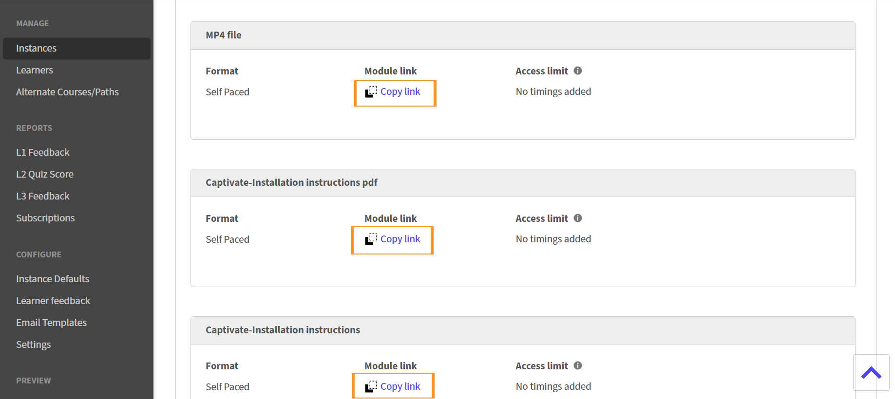

# Configurar registro com um clique no Adobe Learning Manager

## Como funciona o registro com um clique

A inscrição com um clique depende de dois recursos do Adobe Learning Manager (ALM) que trabalham juntos:
Os links profundos fornecem um URL direto para um curso ou objeto de aprendizado específico no ALM. Você pode incorporar esses links (que são URLs diretos para módulos) em emails, portais de intranet ou aplicativos de terceiros. Se um aluno ainda não estiver conectado ao clicar no link, o ALM solicitará que se autentique e o levará diretamente para o curso.

Geralmente, é importante quando os alunos estão no meio do trabalho e usam Slack ou Equipes ou quando precisam ter um treinamento rápido de atualização de dois minutos antes de viajar ou participar de uma reunião ou chamada de vendas. Eles podem acessar o conteúdo imediatamente e receber treinamento.
Os serviços relacionados à inscrição inscrevem automaticamente um aluno em um curso antes que o link profundo inicie o reprodutor do curso. Isso remove a etapa de inscrição manual que, de outra forma, interromperia a experiência do aluno.

Quando um aluno seleciona um link de inscrição de um clique, o ALM os inscreve por meio da API em segundo plano e os redireciona para o curso usando o link profundo. O reprodutor do curso abre imediatamente.

>[!NOTE]
>
>A inscrição ocorre apenas no nível do curso, não em objetos de aprendizado de ordem superior (programações de aprendizado ou certificações).

## Gerar um deep link para um módulo

1. Faça logon no Adobe Learning Manager como administrador.
2. Selecione **Cursos** no painel de navegação esquerdo.
   
3. Selecionar um curso
4. Selecione **Instâncias**.
   
5. Selecione a seção **Módulo** da instância cujos vínculos profundos dos módulos você deseja copiar. Os detalhes do módulo são exibidos na seção expandida na parte inferior da instância.
   
6. Navegue até o módulo cujo link você deseja copiar.
   
7. Selecione **Copiar link**. O deep link agora é copiado. Esse deep link é um link para abrir o módulo específico de um curso.

Agora você pode usar este link profundo para enviá-lo a um aluno.
