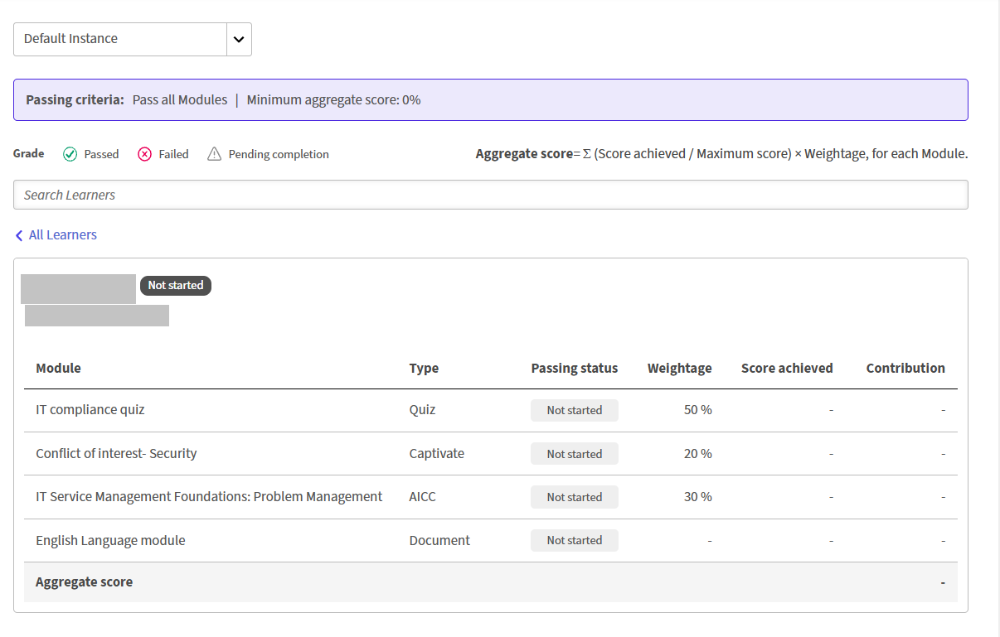

# Ativar a visibilidade do livro de notas para sua conta

## Visão geral

Antes que os autores possam mostrar o livro de notas aos alunos em um curso, um administrador deve ativar a configuração de visibilidade do livro de notas no nível da conta. Essa configuração atua como uma opção mestre: quando desativada, os alunos não podem ver o livro de notas em nenhum curso, independentemente de como os cursos individuais estão configurados.

## O que esta configuração controla

A configuração **Visibilidade do gradiente** em **Configurações** > **Geral** determina se os autores têm permissão para expor o gradiente aos alunos no nível do curso.

Para obter mais informações, consulte [Visibilidade do Gradebook](/help/migrated/administrators/feature-summary/settings/basic-settings.md#gradebookvisibility).

| Estado da configuração | Efeito |
| --- | --- |
| Ativado | Os autores podem controlar a visibilidade do livro de notas por curso usando a opção **Mostrar livro de notas aos alunos** no editor de curso. Os alunos veem a guia **Gradebook** nos cursos em que o autor a habilitou. |
| Desativado | Os alunos não podem ver o livro de notas em nenhum curso. Se estiver desativada, a configuração do curso não terá a configuração para mostrar o livro de notas aos alunos. |

Isso significa que as configurações no nível da conta e no nível do curso funcionam juntas. Ambos devem estar ativados para que um aluno veja o catálogo de notas.

## Ativar a visibilidade do livro de notas

1. Faça logon no Adobe Learning Manager como administrador.
2. Na navegação à esquerda, selecione **Configurações**.
3. Selecione **Geral**.
4. Role até a seção **Visibilidade do gradebook**.
5. Marque a caixa de seleção **Habilitar exibição de Gradebook para alunos**.

   

Os autores agora podem configurar a visibilidade do livro de notas por curso.

## Impacto nos fluxos de trabalho do autor

Quando essa configuração no nível da conta está habilitada, a opção **Mostrar gradiente para alunos** fica disponível no editor de cursos. Os autores usam essa alternância para decidir, por curso, se os alunos podem ver a guia **Gradebook**.

Quando esta configuração no nível da conta está desativada:

* A opção **Mostrar gradiente para alunos** no editor de curso ainda pode aparecer, mas qualquer configuração de nível de curso é substituída. Os alunos não verão o livro de notas.
* Pontuações graduais e cálculos ponderados continuam a ser executados em segundo plano para fins de emissão de relatórios do administrador.
* Os administradores e os administradores personalizados ainda podem baixar transcrições do aluno com dados do catálogo de notas.

>[!NOTE]
>
>Desativar essa configuração no nível da conta não exclui nenhuma configuração ou pontuação do catálogo de notas. Se você reativá-lo, todas as configurações de livro de notas de nível de curso configuradas anteriormente serão restauradas imediatamente.

## Como as duas configurações interagem

| Configuração no nível da conta | Configuração no nível do curso | O que o aluno vê |
| --- | --- | --- |
| Ativado | Mostrar catálogo de notas para os alunos: **Ativado** | Guia **Gradebook** visível no reprodutor do curso |
| Ativado | Mostrar catálogo de notas para os alunos: **Desativado** | Nenhuma guia Gradebook; pontuações calculadas apenas internamente |

## Exibir e relatar pontuações na agenda

Os administradores do Adobe Learning Manager podem visualizar as pontuações ponderadas dos livros de notas de todos os alunos inscritos em um curso, analisar o desempenho individual do aluno por módulo, baixar uma transcrição do aluno filtrada e acompanhar as alterações de configuração dos livros de notas no relatório Registro de auditoria de conteúdo.

## Exibir a agenda de um curso

Quando o gradiente está habilitado para um curso, uma nova seção **Feedback N2 - Gradebook** aparece na navegação à esquerda em **Relatórios** quando você abre o curso.

* Faça logon no Adobe Learning Manager como administrador.
* Na navegação à esquerda, selecione **Cursos** e abra o curso que deseja revisar.
* Na navegação do curso, em **Relatórios**, selecione **Feedback N2 - Gradebook**. A página **Gradebook de comentários ativos** é aberta.

  

Ele mostra:

1. Os critérios de aprovação para o curso (módulos mínimos necessários e pontuação agregada mínima)
2. Uma linha de filtro para exibir alunos por nível: **Aprovado**, **Falha** ou **Conclusão pendente**
3. A fórmula de pontuação agregada: Pontuação agregada = Σ (Pontuação alcançada ÷ Pontuação máxima) × Ponderação, para cada módulo
4. Uma lista de alunos mostrando a **Pontuação agregada** de cada aluno e sua pontuação para cada módulo pontuável
5. Um menu suspenso de instâncias para alternar entre as instâncias do curso quando um curso tem várias instâncias

Os alunos que ainda não tentaram nenhum módulo pontuado mostram traços nas colunas de pontuação. Os módulos que não oferecem suporte a pontuação, PDF, vídeo, áudio e semelhantes não aparecem como colunas de pontuação.

## Exibir as pontuações de um aluno individual

No **Gradebook de Comentários Ativos**, selecione o nome de um aluno.

A exibição individual do aluno mostra:

1. O nome, email e status do aluno (**Conclusão pendente**, **Aprovada** ou **Falha**)
2. A pontuação agregada e quantos módulos obrigatórios o aluno concluiu
3. Uma tabela de módulos mostrando: nome do módulo, tipo, se ele é necessário, status, peso, pontuação obtida e contribuição para o agregado

A tabela de módulos inclui todos os módulos pontuáveis e não pontuáveis. Os módulos pontuáveis mostram sua pontuação e contribuição. Os módulos não pontuáveis mostram traços nas colunas Pontuação e Contribuição.

## Módulos de pontuação

O comportamento da pontuação para administradores e professores não foi alterado no fluxo de trabalho atual:

* Os **módulos de questionário SCORM, AICC, xAPI e nativos** são pontuados automaticamente quando o conteúdo subjacente relata uma pontuação.
* **Sessões de sala de aula, sessões de sala de aula virtual e módulos de Atividade** são pontuadas por professores ou administradores na página **Presença e Pontuação**.

## Baixar a transcrição do aluno para um curso

Você pode baixar uma transcrição do aluno filtrada para este curso diretamente da página do livro de notas de uma das duas maneiras:

* No **Gradebook de feedback ativo**, selecione **Baixar transcrição do aluno** no canto superior direito da página.
* Na home page do administrador, selecione **Relatórios** e selecione **Relatórios Personalizados**. Selecione **Transcrições do aluno** na lista de relatórios disponíveis.

>[!NOTE]
>
>A transcrição do aluno (relatório CSV e API de trabalhos) terá a Ponderação adicionada como uma coluna quando a agenda estiver ativada no nível do curso.

## Eventos da Trilha de auditoria de conteúdo

A trilha de auditoria de conteúdo captura dois eventos de configuração específicos do livro de notas:

| **Evento** | **Quando ele aparecer** |
|-----------|---------------------|
| **Gradebook atualizado** | Quando um autor ativa ou desativa a grade de um curso |
| **Peso Do Módulo Atualizado** | Quando um autor altera a porcentagem de ponderação de um módulo |

Consulte Alterações de relatórios na versão para obter mais informações.

Use essas entradas para rastrear quem alterou a configuração do livro de notas e quando, particularmente em ambientes em que vários autores colaboram no mesmo curso.

## Solução de problemas

**A seção Feedback N2 - Gradebook não aparece na navegação do curso**

O Gradebook deve ser ativado pelo autor do curso ao criar o curso. Confirme se o autor ativou o catálogo de notas para a criação do curso. Se o curso foi criado antes do livro de notas estar disponível, ele não pode ser adicionado retroativamente. Uma nova versão do curso é necessária.

**A pontuação agregada de um aluno é 0 apesar dos módulos concluídos**

Confirme se o curso tem pelo menos um módulo pontuável com um valor de ponderação atribuído. Se todos os módulos concluídos pelo aluno forem não pontuáveis (PDF, vídeo, áudio), nenhuma pontuação agregada será calculada. Além disso, confirme se os módulos pontuados ainda não estão no status **Revisão pendente**. Os módulos não classificados são excluídos do agregado até que um professor insira uma pontuação.

**A coluna Peso está ausente da transcrição do aluno baixada**

Essa coluna aparece somente quando o catálogo de notas está ativado e pelo menos um módulo tem um valor de ponderação salvo. Confirme se o autor ativou o livro de notas e salvou os valores de ponderação totalizando 100%.

**Um aluno concluiu todos os módulos obrigatórios, mas mostra Conclusão pendente**

Um ou mais módulos ainda podem estar aguardando uma pontuação de um professor ou administrador (**Status de revisão pendente**). O curso não pode ser concluído até que todos os módulos obrigatórios tenham uma conclusão e uma pontuação registradas. Insira a pontuação pendente de **Presença e Pontuação** para limpar o estado pendente.
