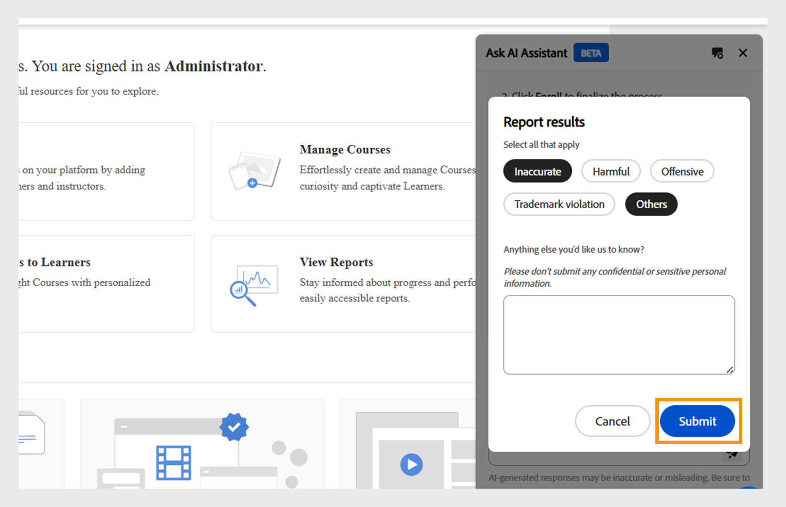

# Assistente Admin AI (Beta) no Adobe Learning Manager

Em configurações de aprendizado complexas, os administradores podem ter dificuldade para encontrar conteúdo ou concluir tarefas devido a menus complicados e fluxos de trabalho desconectados. Por exemplo, tarefas como executar relatórios ou acessar informações específicas podem exigir a navegação em várias telas. O Admin AI Assistant (Beta) ajuda você a encontrar as informações certas para entender e concluir tarefas com eficiência.

O Admin AI Assistant (Beta) no Adobe Learning Manager ajuda os administradores a encontrar rapidamente respostas a perguntas comuns, explorar recursos do sistema e entender como concluir tarefas importantes, apenas perguntando em linguagem simples. Se você ainda não conhece muito bem o Adobe Learning Manager ou está procurando maneiras mais rápidas de solucionar problemas, o Admin AI Assistant (Beta) simplifica o seu fluxo de trabalho, fornecendo ajuda contextual diretamente na plataforma.

Ele usa recursos de IA do Adobe para permitir consultas de idiomas naturais em fluxos de trabalho de conteúdo de aprendizado e do sistema.  Os administradores podem fazer perguntas como **Como adicionar usuários ao Adobe Learning Manager** ou **Como adicionar caminhos de aprendizado**. O Admin AI Assistant (Beta) do Adobe Learning Manager é treinado exclusivamente em documentação disponível publicamente, de propriedade de Adobe, como recursos hospedados em **[!UICONTROL Experience League]**. Ele não aprende nem acessa o conteúdo do cliente, o material de treinamento interno ou os dados gerados pelo usuário.

Este assistente reduz a dependência da navegação manual, diminui o tempo de descoberta e ajuda a revelar insights acionáveis rapidamente.

<!--## Key benefits

* Perform common administrator tasks faster with conversational guidance.
* Get instant answers without browsing through extensive menus.
* Gain real-time insights and step-by-step guidance for administrative workflows.-->

>[!IMPORTANT]
>
>Ela está disponível apenas para administradores e atualmente é compatível apenas com inglês.

## Privacidade, segurança e governança

O Admin AI Assistant (Beta) foi projetado para manter o foco na segurança e na privacidade de dados. Veja o que você pode esperar:

* O Admin AI Assistant (Beta) não usa nenhum dado pessoal, incluindo fins de treinamento.
* Ele não tem acesso aos dados de aprendizado ou ao conteúdo armazenado no Adobe Learning Manager.
* O Admin AI Assistant (Beta) não acessa nem compartilha informações de identificação pessoal (PII) nem compartilha informações confidenciais ou privadas.
* Quaisquer prompts fornecidos pelos usuários (como perguntas ou consultas) não são compartilhados com outros clientes.

>[!IMPORTANT]
>
>O Admin AI Assistant (Beta) será lançado em fases, com os clientes recebendo um aviso prévio de duas semanas. Para obter assistência, entre em contato com seu Gerente de sucesso do cliente (CSM).

## Como acessar o Admin AI Assistant (Beta)

Siga estas etapas para iniciar o Admin AI Assistant (Beta):

1. Faça logon como administrador.
2. Selecione o ícone de bate-papo para iniciar o Admin AI Assistant (Beta).

   
   _Selecione o balão de bate-papo para iniciar o Assistente Admin AI (Beta)_

   >[!NOTE]
   >
   >Ao iniciar o Admin AI Assistant (Beta) pela primeira vez, você deve fornecer seu consentimento antes de usá-lo. A caixa de diálogo de consentimento será exibida somente durante essa primeira inicialização. Para todas as inicializações subsequentes, você será direcionado ao Assistente Admin AI (Beta) para inserir seus prompts.

3. Selecione **[!UICONTROL Começar]**. Agora você está pronto para usar o Admin AI Assistant (Beta).

   
   _Solicitação para aceitar a política de uso antes do primeiro uso_

## Como usar o Admin AI Assistant (Beta)

Para usar o Admin AI Assistant (Beta):

1. Digite seu prompt e pressione **[!UICONTROL Enter]**. A resposta será exibida no Admin AI Assistant (Beta).

   
   _Uma consulta de exemplo e resposta do Assistente Admin AI (Beta)_

### Exemplos de prompts

Veja a seguir alguns exemplos de prompts que os administradores podem usar para utilizar efetivamente o Admin AI Assistant (Beta):

* **Atribuir um curso a um usuário**
   * **Prompt**: “Como atribuir um curso a um usuário?”

  
  _Resposta ao prompt Como atribuir um curso a um usuário_

* **Relatório de inscrição mais recente**
   * **Aviso**: mostre-me o relatório de inscrição mais recente.

  
  _Resposta para o prompt Mostre-me o relatório de inscrição mais recente_

* **Excluir um usuário**
   * **Aviso**: “Como posso excluir um usuário?”

  
  _Resposta para o prompt Como posso excluir um usuário_

### Dicas para usar o Admin AI Assistant (Beta) com eficiência

* **Seja específico em seus prompts**: ao fazer uma pergunta, inclua detalhes e contexto claros. Por exemplo, em vez de perguntar “Como adiciono um usuário no Adobe Learning Manager?”, pergunte “Como atribuo um curso a um usuário no Adobe Learning Manager?”
* **Usar linguagem clara e concisa**: mantenha suas perguntas objetivas e focadas. Isso ajuda o Admin AI Assistant (Beta) a entender sua intenção e fornecer uma resposta mais precisa.
* **Explorar diferentes recursos**: pergunte sobre uma variedade de recursos, como relatórios de inscrição, progresso do aluno, atribuição de conteúdo ou rastreamento de certificação para descobrir a gama completa de suporte disponível.
* **Fornecer comentários**: depois de receber uma resposta, avise-nos se ela foi útil. Use os recursos polegares para cima, polegares para baixo, relatório ou comentário para compartilhar seu feedback. Seu feedback desempenha um papel fundamental no aprimoramento do Assistente.

## Fornecer feedback sobre as respostas do Admin AI Assistant (Beta)

Seu feedback sobre as respostas geradas pelo Admin AI Assistant (Beta) ajuda a melhorar a precisão, a relevância e o desempenho geral.

### Curtir ou não curtir uma resposta

* Selecione **[!UICONTROL Miniaturas]** se a resposta for útil e precisa.
* Selecione **[!UICONTROL Miniaturas inativas]** se a resposta estiver incorreta ou não for útil.

### Sinalizar respostas

Siga estas etapas para sinalizar uma resposta:

1. Selecione **[!UICONTROL Sinalizar]** no final da resposta.

   
   _Selecionar relatório na tela Assistente de IA do administrador_

2. Selecione um ou mais motivos, adicione comentários se necessário e selecione **[!UICONTROL Enviar]**.

   
   _Os administradores classificam a resposta usando miniaturas para cima ou para baixo com comentários opcionais_

O Adobe usa esse feedback para melhorar o Admin AI Assistant (Beta) ao longo do tempo.

## Perguntas frequentes

+++Posso usar o Admin AI Assistant (Beta) como aluno?

Não. Este assistente está disponível somente para administradores.

+++

+++Está disponível no aplicativo para dispositivos móveis?

Não no momento.

+++

+++Ele pode executar ações administrativas?

Não. O Admin AI Assistant (Beta) fornece somente orientação.

+++

+++Oferecerá suporte a mais idiomas?

A equipe do Adobe Learning Manager está avaliando o suporte em vários idiomas para atualizações futuras.

+++
