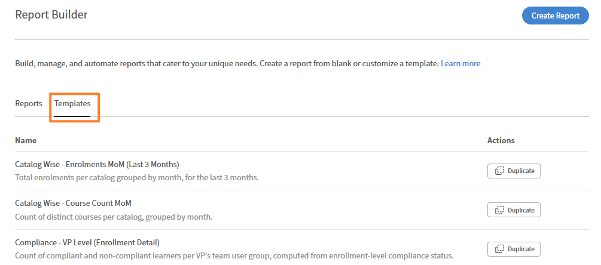
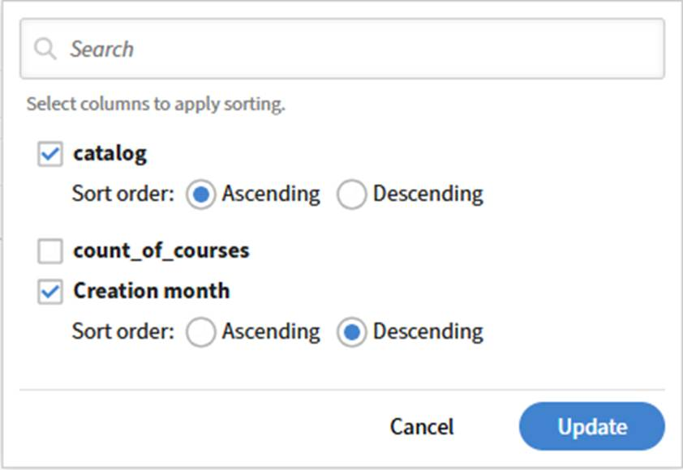

# Introdução a um modelo de Report Builder

Os modelos são configurações de relatório prontas para uso fornecidas pela Adobe Learning Manager. Cada modelo é projetado para um caso de uso específico, como inscrição e controle de conclusão, relatório de conformidade ou desempenho do professor. Você pode baixar um modelo diretamente ou duplicá-lo para criar uma cópia editável.

1. Faça logon no Adobe Learning Manager como administrador.
2. Selecione **Relatórios** no painel esquerdo e selecione **Report Builder**.
3. Selecione a guia **Modelos**.
4. Procure os modelos disponíveis. Cada modelo é nomeado de acordo com seu caso de uso.
   
5. Selecione um nome de modelo para abrir a visualização somente leitura. Para este exemplo, selecione Duplicar ao lado do modelo MoM de Contagem de Cursos do Catalog Wise. Revise as colunas, os filtros aplicados e a ordem de classificação. Ao duplicar um modelo, o Report Builder abre uma cópia editável com a configuração existente do modelo pré-carregada. O nome, a descrição, as colunas, os filtros e a classificação do relatório podem ser editados antes de você salvar.

## Nomear e descrever o relatório

1. No campo **Nome**, substitua o nome padrão (por exemplo, _cópia do Catalog Wise_ - _Course Count MoM_) por um nome exclusivo para o relatório. Um nome é necessário.
2. No campo **Descrição**, insira um breve resumo do que o relatório contém. Isso ajuda outros administradores a entenderem a finalidade do relatório quando visualizam ou editam.

## Adicionar e configurar colunas

A seção **Colunas** tem dois painéis: **Selecionar colunas** à esquerda e **Colunas Selecionadas** à direita.

### Adicionar uma coluna

1. No painel **Selecionar colunas**, expanda um conjunto de dados selecionando seu nome. Por exemplo, **Catálogo** ou **Grupo de usuários de campo ativo**.
2. Selecione o ícone **+** ao lado da coluna que você deseja adicionar. A coluna aparece no painel **Colunas Selecionadas**, à direita.
   
3. Para adicionar a mesma coluna mais de uma vez. Por exemplo, aplicar dois agregados diferentes ao mesmo campo. Selecione **+** novamente para essa coluna.

### Reordenar colunas

Arraste a alça à esquerda de qualquer linha de coluna no painel **Colunas Selecionadas** para movê-la para uma posição diferente. A ordem das colunas no painel corresponde à ordem no relatório baixado.

### Renomear uma coluna

1. Selecione o ícone de **editar** (lápis) em uma linha de coluna.
   
2. Insira um alias. O alias aparece como o cabeçalho da coluna no relatório baixado em vez do nome de campo padrão.
   

### Remover uma coluna

Selecione o ícone **×** em uma linha de coluna para removê-lo do relatório.

## Aplicar grupo por

O controle **Agrupar por** aparece na parte superior do painel **Colunas Selecionadas**.

1. Selecione **Agrupar por: selecione**.
   
2. Selecione as colunas pelas quais agrupar. É possível selecionar mais de um. Na captura de tela, o relatório é agrupado por _catálogo_ e _mês de criação_.
3. Cada coluna agrupar por selecionada aparece como uma tag abaixo do controle Agrupar por. Para remover uma coluna agrupar por, selecione **×** em sua tag.

>[!NOTE]
>
>Quando agrupar por é aplicado, todas as colunas que não são agrupadas por coluna devem ter uma função agregada aplicada. Uma coluna sem uma agregação causará um erro.

## Aplicar uma agregação a uma coluna

1. Em qualquer coluna não agrupar por no painel **Colunas Selecionadas**, selecione **Agregar por**.
2. Escolha uma função no menu suspenso. Na captura de tela, o **Objeto de Aprendizado** - **ID do Objeto de Aprendizado** usa a **Contagem Distinta**, com o alias de count_of_course.

Funções agregadas disponíveis:

| Função | O que retorna |
|----------|-----------------|
| Contagem | Número total de linhas no grupo |
| Número distinto | Número de valores exclusivos no grupo |
| Contar Se | Número de linhas que correspondem a um valor especificado |
| Soma | Total de um campo numérico no grupo |
| Min | Valor mais baixo no grupo |
| Máx | Valor mais alto no grupo |
| Média | Valor médio no grupo |

## Aplicar filtros

A seção **Filtros** está abaixo da seção **Colunas**. Os filtros restringem quais linhas aparecem no relatório.

1. Para adicionar um filtro, selecione o ícone **+** à direita da seção Filtros.
2. Escolha o campo para filtrar.
   
3. Selecione um operador e insira ou escolha um valor.

Para editar um filtro existente, selecione o ícone de **lápis** na linha de filtro. Para adicionar um grupo de filtros aninhado, clique no ícone + com colchetes à direita de uma linha de filtro.

## Configurar classificação

A seção Classificação fica abaixo da seção Filtros.

1. Selecione **+ Adicionar classificação** para adicionar uma classificação.
2. Escolha a coluna pela qual classificar e selecione **Crescente** ou **Decrescente**.
   
3. Repita para adicionar classificações secundárias. Arraste a alça à esquerda de cada linha de classificação para alterar a prioridade.

>[!TIP]
>
>Sempre aplique pelo menos uma classificação. Sem classificação, a ordem das linhas pode diferir entre os downloads do mesmo relatório.

## Salvar o relatório

Selecione **Salvar Relatório** no canto superior direito. O relatório foi salvo na guia **Relatórios** e está pronto para download.

## Práticas recomendadas

* Use aliases em todas as colunas para que o relatório baixado tenha cabeçalhos significativos em vez de nomes de campo como _Objeto de Aprendizado_ - _ID do Objeto de Aprendizado_.
* Use Contagem Distinta em vez de Contagem quando quiser registros exclusivos, por exemplo, cursos distintos por catálogo em vez de linhas totais.
* Aplique a classificação antes de salvar, especialmente para relatórios que você compartilhará ou assinará.
* Mantenha a descrição atualizada. Outros administradores contam com ele para entender o escopo do relatório sem abri-lo.
