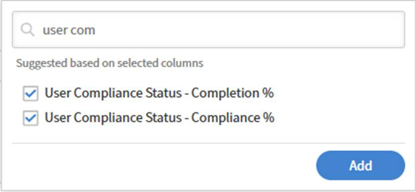

# Adicionar e combinar filtros em um relatório

Os filtros permitem definir o escopo do relatório exatamente para os registros necessários. Você pode aplicar um único filtro, combinar vários filtros com a lógica AND ou OR e criar grupos aninhados para condições complexas.

## Adicionar um filtro

Use filtros para limitar seu relatório a um subconjunto específico de dados em vez de exibir tudo.

Por exemplo, você pode querer entender quantos alunos se inscreveram nos cursos nos últimos 365 dias. Nesse caso, aplique um filtro de data na data de inscrição para incluir apenas atividades recentes.

1. Inicie o Report Builder e selecione **Criar Relatório**.
2. Digite o nome e a descrição do relatório\.
3. Selecione as seguintes colunas: &lt;`dataset>:<column name>`
a. Data de Inscrição
b. Nome de usuário
   
4. Na seção Relatórios, selecione **Adicionar filtro**.
5. Procure ou navegue até o campo pelo qual deseja filtrar. Neste exemplo, selecione **Data de inscrição**.
   
6. Selecione **Adicionar**.
7. Selecione um operador. Os operadores disponíveis dependem do tipo de dados do campo:
a) Campos de string — contém, é igual a, começa com
b) Campos numéricos — maior que, menor que, igual a, entre
c) Campos de data — igual a, antes, depois, entre, últimos N dias
d) Campos de lista (enum) — está em, não está em
8. Neste caso, selecione **está no último ano**.
   
9. Selecione **Salvar Relatório** e selecione **Ações** > **Baixar** para baixar o relatório.

O relatório baixado lista todos os usuários que se inscreveram em um Objeto de aprendizado nos últimos 365 dias.

### Adicionar vários filtros com a lógica AND / OR

Quando você adiciona um segundo filtro, a relação padrão entre os filtros é AND; ambas as condições devem ser verdadeiras para que uma linha seja exibida.

Por exemplo, você pode identificar os alunos que se inscreveram nos cursos nos últimos 365 dias E relatá-los a um gerente específico. Nesse caso, ambas as condições devem ser verdadeiras, de modo que os filtros são combinados usando a lógica AND.

1. Inicie o Report Builder e selecione **Criar Relatório**.
2. Digite o nome e a descrição do relatório.
3. Selecione as seguintes colunas: `<dataset>:<column name>`
a. Nome de usuário
b. Nome do gerente do usuário
c. Data de Inscrição
   

4. Agrupar pela coluna **Nome do Gerenciador de Usuários**.
5. Na seção **Filtro**, selecione os seguintes filtros:
a. A data de inscrição **está no último ano**
b. O Nome do Gerenciador de Usuários **começa com N**
c. O Nome do Gerenciador de Usuários **não está vazio**
   
6. Selecione **Salvar Relatório** e selecione **Ações** > **Baixar** para baixar o relatório.

O relatório baixado lista todos os usuários que se inscreveram em um Objeto de aprendizado nos últimos 365 dias e relata a um gerente cujo nome começa com N.

### Criar grupos de filtros aninhados

Os grupos aninhados permitem criar condições com vários níveis lógicos, equivalentes a colchetes em uma fórmula\. Por exemplo: (Catálogo = Segurança OU Catálogo = Higiene) E a Data de conclusão está nos últimos 90 dias.

Use grupos de filtros aninhados quando a lógica incluir uma combinação de condições AND e OR que devem ser avaliadas em conjunto.

Por exemplo, use a lógica de filtro aninhado para identificar inscrições incompletas nas quais os alunos têm progresso abaixo de 50% ou treinamento vencido, demonstrando como as condições E e OU funcionam juntas.

1. Inicie o **Report Builder** e selecione **Criar Relatório**.
2. Digite o nome e a descrição do relatório.
3. Selecione as seguintes colunas: `<dataset>:<column name>`
a. Inscrição - Status
b. Inscrição - Percentual de Andamento
c. Inscrição - Vencida
   
4. Na seção **Filtro**, selecione os seguintes filtros:
a. Enrollment-Status **não é igual a nenhum de** Concluído.
b. Selecione **+**.
c. Pesquise o Percentual de Andamento da Inscrição.
d. Selecione o filtro.
e. Selecione **Adicionar como grupo**.
   
f. Adicionar Percentual de Andamento da Inscrição **menor que** 50
   
g. Selecione **+**.
h. Pesquisar Inscrição Vencida.
i. Selecione o filtro.
j. Selecione **Adicionar como grupo**.
   
k. Adicionar Inscrição Vencida é igual a VERDADEIRO.
l. Altere o AND aninhado para OR.
   
5. Selecione **Salvar Relatório** e selecione **Ações** > **Baixar** para baixar o relatório.

O relatório baixado lista todas as inscrições em andamento ou não iniciadas, cujo percentual de andamento seja inferior a 50% ou que estejam vencidas.
