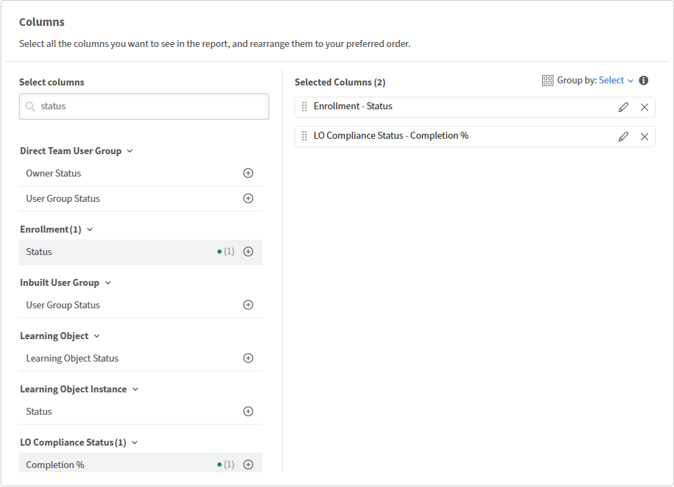

# Report Builder: Conceitos e terminologia

## Modelos e relatórios

**Modelos** são configurações de relatório pré-criadas fornecidas pela Adobe Learning Manager. Eles foram desenvolvidos para casos de uso comuns, controle de inscrição e conclusão, relatórios de conformidade, desempenho do professor e estão prontos para download imediato. Os modelos são somente leitura; não é possível editá-los ou substituí-los.

**Relatórios** são suas próprias configurações salvas. Você pode criar um relatório do zero ou duplicando um modelo e editando a cópia. Quando você duplica um modelo, a cópia torna-se um relatório na guia Relatórios.

Os modelos e relatórios são exibidos em Report Builder, mas sob guias separadas.

## Conjuntos de dados

Um conjunto de dados é um grupo nomeado de colunas relacionadas no Report Builder. Ao adicionar colunas a um relatório, você seleciona um desses conjuntos de dados. Pense em cada conjunto de dados como uma tabela de informações sobre um aspecto dos dados de aprendizado.

Veja a seguir um exemplo de conjuntos de dados disponíveis no Report Builder:

* **Usuário:** dados de perfil do aluno, incluindo campos ativos
* **Transcrição:** registros de inscrição e conclusão
* **Objeto de Aprendizado:** curso, caminho de aprendizado e dados de certificação
* **Instância do Objeto de Aprendizado:** detalhes no nível da instância
* **Catálogo:** dados de catálogo e etiqueta de catálogo
* **Grupo de usuários:** associação e hierarquia de grupos de usuários
* **Sessão do Módulo:** dados da sala de aula e da sessão virtual, incluindo detalhes do módulo de aprendizado eletrônico

>[!NOTE]
>
>Os conjuntos de dados podem ser unidos seletivamente. Nem todas as combinações estão disponíveis em um único relatório.

## Colunas e o botão Adicionar

Cada coluna adicionada aparece como uma linha na tela do relatório e se torna uma coluna no arquivo baixado. É possível adicionar a mesma coluna mais de uma vez. Isso é útil quando você deseja medir dois valores diferentes do mesmo campo. Por exemplo, você pode adicionar a coluna Status duas vezes: uma vez para contar as inscrições e uma vez para contar os alunos em andamento usando a contagem, se agregada.

Você também pode renomear qualquer coluna digitando um alias. O alias aparece como o cabeçalho da coluna no relatório baixado.

## Agrupar por e agregação

Agrupar por resume os dados por um campo escolhido em vez de mostrar linhas individuais. Por exemplo, o agrupamento por nome do professor fornece uma linha por professor em vez de uma linha por inscrição.

Agrupar por segue o comportamento padrão do banco de dados: depois que você aplicar agrupar por em uma coluna, todas as outras colunas do relatório deverão ter uma função agregada aplicada. Você não pode misturar dados de linha individuais com dados agrupados. As **funções** de agregação disponíveis são:

* **Contagem:** Número total de linhas
* **Contar se:** Número de linhas onde o campo corresponde a um valor especificado
* **Soma:** total de um **campo numérico**
* **Mín:** menor valor em um campo numérico
* **Máx:** o valor mais alto em um campo numérico
* **Média:** valor médio de um campo numérico

Se você usou tabelas dinâmicas no Excel, agrupar por funciona da mesma maneira no nível da coluna.

## Filtros

Os filtros restringem quais linhas aparecem no relatório. É possível aplicar vários filtros e combiná-los com a lógica AND ou OR.

Os operadores de filtro dependem do tipo de dados da coluna:

* **Campos de cadeia de caracteres:** contém, é igual a, começa com (pesquisa com tipo antecipado disponível para valores reconhecidos)
* **Campos numéricos:** maior que, menor que, igual a, entre
* **Campos de data:** é igual a, antes, depois, entre e intervalos relativos (por exemplo, últimos 90 dias)
* **Campos de enumeração (lista):** está em, não está em (seletor de valores de seleção múltipla)

## Lógica AND / OR e grupos de filtros aninhados

Vários filtros usam a lógica AND como padrão. Todas as condições devem ser verdadeiras para que uma linha apareça. Você pode alternar o operador entre dois filtros quaisquer para OU. Também é possível agrupar filtros usando Adicionar como grupo, o que cria um colchete. Os filtros dentro do grupo são avaliados juntos antes de serem combinados com os filtros fora dele.

Isso permite criar condições, como:

(catálogo = Segurança OU catálogo = Higiene) E a data de conclusão é nos últimos 90 dias.

É possível aninhar grupos dentro de outros grupos para oferecer suporte à lógica complexa de vários níveis.

## Classificação

Você pode classificar por uma ou mais colunas. A primeira coluna que você classifica é a classificação principal. Classificações adicionais são aplicadas dentro dos vínculos na coluna principal.

Sempre aplique pelo menos uma classificação quando precisar de uma saída consistente. Como a geração de relatórios é executada em um sistema distribuído, a ordem das linhas não é garantida entre dois downloads do mesmo relatório, a menos que a classificação seja aplicada.

## Dados de tendência vs. dados de instantâneo

Qualquer relatório que use um agregador de tendência, como mês-a-mês ou semana-a-semana, reflete os dados atuais do instantâneo agrupados por data. Ele não reflete o estado histórico dos dados em cada data passada.

Por exemplo, uma tendência de inscrição agrupada por mês mostra quantas inscrições existem hoje, distribuídas pelos meses em que foram criadas. Isso não leva em conta os alunos que cancelaram ou alteraram posteriormente os grupos de usuários. Essas alterações não são aplicadas retroativamente aos últimos meses.

## Alunos e campos ativos excluídos

O Report Builder oferece suporte à inclusão de alunos excluídos em relatórios e à recuperação de seus valores de campo ativos. Use a coluna **Data de Exclusão** no conjunto de dados **Usuário** para criar o relatório.

## Práticas recomendadas

* Leia a referência dos conjuntos de dados disponíveis antes de criar um relatório do zero. Saber qual conjunto de dados contém os campos necessários economiza um tempo significativo de configuração.
* Aplique a classificação antes de assinar um relatório agendado. Isso garante uma ordem de linha consistente em todas as entregas.
* Se você vir linhas duplicadas inesperadas, verifique se o relatório inclui um campo que pode ter vários valores por linha, como o nome de um professor para uma sessão com vários professores.
