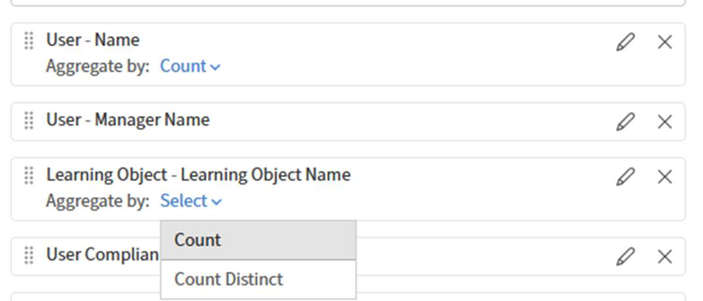

# Revisar o desempenho do professor com o Report Builder

Esse relatório ajuda os gerentes de treinamento a identificar quais professores estão mais ativos, quantos alunos eles alcançam e quantos alunos concluem os cursos que oferecem.

## Criar um relatório de eficiência do professor

1. Inicie o Report Builder e selecione **Criar Relatório**.
2. Digite um nome como _Eficiência do professor_.
3. Adicione **Nomes de Professores** do conjunto de dados **Sessão de Módulo**.
4. Adicionar **ID de Sessão do Módulo** do conjunto de dados **Sessão do Módulo**. Agregaremos isso para contar as sessões.
5. Adicione **Status** da **Transcrição do módulo** ao conjunto de dados. Você usará a contagem se quiser contar as conclusões.
6. Selecione **Agrupar por** em **Nomes de Professores**.
7. Aplicar **Contagem** a **ID de Sessão de Módulo**. Digite o alias _Total de sessões_.
8. Aplique **Count se** a **Status** e selecione **Concluído**. Digite o alias _Total de conclusões_.
9. Para mostrar também o total de inscrições, adicione **Status** uma segunda vez. Aplicar **Contagem se** a **Não iniciado**. Digite o alias _Total de inscrições_.
   
10. Filtrar **Nomes de Professores** para não ficar vazio.
   
11. Classifique por **Total de conclusões** descendentes para destacar primeiro os professores com melhor desempenho.
   
12. Selecione Salvar Relatório e selecione **Ações** > **Baixar** para baixar o relatório.

O relatório baixado resume a eficiência do professor comparando o total de sessões de treinamento, a conclusão do aluno e as inscrições não iniciadas para cada professor, ajudando a avaliar o envolvimento, o desempenho da conclusão e as possíveis necessidades de acompanhamento do treinamento.

## Práticas recomendadas

* Use etiquetas de catálogo para enquadrar os relatórios do professor em uma unidade de negócios, local ou programa específico\. Isso é mais preciso do que filtrar apenas por nome de catálogo.
* Adicione um filtro de data, como **Data de Inscrição** nos últimos 90 dias, para definir o escopo do relatório para um período recente, em vez de dados de todos os tempos.
* Classifique por uma métrica significativa, como **Total de conclusões**, em vez de pelo nome do professor, para que as diferenças de desempenho fiquem imediatamente visíveis.
