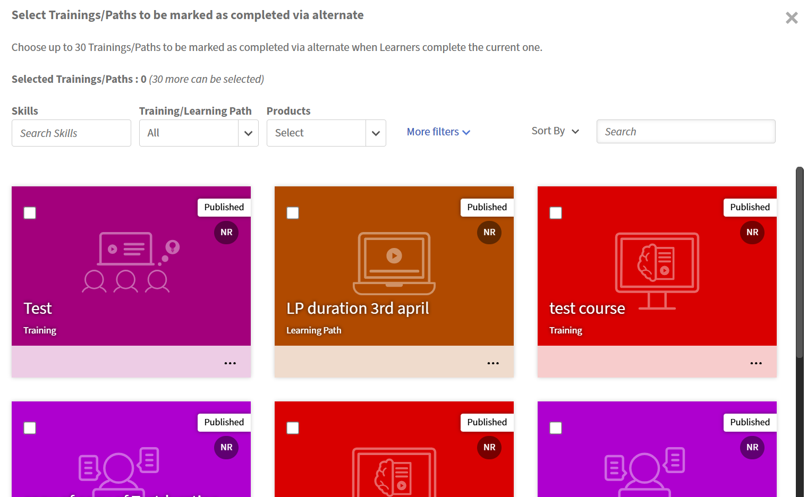

# Alternativas e equivalentes

## Introdução

Em muitas organizações, os alunos encontram situações de treinamento em que diferentes cursos podem legitimamente atender ao mesmo requisito. Por exemplo, quando um novo curso deve substituir um mais antigo? Quando um curso mais abrangente deve ficar em um mais curto ou quando um curso substituto especial deve ser oferecido?

O recurso Cursos alternativos ou Caminho de aprendizado fornece ao ALM uma maneira formal de dizer:

“Se o aluno concluiu este treinamento, trate-o como tendo atendido a esse requisito de treinamento relacionado.”

O recurso funciona em cursos e caminhos de aprendizado, garante que os requisitos de downstream, como pré-requisitos e regras de conformidade, sejam atendidos e faz isso sem forçar os alunos a passar por conteúdo redundante. Ele também mantém a precisão dos relatórios ao gravar o que foi concluído diretamente em comparação com o que foi satisfeito por meio de uma alternativa.

No núcleo, o recurso introduz o conceito de uma conclusão alternativa: um estado de conclusão especial criado automaticamente quando um aluno conclui um treinamento de origem configurado que conta para outro treinamento de destino.

## Relacionamentos alternativos

Alguns relacionamentos de treinamento são bidirecionais, o que significa que cada curso pode satisfazer os requisitos do outro. Este é efetivamente um cenário em que dois treinamentos são tratados como substituíveis entre si. Em contraste, as relações unidirecionais permitem que um treinamento satisfaça a exigência de outro, mas não vice-versa. O ALM modela ambos os cenários usando o mesmo mecanismo de conclusão alternativa subjacente.

* **Relação bidirecional (equivalentes):** a conclusão de um treinamento satisfaz o requisito do outro.
* **Relacionamento unidirecional:** concluir o Treinamento A satisfaz o Treinamento B, mas concluir B não satisfaz A. Isso é comum quando uma versão mais recente ou mais abrangente deve contar para um requisito mais antigo, mas não o contrário.

Por exemplo, quando um curso de superconjunto mais abrangente abrange tudo em um curso de subconjunto mais simples. Completar o superconjunto deve satisfazer o requisito para o subconjunto, mas não necessariamente o contrário.

Um curso mais recente e expandido que deve contar para um requisito mais antigo.

Um curso criado para um público específico (por exemplo, uma variante regional ou adaptada à acessibilidade) que ainda atende ao mesmo requisito do curso principal.

Uma nova versão aprimorada de um curso que a organização deseja contar para um requisito mais antigo, mas a versão mais antiga não deve contar para o novo requisito.

Em Alternativas, a relação é normalmente de uma maneira. Se o curso A for uma alternativa para o curso B, concluir A pode satisfazer a exigência de B, mas concluir B não necessariamente satisfaz A.

Quando um treinamento de origem configurado é concluído, o ALM produz automaticamente uma conclusão alternativa para um ou mais treinamentos de destino.

## Que problemas isso resolve?

Sem alternativas, os administradores e os alunos enfrentam vários problemas recorrentes:

* Os alunos são frequentemente solicitados a repetir cursos que abrangem conteúdo que já concluíram em uma versão ou formato diferente.
* A atualização de programas de conformidade é mais simples porque os administradores podem substituir ou reestruturar treinamentos sem forçar os alunos que concluíram versões mais antigas a retomar conteúdo alternativo ou substituído.
* A lógica de pré-requisito é rígida. Se um caminho exigir um curso específico como pré-requisito, não há uma maneira clara de reconhecer que outro treinamento é bom o suficiente.
* Relatórios e auditorias são mais difíceis. Não há nenhum sinal formal que mostre que um requisito foi atendido através de uma conclusão alternativa e nenhuma maneira direta de rastrear a origem do crédito.

O recurso de alternativas aborda esses problemas da seguinte maneira:

* Impedir esforços duplicados para alunos quando as alternativas são válidas.
* Permitir que os administradores modifiquem as estruturas de treinamento (por exemplo, troquem um curso dentro de um caminho) sem interromper as conclusões dos alunos que fizeram a versão anterior.
* Permitir que os pré-requisitos e as verificações de conformidade respeitem tanto as conclusões diretas quanto as conclusões alternativas ou equivalentes.
* Registrar claramente, em transcrições e relatórios, se um treinamento foi concluído diretamente ou satisfeito por meio de um relacionamento alternativo, junto com o qual o treinamento serviu como fonte.

## Como o recurso funciona conceitualmente

O recurso é construído em três ideias principais: **relações**, **conclusão alternativa** e **comportamento downstream**.

### Relacionamentos entre treinamentos

Os administradores definem as relações entre cursos e caminhos de aprendizado. Para cada relação, eles escolhem uma origem e um ou mais destinos. Um único curso pode ter até 30 metas, dependendo de quantos treinamentos anteriores ou relacionados ele deve atender.

Para equivalentes, os administradores podem tornar o relacionamento bidirecional se quiserem que ambos os treinamentos satisfaçam uns aos outros. Para alternativas, os administradores normalmente mantêm a direção em uma* maneira de refletir que apenas algumas substituições são permitidas.

Esses relacionamentos são armazenados no nível do treinamento, não no nível do aluno. Depois de configurados e habilitados, eles podem se aplicar   para todas as conclusões atuais e futuras do treinamento de origem, sujeito às configurações no nível da conta, como se a conclusão retroativa estiver ativada.

### Conclusão alternativa

Quando um aluno conclui um treinamento de origem, o ALM examina todos os relacionamentos alternativos configurados e, para cada treinamento de destino relevante, cria um registro de conclusão alternativo. Esse registro é diferente de uma conclusão normal:

* Marca o treinamento de destino do aluno, mas registra que ele foi concluído por meio de alternativas em vez de diretamente.
* Ele registra qual treinamento de origem foi usado para satisfazer o alvo.
* Ele é armazenado em uma estrutura dedicada para que a emissão de relatórios possa distinguir entre conclusões diretas e alternativas.

Os alunos verão uma conclusão alternativa mesmo se não estiverem inscritos. O relatório Transcrição do aluno (LT) inclui apenas registros de treinamentos nos quais o aluno se inscreveu.

#### Experiência do aplicativo do aluno para conclusões alternativas e equivalentes

As conclusões alternativas são apresentadas de forma distinta no aplicativo do aluno para que os alunos possam entender claramente como um requisito de treinamento foi atendido, mantendo a consistência com transcrições e relatórios.

#### Comportamento da placa LO

##### Status de conclusão alternativo

Quando um aluno conclui um treinamento por meio de um relacionamento alternativo, o cartão do Objeto de Aprendizado (LO) exibe um status distinto que é **Concluído via Alternativo**. Essa distinção visual ajuda os alunos a diferenciar entre conclusões diretas e conclusões concedidas por meio de relacionamentos configurados.

#### Indicador do método de conclusão

O cartão do OA inclui um indicador do método de preenchimento (por exemplo, uma etiqueta ou um ícone) para mostrar que o preenchimento foi obtido por meio de uma Alternativa. Se uma conclusão alternativa for revogada posteriormente devido a alterações como inconclusão retroativa ou exclusão do treinamento de origem, o ALM desfará todas as adições de interface que fez para a conclusão alternativa. O aluno ainda não poderá direcionar o OA de acordo com o comportamento de acesso ao catálogo atual.

#### Transparência e detalhes de auditoria

Os alunos podem abrir o cartão do OA para exibir detalhes adicionais, incluindo:

* O curso ou a programação de aprendizado de origem que concedeu a conclusão alternativa

Isso garante a transparência.

#### Filtragem e exibições

##### Filtro de método de conclusão

O aplicativo do aluno fornece um filtro que permite aos alunos distinguir entre:

* Concluído
* Concluído por meio de alternado (este filtro OAs que têm apenas conclusões alternativas. Se um OA tiver conclusão alternativa, bem como direta, ele não será incluído.)
* Ao selecionar **Concluído** e **Concluído via alternativo**, você poderá ver todas as conclusões

Isso permite que os alunos entendam rapidamente como seus requisitos de aprendizado foram atendidos.

##### Exibições de transcrição e progresso

O filtro do método de conclusão está disponível nas exibições voltadas para o aluno. Por exemplo:

* Seções de acompanhamento de progresso e conclusão

Essas exibições indicam claramente quais treinamentos foram concluídos diretamente e quais foram satisfeitos por meio de alternativas.

<!--
## Configure equivalent courses (complete each other)

Use this workflow to define courses that are **equal in value**, where completing either course should automatically complete the other.

1. Launch ALM and navigate to courses.
2. Select a course to configure.
3. Navigate to the **Alternates** section.
4. Search for and select one or more related courses.
5. For each selected course, enable **Completes each other**.
6. Save the configuration.

**Result**

- ALMm records a **bi-directional equivalence relationship**.
- Either course can act as a completion source for the other.

## Configure alternate courses (superset → subset)

Use this workflow when one course is a **superset** of another and should satisfy completion for the simpler or subset course.

1. Launch ALM and navigate to courses.
2. Select the **superset (primary)** course.
3. Go to the **Alternates** section.
4. Select one or more **alternate (subset)** courses.
5. Leave the relationship as **alternate** (do not enable completes each other).
6. Save the configuration.

**Result**

- Completion flows **one-way** from the source course to the alternate.
- Reverse completion is not applied.

## Apply completion logic after source course completion

Automatically evaluate and apply alternate or equivalent completion once a learner completes a configured source course. ALM:

1. Detects completion of a **source course**.
2. Evaluates configured relationships:
   - Equivalent relationships
   - Alternate relationships
3. For each related course:
   - Marks the course as completed if conditions are met
4. Creates a completion record with method **Alternate**.

**Key system rules**

- Alternate completion:
  - Satisfies prerequisites
  - Allows progress in learning paths and certifications
- Alternate completion does **not** award:
  - Skills
  - Badges
  - Gamification credits

## Record completion in Learning Transcript

Ensure alternate and equivalent completions are clearly distinguishable from direct completions for audit and reporting. ALM:

1. Updates the **Learner Transcript (LT)**.
2. Sets:
   - Completion status = Completed
   - Completion method = **Alternate**
3. Sets completion date equal to the **source course completion date**.

## Enable retroactive completion (optional)

Apply alternate or equivalent completion benefits to learners who completed source courses **before** the relationships were configured.

1. Open **Account-level settings** from Administrator home > Settings > General.
2. Enable **Retroactive completion**.
3. Save the configuration.

ALM:

1. Scans historical learner completions.
2. Applies alternate or equivalent completion where applicable.
3. Updates learner transcripts automatically.

## Enable retroactive incompletion (irreversible)

Revoke previously applied alternate or equivalent completions when relationships are removed or corrected.

1. Open **Account-level settings**.
2. Enable **Retroactive incompletion**.
3. Modify or remove alternate/equivalent relationships.

ALM:

1. Identifies impacted alternate completions.
2. Revokes previously applied alternate or equivalent completions.
3. Updates transcript entries to **Alternate (Revoked)**.
-->

### Fluxo completo

**Para alunos**

1. Navegue até **Meu aprendizado** ou **Cursos concluídos** no aplicativo do aluno.
2. Revise os cartões do OA para identificar treinamentos marcados como **Concluídos via Alternativo**.
3. Abra um cartão do OA para exibir detalhes (na página Visão geral) sobre o treinamento de origem.
4. Use o filtro para selecionar **Direto**, **Alternativo** ou **Todos**.
5. Revise a lista atualizada com base no método de conclusão selecionado.

**Para administradores e autores**

* Configure relacionamentos alternativos entre cursos ou programações de aprendizado na interface do administrador.

## Conclusão retroativa e comportamento incompleto

O ALM oferece suporte à conclusão retroativa e à inconclusão retroativa para garantir que os relacionamentos alternativos permaneçam precisos ao longo do tempo, mesmo quando os relacionamentos forem modificados ou removidos depois que os alunos já tiverem concluído o treinamento.

### Conclusão retroativa

#### Definição

Quando a conclusão retroativa está ativada, os alunos que concluíram um curso de origem no passado recebem automaticamente uma conclusão alternativa para o curso de destino se um relacionamento alternativo for criado posteriormente. Isso garante que o aprendizado histórico seja respeitado sem exigir que os alunos façam o treinamento novamente.

#### Como funciona

1. Um administrador ativa a conclusão retroativa no nível da conta.
2. O administrador define uma relação alternativa entre um treinamento de origem e de destino.
3. O sistema verifica os registros históricos de conclusão do treinamento de origem.
4. Os alunos qualificados recebem a conclusão alternativa para o treinamento de destino.
5. Esses registros aparecem como **Concluídos via Alternativo** em transcrições e relatórios do aluno.

>[!NOTE]
>
>Quando a conclusão retroativa está ativada, ela se aplica somente aos relacionamentos criados posteriormente. Não se aplica a relacionamentos que já existiam antes da ativação da configuração retroativa.

### Inconclusão retroativa

#### Definição

Quando a inconclusão retroativa estiver ativada, as conclusões alternativas serão revogadas se o relacionamento alternativo subjacente for removido ou se o treinamento de origem for excluído.
Isso garante que o sistema reflita os relacionamentos de treinamento atuais e válidos.

#### Como funciona

1. Um administrador ativa a inconclusão retroativa no nível da conta.
2. O administrador remove um relacionamento alternativo ou exclui o treinamento de origem.
3. O sistema identifica os alunos que receberam a conclusão alternativa por meio do relacionamento afetado.
4. Os registros de conclusão alternativos correspondentes são revogados.
5. Os registros revogados são marcados como **Alternativo (revogado)** em transcrições e relatórios para visibilidade de auditoria.

#### Impacto nos pré-requisitos

As conclusões alternativas—incluindo aquelas concedidas retroativamente—são tratadas como conclusões válidas ao avaliar pré-requisitos. Se um aluno tiver **Concluído via Alternativo**, ele poderá continuar com os cursos que exigem o treinamento de destino.

Se uma conclusão alternativa for revogada posteriormente por meio de inconclusão retroativa, o aluno pode perder a qualificação para cursos que dependem desse pré-requisito. Se o aluno não iniciou o OA dependente/subsequente, a elegibilidade administrada pelo OA de origem será revertida. Se o aluno já iniciou ou concluiu o OA dependente/subsequente, não haverá impacto.

#### Impacto nos caminhos de aprendizado e certificações

As conclusões alternativas contribuem para a conclusão de programações de aprendizado e certificações perpétuas. Os alunos podem avançar ou concluir esses programas quando os treinamentos necessários forem atendidos por meio de relacionamentos alternativos.

Se uma conclusão alternativa for revogada, as programações de aprendizado ou certificações afetadas podem perder o progresso até que o requisito seja atendido por meio de uma conclusão válida.

### Fluxo de trabalho completo

#### Habilitando conclusão retroativa ou inconclusão

1. Os administradores navegam até as configurações da conta e ativam a conclusão retroativa e/ou a conclusão retroativa.
2. Os administradores criam, modificam ou removem relacionamentos alternativos entre treinamentos.

#### Ações do sistema

* **Para conclusão retroativa**:
O sistema concede conclusões alternativas com base nas conclusões de origem histórica.
* **Para inconclusão retroativa**:
O sistema revoga conclusões alternativas quando os relacionamentos são removidos ou os treinamentos de origem são excluídos.

#### Experiência do aluno

Os alunos veem os status de conclusão atualizados em cartões LO e em transcrições, como:

* **Concluído via Alternativo**

Quando uma conclusão alternativa é revogada, nenhum rótulo é exibido na interface do aluno. Em relatórios e transcrições, os métodos de conclusão aparecem como:

* Alternativas
* Alternativo (revogado)
* Direto

Verificações de pré-requisitos, progresso do caminho de aprendizado e atualização do status da certificação são atualizados dinamicamente com base no estado de conclusão atual.

Os OAs solicitados são desbloqueados dinamicamente com base em conclusão alternativa.

Habilidades, medalhas, pontos de gamificação ou feedback não serão concedidos aos alunos após a conclusão alternativa dos alvos.

#### Relatórios e auditoria

Todas as alterações retroativas são refletidas no relatório Transcrição de aprendizado (LT). Depois que a origem é excluída, a transcrição do aluno ainda pode mostrar uma ID de treinamento de origem ao lado de **Alternativa revogada**. Os relatórios distinguem claramente entre conclusões diretas, conclusões alternativas e conclusões alternativas revogadas para dar suporte à conformidade, dar suporte a investigações e auditorias.

O Relatório de inscrição deixa o campo Origem da conclusão em branco no caso de conclusão direta, enquanto a Transcrição do aluno mostra o e-mail e o tipo do mesmo.

Quando um destino é removido da origem (ou a própria origem é excluída), o Relatório de Inscrição talvez não exiba o mesmo status **Alternativo ou Alternativo (Revogado)** conforme mostrado na Transcrição do Aluno.

Mesmo quando   **As alternativas** estão desabilitadas, as entradas históricas nas linhas de **Auditoria de Conteúdo** ou **Registro** ainda podem exibir atividades relacionadas às alternativas.

A data de conclusão pode preceder a data de inscrição quando um OA é concluído por meio de um caminho alternativo **antes** de o aluno realmente se inscrever. Como podem ocorrer conclusões alternativas independentemente do status do aluno (**Inscrito**, **Não Inscrito** ou **Em andamento**), os alunos podem concluir o OA primeiro e somente se inscrever no curso de destino posteriormente.

## Impacto da retirada e exclusão de treinamento de origem em alternativos

O estado do ciclo de vida de um treinamento de origem (retirado ou excluído) afeta diretamente como as conclusões alternativas são mantidas para os alunos. O ALM lida com esses cenários de forma diferente para preservar a precisão histórica, garantindo que os relacionamentos atuais permaneçam válidos.

### Baixar treinamento de origem

#### Definição

Retirar um curso o torna indisponível para novas inscrições, ao mesmo tempo em que o mantém no sistema para fins de referência histórica, relatórios e auditoria.

#### Impacto

* As conclusões alternativas existentes concedidas por meio do curso de origem retirado permanecem válidas.
* Os alunos que concluíram anteriormente o curso de origem continuam a manter a conclusão alternativa para o curso de destino.
* Nenhuma nova conclusão alternativa é gerada a partir do curso inativo, pois ele não pode ser concluído por novos alunos.
* As transcrições e os relatórios do aluno continuam a exibir **Concluído via alternativo** para os alunos afetados.

### Excluir treinamento de origem

#### Definição

Excluir um curso o remove totalmente do sistema, incluindo seus registros de conclusão e relacionamentos configurados.

#### Impacto

* Se um treinamento de origem for excluído, o status poderá mudar para **Alternativo (Revogado)**. Desativar um LO não aciona esse status.
* Se a inconclusão retroativa estiver ativada, todas as conclusões alternativas concedidas por meio do curso de origem excluído serão revogadas.
* As transcrições e os relatórios do aluno são atualizados para mostrar a **Alternativa (Revogada)** para visibilidade de auditoria e conformidade.
* A conclusão dos caminhos de aprendizado e a disponibilidade dos certificados não são afetadas.
* Nenhuma conclusão alternativa adicional pode ser concedida a partir do curso excluído.

#### Fluxo de trabalho (WRK)

1. Um administrador desativa ou exclui o curso de origem usando a interface do administrador.
2. O sistema avalia todas as conclusões alternativas derivadas do curso de origem.
3. O status de conclusão é atualizado com base no estado do curso:
   * **Retirado:** as conclusões alternativas existentes permanecem inalteradas.
   * **Excluído:** conclusões alternativas são revogadas se a inconclusão retroativa estiver habilitada.
4. As transcrições e os relatórios do aluno refletem o status atualizado para suportar os requisitos de conformidade e auditoria.

## Sem encadeamento de relacionamentos

O ALM não oferece suporte ao encadeamento de relações alternativas. Conclusões alternativas são concedidas apenas para relacionamentos configurados diretamente e não estão em cascata entre vários níveis de cursos.

### Conceito: sem encadeamento de relacionamentos

#### Definição

Encadeamento refere-se a permitir que relacionamentos alternativos se propaguem por vários cursos. Por exemplo, se o Curso A for uma alternativa para o Curso B e o Curso B for uma alternativa para o Curso C, o encadeamento implicaria que a conclusão do Curso A concederia a conclusão do Curso C.

#### Política

Não há suporte para encadeamento. Relacionamentos alternativos e equivalentes são avaliados somente em um único nível. Concluir um curso de origem concede a conclusão alternativa apenas ao seu curso ou cursos de destino imediato, não a alvos downstream.

### Fluxo de trabalho (WRK)

#### Configuração de relacionamento

Um administrador define relacionamentos alternativos entre os cursos, como:

* Curso A → Curso B
* Curso B → Curso C

#### Evento de conclusão

Um aluno conclui o curso A diretamente.

#### Ação do sistema

* O sistema concede a conclusão alternativa para o Curso B, se a relação A → B for definida.
* O sistema não concede conclusão alternativa para o Curso C, mesmo se existir uma relação B → C.

#### Requisito de conclusão direta

Para receber a conclusão alternativa do curso C, o aluno deve:

* Completar diretamente o curso B, ou
* Conclua um curso explicitamente configurado como uma alternativa direta ou equivalente para o Curso C.

## Implicações

### Nenhum benefício indireto

Os alunos não podem receber crédito de conclusão para cursos mais abaixo em uma cadeia de relacionamento, a menos que cada curso (ou sua alternativa direta) seja concluído. Isso garante que os requisitos de aprendizado sejam atendidos de forma explícita e previsível.

### Auditoria e relatórios simplificados

Relatórios e transcrições do aluno exibem conclusões alternativas somente para relacionamentos diretos. Isso evita trilhas de auditoria complexas e de vários saltos e garante clareza ao revisar como uma conclusão foi concedida.

## Compartilhamento de catálogo com contas entre parceiros: relacionamentos não compartilhados

O compartilhamento de catálogo permite que os OAs sejam compartilhados entre contas entre parceiros, mas relacionamentos alternativos e equivalentes são gerenciados independentemente em cada conta e não são compartilhados.

### Conceito: compartilhamento e relacionamentos do catálogo

#### Compartilhamento de catálogo

As contas podem compartilhar catálogos com contas entre parceiros para fornecer acesso a cursos, programações de aprendizado e outros OAs entre contas.

#### Relações não compartilhadas

Relações alternativas, equivalentes e de conclusão alternativa configuradas na conta de origem não são compartilhadas ou replicadas quando um catálogo é compartilhado. Cada conta mantém e avalia seus próprios relacionamentos de maneira independente.

### Fluxo de trabalho (WRK)

#### Compartilhamento de catálogo

Um administrador na **Conta A** compartilha um catálogo contendo LOs com a **Conta B**.

#### Configuração de relacionamento

A conta A pode ter relações alternativas definidas entre os OAs no catálogo compartilhado.

#### Acesso à conta entre parceiros

A conta B recebe acesso aos objetos de aprendizado compartilhados, mas não herda nenhum relacionamento alternativo configurado na conta A.

#### Gerenciamento independente

Se a Conta B exigir um comportamento alternativo semelhante, um administrador da Conta B deverá configurar manualmente os relacionamentos nessa conta.

#### Implicações

##### Sem propagação automática de relacionamento

Relações alternativas não estão disponíveis automaticamente em contas entre parceiros por meio do compartilhamento de catálogo.

##### Configuração manual necessária

Cada conta entre parceiros é responsável por definir e gerenciar seus próprios relacionamentos para OAs compartilhados.

##### Considerações de consistência

O comportamento de conclusão, a satisfação de pré-requisitos e a emissão de relatórios podem diferir entre as contas, a menos que os relacionamentos sejam intencionalmente alinhados por meio da configuração manual.

## Comportamento downstream

Quando houver uma conclusão alternativa para um treinamento de destino, o ALM a usará nas verificações de downstream:

* Se o treinamento de destino for um **pré-requisito** para outros treinamentos, o aluno se tornará qualificado para esses treinamentos como se tivesse concluído o destino.
* Se o destino for um curso **obrigatório em um caminho de aprendizado**, a lógica de conclusão do caminho poderá tratar o aluno como tendo concluído essa parte e prosseguir para marcar o caminho como concluído quando outras condições forem atendidas.
* Conformidade e outros painéis, como o Painel de Controle de Sucesso do Grupo, que dependem do cumprimento de um requisito de treinamento podem incluir alunos que têm apenas conclusões alternativas.

O sistema distingue entre conclusão real e conclusão alternativa de modo que:

* Se o aluno realizar o treinamento de destino diretamente e concluí-lo posteriormente, essa conclusão direta pode anular a necessidade da conclusão alternativa.
* Se o relacionamento entre a origem e o destino for removido ou alterado, o ALM poderá remover as conclusões alternativas sem tocar nas conclusões originais, desde que as conclusões retroativas estejam ativadas para a conta.

As conclusões alternativas são projetadas para não interferir na atividade real do aluno no treinamento de destino. Eles atuam como uma sobreposição que pode ser revisada se os relacionamentos mudarem.

## Emails e notificações

Assim que um aluno conclui um curso, ele receberá uma notificação no aplicativo e um e-mail mostrando o status do curso e como ele foi concluído, se ele foi concluído por meio de um curso alternativo.

>[!NOTE]
>
>A conclusão alternativa ainda pode acionar notificações para LOs de destino em catálogos em que o aluno não pode ver. As notificações alternativas de conclusão/inconclusão podem não aparecer da mesma maneira no aplicativo imersivo móvel.

## Adicionar um curso alternativo

Como administrador, você pode adicionar cursos e caminhos alternativos para que os alunos tenham várias opções para concluir seus cursos e caminhos.

1. Navegue até a seção **Aprendizado** > **Cursos**. Uma lista de cursos disponíveis será exibida.
   
   *Lista de cursos*
2. Navegue até o curso ao qual deseja adicionar um curso alternativo.
   
   *Adicionar um curso alternativo a um curso*
3. Navegue até a seção **Gerenciar** > **Cursos/caminhos alternativos**.
   
   *Caminhos/treinamentos alternativos*
4. Selecione **Adicionar cursos/caminhos**. Uma lista de cursos disponíveis será exibida.
   
   *Lista de cursos disponíveis*
5. Selecione os cursos que você deseja marcar como **Alternativo** marcando a caixa de seleção de cada curso no canto superior esquerdo do bloco.
   
   *Adicionar curso alternativo*
6. Selecione **Adicionar**.

   >[!NOTE]
   >
   >Nesse ponto, você pode remover os cursos alternativos se desejar. Para remover os cursos alternativos, selecione **Remover alternativos** ao lado de cada curso à direita.

7. Selecione **Salvar**. Os cursos alternativos agora são salvos.

O progresso não é afetado pela conclusão alternativa. Quando um curso ou caminho de aprendizado é concluído por meio de uma conclusão alternativa, o aluno ainda pode acessá-lo e consumi-lo diretamente para reforçar o aprendizado e obter benefícios downstream (por exemplo, pontos de gamificação). Nesses casos, o status do progresso reflete o progresso real do aluno a partir do consumo direto, independentemente do estado de conclusão alternativa. Você também receberá uma notificação no aplicativo e uma notificação por email sobre a conclusão por meio de um usuário alternativo.

Há vários benefícios dessa conclusão, que estão listados abaixo:

* Isso conta como conclusão como parte do caminho de aprendizado em que está presente.
* Isso também abre outros cursos/caminhos vinculados.

## Configurações para usuários avançados

As configurações a seguir permitem que usuários avançados utilizem conclusões retroativas e incompletas.

1. Navegue até a seção **Configurar** > **Configurações** > seção **Básicos** > **Geral** > **seção Curso/Caminhos Alternativos**.
2. Selecione **Ativar conclusões retroativas** e **Ativar conclusões retroativas** ou apenas uma das duas de acordo com sua necessidade.
   
   *Ativar conclusão ou inconclusão retroativa*

## Relatórios de transcrição do aluno

A maneira como um aluno conclui cursos/caminhos é capturada no relatório de transcrição do aluno. Os seguintes cenários são capturados:

1. Quando um aluno conclui um curso diretamente sem optar por um curso alternativo, isso é refletido no relatório de transcrição do aluno
2. Quando um aluno conclui um curso alternativo, ele é refletido no relatório de transcrição do aluno
3. Quando todas as conclusões alternativas são revogadas devido à inconclusão retroativa e à remoção do relacionamento, isso é refletido no relatório de transcrição do aluno.
