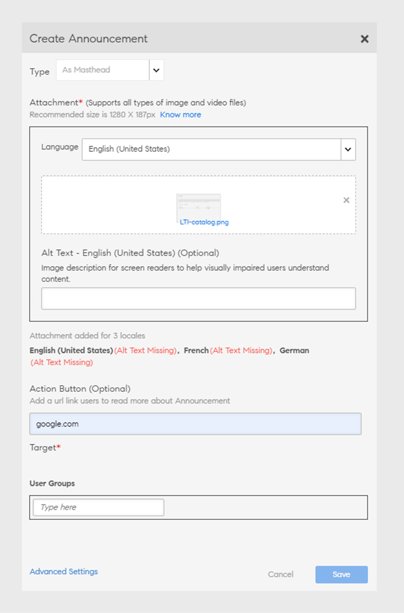

# Comunicados

Um comunicado é uma mensagem multimídia (imagem de texto ou vídeo) que um administrador transmite para um conjunto definido de usuários.

O administrador pode transmitir comunicados aos alunos para informá-los sobre a ocorrência de um evento ou uma atividade. O anúncio pode ser uma combinação de texto, imagens ou vídeos. Você pode vincular objetos de aprendizado como cursos, programas de aprendizado e certificações a um comunicado.

Há quatro tipos de anúncios:

* Notificação
* Manchete
* Recomendação
* Email

## Notificação {#notification}

1. Como usuário administrador, clique em Comunicados no painel esquerdo.
1. Clique em Adicionar no canto superior direito da página.
1. Na lista suspensa Tipo, selecione a opção **Como notificação**.

*Personalizar a notificação*

1. No campo Mensagem, adicione a mensagem para o comunicado. Você também pode adicionar um URL para comunicados aqui. No entanto, você deve adicionar o URL no formulário HTML.

   Por exemplo, `code <a href="http://www.w3schools.com" target="_blank">Visit W3Schools</a>.`

   Quando você especifica o alvo como em branco, quando um usuário clica no URL do comunicado, o link é aberto em uma nova guia. Se você não especificar o alvo, o link será aberto no mesmo navegador.

1. Opcionalmente, adicione anexos como imagens ou arquivos de vídeo ao comunicado.
1. Escolha os grupos de usuários-alvo ou os objetos de aprendizado-alvo. Você pode escolher apenas um deles para um comunicado.

   Comece a digitar o nome do grupo de usuários na caixa de texto e escolha na lista suspensa. Da mesma forma, escolha o treinamento digitando o nome do objeto na caixa de texto.

1. Na caixa de diálogo, clique em Configurações avançadas. Você pode executar as seguintes ações:

   * Fixe este comunicado selecionando a caixa de seleção Ativar comunicado fixo.
   * Selecione o tempo de entrega do comunicado.

1. Selecione **[!UICONTROL Em uma data]** se desejar agendar o comunicado para uma data posterior e clicar na área de texto adjacente a ela. Uma janela pop-up do calendário é exibida, na qual você pode escolher a data de início. Escolha a data de término seguindo as mesmas etapas.
1. Clique em **[!UICONTROL Salvar]**.
1. Na guia Rascunhos, clique no ícone de configurações ao lado de um comunicado e clique em Enviar.

Se o anexo de multimídia for grande, pode levar tempo para fazer o upload. Após clicar em Salvar, você receberá uma janela pop-up com uma mensagem enquanto o upload estiver sendo processado. Você receberá uma notificação depois que o anexo for carregado com êxito.

## Manchete {#masthead}

Quando você escolhe essa opção, qualquer arquivo de mídia que você escolhe é apresentado como uma manchete na página inicial do aluno. A manchete atua como uma chamada de ação para os alunos aos quais se destina.

Os administradores podem adicionar texto alternativo para todas as manchetes a fim de melhorar a acessibilidade para os alunos. Isso permite que alunos com necessidades especiais usem leitores de tela para ler o texto alternativo e entender a imagem. Você pode selecionar vários idiomas e fornecer texto alternativo para cada idioma. Certifique-se de adicionar o texto alternativo nos respectivos idiomas.

Para adicionar a manchete, siga estas etapas:

1. Faça logon como **[!UICONTROL Administrador]**.
2. Selecione **[!UICONTROL Comunicados]** > **[!UICONTROL Adicionar]**.
3. Selecione **[!UICONTROL Como Manchete]** no menu suspenso Tipo.

   
   _Criar um comunicado_

4. Selecione o idioma e faça upload da imagem.

   >[!NOTE]
   >
   >Você pode selecionar vários idiomas e fornecer texto alternativo para cada idioma. Certifique-se de adicionar o texto alternativo nos respectivos idiomas.

5. Insira o texto adequado no campo **[!UICONTROL Texto alternativo]**.
6. No campo **[!UICONTROL Botão de Ação]**, adicione uma URL para redirecionar os alunos quando eles clicarem no botão na manchete.
7. Selecione os grupos de usuários de destino ou os objetos de aprendizado de destino. Você pode escolher apenas um deles para um comunicado.
8. Na seção **[!UICONTROL Configurações Avançadas]**, você tem as seguintes opções:

   * Selecione **[!UICONTROL Imediatamente]** se quiser que o comunicado seja publicado imediatamente.
   * Selecione **[!UICONTROL Nunca]** se não quiser que seu comunicado expire.
   * Selecione as datas de **[!UICONTROL Início]** e **[!UICONTROL Término]** para o comunicado.
9. Clique em Salvar e publique o comunicado.

**Há um limite para o número de comunicados de manchete ao vivo?**

Você verá apenas os 10 comunicados de manchete mais recentes.

## Recomendação {#recommendation}

Quando você escolhe essa opção, qualquer treinamento escolhido é recomendado para grupos de usuários específicos. As recomendações são orientadas por um algoritmo de aprendizado de máquina.

*Selecione o treinamento recomendado a ser exibido a um aluno*

1. Escolha o treinamento que gostaria de recomendar aos alunos. Você pode adicionar até 10 treinamentos.

   Os alunos verão apenas os treinamentos não inscritos em Recomendação por organização. Com base na visibilidade do catálogo, o aluno tem acesso para ver o treinamento.

1. Escolha os grupos de usuários-alvo ou os objetos de aprendizado-alvo. Você pode escolher apenas um deles para um comunicado.

   Comece a digitar o nome do grupo de usuários na caixa de texto e escolha na lista suspensa. Da mesma forma, escolha o treinamento digitando o nome do objeto na caixa de texto.

1. Na seção Configurações avançadas, você tem as seguintes opções:

   * Clique em **[!UICONTROL Imediatamente]** se quiser que o comunicado seja publicado imediatamente.
   * Clique em **[!UICONTROL Nunca]** se não quiser que seu comunicado expire.
   * Selecione as datas de **[!UICONTROL Início]** e **[!UICONTROL Término]** para o comunicado.

   <!---->

Ao clicar em **[!UICONTROL Salvar]**, você pode publicar o comunicado imediatamente ou mais tarde. O comunicado, até então, estará em um estado de rascunho.

* Manchetes/Recomendações não acionam notificações.
* Manchetes/Recomendações não aparecem no relatório de comunicados.

## Lista de rascunhos, programados e enviados {#draftscheduledandsentlist}

No logon do administrador, você pode ver todos os comunicados em três guias, como Rascunhos, Agendado e Enviado.

<!---->

### Rascunho {#draft}

Na guia Rascunhos, você pode exibir todos os comunicados criados por um administrador, mas ainda não transmitidos ou ainda não agendados para transmissão.

Por padrão, todos os comunicados são definidos para transmissão imediata. Se você escolher configurações>opção de envio para um comunicado não programado, ele será transmitido imediatamente. Para programar uma transmissão de comunicado, é necessário escolher a data de início e término em Configurações avançadas.

### Programado {#scheduled}

Na guia Programados, você pode ver todos os comunicados programados para transmissão em uma data posterior.

### Enviada {#sent}

Na guia Enviados, você pode ver todos os comunicados que já foram transmitidos.

## Como E-mail

Use essa opção para enviar e-mails ad-hoc direcionados aos alunos de um grupo de usuários selecionado ou aos alunos inscritos em um treinamento específico.

*Enviar emails ad-hoc direcionados aos alunos*

*O administrador cria um comunicado por email*

1. Selecione **[!UICONTROL Digitar como email]**.
1. Insira o assunto e o corpo da mensagem.
1. Na seção Destino, você pode:

   * Selecione um grupo de usuários OU
   * Selecione um curso. Se o curso tiver várias instâncias, você pode selecionar a instância necessária.

1. Clique em **[!UICONTROL Salvar]**.
