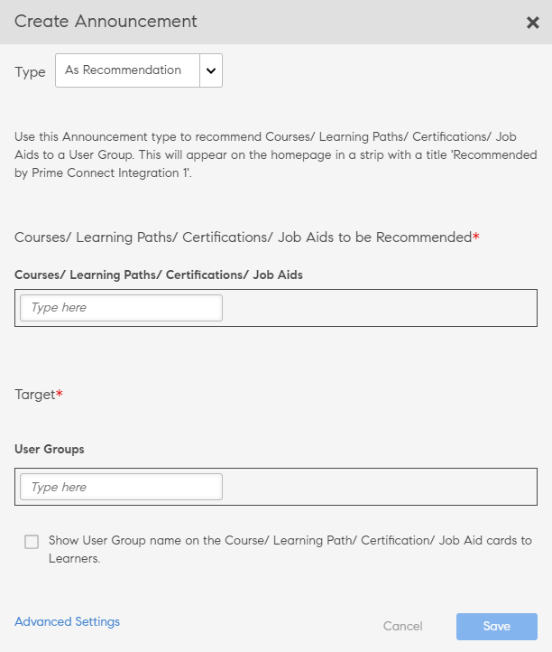

# Comunicados

Um comunicado é uma mensagem multimídia (texto, imagem ou vídeo) que um administrador transmite para um conjunto definido de usuários.

O administrador pode transmitir comunicados aos alunos para informá-los sobre a ocorrência de um evento ou uma atividade. O anúncio pode ser uma combinação de texto, imagens ou vídeos. Você pode vincular objetos de aprendizado, como cursos, programas de aprendizado e certificações, a um comunicado.

Há quatro tipos de anúncios:

* Notificação
* Manchete
* Recomendação
* E-mail

## Notificação {#notification}

1. Como usuário administrador, clique em Comunicados no painel esquerdo.
1. Clique em Adicionar no canto superior direito da página.
1. Na lista suspensa Tipo, selecione a opção **Como Notificação**.
1. No campo Mensagem, adicione a mensagem do comunicado. Você também pode adicionar um URL para comunicados aqui. No entanto, você deve adicionar o URL no formato HTML.

   Por exemplo,  `code <a href="http://www.w3schools.com" target="_blank">Visit W3Schools</a>.`

   Quando você especifica o destino como em branco, quando um usuário clica no URL do comunicado, o link é aberto em uma nova guia. Se você não especificar o destino, o link será aberto no mesmo navegador.

1. Ou adicione anexos, como imagens ou arquivos de vídeo para o comunicado.
1. Escolha os grupos de usuários de destino ou os objetos de aprendizado de destino. Você pode escolher apenas um deles para um comunicado.

   Comece a digitar o nome do grupo de usuários na caixa de texto e escolha na lista suspensa. Da mesma forma, escolha o treinamento digitando o nome do objeto na caixa de texto.

1. Na caixa de diálogo, clique em Configurações avançadas. Você pode executar as seguintes ações:

   * Torne esse anúncio um anúncio fixo marcando a caixa de seleção Ativar anúncio fixo.
   * Selecione o tempo de entrega do comunicado.

1. Selecionar **[!UICONTROL Em uma data]** se quiser agendar o comunicado para uma data posterior e clicar na área de texto adjacente. Uma janela pop-up de calendário é exibida, a partir da qual você pode escolher a data de início. Escolha a data final seguindo as mesmas etapas.
1. Clique em **[!UICONTROL Salvar]**.
1. Na guia Rascunhos, clique no ícone de configurações ao lado de um comunicado e clique em Enviar.

Se o anexo de multimídia for de tamanho grande, o upload pode demorar. Após clicar em Salvar, você receberá uma janela pop-up com uma mensagem enquanto o upload estiver sendo processado. Você receberá uma notificação depois que o upload do anexo for feito com êxito.

## Manchete {#masthead}

Ao escolher essa opção, qualquer arquivo de mídia escolhido funciona como um manchete na página inicial do aluno. A manchete atua como um chamado para ação para os alunos a que se destina.

*Personalizar a manchete*

1. Navegue e escolha uma imagem que representará a manchete. O tamanho recomendado é 1280 x 360 px.
1. Escolha o local ao qual deseja adicionar uma manchete. Para cada idioma, você deve escolher um ativo de manchete.
1. No menu **[!UICONTROL Botão de ação]** adicione um url para que, quando os alunos clicarem no botão na manchete, eles sejam redirecionados para o url. Este é um campo opcional.
1. Escolha os grupos de usuários de destino ou os objetos de aprendizado de destino. Você pode escolher apenas um deles para um comunicado.

   Comece a digitar o nome do grupo de usuários na caixa de texto e escolha na lista suspensa. Da mesma forma, escolha o treinamento digitando o nome do objeto na caixa de texto.

1. No menu **[!UICONTROL Configurações avançadas]** você tem as seguintes opções:

   * Clique em **[!UICONTROL Imediatamente]** se você quiser que o anúncio seja publicado imediatamente.
   * Clique em **[!UICONTROL Nunca]** se você não deseja que seu comunicado expire.
   * Selecione o **[!UICONTROL Início]** e **[!UICONTROL Fim]** datas do anúncio.

   

   *Definir tempo para exibição de uma manchete*

**Há um limite para o número de comunicados de manchete ao vivo?**

Você verá apenas os 10 comunicados de manchete mais recentes.

## Recomendação {#recommendation}

Ao escolher essa opção, qualquer treinamento escolhido é recomendado a grupos de usuários específicos. As recomendações são orientadas por um algoritmo de aprendizado de máquina.

*Selecione o treinamento recomendado a ser exibido a um aluno*

1. Escolha o treinamento que gostaria de recomendar aos alunos. Você pode adicionar até 10 treinamentos.

   Os alunos verão apenas os treinamentos não inscritos na Recomendação por organização. Com base na visibilidade do catálogo, o aluno tem acesso para ver o treinamento.

1. Escolha os grupos de usuários de destino ou os objetos de aprendizado de destino. Você pode escolher apenas um deles para um comunicado.

   Comece a digitar o nome do grupo de usuários na caixa de texto e escolha na lista suspensa. Da mesma forma, escolha o treinamento digitando o nome do objeto na caixa de texto.

1. Na seção Configurações avançadas, você tem as seguintes opções:

   * Clique em **[!UICONTROL Imediatamente]** se você quiser que o anúncio seja publicado imediatamente.
   * Clique em **[!UICONTROL Nunca]** se você não deseja que seu comunicado expire.
   * Selecione o **[!UICONTROL Início]** e **[!UICONTROL Fim]** datas do anúncio.

   <!---->

Ao clicar em **[!UICONTROL Salvar]**, você pode publicar o anúncio imediatamente ou publicá-lo mais tarde. O anúncio, até lá, estará em estado de rascunho.

* Manchetes/Recommendations não acionam notificações.
* Manchetes/Recommendations não aparecem no relatório de comunicados.

## Rascunho, lista agendada e enviada {#draftscheduledandsentlist}

No logon do administrador, você pode ver todos os comunicados em três guias, como Rascunhos, Agendado e Enviado.

<!---->

### Rascunho {#draft}

Na guia Rascunhos, você pode exibir todos os comunicados criados por um administrador, mas ainda não transmitidos ou ainda não agendados para transmissão.

Por padrão, todos os comunicados são definidos para transmissão imediata. Se você escolher a opção configurações>enviar para um comunicado não programado, ele será transmitido imediatamente. Para agendar uma transmissão de anúncio, você deve escolher as datas de início e término nas Configurações avançadas.

### Agendado {#scheduled}

Na guia Agendado, você pode ver todos os comunicados que estão agendados para transmissão posteriormente.

### Enviado {#sent}

Na guia Enviados, você já pode ver todos os comunicados transmitidos.

## Como Email

Use essa opção para enviar e-mails ad-hoc direcionados aos alunos de um grupo de usuários selecionado ou aos alunos inscritos em um treinamento específico.

*Enviar e-mails ad-hoc direcionados aos alunos*

*O administrador cria um comunicado por email*

1. Selecionar **[!UICONTROL Digitar como Email]**.
1. Insira o assunto do email e o corpo da mensagem.
1. Na seção Destino, você pode:

   * Selecione um grupo de usuários OU
   * Selecione um curso. Se o curso tiver várias instâncias, você pode selecionar a instância necessária.

1. Clique em **[!UICONTROL Salvar]**.
