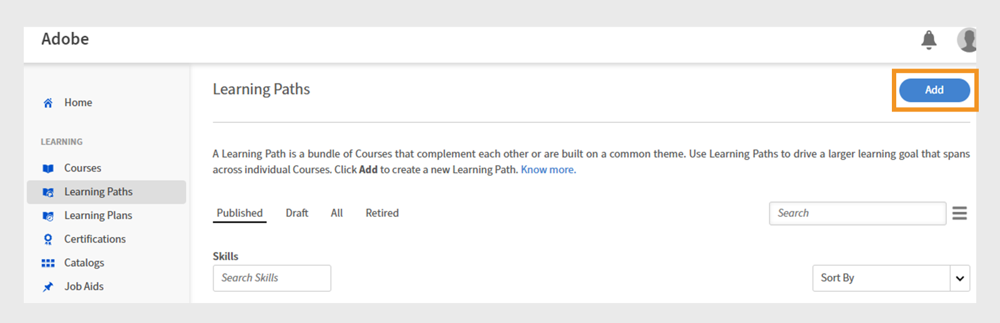

# Curar cursos Go1 para um caminho de aprendizado

Os administradores geralmente precisam selecionar cursos de vários repositórios ou catálogos, o que dificulta a identificação das melhores opções. Isso é especialmente desafiador com o Go1, onde milhares de cursos estão disponíveis. Para simplificar isso, fornecemos um recurso de curadoria por IA diretamente no fluxo de criação do Caminho de aprendizado. Isso ajuda os administradores a descobrir e selecionar rapidamente os cursos mais relevantes

Adicione cursos Go1 diretamente a caminhos de aprendizado e certificações. Crie Caminhos de aprendizado que incluam cursos Go1, para que os alunos possam acessar cursos Go1 selecionados como parte do treinamento.

>[!INFO]
>
>Você precisa de uma licença ativa do Go1 para adicionar cursos do Go1 a caminhos de aprendizado ou certificações. Exiba este [artigo](/help/migrated/administrators/feature-summary/content-marketplace.md) para saber mais sobre os detalhes da licença do Go1.

## Criar um caminho de aprendizado

Para criar um Caminho de aprendizado com cursos Go1:

1. Faça logon no Adobe Learning Manager como administrador.
2. Selecione **[!UICONTROL Caminhos de Aprendizado]** no painel de navegação esquerdo.
3. Selecione **[!UICONTROL Adicionar]**.

   
   _Selecione Adicionar na seção Caminhos de Aprendizado para criar e organizar novos programas de treinamento estruturado para seus alunos_

4. Digite os detalhes necessários e selecione **[!UICONTROL Salvar]**. Exiba este [artigo](/help/migrated/administrators/feature-summary/learning-paths.md) para obter mais informações.
5. Você pode adicionar cursos a um caminho de aprendizado das seguintes maneiras:

   * **[!UICONTROL Adicionar cursos ou caminhos de aprendizado]**: adicione cursos existentes ou caminhos de aprendizado disponíveis no Adobe Learning Manager.
   * **[!UICONTROL Curar conteúdo do Go1]**: adicionar cursos da plataforma Go1.
6. Selecione **[!UICONTROL Curar conteúdo de Go1]**.

   
   _Adicione os cursos do Go1 à sua lista de reprodução de desenvolvimento de habilidades dos engenheiros de vendas para expandir as opções de aprendizado com conteúdo selecionado de terceiros_
7. Os administradores podem criar uma lista de reprodução das seguintes maneiras:

   * Usando o **[!UICONTROL Assistente de IA Go1]**. Consulte o [Assistente de IA Go1](/help/migrated/administrators/feature-summary/content-marketplace/curate-go1-playlist.md#go1-ai-assistant) para obter mais informações.
   * Na **[!UICONTROL Biblioteca]**, selecione **[!UICONTROL Criar lista de reprodução]** e escolha uma destas opções:
a. **[!UICONTROL com IA]**: crie uma lista de reprodução com a ajuda da IA. Exiba esta [seção](/help/migrated/administrators/feature-summary/content-marketplace/curate-go1-playlist.md#create-a-playlist-with-ai) para obter mais informações.
b. **[!UICONTROL sozinho]**: crie uma lista de reprodução adicionando cursos manualmente a ela. Exiba esta [seção](/help/migrated/administrators/feature-summary/content-marketplace//curate-go1-playlist.md#create-a-playlist-manually) para obter mais informações.

### Assistente de IA Go1

O Adobe Learning Manager oferece assistência viabilizada por IA para facilitar a curadoria do curso para administradores. Com o Assistente de IA disponível na página Hub de Conteúdo, os administradores podem fazer perguntas, obter recomendações personalizadas e criar listas de reprodução instantaneamente. Além disso, o suporte a IA é integrado ao fluxo de criação do Caminho de Aprendizado, ajudando os administradores a identificar rapidamente os cursos mais relevantes de grandes catálogos, como o Go1. Esses recursos simplificam o processo de curadoria, economizam tempo e garantem que os alunos recebam o melhor conteúdo.

Para criar uma lista de reprodução com IA:

1. Selecione a opção **[!UICONTROL Conversar com IA]** no Hub de Conteúdo Go1.

   
   _Tela do Hub de Conteúdo exibindo a opção Bate-papo com IA, na qual os administradores podem interagir com o Assistente de IA para fazer perguntas_

2. Digite a pergunta e selecione **[!UICONTROL Enviar]**.

   
   _Tela do Assistente de IA na qual os administradores podem digitar perguntas, obter recomendações de cursos e criar instantaneamente uma lista de reprodução adaptada às suas necessidades_
3. Selecione as habilidades e selecione **[!UICONTROL Compilar em uma lista]**.

   
   _Tela do Assistente de IA exibindo as habilidades relevantes para selecionar e compilar na lista de reprodução_
4. Selecione **[!UICONTROL Converter em Playlist]**.

   
   _Tela do Assistente de IA exibindo a opção Converter em lista de reprodução para compilar todos os cursos na lista de reprodução_

5. Selecione **[!UICONTROL Exibir Lista De Reprodução]**.

   
   _Tela do Assistente do AI exibindo a opção Exibir lista de reprodução para publicar e importar a lista de reprodução para o Caminho de Aprendizado_

6. Selecione **[!UICONTROL Publish]** para criar a Lista de Reprodução. Você pode criar listas de reprodução adicionais em Go1 e adicioná-las a um caminho de aprendizado.
7. Selecione **Sim** no prompt de confirmação.
8. Selecione a Lista de Reprodução no prompt **[!UICONTROL Selecionar lista de reprodução para importar]**.

   
   _Selecione e importe a Lista de Reprodução de Aprimoramento de Habilidades do Engenheiro de Vendas da Biblioteca Go1 no Adobe Learning Manager_

9. Selecione **[!UICONTROL Adicionar listas de reprodução ao Caminho de Aprendizado]** e depois **[!UICONTROL Publish]**.

Os cursos na lista de reprodução serão adicionados ao Caminho de aprendizado. Os administradores podem inscrever os alunos, que podem começar a fazer os cursos imediatamente.

### Criar uma lista de reprodução com IA

Os administradores podem digitar a descrição da lista de reprodução no prompt do AI. A IA selecionará os cursos relacionados e criará uma lista de reprodução com base nos requisitos. A IA gera a lista de reprodução interpretando o objetivo ou o prompt de aprendizado fornecidos pelo usuário. Ao criar uma lista de reprodução, os administradores podem optar por selecionar conteúdo “com IA”, que permite que o sistema use grandes modelos de linguagem para entender os objetivos de aprendizado e as preferências de conteúdo especificados, como duração e tipo. Em seguida, a IA pesquisa a biblioteca de conteúdo em busca de objetos de aprendizado relevantes que correspondam a esses critérios.

1. Selecione **[!UICONTROL Criar playlist]** e selecione **[!UICONTROL com IA]**.

   
   _Crie listas de reprodução selecionadas com IA, o que permite recomendações automatizadas do curso adaptadas às necessidades do aluno_

2. Digite uma breve descrição sobre sua Lista de reprodução no campo de texto **[!UICONTROL Insira sua meta de aprendizado]**. Por exemplo, _Crie uma lista de reprodução de aprendizado selecionada para engenheiros de vendas focados no aprimoramento do conhecimento do produto, da comunicação técnica, do engajamento do cliente e das vendas de soluções_.

   
   _Digite seu objetivo de aprendizado para criar uma Lista de reprodução personalizada, ajudando a Adobe Learning Manager a recomendar cursos direcionados personalizados para as necessidades dos alunos_

3. Selecione **[!UICONTROL Próximo]**. O prompt exibe as habilidades necessárias, a duração do curso e o tipo do curso para a seleção.
4. Selecione as habilidades necessárias.

   
   _Escolha as habilidades da lista para organizar os cursos para o Engenheiro de Vendas_

5. Selecione a duração do curso e o tipo para sua Lista de reprodução.
   
   _Escolha a duração e o tipo de cursos para organizar os cursos para o Engenheiro de Vendas_

6. Selecione **[!UICONTROL Gerar lista de reprodução]**. A lista de reprodução é criada com 10 cursos em 2 páginas e os administradores podem usá-la para criar um caminho de aprendizado.

   
   _Revise sua lista de reprodução de aprimoramento de habilidades com curadoria de engenheiro de vendas no Adobe Learning Manager_

7. Navegue e adicione uma imagem à Playlist selecionando **[!UICONTROL Selecionar Imagem]**.
8. Altere o título usando as opções de IA disponíveis:

   * **[!UICONTROL Aprimorar a gravação]**: refine o título existente para torná-lo mais claro.
   * **[!UICONTROL Gerar título]**: crie um novo título com base no conteúdo ou no contexto automaticamente.

   
   _Tela de criação Go1 Playlist com opções de IA para aprimorar o título da Playlist_

9. Altere a descrição usando as opções de IA disponíveis:
   * **[!UICONTROL Aprimorar a gravação]**: refine a descrição existente para torná-la mais clara.
   * **[!UICONTROL Gerar descrição]**: crie uma nova descrição com base no conteúdo ou no contexto automaticamente.
   * **[!UICONTROL Encurte]**: encurte o texto ou o título enquanto mantém a ideia principal.

   
   _Tela de criação Go1 Playlist com opções de IA para aprimorar a descrição da Playlist_

10. Selecione **[!UICONTROL Adicionar item]** para adicionar mais cursos à Lista de Reprodução.

11. Selecione **[!UICONTROL Publish]** para criar a Lista de Reprodução. Você pode criar listas de reprodução adicionais em Go1 e adicioná-las a um caminho de aprendizado.
12. Selecione **Sim** no prompt de confirmação.
13. Selecione a Lista de Reprodução no prompt **[!UICONTROL Selecionar lista de reprodução para importar]**.

   
   _Selecione e importe a Lista de Reprodução de Aprimoramento de Habilidades do Engenheiro de Vendas da Biblioteca Go1 no Adobe Learning Manager_

14. Selecione **[!UICONTROL Adicionar listas de reprodução ao Caminho de Aprendizado]** e depois **[!UICONTROL Publish]**.

Os cursos na lista de reprodução serão adicionados ao Caminho de aprendizado. Os administradores podem inscrever os alunos, que podem começar a fazer os cursos imediatamente.

>[!NOTE]
>
>Os administradores também podem criar listas de reprodução diretamente da página Hub de Conteúdo. Exiba o [Hub de Conteúdo](/help/migrated/administrators/feature-summary/content-marketplace.md#content-hub) para obter mais informações.

## Criar uma lista de reprodução manualmente

Selecione manualmente os cursos que melhor correspondem aos requisitos dos alunos e selecione os cursos adicionais relevantes.

Para criar uma lista de reprodução manualmente:

1. Selecione **[!UICONTROL Criar lista de reprodução]** e selecione **[!UICONTROL sozinho]**.

   
   _Crie manualmente uma lista de reprodução que dê aos administradores controle total para organizar cursos com base nas necessidades específicas do aluno_

2. Navegue e adicione uma imagem à Playlist selecionando **[!UICONTROL Selecionar Imagem]**.
3. Digite o título e a descrição da sua Lista de Reprodução.

   
   _Adicione um título e uma descrição à sua lista de reprodução no Adobe Learning Manager para definir claramente sua finalidade e ajudar a orientar os alunos para o desenvolvimento de habilidades direcionado_

4. Selecione **[!UICONTROL Criar]**.
5. Selecione **[!UICONTROL Adicionar item]** para adicionar os cursos relacionados.

   
   _Adicione itens à lista de reprodução de desenvolvimento de habilidades de engenheiros de vendas no Adobe Learning Manager para organizar cursos direcionados_

6. Pesquise e selecione os cursos necessários.
7. Selecione **[!UICONTROL Publish]**. A Lista de reprodução foi criada com cursos relacionados.
8. Selecione **Sim** no prompt de confirmação.
9. Selecione a Lista de Reprodução no prompt **[!UICONTROL Selecionar lista de reprodução para importar]**.
10. Selecione **[!UICONTROL Adicionar listas de reprodução ao Caminho de Aprendizado]** e depois **[!UICONTROL Publish]**.

Os cursos na lista de reprodução serão adicionados ao Caminho de aprendizado. Os administradores podem inscrever os alunos, que podem começar a fazer os cursos imediatamente.

## Gerenciar listas de reprodução do Go1

Os administradores podem gerenciar as Listas de Reprodução Go1 criadas duplicando-as, compartilhando-as ou excluindo-as.

### Duplicar a lista de reprodução

Para duplicar a Lista de Reprodução:

1. Faça logon no Adobe Learning Manager como administrador.
2. Selecione **[!UICONTROL Marketplace de Conteúdo]**.
3. Selecione **[!UICONTROL Hub de Conteúdo]** e selecione **[!UICONTROL Biblioteca]**.
4. Selecione a Lista de Reprodução e selecione **[!UICONTROL Editar]**.
   
   _Tela Ir1 da lista de reprodução mostrando opções para editar a Lista de Reprodução_
5. Selecione as reticências e selecione **[!UICONTROL Duplicar]**.
   
   _Tela de gerenciamento de playlist, realçando a opção Duplicar_

A Lista de reprodução selecionada será duplicada e adicionada à biblioteca de conteúdo Go1

### Excluir a Lista de Reprodução

Para excluir a lista de reprodução:

1. Faça logon no Adobe Learning Manager como administrador.
2. Selecione **[!UICONTROL Marketplace de Conteúdo]**.
3. Selecione **[!UICONTROL Hub de Conteúdo]** e selecione **[!UICONTROL Biblioteca]**.
4. Selecione a Lista de Reprodução e selecione **[!UICONTROL Editar]**.
   
   _Tela Ir1 Lista de Reprodução mostrando opções para editar a Lista de Reprodução_
5. Selecione as reticências e selecione **[!UICONTROL Excluir lista de reprodução]**.
   
   _Tela de gerenciamento de playlist, realçando a opção Excluir Playlist_

A Lista de reprodução selecionada será excluída da biblioteca Go1.

### Compartilhar a lista de reprodução

A opção Compartilhar lista de reprodução não é compatível na integração do Go1 com o Adobe Learning Manager. Essa opção será removida da interface na próxima versão.

## Limite de cursos excedido

Ao adicionar cursos Go1 a um caminho de aprendizado, os administradores podem ver um erro se os cursos recém-adicionados ainda não tiverem sido sincronizados com a Adobe Learning Manager. Estes cursos estarão disponíveis dentro de 48 a 72 horas.

Se você adicionar a lista de reprodução agora, somente os cursos que já estão sincronizados serão incluídos.

Para incluir todos os cursos, é recomendável esperar até que a sincronização seja concluída antes de adicionar a lista de reprodução a um caminho de aprendizado.

## Cursos Go1 em certificações

Os administradores podem adicionar cursos Go1 em programas de certificação no Adobe Learning Manager. Ao criar uma certificação, os administradores podem pesquisar e selecionar cursos do catálogo de conteúdo Go1. Todos os cursos Go1 importados por meio do plano Go1 estão disponíveis para seleção no fluxo de trabalho de certificação.

As certificações que incluem cursos Go1 podem ser configuradas como perpétuas ou recorrentes. No caso de certificações recorrentes, o certificado é renovado automaticamente após o intervalo de tempo definido, permitindo que os alunos façam novamente os cursos Go1 e mantenham seu status de certificação.

Exiba [Certificações](/help/migrated/administrators/feature-summary/certifications.md) para obter mais informações sobre como criar certificados.
