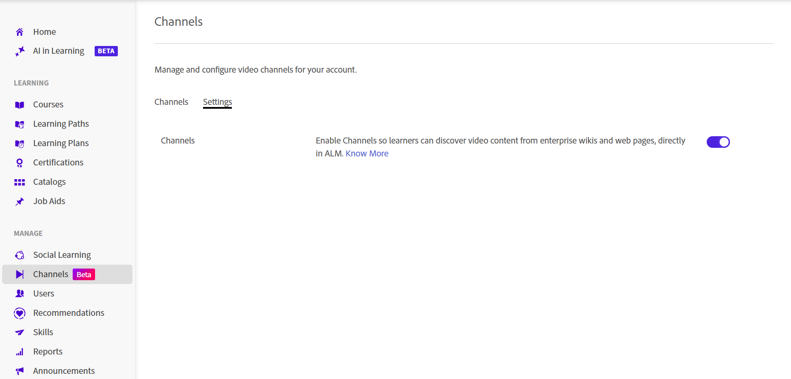

# Criar Canais (Beta)

>[!IMPORTANT]
>
>Os recursos beta podem conter defeitos e são fornecidos “NO ESTADO EM QUE SE ENCONTRAM” sem garantias de nenhum tipo. o Adobe tem o único critério de disponibilizar os recursos beta para o público em geral. O Adobe não tem obrigação de manter, corrigir, atualizar, alterar, modificar ou dar suporte (por meio dos Serviços de Suporte do Adobe ou de outra forma) aos recursos beta. Caso um recurso beta se torne disponível ao público, ele pode estar sujeito a termos e condições adicionais, incluindo taxas aplicáveis. Os recursos beta estão sujeitos a alterações sem aviso prévio, incluindo a descontinuação. Recomenda-se que os clientes tenham cuidado e não dependam de forma alguma do funcionamento ou desempenho ininterrupto ou sem erros dos recursos beta. Portanto, qualquer uso dos recursos beta é inteiramente por conta e risco do Cliente. Os recursos do produto e a documentação relacionada podem mudar conforme o recurso evolui. Esta documentação reflete a experiência beta atual e não deve ser considerada uma documentação final ou completa do produto.

As organizações costumam armazenar sessões de compartilhamento de conhecimento, gravações de treinamento e outros conteúdos de vídeo em páginas da Web e da Confluence Cloud selecionadas de conteúdo de aprendizado informal. Os canais conectam o Adobe Learning Manager a essas fontes de conteúdo, facilitando a descoberta e o consumo de vídeos sem exigir que os alunos naveguem em vários sistemas. Os canais ajudam a organizar e compartilhar conteúdo de aprendizado baseado em vídeo de páginas da Web corporativas e páginas da Confluence Cloud em um único local pesquisável. Em vez de pesquisar em vários sites internos, os alunos podem descobrir e acessar gravações relevantes diretamente do Adobe Learning Manager. Exiba [Descobrir e interagir com Canais](../../learners/feature-summary/discover-and-engage-with-channels.md) para obter mais informações.

Como administrador, você pode criar e gerenciar canais, definir configurações de visibilidade, sincronizar conteúdo com sua origem e verificar se os vídeos estão disponíveis antes de tornar o canal acessível aos alunos. Os formatos de vídeo com suporte são **MP4** e **WebM**.

Este artigo explica como executar essas tarefas de gerenciamento de canal.

**Principais benefícios**

- Consolide o conteúdo de aprendizado baseado em vídeo de várias fontes internas em um único local.
- Organizar conteúdo de vídeo de vários locais da intranet em páginas da Web, que são exibidas como canais no ALM.
- Permita que os alunos encontrem, joguem e se envolvam com conteúdo sem precisar navegar por vários sites.
- Mantenha o conteúdo sincronizado com sua origem.

## Ativar canais

Canais é um recurso que os administradores ativam para a conta. Depois de ativado, você pode criar canais que se conectam a páginas da Web corporativas e a páginas de Confluência na nuvem com conteúdo de vídeo.

O rastreador de canal extrai de forma confiável vídeos de páginas de origem que apresentam seu conteúdo nos seguintes formatos:

- Tabelas
- Listas com marcadores
- Artigos

Para habilitar o recurso **Canais**:

1. Faça logon no Adobe Learning Manager como administrador.

1. Selecione **Canais** da navegação à esquerda.
     A página **Canais** é aberta.

1. Selecione a guia **Configurações**.

   

   *Habilite o recurso Canal na guia **Configurações**&#x200B;para permitir que os administradores criem canais para a conta.*

1. Habilitar **Recurso de canal**.

     Os canais estão habilitados para a conta.

## Criar um canal

Crie um canal para definir a fonte de conteúdo em que o Adobe Learning Manager verifica se há vídeos e personalize o canal e a aparência da página de vídeo.

1. Navegue até a guia **Canais** e selecione **Adicionar canal**.
     A página **Criar canal** é aberta.

   

   *Defina a fonte de conteúdo e configure as opções de visibilidade e sincronização ao criar um canal.*

1. Na seção **Canal**, insira o **Nome do canal** e a **Descrição**.

1. Selecione um **tipo de origem** no menu suspenso. As seguintes opções estão disponíveis:

   1. **Página da Web**: selecione esta opção para rastrear uma página da Web e importar links de vídeo junto com seus metadados associados.

   1. **Página de conferência**: selecione esta opção para recuperar links e metadados de vídeo de uma página da Confluence Cloud. Para se conectar à Confluence Cloud, forneça os seguintes detalhes:
      - **Endereço de email Atlassian**: insira o endereço de email associado à sua conta Atlassian.
      - **Token da API Atlassian**: insira o token da API gerado da sua conta Atlassian. Selecione **Como criar um token de API** para obter instruções sobre como gerar um. Este token é usado para autenticação durante o rastreamento da origem e é armazenado criptografado.

      

      *Insira o endereço de email Atlassian e o token de API usados para autenticar com a Confluence Cloud.*

1. Insira a **URL de Origem** do conteúdo do tipo de origem selecionado.

1. Na seção **Status**, configure as seguintes opções:

   1. **Visível aos alunos**: habilite esta opção para disponibilizar o canal para os alunos. Desative-o para ocultar o canal enquanto continua configurando ou testando-o.

   1. **Sincronizar automaticamente**: habilite esta opção para atualizar automaticamente o canal quando novos vídeos forem adicionados à origem. Desative-a se quiser sincronizar manualmente o canal.

1. (Opcional) Selecione **Mostrar configurações avançadas** e configure as seguintes opções conforme necessário:

   1. **Cor do tema do canal**: selecione uma cor para personalizar a aparência visual do canal.

   1. **profundidade de rastreamento**: insira a profundidade de rastreamento de páginas vinculadas para verificar o conteúdo de vídeo. Ele oferece suporte a uma profundidade de rastreamento máxima de **2**.

   1. **Frequência de rastreamento (em horas)**: insira com que frequência o Adobe Learning Manager deve verificar se há conteúdo novo ou atualizado na origem.

      

      *Selecione Mostrar configurações avançadas para configurar a cor do tema do canal, a profundidade de rastreamento e a frequência de rastreamento.*

1. Selecione **Testar agora** para validar a origem. Os vídeos de amostra são recuperados e exibidos a partir da origem configurada.

   

   *Use **Testar agora**&#x200B;para confirmar se os vídeos são recuperados da origem antes de criar o canal.*

1. Selecione **Criar canal**. O canal é criado e adicionado à lista **Canais**.

## Procurar um canal

Use a caixa de pesquisa para localizar rapidamente um canal pelo nome.

1. Selecione a guia **Canais**.
1. Selecione a caixa **Pesquisar canais**.
1. Insira o nome do canal ou uma parte dele na caixa **Pesquisar canais**.
     Os filtros de lista para exibir somente os canais que correspondem à sua pesquisa.

   

   *Insira um nome de canal na caixa de pesquisa para filtrar a lista **Canais**.*

## Gerenciar a visibilidade de canais

Use o menu **Ações** para desabilitar ou ocultar um ou mais canais ao mesmo tempo.

### Desativar canais

Desative um ou mais canais para impedir que os alunos acessem seu conteúdo enquanto mantêm a configuração do canal.

Para desativar canais:

1. Navegue até **Canais**.
1. Marque a caixa de seleção ao lado de um ou mais canais e selecione **Ações**.

   
   *Selecione Desabilitar no menu Ações para desabilitar um ou mais canais selecionados.*
1. Selecione **Desabilitar**.  A janela pop-up **Desativar canais** é exibida.
1. Selecione **Desabilitar**.  Os canais selecionados estão desabilitados.

### Ocultar canais dos alunos

Oculte um ou mais canais para torná-los indisponíveis para os alunos sem excluí-los.

Para ocultar canais dos alunos:

1. Navegue até **Canais**.
1. Marque a caixa de seleção ao lado de um ou mais canais e selecione **Ações**.
1. Selecione **Ocultar dos alunos**.  A janela pop-up **Ocultar dos alunos** é exibida.

   
   *Oculte os canais dos alunos sem excluir a configuração de canal.*

1. Selecione **Ocultar dos alunos**.
     Os canais selecionados estão ocultos dos alunos.

## Editar um canal

É possível editar um canal existente para atualizar suas configurações.

Para editar um canal:

1. Selecione o canal necessário na lista **Canais**.
     A página **Editar canal** é aberta e exibe a configuração de canal atual.

1. Atualize as configurações do canal conforme necessário.

   

   *Atualize o nome, a descrição, a origem e as configurações de um canal a partir da página **Editar canal**.*

1. (Opcional) Selecione **Testar agora**.

1. Selecione **Salvar alterações**.
     As configurações de canal atualizadas foram salvas.

## Excluir um canal

É possível excluir um ou mais canais que não são mais necessários.

1. Navegue até a guia **Canais**.

1. Marque a caixa de seleção ao lado de cada canal que deseja excluir.

1. Selecione **Excluir** na parte inferior direita da lista de canais.   A janela pop-up **Excluir canais** é exibida.

   

   *Uma caixa de diálogo de confirmação lista os canais que você selecionou.*

1. Selecione **Excluir**.
     Os canais selecionados são excluídos permanentemente. Esta ação não pode ser desfeita.
