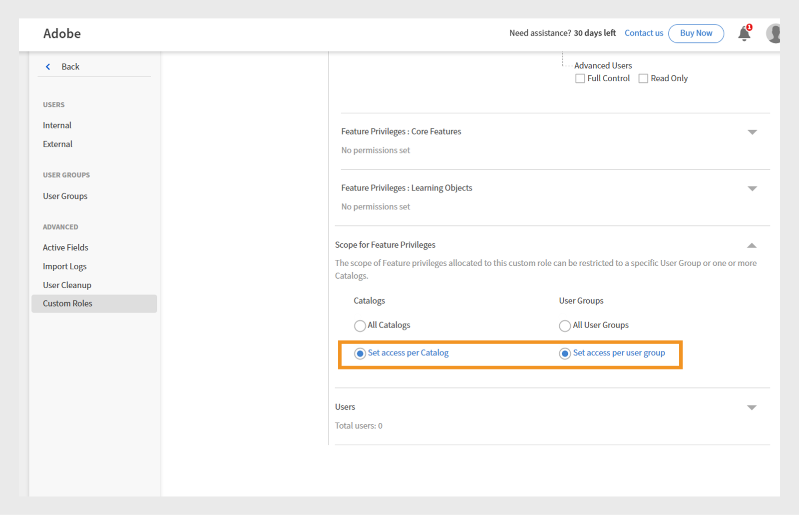

# Função personalizada com permissões de comunicado com escopo

Os administradores podem criar funções personalizadas com permissões de comunicado restritas a catálogos e grupos de usuários específicos. Isso garante que os anúncios sejam direcionados, relevantes e visíveis apenas para os alunos desejados. Anúncios no escopo garantem que os usuários certos recebam o anúncio relevante sem enviar detalhes para outras pessoas.

## Criar uma função personalizada com um escopo específico

O administrador pode criar uma função personalizada com permissões de comunicado limitadas a um catálogo e grupo de usuários específicos.

Para criar uma função personalizada com um escopo específico:

1. Faça logon no Adobe Learning Manager como administrador.
2. Selecione **[!UICONTROL Usuários]** no painel de navegação esquerdo.

   
   _Atribuir funções personalizadas aos usuários para permissões e responsabilidades direcionadas no Adobe Learning Manager_

3. Selecione Funções personalizadas.
4. Selecione Criar função personalizada.

   
   _Atribua funções personalizadas aos usuários para personalizar permissões e otimizar o controle administrativo para grupos de usuários ou catálogos específicos_

5. Digite o nome e a descrição da função personalizada.
6. Selecione Anúncio em Privilégios da conta.

   
   _Habilite as permissões de comunicado em Privilégios da Conta para permitir que os administradores personalizados gerenciem comunicações direcionadas dentro do escopo_

7. Selecione Definir acesso por catálogo em Escopo para privilégios de recurso e selecione o catálogo.
8. Na mesma seção, escolha Definir acesso por grupo de usuários e selecione o
grupo de usuários

   
   _Defina escopos de catálogo e grupo de usuários para garantir que os administradores personalizados possam gerenciar permissões e acessar apenas dentro de seus escopos atribuídos_

9. Selecione e adicione o usuário ao qual você deseja atribuir esta função personalizada. Os usuários atribuídos podem criar um comunicado para seu escopo.

Um administrador personalizado pode criar comunicados limitados aos grupos de usuários e catálogos atribuídos, garantindo que as mensagens cheguem ao público certo e evitando notificações desnecessárias. Para comunicados de notificação e email, os administradores podem adicionar grupos de usuários extras, mas somente os usuários no escopo definido os receberão. Para comunicados de Recomendação e de Manchete, você só pode selecionar grupos de usuários no escopo atribuído.

## Criar comunicado para o escopo atribuído

Um administrador personalizado pode criar comunicados limitados aos grupos de usuários e catálogos atribuídos, garantindo que as mensagens cheguem ao público certo e evitando notificações desnecessárias.

Para criar um comunicado para o escopo atribuído:

1. Faça logon no Adobe Learning Manager como um administrador personalizado.
2. Selecione **[!UICONTROL Comunicado]** no painel de navegação esquerdo.
3. Selecione **[!UICONTROL Adicionar]**.

   
   _Página Comunicados no Adobe Learning Manager, na qual os administradores podem criar e gerenciar comunicados para grupos de usuários direcionados_

4. Selecione o **[!UICONTROL Tipo de Comunicado]** no menu suspenso.
a. **[!UICONTROL Como Notificação]**
b. **[!UICONTROL Como Manchete]**
c. **[!UICONTROL Como Recomendação]**
d. **[!UICONTROL Como Email]**
5. Selecione **[!UICONTROL Como Manchete]**.
6. Selecione o idioma e faça upload de uma imagem para a manchete.
7. Ou adicione um URL para o botão de ação.

   
   _Tela Criar comunicado permitindo que os administradores definam o tipo de comunicado, carreguem anexos e adicionem botões de ação_

   O escopo atribuído é pré-selecionado na seção **[!UICONTROL Escopo]** e não pode ser modificado por administradores personalizados.

   >[!NOTE]
   >
   >**[!UICONTROL Para comunicados de Notificação]** e de **[!UICONTROL Email]**, eles poderão incluir grupos de usuários e catálogos adicionais se eles se sobrepuserem ao escopo atribuído.

8. Selecione **[!UICONTROL Salvar]**.

Somente os alunos no escopo do administrador personalizado poderão exibir o comunicado. Veja este [artigo](/help/migrated/administrators/feature-summary/announcements.md) para saber como criar vários tipos de comunicados.

## Redefinir o escopo por administradores personalizados

Os administradores personalizados podem redefinir o escopo de seus comunicados publicados se um administrador tiver alterado o escopo deles. Depois que o escopo for redefinido, o escopo atualizado será aplicado ao comunicado e somente os alunos do novo escopo poderão ver o comunicado.

Para redefinir o escopo:

1. Faça logon no Adobe Learning Manager como um administrador personalizado.
2. Selecione **[!UICONTROL Comunicado]** no painel de navegação esquerdo.
3. Selecione a guia **[!UICONTROL Publicado]**.
4. Selecione qualquer comunicado e, em seguida, selecione o ícone de configuração.
5. Selecione **[!UICONTROL Editar]**.

   
   _Tela de anúncio mostrando os anúncios publicados com opções de edição, publicação e outras opções_

6. Selecione **Redefinir**.

   
   _Anúncio que mostra uma notificação de alteração de escopo, com uma opção para que os administradores personalizados redefinam e atualizem a seleção de escopo para refletir novas permissões de acesso_

O escopo será atualizado e somente os usuários dentro do escopo atualizado poderão ver o comunicado.

## Editar o comunicado por meio da interface do administrador

Os administradores podem editar e gerenciar todos os comunicados criados por administradores personalizados. Se um administrador tentar editar um comunicado criado por um administrador personalizado com um escopo específico, será exibida uma mensagem de aviso no comunicado informando **[!UICONTROL Remover]** escopo. O administrador pode remover o escopo para disponibilizar o comunicado para todos. Nesse caso, o administrador personalizado receberá um aviso informando que o escopo do comunicado foi alterado.

Para editar o comunicado por meio da interface do administrador:

1. Faça logon no Adobe Learning Manager como administrador.
2. Selecione **[!UICONTROL Comunicado]** no painel de navegação esquerdo.
3. Selecione a guia **[!UICONTROL Publicado]**.
4. Selecione qualquer comunicado e, em seguida, selecione o ícone de configuração.
5. Selecione **[!UICONTROL Editar]**.

   
   _Tela de anúncio mostrando os anúncios publicados com opções de edição, publicação e outras opções_

6. Selecione **[!UICONTROL Remover]**.

   
   _Tela de anúncio indicando que o escopo deve ser removido para permitir que os administradores editem comunicados criados para grupos de usuários com escopo_

O administrador pode editar o comunicado após remover o escopo.
