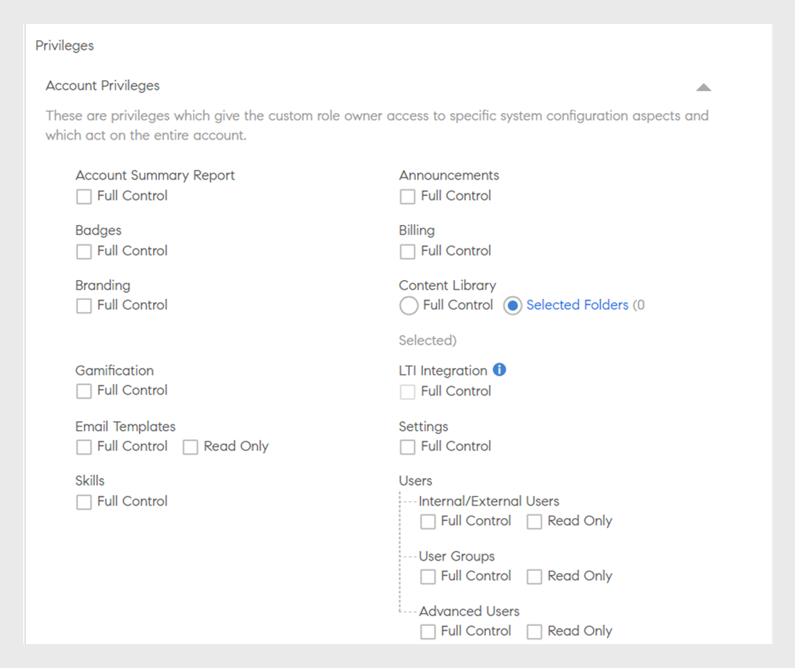
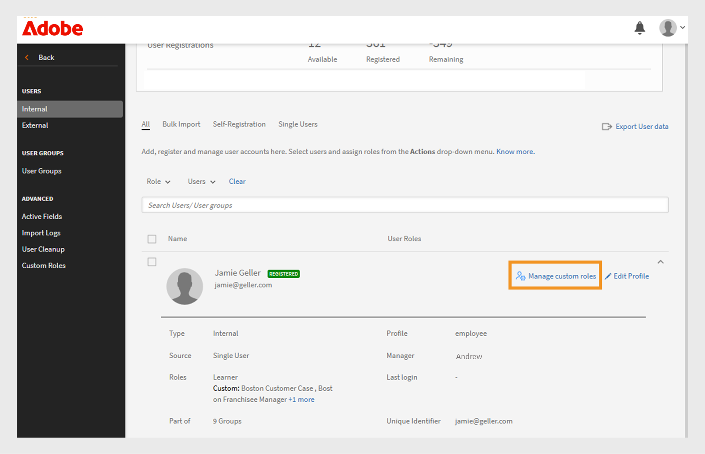

# Funções personalizadas

Esse recurso ajuda a definir funções personalizadas e atribuir responsabilidades específicas a um conjunto de usuários. Esse recurso permite atribuir responsabilidades fora do alcance da função existente do indivíduo.

Você pode criar uma função personalizada para fornecer habilidades limitadas de criação de um catálogo específico. Também pode criar uma função dedicada ao gerenciamento de relatórios. Tais funções podem, então, ser atribuídas a indivíduos que deveriam assumir essas responsabilidades específicas.

>[!NOTE]
>
>Adicionar uma nova função personalizada não afetará grupos de usuários personalizados existentes ou quaisquer grupos baseados em funções, como Todos os administradores, Todos os autores etc.

O administrador tem a capacidade de criar funções personalizadas de administrador e autor com permissões personalizadas para cada função. Veja abaixo uma visão geral das permissões associadas a cada função:

**Permissões de Função de Autor Personalizadas**

Autores personalizados podem realizar as seguintes tarefas:

* Acesse a biblioteca de conteúdo para adicionar, editar ou excluir conteúdo principal.
* Criar, editar e excluir:
   * Cursos
   * Ajudas de tarefa
   * Certificações
   * Caminhos de aprendizado
   * Planos de aprendizado

Os administradores e autores, incluindo administradores personalizados e autores personalizados, terão a capacidade de compartilhar objetos de aprendizado (LOs) em catálogos compartilhados externamente. Os administradores e autores devem poder pesquisar catálogos compartilhados externamente ao criar objetos de aprendizado (LOs).

**Permissões de função de administrador personalizada**

A função de administrador personalizada replica um conjunto de responsabilidades de administrador, incluindo o acesso a privilégios em nível de conta. Os administradores personalizados recebem permissões para gerenciar os principais recursos relacionados às atividades de aprendizado, como:

* Planos de aprendizado
* Catálogos
* Relatórios
* Tags

Além disso, os administradores personalizados podem:

* Gerenciar cursos e ajudas de tarefa, incluindo a inscrição e a exclusão de usuários.
* Criar, editar e excluir certificações, programações de aprendizado e planos de aprendizado.
* Acessar os recursos de relatório e inscrição para todos os objetos de aprendizado (LOs).

Os administradores agora podem exibir as permissões criadas por CSV no Adobe Learning Manager. A opção Filtrar por filtra as funções personalizadas pelo administrador criadas e importadas por meio de um CSV. Depois de selecionar uma função personalizada, você pode ver suas permissões.

_Filtrar funções personalizadas_

## Criar uma função personalizada {#create-role}

1. Faça logon como administrador. Abra **[!UICONTROL Usuários]** > **[!UICONTROL Função Personalizada]**.
2. Selecione **[!UICONTROL Criar Função]**. A guia **[!UICONTROL Criar Nova Função]** é aberta.

   

   *Criar uma função personalizada*

3. Insira o nome no campo **[!UICONTROL Nome da Função]**.
4. **[!UICONTROL Privilégios de conta]**: esses privilégios concedem aos proprietários da função acesso a aspectos específicos de configuração do sistema e que atuam na conta inteira. Escolha as permissões de acesso. O usuário recebe controle total sobre as permissões atribuídas.

   Os administradores podem conceder permissões detalhadas para a seção Usuário, que tem Usuários internos/externos, Grupos de usuários e Usuários avançados.

   >[!NOTE]
   >
   >   O escopo não é aplicável a esses privilégios.

   

   *Definir o escopo*

5. **Privilégios do recurso - recursos principais**: usado para conceder acesso a recursos específicos para gerenciar atividades de aprendizado. Através dessa opção é possível conceder permissões aos recursos a seguir.

   Os administradores podem fornecer permissões detalhadas, como somente leitura, criar, editar e excluir permissões para os catálogos.

   * Catálogos
   * Relatórios
   * Tags

   

   *Definir escopo para catálogos, relatórios e marcas*

6. **Privilégios do recurso- Objetos de Aprendizado:** use esta opção para fornecer acesso aos recursos relacionados aos OAs. Os administradores podem fornecer permissões detalhadas para todos os objetos de aprendizado, incluindo cursos, programações de aprendizado, certificações e ajudas de tarefa. Eles podem atribuir permissões aos usuários, como criar, editar, excluir ou acesso somente leitura.

   * Certificações
   * Cursos 
   * Ajudas de tarefa
   * Programas de aprendizado

   Você também pode conceder um controle de operação específico para os objetos de aprendizado. A permissão pode ser uma das seguintes opções:

   * Somente leitura
   * Criar 
   * Editar
   * Excluir
   * Inscrição
   * Relatório

   Você também pode conceder controle total para os OAs.

   

   *Conceder permissões específicas*

7. **Escopo dos privilégios de recurso:** o escopo dos privilégios de Recurso alocados para esta função pode ser restrito a um Grupo de Usuários específico ou a um ou mais Catálogos.

   Catálogos: use o botão de opção para fornecer controle sobre **[!UICONTROL Todos os catálogos]** ou use a opção **[!UICONTROL Definir acesso por catálogo]** para fornecer acesso a catálogos específicos. Também é possível selecionar vários catálogos.

   Grupos de usuários: forneça acesso a **[!UICONTROL Todos os grupos de usuários]** ou use a opção **[!UICONTROL Definir acesso por grupo de usuários]** para fornecer acesso a grupos de usuários específicos. É possível especificar apenas um grupo de usuários.

   >[!NOTE]
   >
   >Se você selecionou Anúncio, Gamificação, Modelos de email, Habilidades e usuários em Privilégios da conta, o acesso ao grupo de usuários é fornecido a todos os grupos de usuários por padrão e essa opção é desativada.

   Se tiver selecionado Planos de aprendizado em Privilégios da conta, o acesso a todos os Catálogos e Grupos de usuários é fornecido por padrão e estas opções estão desativas em Escopo.

   

   *Definir escopo de privilégios*

>[!NOTE]
>
>   No Learning Manager 27.6, é possível criar uma função personalizada que estará no escopo de vários catálogos e a cada catálogo será concedido um conjunto diferente de permissões.

Para obter mais permissões para os catálogos, siga as etapas abaixo:

1. Clique na opção **[!UICONTROL Definir acesso por catálogo]**.
1. Escolha os catálogos para você poder ver o nível de permissão de cada catálogo. As permissões são as seguintes:

   <table>
        <tbody>
        <tr>
          <td>
          
<b>Permissão</b>
</td>
          <td>
          
<b>Descrição</b>
</td>
        </tr>
        <tr>
          <td>
          
Controle total
</td>
          <td>
          
Concede o controle total em todos os objetos de aprendizado. As permissões incluem adicionar, editar, excluir, ler, inscrever e relatar. 
</td>
        </tr>
        <tr>
          <td>
          
Relatório
</td>
          <td>
          
Concede acesso somente à guia Relatórios do objeto de aprendizado.
</td>
        </tr>
        <tr>
          <td>
          
Inscrever
</td>
          <td>
          
Concede permissão para inscrições somente no objeto de aprendizado.
</td>
        </tr>
        <tr>
          <td>
          
Somente leitura
</td>
          <td>
          
Concede permissão somente para ver os objetos de aprendizado no catálogo.
</td>
        </tr>
        </tbody>
      </table>

1. Ative ou desative as permissões de acordo com suas necessidades.
1. Para salvar as alterações, clique em **[!UICONTROL OK]**. Em seguida, para salvar as alterações na Função personalizada, clique em **[!UICONTROL Salvar]**.

Considere, por exemplo, o seguinte cenário.

A permissão resultante, que um usuário personalizado teria em um objeto de aprendizado, é uma interseção da permissão do objeto de aprendizado e da permissão do catálogo.

Um usuário personalizado tem permissão completa nos cursos e acesso de somente leitura no catálogo A, mas tem permissão completa no catálogo B. Os resultados são acesso de somente leitura nos cursos do catálogo A e controle total nos cursos do catálogo B.

Os usuários com função personalizada podem:

* Ver somente o conteúdo dos catálogos aos quais eles têm acesso.
* Acessar qualquer objeto de aprendizado com base nas permissões do catálogo do qual o objeto de aprendizado faz parte.

  Como administrador, você pode:

* Escolher mais de um catálogo para uma função personalizada.
* Modificar as permissões de um catálogo a qualquer momento.
* Remover os catálogos de um escopo para o qual você não deseja mais conceder permissões.
* Conceder implicitamente a permissão Somente leitura para um catálogo, ao conceder permissões para o catálogo.

  A tabela abaixo ilustra como as permissões são concedidas.

  <table>
    <tbody>
     <tr>
      <td>
       
<strong> </strong>
</td>
      <td>
       
<strong>Permissão no nível do catálogo</strong>
</td>
     </tr>
     <tr>
      <td>
       
<strong>Objeto de aprendizado - Permissão de nível</strong>

       
<strong>(Por exemplo: Cursos)</strong>
</td>
      <td>
       
Controle total
</td>
      <td>
       
Inscrever
</td>
      <td>
       
Relatório
</td>
      <td>
       
Somente leitura
</td>
     </tr>
     <tr>
      <td>
       
Controle total
</td>
      <td>
       
Controle total
</td>
      <td>
       
Inscrever
</td>
      <td>
       
Relatório
</td>
      <td>
       
Somente leitura
</td>
     </tr>
     <tr>
      <td>
       
Inscrever
</td>
      <td>
       
Inscrever
</td>
      <td>
       
Inscrever
</td>
      <td>
       
Somente leitura
</td>
      <td>
       
Somente leitura
</td>
     </tr>
     <tr>
      <td>
       
Editar e excluir
</td>
      <td>
       
Editar e excluir
</td>
      <td>
       
Somente leitura
</td>
      <td>
       
Somente leitura
</td>
      <td>
       
Somente leitura
</td>
     </tr>
     <tr>
      <td>
       
Relatório
</td>
      <td>
       
Relatório
</td>
      <td>
       
Somente leitura
</td>
      <td>
       
Relatório
</td>
      <td>
       
Somente leitura
</td>
     </tr>
    </tbody>
   </table>

1. **Usuários:** use esta opção para determinar quais usuários receberam esta função. É possível escolher um ou mais usuários usando a caixa de pesquisa.

   **Adicionar usuários ao carregamento de CSV de função personalizada:** para adicionar usuários por meio do carregamento de CSV, adicione uma coluna CustomRole ao arquivo .csv que o administrador usou para importar usuários. Insira a função do usuário na coluna CustomRole para os usuários aos quais você deseja atribuir uma função personalizada. Para carregar o arquivo CSV, clique em **[!UICONTROL Adicionar > Carregar um CSV]**.

   * Não é possível pesquisar Grupos de usuários.
   * Não é possível pesquisar usuários que já tenham uma função de administrador atribuída a eles.
   * A atribuição de uma nova função personalizada a um usuário substitui a função personalizada anterior do usuário.

   <!---->

   * Um administrador personalizado com permissão para Configurações poderá configurar o agendamento para sincronizar ou sincronizar usuários da Fonte de dados, mesmo se não tiver permissão para a entidade Usuários.
   * Se um administrador personalizado tiver permissão na entidade Usuários, ele poderá atribuir a si mesmo a função de administrador e se tornar um administrador padrão.

## Atribuir várias funções personalizadas a um usuário

É possível atribuir várias funções personalizadas a usuários usando as seguintes maneiras:

* Usar a interface: é possível atribuir mais de uma função personalizada a um usuário diretamente da interface do Adobe Learning Manager.
* Usar upload de CSV: você pode fazer upload de um arquivo CSV para atribuir várias funções personalizadas a vários usuários ao mesmo tempo.

Isso facilita o gerenciamento do acesso do usuário e o controle de permissões no sistema.

### Atribuir várias funções personalizadas por meio da interface de usuário

Atribuir várias funções personalizadas por meio do Admin Console no Adobe Learning Manager é uma opção rápida e intuitiva ideal para integração, ajustes de permissão ou atualizações menores. As funções podem ser atribuídas visualmente, sem a necessidade de uploads de CSV, o que reduz o risco de erros e fornece visibilidade em tempo real. Esse método oferece suporte a atualizações rápidas à medida que as responsabilidades mudam e permite a alternância e a delegação de funções conforme necessário.

Para atribuir várias funções personalizadas a um usuário, siga estas etapas:

1. Faça logon como administrador e selecione **[!UICONTROL Usuários]**.
2. Selecione **[!UICONTROL Funções personalizadas]** no painel esquerdo.
3. Crie uma nova função personalizada e adicione privilégios de conta, catálogos, objetos de aprendizado ou escopos. Consulte as [etapas mencionadas aqui](#create-a-custom-role).
4. Adicionar usuários à função personalizada.

   
   _Atribuir usuários a uma função personalizada_

5. Selecione **[!UICONTROL Salvar]**.

Selecione várias funções personalizadas para um usuário conforme necessário. Cada usuário pode ter até 50 atribuições de função personalizadas. O número de funções disponíveis diminui com cada atribuição.

Depois de atribuir usuários a uma função personalizada adicional, você pode ver quantas atribuições de função permanecem disponíveis para cada usuário.

>[!NOTE]
>
>Você pode atribuir até 50 funções a cada usuário e adicionar até 500 usuários a cada função.

### Atribuir várias funções personalizadas usando CSV

Fazer upload de um arquivo CSV no Adobe Learning Manager permite a atribuição em massa eficiente de funções personalizadas. Esse processo é benéfico principalmente para a integração de um grande número de funcionários, a reorganização de equipes ou a atualização do acesso a novos treinamentos. As importações de CSV poupam o esforço manual, garantem atribuições consistentes e reduzem erros. Esse método é especialmente útil durante fusões, atualizações em todo o departamento ou implementações de treinamento global. Esse método ajuda os administradores a economizar tempo, padronizar funções e manter a governança.

Agora você pode atribuir várias funções a um usuário por meio da importação de CSV enviando dois arquivos para o Box:

* [role.csv](assets/role.csv)
* [user_role.csv](assets/user_role.csv)

O arquivo user_role.csv inclui os campos Função personalizada e IDs de usuário.

O arquivo role.csv inclui os campos, a função Personalizada, a Origem da criação e informações detalhadas para Catálogos, Usuários, Cursos, Caminhos de aprendizado e muito mais.

Se o arquivo CSV tiver dados incorretos ou ultrapassar os limites (50 funções por usuário e 500 usuários por função), uma mensagem será exibida mostrando os erros.

_Notificação de erro para funções personalizadas_
Os usuários recebem notificações por email quando as funções são atribuídas, incluindo o nome da função.

### Gerenciar funções personalizadas

Os administradores podem atualizar, adicionar ou remover funções personalizadas para usuários no Adobe Learning Manager à medida que as responsabilidades mudam. Isso garante que o acesso se alinhe às funções atuais sem afetar o histórico de aprendizado ou os dados de inscrição. Na página **[!UICONTROL Usuários]**, o administrador pode pesquisar usuários, exibir suas funções e ajustá-las usando a opção Gerenciar Funções Personalizadas. Essa interface guiada permite fácil adição ou remoção de funções, mantendo a governança e a segurança.

>[!NOTE]
>
>Os administradores personalizados não podem gerenciar funções personalizadas (adicionar ou remover função personalizada) ou promover a si mesmos para a função de administrador.

Depois de atribuir funções personalizadas aos usuários, você pode adicionar ou remover funções personalizadas da página **[!UICONTROL Usuários]**.

1. Pesquise um usuário na página **[!UICONTROL Usuários]**.

   
   _Pesquisar um usuário na página Usuários_

2. Selecione a seta suspensa no final da linha em que o nome de usuário é exibido e selecione **[!UICONTROL Gerenciar funções personalizadas]**.

   
   _Selecione Gerenciar funções personalizadas na página do usuário_

3. É exibida uma caixa de diálogo com a lista de funções personalizadas atribuídas ao usuário. Selecione **[!UICONTROL Adicionar/remover funções]** para adicionar ou remover funções personalizadas atribuídas ao usuário.

   
   _Selecione Adicionar/Remover funções no prompt Gerenciar Funções Personalizadas_

4. Pesquise outras funções personalizadas a serem atribuídas ao usuário. Depois de localizar um, selecione a função personalizada.

   
   _Selecione a função personalizada_

5. Selecione **[!UICONTROL Salvar]**. Uma caixa de diálogo de confirmação da alteração na função personalizada é exibida. Selecione **[!UICONTROL Sim]**.

   
   _Selecione Sim no prompt de confirmação_

Uma terceira função personalizada é atribuída ao usuário.

Para remover as funções personalizadas, siga estas etapas:

1. Pesquise um usuário na página **[!UICONTROL Usuários]**.
2. Selecione a lista suspensa ao lado do usuário e selecione **[!UICONTROL Gerenciar funções personalizadas]**.
3. Selecione **[!UICONTROL Adicionar/remover funções]** para adicionar ou remover funções personalizadas.
4. Selecione o **[!UICONTROL ícone de remoção]** para excluir a função personalizada.

   
   _Remover funções personalizadas_

### Alternar funções personalizadas

Para exibir e selecionar quaisquer funções personalizadas atribuídas a você, use a opção **[!UICONTROL Alternar função personalizada]**.

_Selecionar funções personalizadas_

Os usuários recebem notificações por email quando as funções personalizadas são atribuídas a eles. Os e-mails agora incluem nomes de funções para maior clareza.

## Baixar o relatório de função personalizada

Os administradores podem baixar um relatório CSV listando todas as funções personalizadas e suas permissões associadas. O relatório indica se cada função foi criada manualmente ou por meio de upload de CSV e fornece um resumo do acesso e dos privilégios atribuídos a cada função.

Para baixar o relatório, siga estas etapas:

1. Faça logon como **[!UICONTROL Administrador]**.
2. Selecione **[!UICONTROL Usuários]** > **[!UICONTROL Funções Personalizadas]**.
3. Selecione a opção **[!UICONTROL Baixar]** para baixar o relatório CSV.

_Baixar relatório de funções personalizadas_

O relatório tem dois arquivos CSV: role.csv e user_role.csv. O arquivo role.csv inclui:

* Função personalizada
* IDs de usuário
* Origem da criação.

O arquivo user_role.csv inclui os campos, a função Personalizada, a Origem da criação e informações detalhadas para Catálogos, Usuários, Cursos, Caminhos de aprendizado e muito mais.

## Trilha de auditoria para funções personalizadas

Os administradores podem baixar o relatório de auditoria da função personalizada para rastrear todas as alterações feitas nas funções personalizadas, incluindo a criação, modificação e exclusão de funções personalizadas e o acesso a seus recursos associados.

Consulte este artigo [Trilha de auditoria para funções personalizadas](/help/migrated/administrators/feature-summary/reports.md#audit-trail-for-custom-roles) para obter mais informações.

## Restringir o acesso de pasta para autores personalizados {#folder-custom-author}

O Learning Manager já é compatível com a capacidade de fornecer acesso à biblioteca de conteúdo usando funções personalizadas. Todos os autores personalizados que já têm acesso à biblioteca de conteúdo continuarão a ter acesso a todos os arquivos de conteúdo mesmo depois que as pastas de conteúdo forem configuradas. Isso é para manter o comportamento herdado. Os administradores não precisam fazer alterações caso desejem continuar com o comportamento atual.

Caso desejem restringir o acesso a esses autores personalizados, os administradores precisam editar a função personalizada existente e configurá-la, fornecendo acesso apenas a pastas de conteúdo específicas.

*Restringir o acesso de pasta para autores personalizados*

Ao criar um autor personalizado, será possível atribuir pastas de conteúdo ao autor. Escolha a opção **Pastas Selecionadas**.

Depois de clicar na opção, uma nova caixa de diálogo é aberta. Nela, você poderá atribuir as pastas ao autor personalizado.

*Selecione as pastas para o autor personalizado*

Escolha as pastas e clique em **[!UICONTROL OK]**.

## Painel Resumo do aprendizado para administrador personalizado {#custom-admin-dashboard}

Os administradores personalizados podem ver a mesma exibição que um administrador vê. Um administrador personalizado pode ter dados fora deste escopo. Isso só é aplicável se o administrador personalizado tiver escopo completo. Para conceder um escopo completo, ao criar um administrador personalizado, habilite a opção **[!UICONTROL Controle Total]** no Relatório de Resumo da Conta.

*Criar uma função personalizada*

Como resultado, as opções **[!UICONTROL Todos os catálogos]** e **[!UICONTROL Todos os grupos de usuários]** serão selecionadas e o restante desabilitado.

*Definir escopo de privilégios*

## Permissões implícitas {#implicitpermissions}

Quando um usuário recebe uma função com uma entidade específica, pode haver casos em que ele precisa de acesso a outras entidades para poder executar tarefas na entidade concedida. Por exemplo, se um usuário tiver acesso de criação na entidade do curso, ele precisará acessar as entidades Habilidade e Marca para poder associá-las ao curso que está sendo criado. Estas tabelas fornecem informações sobre essas permissões implícitas.

<table>
 <tbody>
  <tr>
   <th>Tipo de acesso</th>
   <th>Permissão de entidade concedida pelo administrador</th>
   <th>Permissão implícita de entidade</th>
   <th>Acesso implícito</th>
  </tr>
  <tr>
   <td>Gerenciar</td>
   <td>Usuário</td>
   <td>Grupo</td>
   <td>Criar, ler, atualizar e excluir</td>
  </tr>
  <tr>
   <td>Inscrever</td>
   <td>Qualquer objeto de aprendizado (curso, ajuda de tarefa, programa de aprendizado, certificação)</td>
   <td>Usuário 
     Plano de aprendizado</td>
   <td>Ler</td>
  </tr>
  <tr>
   <td>Criar</td>
   <td>
    
Grupo de conteúdo 
      Ajuda de tarefa 
</td>
   <td>Etiqueta</td>
   <td>Ler</td>
  </tr>
  <tr>
   <td>Criar</td>
   <td>Curso</td>
   <td>Grupo de conteúdo 
     Marca 
     Habilidade 
     Medalha 
     Ajuda de tarefa</td>
   <td>Leitura em todos</td>
  </tr>
  <tr>
   <td>Criar</td>
   <td>Programa de aprendizado 
     Certificação </td>
   <td>Curso 
     Marca 
     Habilidade 
     Medalha</td>
   <td>Ler</td>
  </tr>
  <tr>
   <td>Criar</td>
   <td>Plano de aprendizado</td>
   <td>Catálogo 
     Grupo 
     Habilidade 
     Todas as perdas (curso, ajuda de tarefa, programa de aprendizado, certificação)</td>
   <td>Ler</td>
  </tr>
  <tr>
   <td>Criar</td>
   <td>Anúncio</td>
   <td>Usuário 
     Grupo 
     Todas as perdas (curso, ajuda de tarefa, programa de aprendizado, certificação)</td>
   <td>Ler</td>
  </tr>
  <tr>
   <td>Criar</td>
   <td>Gamificação</td>
   <td>Marca</td>
   <td>Escrever</td>
  </tr>
  <tr>
   <td>*</td>
   <td>Usuário</td>
   <td>Faturamento</td>
   <td>Ler</td>
  </tr>
  <tr>
   <td>*</td>
   <td>Catálogo</td>
   <td>Grupo 
     Todas as perdas (curso, ajuda de tarefa, programa de aprendizado, certificação)</td>
   <td>Ler</td>
  </tr>
  <tr>
   <td>*</td>
   <td>Configuração</td>
   <td>Identidade visual 
     Usuário</td>
   <td>Ler</td>
  </tr>
  <tr>
   <td>*</td>
   <td>Marca</td>
   <td>Configuração</td>
   <td>Ler</td>
  </tr>
  <tr>
   <td>*</td>
   <td>Faturamento 
     Gamificação</td>
   <td>Usuário</td>
   <td>Ler</td>
  </tr>
 </tbody>
</table>

## Acessar uma função personalizada {#accessacustomrole}

Quando um administrador atribui uma função personalizada, você recebe uma notificação por e-mail.

Observação: Se já tiver feito logon no Learning Manager com uma função personalizada, você precisará fazer logon novamente no Learning Manager para acessar a nova função.

Para alternar entre funções, clique no ícone do perfil no canto superior direito do Learning Manager e selecione a função.

## Planos de aprendizado com escopo definido por funções configuráveis {#scopeconfigure}

Em versões anteriores do Learning Manager, qualquer função personalizada com permissão para criar planos de aprendizado podia ampliar o escopo do plano de aprendizado a todos os tipos de grupos de usuários e objetos de aprendizado.

A configuração do escopo costumava ser desativada quando o acesso ao plano de aprendizado era concedido, o que dava ao usuário acesso a Todos os catálogos e Todos os grupos de usuários por padrão.

Todos os planos de aprendizado criados por um administrador, por padrão, são aplicáveis a todos os usuários. Os usuários também podem ser atribuídos a qualquer objeto de aprendizado. Por outro lado, os usuários com funções personalizadas têm acesso a escopos completos, por exemplo, todos os catálogos, objetos de aprendizado ou grupos de usuários. Isso significava que os administradores não conseguiam criar funções personalizadas conforme o esperado, o que permitia o acesso aos planos de aprendizado para usuários com escopo limitado.

Nesta atualização do Learning Manager, você pode criar funções personalizadas para os planos de aprendizado que permitem criar o escopo de usuários e objetos de aprendizado. Em outras palavras, os Planos de aprendizado podem ser criados com um escopo limitado, derivado do escopo da função de um administrador personalizado.

Agora, um administrador pode definir ou restringir o escopo ao conceder acesso ao gerenciamento do plano de aprendizado.

Os administradores personalizados podem criar planos de aprendizado com um escopo limitado, determinado pelo escopo da função configurável do administrador personalizado. Esses planos de aprendizado só são acessíveis a administradores personalizados com a mesma função, além de serem acessíveis a administradores regulares. Além disso, os administradores personalizados não podem ver nenhum outro plano de aprendizado na conta.

Os administradores personalizados existentes, que têm acesso aos planos de aprendizado, sempre terão escopo completo (por definição). Eles terão acesso a todos os planos de aprendizado na conta, assim como os administradores regulares têm. Novas funções personalizadas criadas com escopo completo e novos administradores personalizados adicionados a essas funções continuarão a ter acesso a todos os planos de aprendizado.

Os planos de aprendizado criados pelo administrador e pelos administradores personalizados de escopo completo serão criados normalmente e não serão limitados pelo escopo.

Na seção **Escopo dos privilégios do recurso**, conceda acesso a grupos de usuários e/ou catálogo para a função personalizada.

*Conceder acesso a Grupos de Usuários e/ou Catálogo para a Função Personalizada*

Atribua um usuário à função personalizada.

*Atribuir um usuário a uma Função Personalizada*

O usuário agora faz logon no Learning Manager como administrador personalizado e adiciona um plano de aprendizado.

Quando um novo aluno é adicionado, o administrador personalizado pode selecionar um treinamento somente nos catálogos com escopo da função configurável.

Agora, este plano de aprendizado é aplicável ao aluno apenas se o usuário também for adicionado ao grupo no grupo de usuários com escopo do plano de aprendizado. Todos os outros alunos são isentos deste plano de aprendizado.

## O aluno é adicionado ao grupo {#learnergetsaddedtothegroup}

<!---->

O administrador personalizado pode selecionar qualquer grupo de usuários dentro do grupo de usuários com escopo da função.

Quando um usuário é adicionado ao grupo especificado, somente os usuários que já fazem parte do grupo de usuários com escopo do plano de aprendizado e foram adicionados ao grupo de usuários especificado serão atribuídos ao objeto de aprendizado.

## Alteração no escopo {#changeinscope}

Quando o administrador altera o escopo da função personalizada, a alteração também é transmitida em cascata para o administrador personalizado. Quando o administrador personalizado escolhe um plano de aprendizado que já estava no escopo de uma função personalizada anterior, uma mensagem é exibida, conforme mostrado abaixo:

*Mensagem após alterações de escopo*

O administrador personalizado agora deve atualizar ou atualizar o escopo anterior para o novo escopo.

Clicar em **[!UICONTROL Atualizar escopo]** atualiza o escopo. É exibida uma mensagem de aviso.

*Mensagem de aviso após atualizar um escopo*

Clicar em **[!UICONTROL Sim]** atualiza o escopo.

## Adicionar relatório de gamificação a uma função personalizada {#gamification-custom}

Um administrador pode ativar relatórios de gamificação para um usuário personalizado.

1. Na página **[!UICONTROL Funções personalizadas]**, digite o nome da função personalizada.
1. Na seção **[!UICONTROL Privilégios do Recurso: Recursos Principais]**, habilite a opção **[!UICONTROL Controle Total]** para a categoria **[!UICONTROL Relatórios]**.

1. Na seção **[!UICONTROL Usuários]**, selecione o usuário ao qual será atribuída a função personalizada recém-criada.
1. Clique em **[!UICONTROL Salvar]**.

Quando um usuário faz logon como administrador personalizado e clica em **[!UICONTROL Relatórios]** no painel esquerdo, as transcrições são exibidas, conforme mostrado abaixo:

*Baixar as transcrições de gamificação*

Clique em **[!UICONTROL Transcrições de gamificação]**, escolha um usuário e gere o relatório.

Se um administrador alterar os pontos de nível, os relatórios mostrarão os níveis de acordo com os pontos atuais.

Redefinir gamificação não redefine o nível atingido.

## Perguntas frequentes {#frequentlyaskedquestions}

+++Como criar uma função personalizada?

Uma função personalizada é como um subconjunto de uma função de autor ou administrador. Permita um ou vários privilégios, defina o escopo e atribua a função a um usuário.

Clique em **[!UICONTROL Usuários]** > **[!UICONTROL Funções personalizadas]**. Na página Funções personalizadas, clique em **[!UICONTROL Criar função]**. Insira o nome da função personalizada e defina os privilégios para a função. Para mais informações, consulte [Criar uma função personalizada](custom-role.md#create-role).
+++

