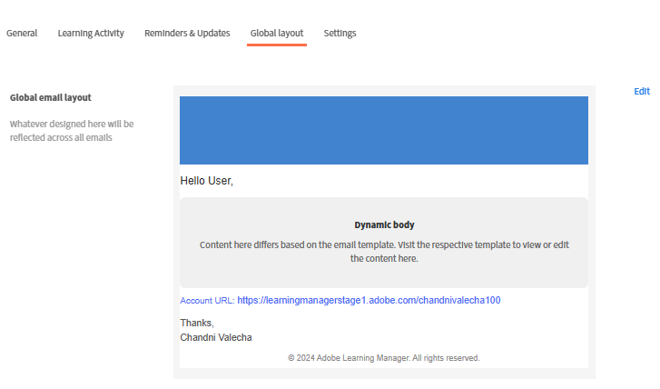
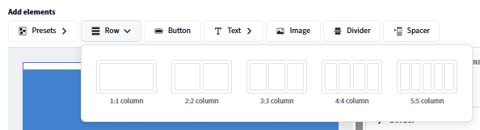
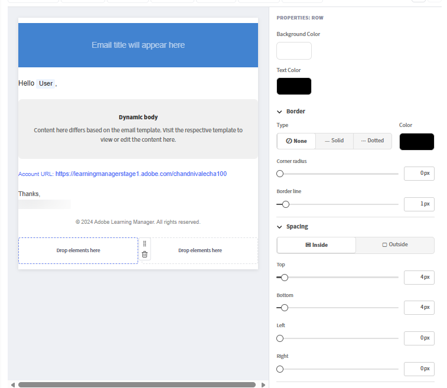
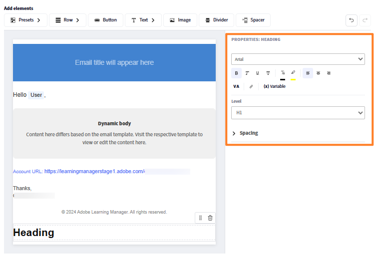

## Criador de email baseado em componente

O Adobe Learning Manager inclui um criador de email baseado em componentes que permite aos administradores e autores criarem emails de nível corporativo e marca completa usando um editor visual moderno, sem escrever HTML. Cada e-mail que sua organização envia, das confirmações de inscrição aos lembretes de sessão, pode combinar com precisão a aparência da sua marca.

**Para administradores:** crie um layout global uma vez* com um cabeçalho e um rodapé reutilizáveis que envolvam cada email automaticamente e personalize modelos individuais conforme necessário. Componha e-mails em um editor de arrastar e soltar em linha usando componentes avançados: texto com formatação rich text completa, imagens, banners, botões, links de redes sociais, divisores e muito mais.

**Para autores:** aplique os mesmos recursos de editor a emails no escopo de cursos e instâncias específicos para que as comunicações de treinamento possam ser personalizadas para cada experiência de aprendizado sem afetar as configurações de toda a conta.

O construtor é compatível com um modelo hierárquico: o mesmo modelo de email pode ser configurado no nível de instância, curso ou conta. Quando um modelo não é editado individualmente, ele herda as configurações do nível pai automaticamente. Quando precisar de um design totalmente personalizado, desvincule o modelo e assuma o controle completo. Uma visualização integrada permite verificar exatamente como um email será exibido nas caixas de entrada dos destinatários antes de ser enviado.

## Como o sistema de modelos de email funciona

Cada email de saída no Adobe Learning Manager é composto por três partes estruturais:

* **Cabeçalho:** a imagem ou a cor do banner e o nome da organização
* **Corpo:** a zona de conteúdo dinâmico exclusiva para cada tipo de email; contém o texto da mensagem e os espaços reservados variáveis
* **Rodapé:** a URL da conta, assinatura de email, link da ajuda e outros elementos

O **Layout Global** é o design mestre aplicado a todos os mais de 130 modelos de email simultaneamente. Quando você atualiza o layout global, cada modelo que ainda está vinculado a ele reflete a alteração automaticamente. Os modelos podem ser desvinculados do layout global a qualquer momento para personalização independente.

### A hierarquia de email

As configurações e o design fluem de um nível superior para níveis inferiores por meio da herança. Cada nível pode substituir ou personalizar totalmente o que herda.

| Nível | Quem o configura | Estado padrão | O que pode ser editado |
| --- | --- | --- | --- |
| **Layout Global** | Administrador | Raiz; sem pai | Layout completo: todas as partes, todos os componentes |
| **Modelo de email da conta** | Administrador | Vinculado ao Layout global | Somente corpo (vinculado); layout completo (desvinculado) |
| **Autor- Layout do LO** | Autor | Vinculado ao modelo de conta | Layout completo no escopo do OA |
| **Autor- modelo de email do OA** | Autor | Vinculado ao layout do OA | Somente corpo (vinculado); layout completo (desvinculado) |
| **Autor- Modelo de email de instância** | Autor | Vinculado ao modelo de OA | Somente corpo (vinculado); layout completo (desvinculado) |

### Principais regras de herança

* Cada nível começa vinculado ao seu pai imediato até que seja explicitamente alterado.
* Editar o **corpo** de um modelo não o desvincula. O cabeçalho e o rodapé continuam a refletir a página principal.
* Editar o **layout** ou selecionar **Desvincular** interrompe a conexão pai somente para esse modelo.
* **Reverter para original** vincula novamente o modelo ao seu pai e redefine o layout e o corpo para a versão pai.
* Desvincular em um nível não tem efeito em níveis acima ou abaixo dele.

## Configurar o layout global

O layout global define o cabeçalho, o rodapé e o wrapper estrutural compartilhados que fluem para cada email vinculado. Configure-o primeiro para que todos os modelos comecem com uma identidade visual consistente.

### Abrir o Editor de layout global

1. Faça logon no Adobe Learning Manager como administrador.
2. Na navegação à esquerda, selecione **Modelos de Email**.
3. Selecione a guia **Layout global**.

   A tela do editor é carregada com o layout global atual. A zona **Corpo dinâmico**, mostrada como um espaço reservado no centro, representa a área em que o conteúdo de mensagem exclusivo de cada modelo é exibido. Não é possível editar o corpo dinâmico no layout global.

   

### Configurar o contêiner de email

O contêiner de email é o envoltório mais externo para cada email. Suas configurações afetam o quadro visual ao redor de todo o conteúdo.

1. Selecionar **Editar** próximo a **Layout de email global**
2. Selecione o contêiner de email na tela.
3. No painel **Propriedades** à direita, defina:
   * **Cor do plano de fundo:** a cor por trás de todo o conteúdo do email

   

   * **Borda:** estilo, largura e cor da borda externa

   

   * **Espaçamento:** preenchimento em torno das direções do conteúdo de email

   

   * **Espaçamento entre linhas:** o espaço vertical aplicado entre todas as linhas no layout

   

### Trabalhar com linhas e colunas

Todo o conteúdo no editor de email é colocado em **linhas**. Cada linha contém uma ou mais **colunas** e cada coluna contém um ou mais **componentes**.

Para adicionar uma linha:

1. Selecione **Linha** na parte superior da tela.

   

2. Selecione um layout de coluna: **1 coluna**, **2 colunas**, **3 colunas** ou **4 colunas**.

   

   A nova linha aparece na tela pronta para os componentes.

Para configurar uma linha:

1. Selecione a linha na tela.

   

2. No painel **Propriedades**, defina:
   * **Cor do plano de fundo:** o plano de fundo no nível de linha substitui a cor do contêiner para esta linha
   * **Borda:** estilo, largura e cor da borda da linha
   * **Espaçamento:** espaço horizontal entre as colunas nesta linha

   

**Para reordenar as linhas:**

* Arraste qualquer linha pela alça (mostrada ao passar o mouse sobre a borda esquerda) para movê-la para cima ou para baixo.

**Para excluir uma linha:**

* Selecione a linha e o ícone **Excluir** na barra de ferramentas de linha.

### Adicionar e organizar componentes

Os componentes são a base do conteúdo do email. Arraste-os do painel **Componentes** na parte superior e solte-os em qualquer célula da coluna. Use o painel **Propriedades** à esquerda para personalizar o componente selecionado.

Ao arrastar e soltar um componente, um indicador “+” azul mostra onde o componente pode ser colocado.

**Para adicionar um componente:**

1. No painel do componente, localize o componente desejado.

   

2. Arraste-a para uma célula de coluna na tela.

   

3. O componente é adicionado a essa célula. Selecione-o para abrir suas propriedades no painel direito.

   

**Para mover um componente:**

* Arraste o componente pela alça para uma posição diferente da coluna ou da linha.

**Para excluir um componente:**

* Selecione o componente e escolha o ícone **Excluir** na barra de ferramentas do componente.

### Editar componentes predefinidos

O **Layout global** inclui componentes predefinidos internos que correspondem aos campos compartilhados definidos nas configurações de email. Os componentes predefinidos podem ser editados diretamente na tela ou removidos completamente.

| Componente predefinido | Conteúdo padrão | Pode ser removido? |
| --- | --- | --- |
| **Banner** | Imagem ou cor padrão do banner | Sim |
| **Saudação** | “Olá, {{user}},” | Sim |
| **Corpo dinâmico** | Espaço reservado para conteúdo por modelo | Não - obrigatório |
| **URL da conta** | URL da plataforma da sua conta | Sim |
| **Assinatura** | Seu texto de assinatura configurado | Sim |

**Para editar um componente predefinido:**

1. Adicione o componente de predefinição, por exemplo, banner.

   

2. Selecione o banner na tela.
3. No painel **Propriedades**, altere a fonte, o tamanho da fonte e outras propriedades visuais do banner.

   

**Para remover um componente de predefinição de todos os emails:**

1. Selecione o componente de predefinição na tela.
2. Selecione **Excluir** na barra de ferramentas do componente.

A remoção de um componente predefinido do layout global o remove de todos os emails vinculados. Modelos não vinculados mantêm o componente até que você o remova manualmente de cada um.

### Salvar o layout global

Selecione **Salvar** quando seu layout estiver completo. O design atualizado é aplicado imediatamente a todos os modelos de email que ainda estão vinculados ao layout global.

## Configurar predefinições de email globais

Defina elementos comuns, como banner, saudação e assinatura, para reutilizar em seus emails. Eles podem ser usados no layout global ou em modelos de email individuais com base em evento no Adobe Learning Manager. As alterações feitas aqui são refletidas automaticamente sempre que essas predefinições são usadas. Você também pode optar por substituir essas predefinições e criar elementos personalizados diretamente no email builder.

Configure o seguinte:

### Banner do e-mail

1. Selecione **Editar** ao lado de **Banner de email.**
2. Carregue uma imagem de banner ou defina uma cor de plano de fundo sólida.

   

3. Selecione **Salvar.**

### Saudação do e-mail

1. Selecione **Editar** ao lado de **Saudação de email**
2. O padrão é “Olá, {{user}}” — a variável {{user}} é preenchida com o nome do destinatário no tempo de execução.

   

3. Modifique o texto da saudação ou remova a saudação completamente.
4. Selecione **Salvar**.

### URL da conta

1. Selecione **Editar** ao lado da **URL da conta.**
2. Insira o URL da sua plataforma de aprendizado; aparece em todos os e-mails de saída.

   

3. Selecione **Salvar**.

### Assinatura do e-mail

1. Selecione **Editar** ao lado de **Assinatura de email**
2. Insira o texto de fechamento.

   

3. Selecione **Salvar**.

## Adicionar e configurar componentes individuais

### Componente Texto

O componente de texto oferece suporte à edição completa de rich text.

1. Arraste um componente **Texto** para uma célula de coluna.
2. Selecione-o para entrar no modo de edição.

   

3. Digite ou cole seu conteúdo.
4. Aplique as seguintes opções de formatação:
   * **Fonte:** selecione entre fontes seguras para a Web (Arial, Helvetica, Georgia e outras) ou fontes personalizadas configuradas para sua conta
   * **Tamanho:** tamanho da fonte em pontos
   * **Negrito**, **Itálico**, **Sublinhado**, **Tachado**
   * **Sobrescrito** e **Subscrito**
   * **Cor do texto** e **Cor do plano de fundo** (realce de texto)
   * **Alinhamento:** à esquerda, centralizado, à direita ou justificado
   * **Espaçamento entre linhas:** multiplicador de altura de linha
   * **Preenchimento horizontal e vertical:** espaçamento interno dentro do bloco de texto
5. Para adicionar um hiperlink:
   * Selecione o texto que deseja vincular
   * Selecione o ícone **Link** na barra de ferramentas
   * Insira o URL de destino

   

6. Selecione **Aplicar**

### Componente de imagem

1. Arraste um componente **Imagem** para uma célula de coluna.
2. Selecione **Carregar** para carregar um novo arquivo de imagem (JPEG e GIF compatíveis) ou selecione **Procurar** para escolher na sua biblioteca de imagens.
3. Com a imagem selecionada, configure:

   

   * **Alterar Imagem:** carregue uma nova imagem ou substitua a imagem selecionada no momento.
   * **URL da imagem:** especifica a URL de origem da imagem a ser exibida. A imagem é carregada deste local.
   * **Link:** adiciona um hiperlink clicável à imagem. Os usuários são redirecionados para a URL especificada quando a imagem é clicada.
   * **Tipo de borda:** define o estilo da borda da imagem. As opções disponíveis incluem Nenhum, Sólido e Pontilhado.
   * **Cor da borda:** define a cor da borda da imagem quando um estilo de borda é aplicado.
   * **Raio do canto:** controla o arredondamento dos cantos da imagem. Valores mais altos criam cantos mais arredondados.
   * **Linha da borda:** ajusta a espessura (largura) da borda da imagem.
   * **Espaçamento Superior:** adiciona espaço acima da imagem.
   * **Espaçamento inferior:** adiciona espaço abaixo da imagem.
   * **Espaçamento esquerdo:** adiciona espaço ao lado esquerdo da imagem.
   * **Espaçamento Direito:** adiciona espaço ao lado direito da imagem.
   * **Alinhamento horizontal:** determina a posição da imagem dentro de seu contêiner. Normalmente, as opções incluem alinhamento à esquerda, centralizado e à direita.

### Componente Botão

1. Arraste um componente **Botão** para uma célula de coluna.
2. Selecione-o e configure:

   

   * **Rótulo:** o texto do botão
   * **Link:** a URL de destino quando o botão é clicado
   * **Família e tamanho da fonte** para o rótulo do botão
   * **Cor do texto:** cor do rótulo
   * **Cor do plano de fundo:** cor de preenchimento do botão
   * **Tamanho:** largura e altura do botão
   * **Estilo do canto:** arredondado, quadrado ou circular
   * **Alinhamento:** à esquerda, no centro ou à direita dentro da coluna
   * **Preenchimento:** espaçamento interno entre o texto do rótulo e as bordas do botão

### Componentes do divisor e do espaçador

**Divisor:** adiciona uma linha horizontal visível entre as seções de conteúdo.

1. Arraste um componente **Divisor** para uma coluna.
2. Defina o **Estilo da linha** (sólido, tracejado, pontilhado), **Cor**, **Largura** e **Altura** (espaço vertical acima e abaixo da linha) no painel de propriedades.

   O **Espaçador:** adiciona espaço vertical invisível entre elementos sem uma linha visível.

3. Arraste um componente **Espaçador** e defina sua **Altura** no painel de propriedades.

## Inserir e gerenciar variáveis

As variáveis são espaços reservados dinâmicos substituídos por dados reais quando um e-mail é enviado. As variáveis disponíveis dependem do tipo de modelo específico. Um e-mail de confirmação de inscrição tem variáveis diferentes de um lembrete de sessão.

### Inserir uma variável usando o seletor

1. Coloque o cursor em um componente de texto onde você deseja que a variável apareça.
2. Selecione **Inserir variável** na barra de ferramentas do editor de texto. O seletor de variáveis é aberto mostrando todas as variáveis disponíveis para este tipo de modelo.
3. Selecione uma variável. Por exemplo, **Nome do curso**, **Nome do aluno** ou **Nome do caminho de aprendizado**.

   

### Inserir uma variável digitando

Digite o nome da variável diretamente entre chaves duplas: {\{variable_name}\}. O editor o reconhece e realça automaticamente como um token de variável.

**Exemplos de variáveis comuns:**

| Variável | Substituído por |
| --- | --- |
| Nome completo do destinatário | {\{learnerName}\} |
| Email do destinatário | {\{learnerEmail}\} |
| Nome de usuário do destinatário | {\{user}\} |
| Tipo de usuário | {\{userType}\} |
| Nome da organização | {\{organizationName}\} |
| Nome do curso | {\{courseName}\} |
| Descrição do curso | {\{courseDescription}\} |
| Autor do curso | {\{courseAuthor}\} |
| Link do curso | {\{courseLink}\} |
| Habilidades necessárias para o curso | {\{courseSkillDetails}\} |
| Medalhas no curso | {\{courseBadge}\} |
| Prazo de inscrição no curso | {\{courseEnrollmentDeadline}\} |
| Prazo de conclusão do curso | {\{courseCompletionDeadline}\} |
| Data de conclusão do curso | {\{courseCompletionDate}\} |
| Nome do Caminho de Aprendizado | {\{LPName}\} |
| Link do Caminho de Aprendizado | {\{LPLink}\} |
| Prazo de inscrição no Caminho de Aprendizado | {\{LPEnrollmentDeadline}\} |
| Prazo de conclusão do caminho de aprendizado | {\{LPCompletionDeadline}\} |
| Data de conclusão do caminho de aprendizado | {\{LPCompletionDate}\} |
| Nome da certificação | {\{certificationName}\} |
| Prazo de inscrição de certificação | {\{certificationEnrollmentDeadline}\} |
| Data de conclusão da certificação | {\{certificationCompletionDate}\} |
| Duração do prazo do curso | {\{deadlineDuration}\} |
| Duração de expiração do curso | {\{expiryDuration}\} |
| Data de vencimento do curso | \{\{expiryDate\}\} |
| Nome da sessão | \{\{sessionName\}\} |
| Data de início da sessão | \{\{sessionDate\}\} |
| Data de término da sessão | \{\{endSessionDate\}\} |
| Hora de início da sessão | \{\{sessionTime\}\} |
| Hora de término da sessão | \{\{endSessionTime\}\} |
| Nome do local | \{\{nomeLocal\}\} |
| Informações do local | \{\{localInfo\}\} |
| URL do Local | \{\{localURL\}\} |
| Região Local | \{\{localRegion\}\} |
| URL da sala de aula virtual | \{\{vcUrl\}\} |
| Conta de provedor de sala de aula virtual necessária | \{\{VCProviderAccountReq\}\} |
| Nome do professor | \{\{instrutorName\}\} |
| Nome do módulo | \{\{moduleName\}\} |
| Nome do objeto de aprendizado | \{\{learningObjectName\}\} |
| Data de conclusão do Objeto de aprendizado | \{\{loCompletionDate\}\} |
| Nomes alternativos dos objetos de aprendizado | \{\{alternateLoNameList\}\} |
| Links alternativos do objeto de aprendizado | \{\{alternateLoNameListLinks\}\} |
| Objeto de aprendizado alternativo removido | \{\{removedAlternateLo\}\} |
| Texto de pré-requisito | \{\{preRequiiteText\}\} |
| Contagem de pré-requisitos | \{\{preRequiiteCountText\}\} |
| Nome do IC | \{\{ciName\}\} |
| Nome do painel de relatório | \{\{reportDashboardName\}\} |
| Nome da ajuda de tarefa | \{\{jobAidName\}\} |
| Conteúdo do anúncio | \&lbrace;\{announ{ContentText\}\} |
| Nome do perfil | \{\{profileName\}\} |
| Limite de vagas para o curso | \{\{sitLimit\}\} |
| Link para a página inicial do documento de ajuda | \{\{captivatePrimeHelp\}\} |
| Link para a página de ajuda | \{\{helpPageLink\}\} |
| Contagem | \{\{count\}\} |

>[!NOTE]
>
>As variáveis são específicas do modelo. Nem todas as variáveis estão disponíveis em todos os modelos. Use o seletor **Inserir variável** para ver apenas as variáveis que se aplicam ao modelo que você está editando. Digitar um nome de variável não reconhecido entre chaves não gerará um erro no editor, mas aparecerá como texto literal no email enviado.

### Variáveis no banner

1. A linha de assunto do email também suporta variáveis. Para adicionar uma variável ao assunto:
2. Abra um modelo e localize o campo **Assunto do email**.
3. Digite a variável diretamente. Por exemplo, “Sua inscrição em {\{course_name}\} foi confirmada”. A variável é renderizada com o nome real do curso quando o e-mail é enviado.
4. Como alternativa, selecione **Adicionar variável** e selecione **Curso**.

   

### Variáveis e o layout global

As variáveis no layout global são independentes do modelo e resolvem de forma diferente dependendo do contexto. Use apenas variáveis de aplicação universal, como {\{user}\} e {\{account_url}\}, no layout global. Variáveis específicas de modelo (como {\{course_name}\}) devem ser colocadas em corpos de modelos individuais, não no layout global.

## Vincular e desvincular modelos

### Estado vinculado vs. não vinculado

Cada modelo está **vinculado** ao seu pai ou **desvinculado** e é totalmente independente.

**Quando vinculado:**

* O cabeçalho e o rodapé aparecem **esmaecidos** no editor. Este é o indicador visual de que o modelo está vinculado

* Somente o corpo é editável
* Alterações no fluxo de layout pai neste modelo automaticamente

**Quando desvinculado:**

* O cabeçalho e o rodapé são completamente editáveis. Não há zonas esmaecidas
* O modelo é totalmente independente; as alterações na página principal não o afetam
* O modelo começa no design do pai no momento da desvinculação

**Regra de chave:** editar o **corpo** nunca desvincula um modelo. Editar o **layout** ou selecionar explicitamente **Desvincular** interrompe a conexão pai.

### Quando vincular (permanecer vinculado)

* Você quer que a marca global continue fluindo automaticamente
* Você só precisa alterar o texto ou as variáveis da mensagem neste modelo
* Você mantém uma grande biblioteca de modelos e deseja um controle de marca centralizado

### Quando desligar

* Você precisa de um banner, esquema de cores ou layout estrutural diferente para um modelo específico
* Você está criando uma experiência de marca distinta para um curso, certificação ou público específico
* Você é um autor que deseja ter controle total do design de uma instância ou objeto de aprendizado

### Desvincular um modelo em nível de conta - administrador

1. Selecione **Modelos de Email** e abra um modelo. Por exemplo, Curso - Autoinscrição.
2. Selecione **Desvincular**.

   

3. Leia a mensagem de confirmação e selecione **Sim**.
4. O cabeçalho e o rodapé se tornam completamente editáveis.
5. Personalize qualquer parte do modelo.
6. Selecione **Salvar**.

O modelo mantém o layout da página principal como ponto de partida, mas não recebe mais atualizações futuras da página principal.

### Reverter um modelo para sua versão pai

Reverter para original vincula novamente o modelo e o redefine exatamente para o que o pai fornece.

* Se o modelo era **somente editado pelo corpo** (ainda vinculado): reverte a mensagem de corpo para o padrão do pai. O cabeçalho e o rodapé permanecem inalterados porque já provêm da página principal.
* Se o modelo foi **totalmente desvinculado**: substitui tudo, cabeçalho, corpo e rodapé pela versão pai. Todas as personalizações independentes são removidas permanentemente.

>[!CAUTION]
>
>A reversão para original não pode ser desfeita. Copie qualquer conteúdo que desejar manter antes de reverter.

**Para reverter:**

1. Abra o modelo no editor.
2. Selecione **Reverter para o original**.

   

### Desvincular um modelo em nível de instância - autor

1. Abra um curso e selecione **Modelos de email**.
2. Abra um modelo, por exemplo, Conclusão do curso.
3. Selecione **Desvincular** e confirme.
4. Faça alterações e selecione **Salvar**.

Isso afeta somente esta instância. Outras instâncias não são afetadas. O modelo de instância começa no design do modelo de nível de OA no momento da desvinculação, não no layout global.

Os modelos de administração são revertidos para a versão de layout global e vinculados novamente ao layout global. Os modelos de OA do autor são revertidos para a versão do modelo de conta do administrador. Os modelos de instância do autor são revertidos para a versão do modelo de OA (ou para o modelo de conta se o modelo de OA estiver vinculado).

## Personalizar um modelo individual

### Navegar até um modelo

1. Em **Modelos de Email**, selecione uma categoria na lista. Por exemplo, **Geral**, **Atividade de Aprendizado** ou **Lembretes e Atualizações**.
2. Localize o modelo por nome. Os modelos são listados com seu evento de acionamento e o status atual de ativação/desativação.
3. Selecione o nome do modelo para abri-lo no editor.

### Editar o corpo (modelo vinculado)

Quando um modelo é vinculado, somente o corpo é editável. O cabeçalho e o rodapé aparecem esmaecidos.

1. Abra o modelo. Confirme se o cabeçalho e o rodapé estão esmaecidos (estado vinculado).
2. Selecione em qualquer lugar no corpo para entrar no modo de edição.
3. Edite o texto da mensagem, formatação, variáveis e quaisquer componentes no corpo.
4. Selecione **Salvar**.

### Editar um modelo totalmente personalizado (desvinculado)

Após a desvinculação, todas as três partes, cabeçalho, corpo e rodapé, podem ser editadas usando o mesmo editor de arrastar e soltar que o layout global.

1. Adicione, remova ou reorganize linhas e componentes em qualquer parte.
2. Edite os componentes predefinidos (banner, saudação, assinatura, URL da conta) de maneira independente.
3. Insira variáveis específicas para este tipo de modelo.
4. Selecione **Salvar**.

### Editar modelos em vários idiomas

Cada modelo oferece suporte a todos os idiomas de conteúdo configurados para sua conta.

1. Abra o modelo.
2. Selecione o menu suspenso **Idioma**. Ela mostra todos os idiomas disponíveis para sua conta.
3. Selecione o idioma que deseja editar.
4. Edite o corpo (e o layout, se desvinculado) desse idioma.
5. Selecione **Salvar**.

Cada versão de idioma é armazenada de forma independente. A edição de um idioma não afeta os outros. Se uma versão do idioma não tiver sido personalizada, os alunos receberão o conteúdo padrão desse idioma.

>[!NOTE]
>
>Se um modelo estiver desvinculado e você editar seu layout em um idioma, a alteração do layout será aplicada apenas a essa versão do idioma. Outras versões linguísticas mantêm seus próprios estados.

### Visualizar no editor (verificação visual)

1. Selecione **Visualizar** na barra de ferramentas do editor.
2. Um modal de visualização é aberto, mostrando o email como ele aparecerá para os destinatários.
3. Revise o layout, o espaçamento, as imagens e os tokens de espaço reservado variáveis.
4. Feche a visualização para continuar editando.

## Compatibilidade com versões anteriores

### Contas existentes

Todos os modelos de e-mail configurados anteriormente são preservados exatamente como estavam. O novo construtor está disponível junto com o editor existente. Os modelos configurados antes da atualização não são migrados automaticamente para o novo formato. Eles continuam a funcionar como antes.

### Novas contas

Comece com o novo construtor e um layout global padrão limpo. O layout padrão usa um design simplificado que evita os problemas de renderização conhecidos (como falhas de exibição de imagem de banner) presentes em configurações mais antigas.

Se sua conta tiver modelos de formato antigo e de novo formato, os dois coexistem sem conflito. Você pode migrar modelos individuais para o novo formato no seu próprio ritmo abrindo-os no novo editor e salvando-os.

## Solução de problemas de modelos de email

**As alterações de layout global não estão aparecendo em um modelo**

O modelo foi desvinculado. Para confirmar e corrigir:

1. Abra o modelo.
2. Se o cabeçalho e o rodapé forem **editáveis** (e não estiverem esmaecidos), o modelo será desvinculado.
3. Para restaurar a herança de layout global, selecione **Reverter para original** e confirme.

**Um modelo parece diferente do layout global**

A mesma causa acima. O modelo foi desvinculado, deliberadamente ou devido a uma edição de layout anterior. Reverta para o original para vinculá-lo novamente.

**As variáveis estão renderizando como texto literal nos emails enviados**

O nome da variável foi digitado incorretamente ou não está disponível para este tipo de modelo.

1. Abra o modelo e localize a variável.
2. Exclua-a e insira-a novamente usando o seletor **Inserir variável**.
3. O seletor mostra apenas as variáveis válidas para este modelo. Selecione um item na lista para evitar erros de digitação.
