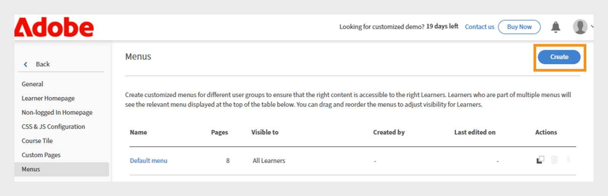
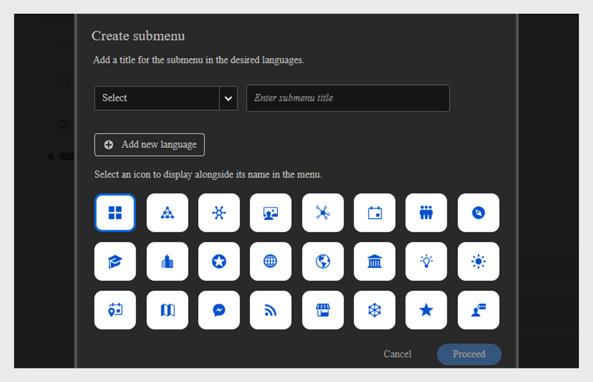

# Criar um menu

Como administrador de uma empresa financeira com duas equipes principais: gerentes de vendas e de sucesso do cliente (CSM), você deve criar menus separados com suas respectivas páginas. Isso permite que os alunos encontrem facilmente cursos relevantes para suas funções em seus próprios menus.

Por padrão, os administradores podem ver o menu padrão na página **[!UICONTROL Menu]**, que não pode ser excluída. Esse menu inclui todas as páginas incorporadas atualmente visíveis no aplicativo do aluno.

Para criar um menu:

1. Faça logon no Adobe Learning Manager como administrador.
2. Selecione **[!UICONTROL Marcas]** no painel de navegação esquerdo.
3. Selecione **[!UICONTROL Menu]** e selecione **[!UICONTROL Criar]**.

   
   _Tela de menu mostrando opções para exibir, organizar e criar menus personalizados para diferentes grupos de alunos_

4. Digite o **[!UICONTROL Nome do menu]** (por exemplo, Treinamento de produtos) e selecione o grupo de usuários na opção **[!UICONTROL Visível para]**.

   
   _Tela Criar menu, onde os administradores podem inserir um nome de menu para uso interno e especificar grupos de usuários para controlar a visibilidade do menu_

5. Veja a seguir os tipos de páginas disponíveis no Menu:
   * **[!UICONTROL Páginas internas]**: estas são as páginas padrão que vêm com o Adobe Learning Manager, como Início, Meu Aprendizado e Catálogo. Os administradores não podem remover as páginas internas do menu. Eles podem ocultar as páginas do menu.
   * **[!UICONTROL Páginas personalizadas]**: são páginas criadas pelo administrador usando o Experience Builder. As páginas personalizadas permitem que as organizações projetem experiências de marca, específicas de função ou baseadas em evento adicionando widgets, layouts e menus personalizados para diferentes grupos de alunos.
6. Selecione **[!UICONTROL Alterar]** ao lado de **[!UICONTROL Página inicial]** para atualizar a página inicial do aluno.

   
   _Tela de configuração de menu mostrando a opção de selecionar páginas para alterar a página de aterrissagem da interface do aluno_

7. Escolha a página personalizada na opção **[!UICONTROL Selecionar páginas]**. Os administradores devem ser capazes de selecionar apenas páginas personalizadas publicadas, não aquelas no estado de rascunho.

   
   _Tela de seleção de página, destacando a opção para incluir a página personalizada para grupos de usuários e personalizar a ordem de menus_

8. Arraste e solte para reorganizar as páginas no menu.
9. Selecione **[!UICONTROL Menu de visualização]** para exibir o menu antes de salvá-lo.
10. Selecione **[!UICONTROL Salvar]**.

O menu criado ficará visível para os alunos selecionados. Eles podem acessar as páginas personalizadas por meio da interface do aluno.

_Interface do aluno exibindo a página personalizada com módulos de treinamento em destaque e navegação fácil no menu da barra lateral_

## Criar um submenu

Os administradores podem criar um submenu no menu e adicionar páginas personalizadas a ele. Os submenus não têm uma página de aterrissagem.

Para criar um submenu:

1. Selecione o submenu **[!UICONTROL Criar]** na página **[!UICONTROL Configuração de menu]**.

   
   _Páginas de configuração de menu destacando a opção Criar submenu para criar submenus para os alunos_

2. Selecione o idioma e digite o título do submenu.
3. Selecione um ícone para exibir ao lado do submenu.
4. Selecione **[!UICONTROL Adicionar Novo Idioma]** para criar o mesmo submenu para localidades diferentes. Por exemplo, se você adicionar inglês e francês, os alunos com o idioma da interface inglês selecionado verão o submenu Inglês, enquanto os alunos com francês selecionado verão o submenu Francês.

   
   _Prompt do submenu mostrando opções para selecionar o título, o idioma e o ícone do submenu para exibição no menu_

5. Selecione **[!UICONTROL Continuar]**.
6. Arraste e solte as páginas sob o submenu.

## Configurar páginas ocultas

A opção **[!UICONTROL Ocultar páginas]** permite que os administradores mantenham a interface do aluno limpa, mostrando menos páginas. Os administradores podem ocultar páginas do menu para que os alunos não as vejam na interface do aluno, mas os alunos ainda podem acessar essas páginas de outras maneiras. Por exemplo, a página Catálogo pode ficar oculta no menu, mas ser acessada na página inicial do aluno.

_Tela de configuração de menu mostrando páginas ocultas, como Catálogo, Aprendizado Social, Habilidades e Medalhas_

>[!NOTE]
>
>As páginas de um submenu não podem ser ocultadas diretamente. Para ocultar uma página, primeiro arraste-a para fora do submenu e depois oculte-a.

## O que vem a seguir

Depois de configurar páginas, widgets e menus, aprimore a experiência geral do aluno adicionando personalizações usando JavaScript e CSS.

