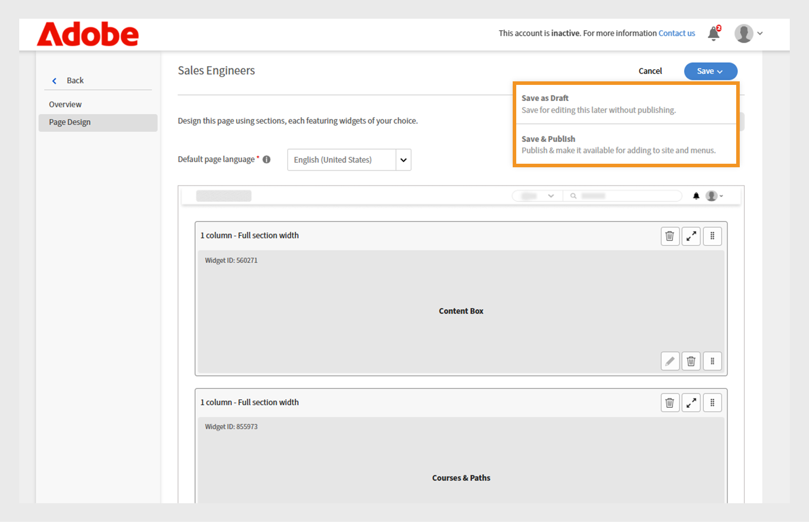

# Criar uma página personalizada no Experience Builder

Como administrador de uma empresa de serviços financeiros, você gerencia duas equipes: Vendas e Sucesso do cliente. Cada equipe tem requisitos de aprendizado exclusivos, mas ambas têm usado o mesmo portal de aprendizado padrão. Isso levou a confusão, desordem e baixo envolvimento do aluno.
Para resolver esse desafio sem investir em uma compilação sem periféricos ou aguardar uma solução de desenvolvedor personalizada, você pode usar o Experience Builder no Adobe Learning Manager. Com páginas, widgets e menus, você pode criar portais de marca e funções específicas em poucas etapas, sem precisar programar.

Para criar uma página personalizada para a equipe de engenharia de vendas no Adobe Learning Manager:

1. Faça logon no Adobe Learning Manager como administrador.
2. Selecione **[!UICONTROL Marcas]** no painel de navegação esquerdo.
3. Selecione **[!UICONTROL Páginas Personalizadas]**.
4. Selecione **[!UICONTROL Criar página]**.

   
   _Tela Páginas Personalizadas mostrando a opção Criar página para criar novas experiências de aprendizado personalizadas_

5. Digite o **[!UICONTROL Nome da página]** (por exemplo, Treinamento de vendas para a equipe de vendas).
6. Digite a **[!UICONTROL Descrição de página]**.

   
   _Configuração da página de treinamento de vendas no Adobe Learning Manager, mostrando campos para nome da página, descrição, tipo, URL e configuração de ícone para a criação de um portal de treinamento de vendas direcionado_

7. Selecione o tipo de página dentre os seguintes:

   * **[!UICONTROL Compilar usando widgets do ALM]**: o administrador pode criar uma página usando os widgets existentes do Adobe Learning Manager. Digite a sequência de caracteres personalizada no campo URL da página. Essa sequência de caracteres será anexada à URL da página personalizada.
   * **[!UICONTROL Página externa]**: o administrador pode adicionar uma URL para a página externa. Se você selecionar o tipo de página como externa, digite a URL da página externa no campo de texto URL da página.

8. Selecione o **[!UICONTROL ícone Alterar]** para alterar o ícone da página.
9. Selecione **[!UICONTROL Adicionar Novo Idioma]** para adicionar o idioma padrão da página.
10. Selecione **[!UICONTROL Salvar]**.

A página foi criada e salva como rascunho na seção Páginas personalizadas. Os administradores podem editar e criar as páginas rascunhadas usando os widgets.

A próxima etapa é adicionar um layout à página personalizada, onde você pode adicionar e configurar widgets.

## Layout de página no Experience Builder

Crie sua página selecionando o layout de seção apropriado no menu suspenso. A largura máxima de qualquer layout é de 1212 pixels. Escolha entre as seguintes opções de seção com base em quantos widgets você deseja adicionar e o tamanho desejado:

* **[!UICONTROL 1 coluna - Largura total da seção]**: o conteúdo abrange toda a largura da seção, fornecendo o espaço máximo.
* **[!UICONTROL 2 colunas - 1/2 largura de seção cada]**: a seção é dividida uniformemente em duas colunas de mesma largura.
* **[!UICONTROL 2 colunas - 2/3 e 1/3 de largura da seção]**: o conteúdo principal ocupa dois terços da largura, enquanto o conteúdo lateral usa um terço.
* **[!UICONTROL 2 colunas - 1/3 e 2/3 largura da seção]**: o conteúdo lateral ocupa um terço e o conteúdo principal ocupa dois terços da seção.
* **[!UICONTROL 3 colunas - 1/3 de largura de seção cada]**: a seção se divide em três colunas de largura igual.

>[!NOTE]
>
>No máximo 10 widgets podem ser adicionados verticalmente em todos os layouts, exceto no layout de largura de seção inteira e de 1 coluna.

Para selecionar o layout da página de treinamento de vendas no Experience Builder:

1. Faça logon no Adobe Learning Manager como administrador.
2. Selecione **[!UICONTROL Marcas]** no painel de navegação esquerdo.
3. Selecione **[!UICONTROL Páginas Personalizadas]** e selecione a página necessária.
4. Selecione **[!UICONTROL Design de Página]**.
5. Selecione **[!UICONTROL Editar]**.

   
   _Tela de edição de design de página para uma página personalizada de treinamento de vendas, destacando o botão Editar para adicionar seções, widgets e layout de página_

6. Escolha as opções na lista suspensa **[!UICONTROL Selecionar layout de seção]**.

   
   _A caixa de diálogo de seleção de layout de seção permite que os administradores escolham arranjos de widget de uma ou várias colunas para o design de página personalizado_

7. Selecione **[!UICONTROL Continuar]**.

O layout adicionado tem as seguintes opções:

* **[!UICONTROL Excluir linha]**: remova a linha do layout.
* **[!UICONTROL Ajustar largura da tela]**: ajuste o layout para que ele seja redimensionado automaticamente para se ajustar à tela e proporcionar melhor visibilidade.
* **[!UICONTROL Reordenar]**: altere a ordem dos layouts arrastando e soltando-os na posição desejada.

_Layout de página exibindo as opções de layout para reordenar, expandir ou excluir a seção_

A próxima etapa é adicionar e configurar widgets na página personalizada.

## Adicionar e configurar um widget

Adicione os widgets necessários às páginas personalizadas do treinamento de vendas com base nos requisitos.

Para configurar um widget na página personalizada de treinamento de vendas:

1. Selecione **[!UICONTROL Adicionar widget]** no layout.

   
   _A tela de design da página permite que os administradores selecionem e adicionem widgets para personalizar suas páginas do curso_

2. Escolha o **[!UICONTROL widget Caixa de Conteúdo]** e selecione **[!UICONTROL Continuar]**.

   
   _Tela de seleção de widget que destaca o widget Caixa de conteúdo para exibir imagens personalizadas, texto e botões de ação para aprimorar o engajamento do aluno_

3. Digite **[!UICONTROL Título]** e **[!UICONTROL Descrição]**.
4. Digite o texto no **[!UICONTROL rótulo do botão Ação]** e forneça um link.
5. Configure as opções restantes. Exiba esta [seção](/help/migrated/administrators/feature-summary/experience-builder/add-a-widget.md#content-box-widget) para saber mais sobre o **[!UICONTROL widget Caixa de Conteúdo]**.

   
   _Tela de widgets da Caixa de Conteúdo mostrando as opções para configurar o widget_

6. Digite o título, a descrição e o rótulo do botão de ação na tela de configuração do **[!UICONTROL widget Caixa de Conteúdo]** para os engenheiros de vendas
7. Selecione **[!UICONTROL Adicionar widget]**.
8. Selecione **[!UICONTROL Salvar]** e escolha entre as seguintes opções:
a. **[!UICONTROL Salvar como Rascunho]**: a página será salva como um rascunho. O administrador pode editar a página posteriormente.
b. **[!UICONTROL Salvar e Publish]**: a página será publicada e o administrador poderá adicioná-la ao Menu.

   
   _As opções de salvamento permitem que os administradores escolham entre salvar uma página como rascunho para futura edição ou publicá-la para acesso do aluno_

A página pode ser salva como rascunho ou publicada. Os administradores podem editar rascunhos antes de publicar e também podem atualizar e republicar páginas publicadas.

Siga as mesmas etapas para criar páginas para a equipe de Gerentes de sucesso do cliente.

## Visualize a página

Para visualizar as páginas:

1. Faça logon no Adobe Learning Manager como administrador.
2. Selecione **[!UICONTROL Marcas]** no painel de navegação esquerdo.
3. Selecione **[!UICONTROL Páginas Personalizadas]**.
4. Selecione a página necessária e, em seguida, selecione **[!UICONTROL Design de Página]**.
5. Selecione **[!UICONTROL Editar]** e selecione **[!UICONTROL Visualizar página]** para exibir a visualização do portal.

   
   _Visualização de página mostrando um layout de página personalizado com um banner e cursos em destaque_

6. Selecione Modo Inspect para visualizar a altura e a largura do widget.

   
   _A tela de visualização de página no Experience Builder com o modo Inspect é realçada, permitindo que os administradores revisem e inspecionem os widgets_

## Criar uma página em um idioma diferente

Os administradores podem criar várias páginas personalizadas específicas da localidade selecionando os idiomas necessários em Adicionar novo idioma ao criar a página. Quando vários idiomas são adicionados, os detalhes do widget devem ser configurados separadamente para cada idioma em sua guia correspondente, localizada ao lado da guia Idioma padrão.

_Os administradores podem adicionar detalhes do widget para idiomas adicionais, como francês, além do idioma padrão_

## Gerenciar o ciclo de vida das páginas

Os administradores podem usar a seção Páginas personalizadas para editar, excluir e duplicar as páginas.

### Editar a página

Para editar as páginas personalizadas:

1. Faça logon no Adobe Learning Manager como administrador.
2. Selecione Marcas no painel de navegação esquerdo.
3. Selecione Páginas personalizadas.
4. Selecione a página necessária e clique em Editar.
5. Escolha Salvar.

A página será atualizada com as alterações.

_Edite a página personalizada, permitindo que os administradores atualizem o nome, a descrição e o tipo da página_

### Excluir a página

Para excluir a página:

1. Faça logon no Adobe Learning Manager como administrador.
2. Selecione Marcas no painel de navegação esquerdo.
3. Selecione Páginas personalizadas.
4. Selecione a página necessária.
5. Selecione Ação e, em seguida, Excluir.

_Tela Páginas Personalizadas exibindo opções para excluir páginas personalizadas criadas para treinamento de produtos_

### Duplicar a página

Para duplicar a página:

1. Faça logon no Adobe Learning Manager como administrador.
2. Selecione Marcas no painel de navegação esquerdo.
3. Selecione Páginas personalizadas.
4. Selecione a página necessária.
5. Selecione Ação e selecione Duplicar.

_Tela Páginas Personalizadas exibindo opções para duplicar as páginas personalizadas criadas para treinamento de produtos_

## O que vem a seguir

Depois de criar a página, adicione e configure widgets nas páginas personalizadas de acordo com suas necessidades de treinamento.
