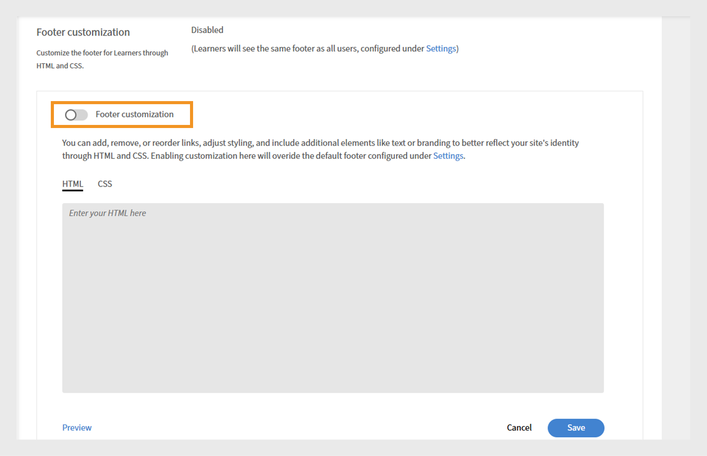

# Personalizar o Experience Builder

## Personalizar um rodapé

O rodapé é exibido na parte inferior da interface do aluno e geralmente mostra informações padrão definidas nas configurações do administrador. Os administradores podem substituí-lo por um rodapé personalizado para criar uma experiência de marca. Usando o HTML e o CSS, eles podem definir o design, o layout e o conteúdo do rodapé para corresponder aos requisitos organizacionais.

Como administrador de uma empresa financeira, você pode configurar o rodapé usando a opção personalizada. Esta opção permite adicionar seu próprio HTML e CSS, oferecendo flexibilidade total para criar o rodapé.

Para personalizar o rodapé:

1. Faça logon no Adobe Learning Manager como administrador.
2. Selecione **[!UICONTROL Marcas]** e selecione **[!UICONTROL Geral]**.
3. Selecione **[!UICONTROL Editar]** ao lado da opção **[!UICONTROL Personalização de rodapé]**.

   
   _Tela de configurações gerais no Adobe Learning Manager, mostrando opções para habilitar a personalização do rodapé_

4. Selecione o botão de alternância para habilitar a **[!UICONTROL Personalização do rodapé]**.

   
   _Configurações de personalização do rodapé no Adobe Learning Manager, mostrando a alternância para habilitar o rodapé e os campos personalizados para adicionar HTML ou CSS para identidade visual personalizada_

5. Digite seu **[!UICONTROL HTML]** e o **[!UICONTROL CSS]** nas respectivas guias.

   
   _Tela de personalização do rodapé no Adobe Learning Manager, exibindo uma seção de HTML personalizada para adicionar, editar ou estilizar o rodapé da interface do aluno_

6. Selecione **[!UICONTROL Visualizar]** para exibir o rodapé personalizado antes de salvá-lo.

   
   _Visualização de um rodapé personalizado da interface do aluno no Adobe Learning Manager, com links categorizados_

7. Selecione **[!UICONTROL Salvar]**.

O rodapé personalizado será exibido a todos os alunos.

## Personalizar blocos do curso

Em uma empresa financeira, os administradores podem configurar quadros do curso para decidir quais detalhes os alunos verão. Por exemplo, eles podem mostrar a descrição do curso e o nome da habilidade para o treinamento de conformidade, mas ocultar as classificações ou o nome do autor para manter o foco nos requisitos obrigatórios.

Para personalizar os quadros do curso:

1. Faça logon no Adobe Learning Manager como administrador.
2. Selecione **[!UICONTROL Marca]** e depois **[!UICONTROL Bloco do curso]**.
3. Selecione **[!UICONTROL Editar]**.

   
   _Tela de configurações do Bloco do Curso no Adobe Learning Manager, mostrando a opção Editar para personalizar o bloco_

4. Selecione as opções abaixo para mostrar ou ocultar detalhes relacionados às informações do curso:

   a. **[!UICONTROL Formato]**: mesclado/ritmo próprio/sala de aula/sala de aula virtual: tipo do objeto de aprendizado.
b. **[!UICONTROL Duração]**: duração do objeto de aprendizado.
c. **[!UICONTROL Habilidade/Produto]**: exibir a habilidade principal ou o produto coberto pelo curso.
d. **[!UICONTROL Classificação]**: exibe a classificação do aluno do curso.
e. **[!UICONTROL Nome do autor]**: exibe o nome do autor do curso
f. **[!UICONTROL Descrição (aparece ao passar o mouse)]**: exibe um breve resumo do curso quando os alunos passam o mouse sobre o cartão.
g. **[!UICONTROL Data de publicação/data de vencimento (aparece em foco)]**: exibe quando o curso foi publicado ou o prazo de conclusão.

5. Selecione as opções abaixo para mostrar ou ocultar detalhes relacionados às ações do curso:

   a. **[!UICONTROL Botão Adicionar à Lista de Aprendizado]**: permite que os alunos salvem o curso em sua lista de aprendizado pessoal para referência futura.
b. **[!UICONTROL Botão Salvar]**: salva todas as alterações feitas nas configurações ou preferências do curso.
c. **[!UICONTROL Botão Inscrever/Continuar]**: permite que os alunos se inscrevam em um novo curso ou continuem um curso que já iniciaram. Ocultar esta opção também removerá as ações Não recomendar e baixar que aparecem ao lado dela.

   
   _Tela de configuração de bloco do curso no Adobe Learning Manager, onde os administradores selecionam as informações e ações a serem exibidas para os alunos_

6. Uma visualização do quadro do curso é exibida no lado direito da tela.

   
   _Tela de configuração do quadro do curso no Adobe Learning Manager, destacando a visualização do quadro do curso_

7. Selecione **Salvar**.

O quadro personalizado do curso será exibido a todos os alunos.

**Antes da Personalização**


_Bloco do curso no Adobe Learning Manager antes da personalização_

**Após a personalização**


_Bloco do curso no Adobe Learning Manager após a personalização_

## Personalizar usando JavaScript e CSS

Como administrador de uma empresa financeira, você pode personalizar o aplicativo do aluno injetando CSS e JavaScript para corresponder aos requisitos de marca e regulamentação da sua empresa, dando a você controle total sobre a aparência, o layout e os recursos interativos do aplicativo.

Para personalizar a interface do aluno usando CSS e JS:

1. Faça logon no Adobe Learning Manager como administrador.
2. Selecione **[!UICONTROL Marcas]** e selecione **[!UICONTROL Configuração de CSS e JS]**.
3. Selecione **[!UICONTROL Editar]**.
4. Digite o CSS e o JS personalizados nas respectivas guias.

   
   _Tela Configuração de CSS e JS no Adobe Learning Manager, onde os administradores podem adicionar CSS e JS personalizados_

5. Escolha Salvar.

A personalização será exibida a todos os alunos.

**Antes da personalização**

O design do menu da página inicial do aluno é baseado no design padrão do Adobe Learning Manager.


_Página inicial do aluno do Adobe Learning Manager antes da personalização_

**Após a personalização**

Depois de adicionar o CSS e o JS a seguir, o menu da página inicial do aluno foi atualizado com base na personalização.

CSS de exemplo:

```
p{
display:block;
}

.withExtraMargin{
margin-right: 100px!important;
}
.alm-footer-extraMargin{
margin-top:0;
}

.alm-layout-almLayoutContainer{
margin: 0;
    margin-bottom: 5rem;
}
#page-756 #category-970151 .alm-category-card-cardLink
{
    height: 400px;

}
#page-756 #category-970151 .alm-category-card-header
{
height: 240px!important;
}
#page-656 .alm-category-card-cardLink{
    height: 380px;
background: white;
}
#page-656 .alm-category-card-header{
height: 200px!important;
}

#page-746 #html-636797 {
    background-color: #f7f9fc;
}

#page-746 .alm-layout-almLayoutContainer{
row-gap:0;
margin-bottom:0;
}

.alm-category-card-cardLink{
transition: border .3s ease;
}
.navText{
       font-size: 16px;
    cursor: pointer;
}
.submenuDownCaret{
display:none;}
.alm-catalog-container-pageContainer{
max-width: 1720px;
    width: 100%;
    padding: 0 40px;
    padding: 0 40px;
}


.pagenavbarcontainer.newNavbarContainer{
width: 1230px;
    margin: 0 auto;
}
div[automationid="learner-menu-inside-header"]{
margin-right:100px!important;
}
#searchScope,.searchSeparator,#searchInDropdown{
display:none!important;
}
#right-navbar{
    margin-right: 0;
}
#companyLogoImg{
cursor:pointer;
max-width:190px;
}
.alm-catalog-container-filtersContainer{
width:340px;
}
.alm-training-card-v2-imageFlipContainer{
border:none;
}
.newSearchBoxContainer{
border-radius: 5px !important;
    border-width: 2px !important;
    border-color: rgb(5, 32, 34) !important;
}
.searchBoxFlex{
width:250px!important;
flex-direction: row-reverse;
    padding-right: 10px;
}
.searchPlaceholderIcon svg{
    height: 16px;
    width: 16px;
}
.searchPlaceholderIcon svg path{
fill: black;
}
#page-656 .alm-layout-almLayoutContainer {
    padding-bottom: 5rem;
margin-bottom:0!important;
}
#page-656 .alm-strip-widget-header-stripHeaderContainer{
display:none;
}
#page-656 .content-wrapper{
padding-bottom:50px;
}
.myspan{
position: absolute;
    bottom: 10px;
    display: block;
    width: 85%;
    margin-left: 20px;
    margin-right: 20px;
    border-top: 1px solid #efefef !important;
    color: #5a697c !important;
    text-align: right;
    padding-top: 5px;
}
.alm-app-wrapperComponent{
padding-bottom:100px;}


@media (max-width: 768px) {
#page-656 .alm-category-widget-cardRow{
   flex-direction: column;
gap: 40px;
 }
#page-656 .alm-category-widget-stripCardContainerRow{
    width: 100%;
    display: flex;
    justify-content: center;
  }
}

@media (max-width: 768px) {
    .container2-right {
        display: none!important;
    }
.container-1 .content-wrapper{
    padding: 0 20px!important;
 }
}
```

JS de exemplo:

```
console.error("Hello Error")

setTimeout(() =>{
// Step 1: Check if #category-284977 is present
const categoryElement = document.querySelector('#category-284977');

if (categoryElement) {
  // Step 2: Find all elements with .alm-category-card-cardLink
  const cardLinks = categoryElement.querySelectorAll('.alm-category-card-cardLink');

  // Step 3: Loop over them and append span with random calculation
  cardLinks.forEach((link, index) => {
    const span = document.createElement('span');


    // Calculate number = (index+1) * 5
    let number = (index + 1) * 5;
if(index === 2){
number = number +2;
}
if(index == 3){
number = number - 7;
}

    span.textContent = `${number} courses`;
    span.classList.add('myspan');
    link.appendChild(span);
  });
}

},2000)
```


_Página inicial do aluno do Adobe Learning Manager após a personalização_

## Personalizar um widget

Os administradores podem personalizar widgets em páginas personalizadas aplicando classes CSS. Por exemplo, eles podem alinhar o texto em um widget Caixa de conteúdo ou ajustar o espaçamento entre os blocos do curso no widget Curso e caminhos.

>[!TIP]
>
>Inspect a página do aluno para identificar os estilos que deseja modificar. Copie as classes CSS relevantes e cole-as na página Configuração de CSS e JS para aplicar suas personalizações.

**Antes da personalização**

A tela a seguir é a página de treinamento Sales Engineers antes de adicionar a personalização CSS.


_Página do aluno do Sales Engineer antes da personalização_

**Após a personalização**

Depois de adicionar as seguintes classes CSS, a página do aluno é atualizada de acordo com os estilos definidos nessas classes. Com base no CSS, o texto no widget Caixa de conteúdo foi alinhado à esquerda e os blocos do curso agora têm maior espaçamento entre eles.

```
.alm-custom-content-box-center {
    align-items: baseline;
    text-align: initial;
}
.alm-training-card-v2-imageContainer {
    border: 14px solid var(--prime-color-white);
    border-radius: -1px;
    height: 106%;
    position: relative;
    transition: all .1s ease-in-out;
}
.alm-course-path-widget-cardRow {
    display: flex;
    gap: 135px;
    margin: 0 0 21px;
    padding: 10px;
}
```


_Página do aluno do Sales Engineer após a personalização_

### Classes CSS predefinidas para widgets

Estas são algumas classes CSS predefinidas disponíveis para widgets.

| Nome do widget | CSS de contêiner |
|---|---|
| Calendário | alm-calendar-widget-container |
| Categoria | alm-category-widget-container |
| Cartões de categoria | alm-category-card-container |
| Conformidade | alm-compliance-container |
| Curso e caminhos | alm-course-path-widget-container |
| Cartas de OA de Curso e Caminhos | alm-training-card-v2-card |
| Caixa de Conteúdo | alm-custom-content-box-container |
| Gamificação | alm-leaderboard-container |
| Aprendizado social | alm-social-learning-container |


