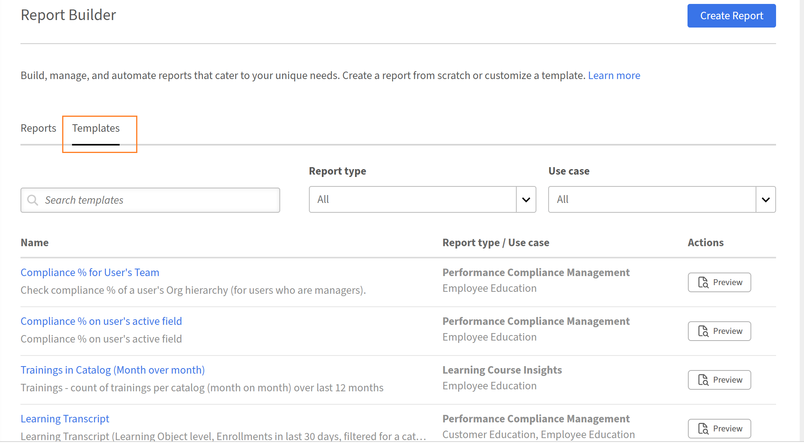
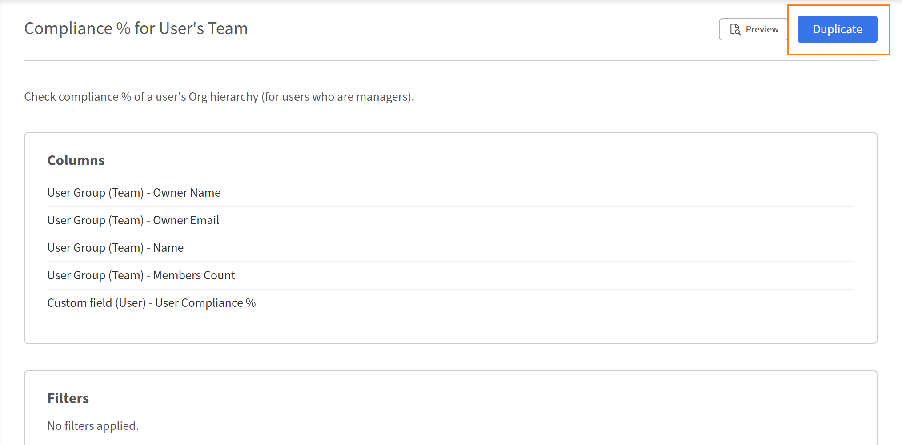

# Introdução ao Report Builder

## Visão geral

O Report Builder inclui 15 modelos pré-criados projetados para os casos de uso mais comuns de relatórios de dados de aprendizado. Cada modelo é uma configuração de relatório pronta para uso com colunas, filtros, configurações de agrupar por e classificação já aplicadas. Os modelos são somente leitura. Você pode visualizá-los ou duplicá-los para criar uma cópia editável.

## Sobre modelos

Os modelos são configurações de relatório prontas para uso fornecidas pela Adobe Learning Manager. Cada modelo é projetado para um caso de uso específico, como inscrição e controle de conclusão, relatório de conformidade ou desempenho do professor. Os modelos aparecem na guia **Modelos** no Report Builder. Cada modelo é criado a partir de um ou mais conjuntos de dados e produz um tipo específico de saída. Para personalizar um modelo, selecione **Duplicar** para criar uma cópia editável na guia **Relatórios**, deixando o original inalterado.

## Catálogo de modelos

### Transcrição de aprendizado do usuário

**Categoria:** transcrições, acompanhamento de conclusão e progresso

**Descrição:** histórico completo de aprendizado de cada aluno, mostrando todas as inscrições, status, pontuações, prazos e tempo gasto em todos os tipos de objeto de aprendizado.

**Use quando:** você precisar de uma exportação completa pronta para auditoria da atividade do aluno para auditorias de conformidade, casos de suporte do aluno ou integração de dados do ALM em um sistema externo.

**Audiências aplicáveis:** educação do cliente, educação do parceiro, educação do funcionário, capacitação de vendas.

**Conjuntos de dados usados:** usuário, objeto de aprendizado, transcrição (objeto de aprendizado)

**Colunas de chave:** ID de usuário, nome de usuário, e-mail do usuário, nome do gerente, status do usuário, nome do objeto de aprendizado, tipo de objeto de aprendizado, data de inscrição, data de conclusão, status, percentual de progresso, pontuação mais alta do usuário, prazo de conclusão, Atrasado, Tempo gasto (minutos)

**Filtros aplicados:** data de inscrição no último ano; Catálogo = Catálogo Padrão

### Resumo do progresso do aluno

**Categoria:** transcrições, acompanhamento de conclusão e progresso

**Descrição:** acompanha o progresso de cada aluno em relação aos caminhos de aprendizado e cursos atribuídos, incluindo o mapeamento de hierarquia por meio da ID do OA pai.

**Use quando:** você quiser ver onde cada aluno está em um caminho de aprendizado -* quem está em andamento, quem está atrasado e quem está sob risco de perder um prazo.

**Audiências aplicáveis:** educação do cliente, educação do parceiro, educação do funcionário, capacitação de vendas.

**Conjuntos de dados usados:** usuário, objeto de aprendizado, transcrição (objeto de aprendizado)

**Colunas de chave:** ID do usuário, nome do usuário, e-mail do usuário, nome do gerente, ID do objeto de aprendizado, nome do objeto de aprendizado, tipo de objeto de aprendizado, ID do objeto de aprendizado pai, data de inscrição, prazo de conclusão, status, percentual de progresso, atraso, data de início, data de conclusão

**Filtros aplicados:** data de inscrição no último ano; tipo de Objeto de Aprendizado = Caminho de Aprendizado ou Curso; Catálogo = Catálogo Padrão

### Painel de alunos ativo

**Categoria:** Contrato do Aluno e Uso da Plataforma

**Descrição:** resumo mensal do envolvimento da plataforma por aluno, mostrando os cursos acessados, as conclusões e o tempo total gasto.

**Use quando:** você quiser identificar os alunos mais e menos engajados no último ano e ver como o engajamento tende mês a mês.

**Audiências aplicáveis:** educação do cliente, educação do parceiro, educação do funcionário, capacitação de vendas.

**Conjuntos de dados usados:** usuário, transcrição (Objeto de Aprendizado)

**Colunas de chave:** ID de usuário, Nome de usuário, Email do usuário, Nome do gerente, Status do usuário, Data do último acesso (Mês), Cursos exclusivos acessados, Inscrições concluídas, Tempo total gasto (minutos)

**Filtros aplicados:** data do último acesso do usuário no último ano; status do usuário = Ativo; Catálogo = Catálogo Padrão

**Agrupar por:** campos de usuário + Mês da data do último acesso

**Agregações:** Contagem de Exclusivos na ID do Objeto de Aprendizado (Cursos exclusivos acessados), Contagem se o Status = Concluído (Inscrições concluídas), Soma do Tempo Gasto (Total de tempo gasto)

### Relatório de alunos inativos

**Categoria:** Contrato do Aluno e Uso da Plataforma

**Descrição:** identifica os usuários ativos sem acesso à plataforma no último ano, mostrando suas datas de inscrição e conclusão mais recentes.

**Use quando:** precisar encontrar contas inativas para campanhas de reengajamento, revisões de licença ou limpeza de conta.

**Audiências aplicáveis:** educação do cliente, educação do parceiro, educação do funcionário, capacitação de vendas.

**Conjuntos de dados usados:** usuário, transcrição (Objeto de Aprendizado)

**Colunas de chave:** ID de usuário, Nome de usuário, Email do usuário, Nome do gerente, Data de criação do usuário, Data do último acesso do usuário, Data da última inscrição, Data da última conclusão

**Filtros aplicados:** data do último acesso do usuário NÃO no último ano; status do usuário = Ativo; Catálogo = Catálogo Padrão

**Agrupar por:** ID de usuário, Nome de usuário, Email do usuário, Nome do gerente, Data de criação do usuário, Data do último acesso do usuário

**Agregados:** máx. na data de inscrição (data da última inscrição), máx. na data de conclusão (data da última conclusão)

### Adoção de novo aluno

**Categoria:** Contrato do Aluno e Uso da Plataforma

**Descrição:** acompanha o envolvimento de integração de usuários criados no último ano, por exemplo, primeiras inscrições, conclusões e total de cursos acessados.

**Use quando:** você quiser medir a rapidez com que novos usuários passam da criação de contas para sua primeira inscrição e conclusão, uma importante métrica de integridade de integração.

**Audiências aplicáveis:** educação do cliente, educação do parceiro, educação do funcionário, capacitação de vendas.

**Conjuntos de dados usados:** usuário, transcrição (Objeto de Aprendizado)

**Colunas de chave:** ID de usuário, nome de usuário, email do usuário, nome do gerente, data de criação do usuário, data do último acesso do usuário, data da primeira inscrição, data da primeira conclusão, Total de cursos acessados, Cursos concluídos

**Filtros aplicados:** data de criação do usuário no último ano; status do usuário = Ativo; Catálogo = Catálogo Padrão

>[!NOTE]
>
>Este modelo usa um join esquerdo entre os conjuntos de dados Usuário e Transcrição para que os usuários com zero inscrições ainda apareçam no relatório. Isso permite identificar novos usuários que ainda não iniciaram sua jornada de aprendizado.

**Agrupar por:** ID de usuário, Nome de usuário, Email do usuário, Nome do gerente, Data de criação do usuário, Data do último acesso do usuário

**Agregações:** mínimo na data de inscrição (primeira data de inscrição), mínimo na data de conclusão (primeira data de conclusão), contagem exclusiva na ID do objeto de aprendizado (total de cursos acessados), contagem se o status = concluído (cursos concluídos)

### Aprendizado por grupo de usuários

**Categoria:** Usuários, Grupos e Estrutura de Organização

**Descrição:** compara a atividade de aprendizado entre os segmentos organizacionais - alunos ativos, cursos acessados, conclusões e tempo gasto por grupo.

**Use quando:** você quiser fazer um teste de desempenho de envolvimento entre departamentos, funções de trabalho ou qualquer grupo de usuários ativo baseado em campo.

**Audiências aplicáveis:** educação do cliente, educação do parceiro, educação do funcionário, capacitação de vendas.

**Conjuntos de dados usados:** Grupo de Usuários (Campo Ativo), Transcrição (Objeto de Aprendizado)

**Colunas de chave:** ID do grupo de usuários, nome do grupo de usuários, contagem de membros, Alunos ativos, Total de cursos exclusivos acessados, Inscrições concluídas, Total de tempo gasto (minutos)

**Filtros aplicados:** data de inscrição no último ano; Catálogo = Catálogo Padrão; nome do Grupo de Usuários (Campo Ativo) = Perfil (Campo Ativo)

**Agrupar por:** ID do Grupo de Usuários, Nome do grupo de usuários, Contagem de membros

**Agregações:** Contagem de Exclusivos na ID de Usuário (Alunos Ativos), Contagem de Exclusivos na ID de Objeto de Aprendizado (Total de cursos exclusivos acessados), Contagem de Status = Concluído (Inscrições concluídas), Soma de Tempo Gasto (Total de tempo gasto)

### Aprendizado por local

**Categoria:** Usuários, Grupos e Estrutura de Organização

**Descrição:** compara a atividade de aprendizado entre locais geográficos - alunos ativos, cursos acessados, conclusões e tempo gasto por local.

**Use quando:** você precisar testar a integridade do aprendizado nas regiões sem fatias de dados manuais. Útil para organizações globais com alunos distribuídos geograficamente.

**Audiências aplicáveis:** educação do cliente, educação do parceiro, educação do funcionário, capacitação de vendas.

**Conjuntos de dados usados:** Grupo de Usuários (Campo Ativo), Transcrição (Objeto de Aprendizado)

**Colunas de chave:** ID do grupo de usuários, nome do grupo de usuários, contagem de membros, Alunos ativos, Total de cursos exclusivos acessados, Inscrições concluídas, Total de tempo gasto (minutos)

**Filtros aplicados:** data de inscrição no último ano; Catálogo = Catálogo Padrão; o nome do Grupo de Usuários (Campo Ativo) contém “Local”

**Agrupar por:** ID do Grupo de Usuários, Nome do grupo de usuários, Contagem de membros

**Agregações:** Contagem de Exclusivos na ID de Usuário (Alunos Ativos), Contagem de Exclusivos na ID de Objeto de Aprendizado (Total de cursos exclusivos acessados), Contagem de Status = Concluído (Inscrições concluídas), Soma de Tempo Gasto (Total de tempo gasto)

### Aprendizado por gerente

**Categoria:** Usuários, Grupos e Estrutura de Organização

**Descrição:** resume o desempenho de aprendizado de toda a hierarquia de equipe de cada gerente - alunos ativos, conclusões e tempo gasto.

**Use quando:** você quiser comparar o envolvimento da equipe entre gerentes e identificar equipes com baixas taxas de conclusão ou tempo gasto relativo ao tamanho da equipe.

**Audiências aplicáveis:** formação do funcionário, habilitação de vendas.

**Conjuntos de dados usados:** grupo de usuários (equipe), transcrição (objeto de aprendizado)

**Colunas de chave:** ID do gerente, nome do gerente, email do gerente, contagem de membros (equipe completa), Alunos ativos, Total de cursos exclusivos acessados, Inscrições concluídas, Tempo total gasto (minutos)

**Filtros aplicados:** data de inscrição no último ano; Catálogo = Catálogo Padrão

**Agrupar por:** ID do Proprietário (ID do Gerente), Nome do Proprietário, Email do Proprietário, Contagem de Membros

**Agregações:** Contagem de Exclusivos na ID de Usuário (Alunos Ativos), Contagem de Exclusivos na ID de Objeto de Aprendizado (Total de cursos exclusivos acessados), Contagem de Status = Concluído (Inscrições concluídas), Soma de Tempo Gasto (Total de tempo gasto)

>[!NOTE]
>
>Este modelo usa o conjunto de dados do Grupo de Usuários (Equipe), que captura toda a hierarquia da equipe em cada gerente. Nenhum filtro adicional de grupo de usuários é necessário.

### Resumo da Inscrição

**Categoria:** transcrições, acompanhamento de conclusão e progresso

**Descrição:** contagens de inscrições no nível do curso divididas por status - concluído, em andamento e não iniciado - para cada objeto de aprendizado.

**Use quando:** você quiser uma visualização rápida do funil de inscrição de cada curso - quantos alunos iniciaram, quantos estão em andamento e quantos concluíram.

**Audiências aplicáveis:** educação do cliente, educação do parceiro, educação do funcionário, capacitação de vendas.

**Conjuntos de dados usados:** Objeto de aprendizado, Transcrição (Objeto de aprendizado)

**Colunas de chave:** ID do Objeto de Aprendizado, nome do Objeto de Aprendizado, tipo do Objeto de Aprendizado, status do Objeto de Aprendizado, Total de alunos inscritos, Inscrições concluídas, Inscrições em andamento, Inscrições não iniciadas

**Filtros aplicados:** data de inscrição no último ano; Catálogo = Catálogo Padrão

**Agrupar por:** ID, nome, tipo e status do Objeto de Aprendizado

**Agregações:** Contagem exclusiva na ID de usuário (total de alunos inscritos), Contagem se o status for concluído, Contagem se o status for em andamento, Contagem se o status for não iniciado

### Análise de Tendência de Inscrição

**Categoria:** transcrições, acompanhamento de conclusão e progresso

**Descrição:** contagens de inscrições e conclusões mês a mês por objeto de aprendizado, mostrando como a aceitação do aluno evolui com o tempo.

**Use quando:** você deseja ver quando as inscrições aumentam e diminuem em cada curso e se as inscrições seguem as inscrições no mesmo mês.

**Audiências aplicáveis:** educação do cliente, educação do parceiro, educação do funcionário, capacitação de vendas.

**Conjuntos de dados usados:** Objeto de aprendizado, Transcrição (Objeto de aprendizado)

**Colunas de chave:** nome do Objeto de Aprendizado, tipo do Objeto de Aprendizado, data de inscrição (mês), Total de alunos inscritos, inscrições concluídas

**Filtros aplicados:** data de inscrição no último ano; Catálogo = Catálogo Padrão

**Agrupar por:** nome do Objeto de Aprendizado, tipo do Objeto de Aprendizado, Mês da Data de Inscrição

**Agregações:** Contagem exclusiva na ID de usuário (total de alunos inscritos), Contagem se Status = Concluído (inscrições concluídas)

### Relatório de conclusão do curso

**Categoria:** transcrições, acompanhamento de conclusão e progresso

**Descrição:** detalhamento da conclusão por curso com contagens de status, última data de conclusão, progresso médio e tempo médio gasto.

**Use quando:** você quiser identificar conteúdo com baixo desempenho - cursos com alta inscrição, mas baixa conclusão, ou cursos nos quais o progresso médio é baixo (indicando abandono antecipado).

**Audiências aplicáveis:** educação do cliente, educação do parceiro, educação do funcionário, capacitação de vendas.

**Conjuntos de dados usados:** Objeto de aprendizado, Transcrição (Objeto de aprendizado)

**Colunas de chave:** ID do Objeto de Aprendizado, nome do Objeto de Aprendizado, tipo do Objeto de Aprendizado, status do Objeto de Aprendizado, Total de alunos inscritos, Inscrições concluídas, Inscrições em andamento, Inscrições não iniciadas, Última data de conclusão, % de progresso médio, Tempo médio gasto (minutos)

**Filtros aplicados:** data de inscrição no último ano; Catálogo = Catálogo Padrão

**Agrupar por:** ID, nome, tipo e status do Objeto de Aprendizado

**Agregações:** Contagem exclusiva na ID do Usuário, Contagem se o Status = Concluído/Em Andamento/Não Iniciado, Máximo na Data de Conclusão, Percentual Médio em Andamento, Média em Tempo Gasto

### Painel de Tendência de Conclusão

**Categoria:** transcrições, acompanhamento de conclusão e progresso

**Descrição:** contagens mensais de conclusão por objeto de aprendizado, com tempo médio gasto e progresso, limitado apenas a inscrições concluídas.

**Use quando:** você quiser acompanhar se as taxas de conclusão estão aumentando mês a mês e se os alunos que terminam estão indo muito bem ou se estão se apressando.

**Audiências aplicáveis:** educação do cliente, educação do parceiro, educação do funcionário, capacitação de vendas.

**Conjuntos de dados usados:** Objeto de aprendizado, Transcrição (Objeto de aprendizado)

**Colunas de chave:** nome do Objeto de Aprendizado, tipo do Objeto de Aprendizado, data de conclusão (mês), Total de alunos concluídos, Tempo médio gasto (minutos), % de progresso médio

**Filtros aplicados:** data de conclusão no último ano; Status = Concluído; Catálogo = Catálogo Padrão

**Agrupar por:** nome do Objeto de Aprendizado, tipo do Objeto de Aprendizado, data do Mês de Conclusão

**Agregações:** Contagem exclusiva na ID de usuário (total de alunos concluídos), Média do tempo gasto, Média do percentual em andamento

>[!NOTE]
>
>Esse modelo filtra para o status Concluído antes do agrupamento, garantindo que apenas os registros com uma Data de conclusão válida sejam incluídos e que as datas nulas não distorçam a tendência mensal.

### Tempo até a conclusão

**Categoria:** transcrições, acompanhamento de conclusão e progresso

**Descrição:** mede o tempo real gasto na conclusão de cada curso, médio, mínimo e máximo, em comparação com a duração projetada.

**Use quando:** você quiser identificar os cursos nos quais os alunos demoram significativamente mais tempo ou menos do que o esperado para concluir, o que pode indicar problemas de dificuldade ou duração do conteúdo.

**Audiências aplicáveis:** educação do cliente, educação do parceiro, educação do funcionário, capacitação de vendas.

**Conjuntos de dados usados:** Objeto de aprendizado, Transcrição (Objeto de aprendizado)

**Colunas de chave:** ID do Objeto de Aprendizado, nome do Objeto de Aprendizado, tipo do Objeto de Aprendizado, Duração (minutos, projetada), Total de alunos concluídos, Média de tempo gasto (minutos), Mín. tempo gasto (minutos), Máx. tempo gasto (minutos)

**Filtros aplicados:** data de conclusão no último ano; Status = Concluído; Catálogo = Catálogo Padrão

**Agrupar por:** ID, nome, tipo e Duração do Objeto de Aprendizado (minutos)

**Agregações:** Contagem Exclusiva na ID de Usuário, Média/Mín/Máx no Tempo Gasto

**Observação:** a duração (a duração do curso projetada) está incluída em Agrupar por, portanto, aparece na mesma linha do tempo real gasto, permitindo a comparação direta sem um campo calculado. Uma ampla lacuna entre o tempo mínimo e máximo gasto sugere experiências inconsistentes do aluno.

### Atribuições de aprendizado vencidas

**Categoria:** Conformidade e Certificação

**Descrição:** lista os usuários ativos com inscrições obrigatórias vencidas, mostrando prazo, status atual e progresso para cada um.

**Use quando:** você precisar de uma lista acionável de alunos incompatíveis para escalar para gerentes ou acionar fluxos de trabalho de reinscrição.

**Público aplicável:** formação de parceiros, formação de funcionários, habilitação de vendas.

**Conjuntos de dados usados:** usuário, grupo de usuários (campo ativo), objeto de aprendizado, transcrição (objeto de aprendizado)

**Colunas de chave:** ID do usuário, nome do usuário, e-mail do usuário, nome do gerente, nome do grupo de usuários (campo ativo), ID do objeto de aprendizado, nome do objeto de aprendizado, tipo de objeto de aprendizado, data de inscrição, prazo de conclusão, status, percentual de progresso, vencido

**Filtros aplicados:** Atrasado = Sim; Status = Em Andamento OU Não Iniciado; Prazo de conclusão no último ano; Catálogo = Catálogo Padrão; Status do usuário = Ativo; Nome do Grupo de Usuários (Campo Ativo) = Perfil (Campo Ativo)

**Nenhum grupo por aplicado** A saída é uma linha por inscrição vencida, preservando todos os detalhes do aluno e do curso para escalonamento.

>[!NOTE]
>
>O filtro Status (Em andamento OU Não iniciado) atua como uma proteção para excluir todos os registros sinalizados incorretamente como vencidos apesar de estarem concluídos.

### Status de Treinamento Obrigatório

**Categoria:** Conformidade e Certificação

**Descrição:** exibição de conformidade completa de todas as inscrições com prazo de conclusão, com todos os status incluídos, não apenas vencidos.

**Use quando:** você precisar de um quadro de conformidade completo em vez de apenas violações, por exemplo, para relatar taxas gerais de conclusão de treinamento obrigatório para a liderança.

**Audiências aplicáveis:** formação do funcionário, habilitação de vendas.

**Conjuntos de dados usados:** usuário, grupo de usuários (campo ativo), objeto de aprendizado, transcrição (objeto de aprendizado)

**Colunas de chave:** ID do usuário, nome do usuário, e-mail do usuário, nome do gerente, nome do grupo de usuários (campo ativo), ID do objeto de aprendizado, nome do objeto de aprendizado, tipo de objeto de aprendizado, data de inscrição, prazo de conclusão, data de conclusão, status, percentual de progresso, vencido

**Filtros aplicados:** o prazo de conclusão não está em branco; a data de inscrição no último ano; Catálogo = Catálogo Padrão; status do usuário = Ativo; nome do Grupo de Usuários (Campo Ativo) = Perfil (Campo Ativo)

**Nenhum grupo por aplicado** Todos os status incluídos (concluído, em andamento, não iniciado, vencido), dando uma imagem completa de conformidade.

**Observação:** a filtragem de “O prazo de conclusão não está em branco” é a lógica principal que identifica consistentemente o treinamento obrigatório em todos os tipos de curso, independentemente de como o status obrigatório esteja configurado.

## Referência rápida do modelo

| **#** | **Nome do modelo** | **Categoria** | **Edu interno** | **edu (cliente/parceiro) externo** |
|--------|------------------------------|-------------------------------------|------------------|-------------------------------------|
| 1 | Transcrição de aprendizado do usuário | Transcrições, conclusão e progresso | ✓ | ✓ |
| 2 | Resumo do progresso do aluno | Transcrições, conclusão e progresso | ✓ | ✓ |
| 3 | Painel de alunos ativo | Envolvimento dos alunos e uso da plataforma | ✓ | ✓ |
| 4 | Relatório de alunos inativos | Envolvimento dos alunos e uso da plataforma | ✓ | ✓ |
| 5 | Adoção de novo aluno | Envolvimento dos alunos e uso da plataforma | ✓ | ✓ |
| 6 | Aprendizado por grupo de usuários | Usuários, grupos e estrutura da organização | ✓ | ✓ |
| 7 | Aprendizado por local | Usuários, grupos e estrutura da organização | ✓ | ✓ |
| 8 | Aprendizado por gerente | Usuários, grupos e estrutura da organização | ✓ | ✗ |
| 9 | Resumo da Inscrição | Transcrições, conclusão e progresso | ✓ | ✓ |
| 10 | Análise de Tendência de Inscrição | Transcrições, conclusão e progresso | ✓ | ✓ |
| 11 | Relatório de conclusão do curso | Transcrições, conclusão e progresso | ✓ | ✓ |
| 12 | Painel de Tendência de Conclusão | Transcrições, conclusão e progresso | ✓ | ✓ |
| 13 | Tempo até a conclusão | Transcrições, conclusão e progresso | ✓ | ✓ |
| 14 | Atribuições de aprendizado vencidas | Conformidade e certificação | ✓ | ✓ |
| 15 | Status de Treinamento Obrigatório | Conformidade e certificação | ✓ | ✗ |

## Usar um modelo de Report Builder

Comece rapidamente no Adobe Learning Manager Report Builder personalizando um modelo pré-criado para casos de uso comuns de relatórios.

1. Faça logon no Adobe Learning Manager como administrador.
2. Selecione **Relatórios** no painel esquerdo e selecione **Report Builder**.

3. Selecione a guia **Modelos**.
4. Procure os modelos disponíveis. Cada modelo é nomeado de acordo com seu caso de uso.

   

5. Selecione um nome de modelo para abrir a visualização somente leitura. Para este exemplo, selecione o modelo **Conformidade % para a Equipe do Usuário**. Revise as colunas, os filtros aplicados e a ordem de classificação.
6. Selecione **Duplicar**.

   

Ao duplicar um modelo, o Report Builder abre uma cópia editável com a configuração existente do modelo pré-carregada. O nome, a descrição, as colunas, os filtros e a classificação do relatório podem ser editados antes de você salvar.

## Nomear e descrever o relatório

1. No campo **Nome**, substitua o nome padrão (por exemplo, *cópia de % de Conformidade para a Equipe do Usuário*) por um nome exclusivo para o relatório. Um nome é necessário.
2. No campo **Descrição**, insira um breve resumo do que o relatório contém. Isso ajuda outros administradores a entenderem a finalidade do relatório quando visualizam ou editam.

## Adicionar e configurar colunas

A seção **Colunas** tem dois painéis: **Selecionar colunas** à esquerda e **Colunas Selecionadas** à direita.

### Adicionar uma coluna

1. No painel **Selecionar colunas**, expanda um conjunto de dados selecionando seu nome. Por exemplo, **Catálogo** ou **Grupo de usuários de campo ativo**.
2. Selecione o ícone **+** ao lado da coluna que você deseja adicionar. A coluna aparece no painel **Colunas Selecionadas** à direita.

   

3. Para adicionar a mesma coluna mais de uma vez. Por exemplo, aplicar dois agregados diferentes ao mesmo campo. Selecione **+** novamente para essa coluna.

### Reordenar colunas

Arraste a alça à esquerda de qualquer linha de coluna no painel **Colunas Selecionadas** para movê-la para uma posição diferente. A ordem das colunas no painel corresponde à ordem no relatório baixado.

### Renomear uma coluna

1. Selecione o ícone de **editar** (lápis) em uma linha de coluna.

   

2. Insira um alias. O alias aparece como o cabeçalho da coluna no relatório baixado em vez do nome de campo padrão.

   

### Remover uma coluna

Selecione o ícone **x** em uma linha de coluna para removê-lo do relatório.

## Aplicar grupo por

O controle **Agrupar por** aparece na parte superior do painel **Colunas Selecionadas**.

1. Selecione **Agrupar por: selecione**.

   

2. Selecione as colunas pelas quais agrupar. É possível selecionar mais de um. Na captura de tela, o relatório é agrupado por Nome do grupo de usuários (equipe) e Nome do proprietário do grupo de usuários (equipe).
3. Cada coluna agrupar por selecionada aparece como uma marca abaixo do controle **Agrupar por**. Para remover uma coluna agrupar por, selecione **x** em sua marca.

>[!NOTE]
>
>Quando agrupar por é aplicado, todas as colunas que não são agrupadas por coluna devem ter uma função agregada aplicada. Uma coluna sem uma agregação causará um erro.

### Aplicar uma agregação a uma coluna

1. Em qualquer coluna não agrupar por no painel **Colunas Selecionadas**, selecione **Agregar por**.
2. Escolha uma função no menu suspenso. Na captura de tela, a **Contagem de objetos de aprendizado** usa a **Contagem distinta**, cujo alias é count_of_courses.

   

Funções agregadas disponíveis:

| **Função** | **O que ele retorna** |
|--------------------|---------------------------------------------|
| **Contagem** | Número total de linhas no grupo |
| **Contagem Distinta** | Número de valores exclusivos no grupo |
| **Contar Se** | Número de linhas que correspondem a um valor especificado |
| **Soma** | Total de um campo numérico no grupo |
| **Mín** | Valor mais baixo no grupo |
| **Máx** | Valor mais alto no grupo |
| **Média** | Valor médio no grupo |

## Aplicar filtros

A seção **Filtros** está abaixo da seção **Colunas**. Os filtros restringem quais linhas aparecem no relatório.

1. Para adicionar um filtro, selecione o ícone **+** à direita da seção Filtros.
2. Escolha o campo para filtrar.

   

3. Selecione um operador e insira ou escolha um valor.

Para editar um filtro existente, selecione o ícone de **lápis** na linha de filtro. Para adicionar um grupo de filtros aninhado, selecione o ícone **+** com colchetes à direita de uma linha de filtro.

## **Configurar classificação**

A seção **Classificação** está abaixo da seção **Filtros**.

1. Selecione **+ Adicionar classificação** para adicionar uma classificação.
2. Escolha a coluna pela qual classificar e selecione **Crescente** ou **Decrescente**.

   

3. Repita para adicionar classificações secundárias. Arraste a alça à esquerda de cada linha de classificação para alterar a prioridade.

>[!TIP]
>
>Sempre aplique pelo menos uma classificação. Sem classificação, a ordem das linhas pode diferir entre os downloads do mesmo relatório.

## Salvar o relatório

Selecione **Salvar Relatório** no canto superior direito. O relatório foi salvo na guia **Relatórios** e está pronto para download.

## Práticas recomendadas

* Use aliases em todas as colunas para que o relatório baixado tenha cabeçalhos significativos em vez de nomes de campo, como Objeto de aprendizado - ID do Objeto de aprendizado.
* Use **Contagem distinta** em vez de **Contagem** quando desejar registros exclusivos, por exemplo, cursos distintos por catálogo em vez de linhas totais.

* Aplique a classificação antes de salvar, especialmente para relatórios que você compartilhará ou assinará.
* Mantenha a descrição atualizada. Outros administradores contam com ele para entender o escopo do relatório sem abri-lo.
