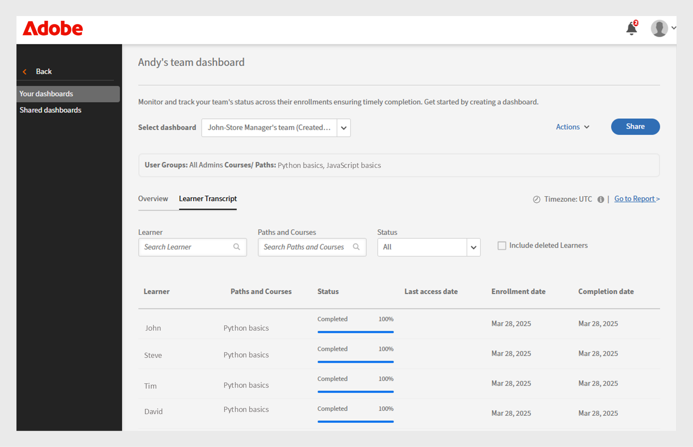

# Painel de Sucesso do Grupo

## Visão Geral do Painel de Controle de Êxito do Grupo

O Painel de sucesso do grupo (GSD) no Adobe Learning Manager permite que administradores e gerentes monitorem o progresso do aluno quase em tempo real (60 minutos de atraso da inscrição, progresso ou conclusão para refletir no painel) entre departamentos ou grupos de usuários. Ele oferece suporte ao rastreamento pró-ativo da conclusão do curso, inscrição e ações pendentes, facilitando o gerenciamento do aprendizado para equipes. Exiba este [artigo](/help/migrated/administrators/feature-summary/add-users-user-groups.md) para saber mais sobre grupos de usuários.

## Principais casos de uso

O Painel de Controle de Êxito do Grupo oferece o seguinte:

* **Simplifica o acompanhamento do progresso do aluno**: o painel de sucesso do grupo fornece uma visualização em tempo real e fácil de usar dos dados do aluno, reduzindo a necessidade de transcrições baseadas em Excel. Os gerentes e administradores podem visualizar rapidamente as inscrições do aluno e o progresso do curso para suportar os principais cenários, como:

   * **Prontidão da revisão de desempenho**: os gerentes podem avaliar o progresso do curso para os membros da equipe antes dos ciclos de avaliação.
   * **Monitoramento de conformidade**: identifique os alunos que não concluíram treinamentos obrigatórios.
   * **Acompanhamento de nível de equipe**: os gerentes de franquia, loja ou região podem garantir que suas equipes concluam o aprendizado necessário a tempo.

* **Facilita o gerenciamento da equipe**: o Painel de Sucesso do Grupo é útil para gerentes com equipes pequenas (menos de 50 pessoas), como gerentes de lojas, gerentes de franquias, gerentes de concessionárias ou equipes internas. Ele fornece uma visão da equipe e permite que os gerentes verifiquem rapidamente se sua equipe concluiu o conjunto de cursos necessários para atingir as metas de negócios.

## Como usar o Painel de Sucesso do Grupo

Um administrador pode ativar e criar os painéis dando um nome, selecionando grupos de usuários e escolhendo os cursos ou caminhos de aprendizado. Os painéis podem ser compartilhados com outros administradores ou gerentes.

### Ativar o Painel de Sucesso do Grupo

O administrador deve ativar o Painel de sucesso do grupo para a conta. Para ativar o Painel de Controle de Êxito do Grupo, siga estas etapas:

1. Faça logon como administrador.
2. Selecione **[!UICONTROL Configurações]**e depois **[!UICONTROL Relatórios]**.
3. Selecione a alternância **[!UICONTROL Visibilidade do painel]**.
4. Digite o nome do painel (por exemplo, **[!UICONTROL Painel do Gerenciador de Armazenamento]**).
   
   _Campos para nome do painel, grupo de usuários e seleção do caminho de aprendizado_
5. Selecione **[!UICONTROL Visibilidade de visão geral]** para habilitar a seção de visão geral no painel. Esta seção permite ver o progresso de até 50 alunos.
6. Na seção **[!UICONTROL Transcrição do aluno]**, selecione as colunas necessárias que deseja exibir.

   * Aluno
   * Caminhos e cursos
   * Status
   * Data da inscrição
   * Data do último acesso
   * Data de conclusão

Depois de habilitar esse recurso, os administradores podem exibir o Painel de Êxito do Grupo na seção **[!UICONTROL Relatórios]**.

### Criar um Painel de Sucesso do Grupo

Os administradores podem criar até 100 painéis para exibir o progresso dos alunos. Para criar um painel de controle, siga estas etapas:

1. Faça logon como administrador e selecione a página **[!UICONTROL Relatórios]**.

   
   _Selecionar relatórios na página inicial do administrador_

2. Selecione o Painel de Controle de Êxito do Grupo. O nome do painel é **[!UICONTROL Painel do Gerenciador de Repositório]**.

   
   _Selecionar Painel do Gerenciador de Repositório_

   >[!NOTE]
   >
   >O nome que você definir ao ativar o Painel de Controle de Êxito do Grupo aparecerá como o nome do painel.

3. Selecione **[!UICONTROL Criar Novo Painel]** no menu suspenso Selecionar Painel.

   
   _Selecione a opção para criar um GSD_

4. Digite o nome do painel.
5. Selecione um grupo de usuários para aparecer no painel.
6. Pesquise os cursos ou caminhos de aprendizado e selecione-os nos resultados.

   
   _Selecionar grupo de usuários e cursos_

7. Selecione **[!UICONTROL Criar painel]**.

Para equipes maiores, crie um painel selecionando o **Catálogo padrão** e o grupo de usuários **Todos os alunos** na guia **[!UICONTROL Transcrição do aluno]**. Isso inclui todos os cursos e alunos na exibição **[!UICONTROL Transcrição do aluno]**, facilitando a pesquisa e o acompanhamento do progresso de cada aluno.

### Exibir o Painel de Sucesso do Grupo

Depois de criar um painel de controle, o administrador pode exibir o painel de controle seguindo estas etapas:

1. Faça logon como administrador.
2. Selecione **[!UICONTROL Relatórios]** e depois **[!UICONTROL Painel de Êxito do Grupo]**.
O nome do painel é Painel do Gerenciador de Armazenamento.
3. Na seção **[!UICONTROL Seus painéis]**, selecione o painel criado na lista suspensa **[!UICONTROL Selecionar painel]**.
4. O painel está dividido em:
   * **[!UICONTROL Visão geral]**: você pode ver rapidamente o progresso dos alunos em cursos individuais ou caminhos de aprendizado. Você pode ver o progresso de até 50 cursos ou caminhos de aprendizado e 50 alunos de uma só vez. Se quiser verificar o progresso de um aluno específico, selecione a seção **[!UICONTROL Transcrição do aluno]**.

   
   _Status de aprendizado dos alunos na equipe do gerente da loja_

   * **[!UICONTROL Transcrição do aluno]**: exiba o progresso do aluno selecionando um aluno ou curso específico. Procure um aluno no painel para verificar o progresso do aprendizado. Se você criou o painel usando o catálogo padrão e incluiu todos os alunos, pode pesquisar qualquer aluno para revisar facilmente seu progresso.

   
   _Exibição detalhada da transcrição do aluno com colunas para inscrição e conclusão_

>[!NOTE]
>
>Para baixar a transcrição detalhada do aluno, selecione **[!UICONTROL Ir para o relatório]** na guia **[!UICONTROL Transcrição do aluno]**.

### Compartilhar o Painel de Êxito do Grupo

Os administradores podem compartilhar painéis com outros administradores ou gerentes. Siga as etapas para compartilhar um painel:

1. Selecione **[!UICONTROL Relatórios]** e depois **[!UICONTROL Painel de Êxito do Grupo]**. O nome do painel é **[!UICONTROL Painel do Gerenciador de Repositório]**.
2. Selecione **[!UICONTROL Compartilhar]** na opção **[!UICONTROL Seus painéis]**.

   
   _Botão Selecionar Compartilhar_

3. Pesquise usuários ou grupos de usuários por nome e selecione-os.

   
   _Compartilhar o painel com usuários ou grupos de usuários_

4. Selecione **[!UICONTROL Prosseguir]** para compartilhar o painel.

Você pode ver os detalhes do painel compartilhado em **[!UICONTROL Relatórios]**, selecione **[!UICONTROL Painel de Êxito do Grupo]** (Painel do Gerenciador de Loja) e selecione **[!UICONTROL Painéis compartilhados]**.

_Exibir o painel compartilhado_

>[!NOTE]
>
>O gerente ou o administrador personalizado só pode ver os catálogos habilitados no Painel de Sucesso do Grupo compartilhado pelo administrador.

### Limitações do Painel de Controle de Êxito do Grupo

Veja a seguir a limitação do Painel de Controle de Êxito do Grupo:

* Não há suporte para certificados recorrentes no painel.
* A coluna **[!UICONTROL Data do último acesso]** na guia **[!UICONTROL Transcrição do aluno]** atualmente exibe dados para caminhos de aprendizado e certificações. O suporte aos cursos está planejado para uma atualização futura.

## Selecionar alunos em vários grupos de usuários

Quando você seleciona mais de um grupo de usuários, o Adobe Learning Manager usa regras específicas para determinar quais alunos incluir:

* **Grupos de usuários com o mesmo campo Ativo**: se os grupos de usuários usarem o mesmo campo (por exemplo, Local), o sistema incluirá todos os alunos de ambos os grupos. Ele combina os valores. Por exemplo: **Local = Bangalore** e **Local = Chennai**. Inclui alunos de ambos os locais.
* **Grupos de usuários com campos ativos diferentes**: se os grupos de usuários usarem campos diferentes (por exemplo, Local e Função), o sistema incluirá apenas os alunos que atenderem a todas as condições. Por exemplo: **Local = Bangalore ou Chennai** e **Função = Gerente**. Inclui somente alunos com a função Gerente e localizados em Bangalore ou Chennai.

* Mesmo campo ativo: os alunos são combinados (lógica OR)
* Campos Ativos diferentes: os alunos devem corresponder a todos os critérios (lógica AND)

Essa abordagem ajuda a direcionar os alunos certos com base nas condições selecionadas.
