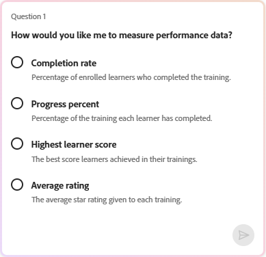

# O que é o Insights Agent

O Insights Agent é um recurso viabilizado por IA no Adobe Learning Manager que permite que os administradores consultem os dados do aluno usando linguagem natural. Em vez de baixar relatórios e manipular planilhas, você digita uma pergunta, como “Quantos cursos foram criados nos últimos 3 meses na conta? Dê-me um relatório mensal.” e o agente do Insights recupera e apresenta os dados diretamente. Você pode exibir os resultados em tabelas ou baixá-los como um arquivo CSV.

O Agente do Insights foi projetado para reduzir as etapas entre fazer uma pergunta sobre os dados e obter uma resposta. Os administradores que atualmente dependem de tabelas dinâmicas do Excel, equipes de BI ou vários relatórios combinados podem usar o Agente do Insights para obter respostas mais rapidamente.

## O que o Agente do Insights pode fazer

Você pode usar o Agente do Insights para:

- Verificar métricas de conclusão e conformidade por região, departamento ou grupo de usuários
- Analisar as tendências de inscrição nos programas de aprendizado
- Exibir dados de progresso de um curso ou caminho de aprendizado específico
- Recuperar resultados em uma tabela ou como um arquivo CSV para download
- Obtenha uma explicação em linguagem simples sobre como seus resultados foram calculados

## O que o Data Insights Agent não suporta

Os seguintes tipos de dados estão fora do escopo desta versão:

- Comentários e dados da pesquisa
- Pontos e medalhas de gamificação
- Histórico de auditoria e logs de alteração

As consultas que referenciam esses tipos de dados não retornarão resultados. Por exemplo, “Quantos pontos de gamificação foram concedidos no último trimestre?” ou “Quais alunos receberam um emblema de conformidade?” retornará um erro ou dados incompletos.

## Como o Insights Agent difere do Report Builder

Os dois recursos usam os mesmos dados de aprendizado subjacentes, mas funcionam de forma diferente. O agente do Insights é conversacional. Você descreve o que deseja e o agente o recupera. O Report Builder está estruturado. Você seleciona conjuntos de dados, colunas e filtros para criar relatórios reutilizáveis.

| **Caso de uso** | **Recomendação** |
|---|---|
| Faça uma pergunta rápida sobre dados | Agente de insights |
| Explore dados sem conhecer o esquema | Agente de insights |
| Criar um relatório estruturado e repetível | Criador de relatórios |
| Combine vários conjuntos de dados com junções personalizadas | Criador de relatórios |
| Agendar assinaturas de relatório | Criador de relatórios |
| Combine conjuntos de dados com junções personalizadas ou modelagem de dados avançada | Criador de relatórios |

**IMPORTANTE**: a integração entre o Insights Agent e o Report Builder está planejada para uma versão futura e não está disponível na versão beta atual.

## Como o Agente do Insights funciona

Quando você insere uma pergunta, o Agente do Insights a processa em quatro estágios:

1. **Interpretação**: o agente analisa sua pergunta para identificar quais dados são necessários. Se qualquer parte da pergunta for ambígua, o agente fará uma pergunta esclarecedora antes de continuar

2. **Abordagem**: o agente descreve as etapas necessárias para localizar sua resposta. Esta seção ajuda a verificar se os dados foram recuperados da maneira desejada, especialmente em consultas complexas.

3. **Resultados**: o agente apresenta seus dados como uma tabela. Se os resultados contiverem 50 ou menos linhas, um resumo em linguagem simples poderá ser incluído.

4. **Baixar**: você pode baixar os resultados como um arquivo CSV. Relatórios grandes podem levar mais tempo; o agente notifica quando o arquivo estiver pronto.

A seção **Abordagem** é particularmente útil para consultas complexas. Ela mostra a lógica que o agente usou, semelhante ao que um analista de BI explicaria se executasse a consulta manualmente. Revisar a abordagem ajuda a confirmar se o resultado é confiável antes de agir com ele.

## Fazer perguntas usando o Agente do Insights

Use o Agente do Insights no Adobe Learning Manager para consultar os dados do aluno com perguntas de linguagem simples e obter resultados como texto, tabelas ou arquivos CSV para download.

O Agente do Insights está disponível para administradores no painel Assistente do AI no Learning Manager. O painel é redimensionável. É possível expandi-lo para facilitar a leitura dos resultados. Por padrão, o modo **Obter Insights** é selecionado quando você abre o painel. Um modo separado do **Aprendizado** também está disponível para perguntas instrucionais sobre como usar o produto. O modo **Aprender** responde a perguntas instrucionais sobre como usar o Learning Manager. Por exemplo, “Como criar um caminho de aprendizado?” Ele não consulta dados do aluno.

### Fazer uma pergunta

Quando o modo **Obter insights** é selecionado por padrão, você pode começar imediatamente a consultar os dados do aluno sem precisar ajustar o modo toda vez que acessar o assistente. No entanto, se você alternar para o modo **Aprender** para perguntas instrucionais, selecione novamente **Obter Insights** antes de enviar uma consulta.

1. Selecione o ícone do assistente do AI no Learning Manager para abrir o painel do assistente.

2. Selecione **Obter Insights** no seletor de modos, se ainda não estiver selecionado por padrão.
   

3. Digite sua pergunta no campo de texto. Usar linguagem simples. Por exemplo: **Quantos cursos foram criados nos últimos 3 meses?**

4. Selecione **Enviar** ou pressione **Enter** para enviar sua pergunta.

### Examinar a resposta

Depois de enviar sua pergunta, o Agente do Insights processa sua solicitação e retorna uma resposta com até quatro partes:

1. **Desambiguidade (se necessário):** se a sua pergunta contiver um termo ambíguo, como \”atividade de aprendizado\” ou \”desempenho\”, ou “Fornecer-me dados de desempenho dos últimos 3 meses”, o assistente exibirá uma lista de opções e solicitará que você selecione uma antes de continuar. Selecione a opção que melhor corresponde ao que você está procurando. Depois da pergunta inicial, não será possível digitar instruções adicionais. Selecionar entre as opções fornecidas é a única interação disponível até que você inicie uma nova consulta usando a interface de consulta. Você só pode responder à desambiguação selecionando uma das opções fornecidas; o acompanhamento de texto livre não está disponível nesta versão.

&#x200B;2. **Abordagem:** a seção **Abordagem** descreve as etapas que o agente realizou para recuperar seus dados. Aparece como um painel rolável abaixo da pergunta. Selecione o ícone de expansão para ver a abordagem completa. A revisão desta seção ajuda a confirmar se a lógica corresponde à sua intenção, especialmente em consultas complexas. Por exemplo, se você solicitar “todos os alunos inscritos no último ano”, o agente poderá retornar a inscrição mais recente de cada aluno, em vez de cada registro de inscrição. A seção **maio** ou **Abordagem** explicará&#x200B;**essa decisão.** Se a lógica não corresponder à sua intenção, inicie uma nova consulta com termos mais específicos.

&#x200B;3. **Resultados:** o Agente do Insights gera resultados como texto ou tabela. Para pontos de dados que são melhor interpretados em um formato tabular, o Agente do Insights retorna uma tabela. O Agente do Insights não gera gráficos. Para visualizar os dados, baixe o CSV e abra-o na ferramenta de sua preferência. Se os resultados contiverem 50 ou menos linhas, um resumo em linguagem simples poderá ser incluído acima da tabela. Por exemplo, “Quais cursos não têm menos de 5 inscrições criadas no último ano e quem são os autores?\”

E a resposta contém o seguinte resumo:

***Resumo***

- *Cursos correspondentes: 102*
- *Intervalo de contagem de registros: 24 a 2019*
- *Média de inscrições por curso correspondente: 589,6*
- *Inscrições medianas por curso correspondente: 553,5*

*Um link de download para o relatório completo será fornecido assim que a exportação estiver pronta.*

**Observação:** o Agente do Insights é probabilístico. Se você executar a mesma consulta duas vezes, a frase da resposta ou a ordenação do resultado poderão ser ligeiramente diferentes. Os dados subjacentes recuperados são os mesmos, mas a saída pode variar entre as execuções.

### Baixar o relatório

Selecione **Baixar relatório** para exportar seus resultados como um arquivo CSV. Para conjuntos grandes de resultados, o download pode levar mais tempo. O agente exibe uma mensagem quando o arquivo está pronto; você também recebe uma notificação.

## Iniciar uma nova consulta

Cada sessão do agente do Insights lida com uma pergunta de cada vez. Depois de revisar seus resultados, selecione **Nova pergunta** para fazer uma pergunta diferente. Você não pode digitar uma pergunta de acompanhamento na mesma sessão ou pedir ao agente para refinar ou expandir os resultados retornados.

>[!TIP]
>
>Se quiser explorar dados relacionados, inicie uma nova consulta que incorpore o que você aprendeu desde a primeira etapa. Por exemplo, depois de ver os totais de inscrição por região, inicie uma nova consulta para verificar as taxas de conclusão para a mesma região.

## Fornecer feedback

Após cada resposta, selecione o ícone de miniaturas para cima ou para baixo para classificar o resultado. Você também pode especificar se o resultado foi impreciso, difícil de entender ou se demorou muito para retornar. Esse feedback ajuda a melhorar o agente ao longo do tempo.

## Práticas recomendadas

- Comece com uma pergunta específica em vez de uma pergunta ampla. \”Qual é a taxa de conclusão do curso de Treinamento em Segurança no grupo de usuários da América do Norte?\” retorna resultados mais úteis do que \”Mostrar dados de conclusão.\”
- Use termos exatos do Adobe Learning Manager ao nomear conteúdo e grupos de alunos. O guia de gravação de consultas lista os termos corretos a serem usados.
- Se o agente fizer uma pergunta esclarecedora, trate-a como um sinal para refinar a consulta original. Quanto mais específica for a sua pergunta, menos esclarecimentos serão necessários.
- Revise a seção **Abordagem** antes de agir nos resultados, especialmente para consultas relacionadas à conformidade em que a precisão é crítica.

## Gravar consultas eficazes para o Agente do Insights

A qualidade de sua consulta afeta diretamente a qualidade dos resultados que o Agente do Insights retorna. Uma consulta bem-formada inclui três ingredientes: contexto (qual conteúdo e quais alunos), escopo (status, intervalo de tempo e estado do usuário) e colunas (os campos exatos que você deseja na saída). Saiba como usar a terminologia, a estrutura de consultas e as consultas de exemplo corretas como pontos de partida.

### A fórmula de consulta em três partes

Cada consulta efetiva do Agente do Insights contém estes três componentes:

| **Componente** | **O que significa** | **Exemplo** |
|---|---|---|
| **Contexto** | O conteúdo e os alunos sobre os quais você está perguntando | “...o caminho de aprendizado Nova contratação integrada, para alunos associados a vendas no local 101...” |
| **Escopo** | Status de inscrição, intervalo de tempo e estado do usuário | “...inscritos, mas ainda não concluídos, nos últimos 90 dias...” |
| **Colunas** | Cada campo desejado na saída | “...mostrar nome, email, local e data de inscrição” |

A ausência de qualquer um desses componentes leva a resultados ambíguos ou a uma pergunta esclarecedora do agente.

### Use os termos corretos do ALM

O Agente do Insights corresponde sua consulta ao modelo de dados da Adobe Learning Manager. O uso do termo errado pode retornar resultados incorretos ou nenhum resultado. Use os termos na coluna à esquerda abaixo.

| **Usar este termo** | **Não** |
|---|---|
| **Caminho de Aprendizado** | Programa/curso/currículo |
| **Curso** | Módulo/classe/lição |
| **Certificação** | Medalha/certificado |
| **Aluno** | Aluno/funcionário |
| **Sessão** | Classe/data programada |
| **Grupo de usuários** | Equipe/departamento/coorte |
| **Campo ativo** | Campo/atributo personalizado |
| **Inscrição** | Registro/atribuição |
| **Conclusão** | Concluído/concluído/aprovado |
| **Etiqueta de catálogo** | Categoria/grupo de tags |

O Agente do Insights não diferencia maiúsculas de minúsculas, mas a correspondência exata de termos aumenta a precisão.

### Ancorar seu conteúdo

Cada consulta precisa de uma âncora de conteúdo para que o agente saiba quais itens de aprendizado examinar. É possível ancorar por qualquer uma das seguintes opções:

| **Tipo de âncora** | **Exemplo** |
|---|---|
| Nome | “...o caminho de aprendizado Integração de Novas Contratações” |
| Catálogo | “...todos os caminhos de aprendizado no catálogo de integração” |
| Etiqueta de catálogo | “...todos os cursos em que a etiqueta de catálogo Region = North” |
| Etiqueta | “...todos os cursos rotulados Conformidade” |
| Habilidade | “...todos os cursos mapeados para a habilidade no Atendimento ao cliente” |
| Rótulo de conformidade | “...todas as certificações com rótulo de conformidade” |
| Tipo de conteúdo | “...todos os cursos publicados” / “...todas as certificações” |

### Ancorar os alunos

Especifique quais alunos incluir usando um destes métodos:

- **Valor de campo ativo** — “alunos em que campo ativo Cargo = Associado de Vendas” ou “alunos em que campo ativo Local = 101”
- **Grupo de usuários** — “alunos no grupo de usuários Associados de Vendas”
- **Sessão** — “alunos inscritos na sessão de 15 de junho do curso de Segurança do Local de Trabalho”

### Defina seu escopo

Sem um escopo claro, os resultados podem incluir status, período de tempo ou estado de usuário incorreto.

| **Tipo de escopo** | **Opções** |
|---|---|
| Status da inscrição | inscrito/concluído/não inscrito/vencido |
| Intervalo de tempo | todas as horas / últimos 30 dias / últimos 90 dias / intervalo de datas específico |
| Estado do usuário | somente usuários ativos (padrão) / adicionar “incluir usuários excluídos” para inativos |

### Nomear cada coluna de saída

Se você não especificar colunas, o Agente do Insights as escolherá para você. Nomeie cada campo desejado na saída.

| **Vago** | **Específico** |
|---|---|
| “Mostrar números de localização” | “Para cada local: total de alunos, contagem de inscritos, contagem de não inscritos” |
| “Mostrar taxas de conclusão” | “Para cada caminho de aprendizado: nome, total inscrito, total concluído, % de conclusão” |
| Mostre-me quem falhou | “Mostrar nome do aluno, e-mail, nome do curso e status de conclusão para alunos que não concluíram” |

### Consultas de exemplo

Use-os como ponto de partida. Adapte-os substituindo os nomes de conteúdo, grupos de usuários e intervalos de tempo que se aplicam à sua conta.

**Conclusão e conformidade**

- “Qual é a taxa de conclusão do curso de Treinamento em Segurança no grupo de usuários da América do Norte?”
- “Mostrar a taxa de conclusão por grupo de usuários para todos os cursos rotulados como de conformidade. Inclua o nome do grupo de usuários, o total inscrito, o total concluído e a porcentagem de conclusão.”
- “Qual é a taxa de conformidade para todos os alunos em que o campo ativo Cargo = VP?”

**Análise de registro**

- “Quantos alunos estão inscritos no caminho de aprendizado Integração de Novas Contratações, por local?”
- “Mostrar inscrições por região para os últimos 90 dias. Inclua o nome da região e a contagem de inscrições.”
- “Liste todos os alunos inscritos no curso de Segurança no local de trabalho, mas ainda não concluídos — inclua o nome, o email e a data de inscrição.”

**Progresso do programa e do curso**

- “Qual é a decomposição do status de conclusão do caminho de aprendizado Desenvolvimento de liderança? Mostrar contagens concluídas, em andamento e não iniciadas?”
- “Quantos alunos concluíram o curso de privacidade de dados no mês passado?”

**Exibições organizacionais**

- “Mostrar a taxa de conclusão de todas as certificações rotuladas como de conformidade, agrupadas por departamento. Inclua o nome do departamento, o total de inscrições e a porcentagem de conclusão.”
- “Qual é a distribuição de matrículas por região nos últimos 30 dias?”

### Erros comuns a serem evitados

| **Evitar** | **Em vez disso, faça isso** |
|---|---|
| Sem âncora de conteúdo (”mostre-me tudo”) | Nomeie o caminho, curso, catálogo, tag ou habilidade específico |
| Métrica vaga (”por que as conclusões são baixas?”) | Faça uma pergunta mensurável: “Quais programações de aprendizado têm taxa de conclusão abaixo de 30%, por local?” |
| Estado de usuário não especificado | Adicionar “somente usuários ativos” ou “incluir usuários excluídos” explicitamente |
| Pedir previsões | Perguntar o que os dados atuais mostram, não o que acontecerá |
| Perguntar sobre dados não compatíveis (feedback, habilidades, medalhas) | Usar relatórios existentes na seção Relatórios |
| Fazer várias perguntas em uma consulta (”Mostrar inscrições por região e também listar quem não concluiu o Treinamento de Segurança”) | Faça uma pergunta direcionada por consulta. O agente pode responder apenas parte de uma consulta composta, sem nenhuma garantia de que o restante seja tratado. |

## Limitações na versão

**Certificações recorrentes podem mostrar várias opções durante a etapa de desambiguação**

Quando você consulta dados para uma certificação recorrente, o Agente do Insights pode exibir várias opções durante a etapa de esclarecimento, uma para cada recorrência da certificação, em vez de mostrá-la como uma única entrada. A seleção de qualquer uma dessas opções pode retornar dados incorretos ou incompletos. Recomendamos não usar o Agente do Insights para consultar certificações recorrentes.

**Os cursos que fazem parte de uma certificação recorrente podem mostrar várias opções durante a etapa de desambiguação**

Ao consultar dados de um curso associado a uma certificação recorrente, o Agente do Insights pode exibir várias opções durante a etapa de esclarecimento, uma para cada versão do curso criada em ciclos de certificação, em vez de mostrá-la como uma única entrada. A seleção de qualquer uma dessas opções pode retornar dados incorretos ou incompletos.

**Os dados recém-adicionados podem levar até 30 minutos para serem exibidos nos resultados**

Depois que o conteúdo é criado, os alunos são inscritos ou os registros de conclusão são atualizados, pode levar até 30 minutos para que os dados fiquem disponíveis nos resultados da consulta. Se os resultados parecerem incompletos ou não refletirem a atividade recente, aguarde 30 minutos e tente a consulta novamente.

**Os dados de inscrição e conclusão incluem inscrições diretas e indiretas**

Quando você consulta os dados de inscrição ou conclusão de um curso ou caminho de aprendizado, o Agente do Insights retorna uma contagem combinada que inclui inscrições diretas (alunos inscritos especificamente nesse curso ou caminho de aprendizado) e indiretas (alunos que acessaram o mesmo conteúdo como parte de outro caminho de aprendizado ou certificação). Os resultados não separam esses dois tipos de inscrição.

**Não há suporte para consultas enviadas em scripts não latinos**

O Agente do Insights oferece suporte a consultas escritas em idiomas do alfabeto inglês e latino, como francês e espanhol. As consultas enviadas usando scripts não latinos, incluindo japonês, chinês, árabe, coreano, hindi e russo, não podem ser processadas e o agente exibirá uma mensagem indicando que a consulta não pôde ser concluída. Se você enviar uma consulta em um desses idiomas, inicie uma nova consulta e a reformule em inglês. O suporte para idiomas adicionais pode ser considerado em versões futuras.

**Os resultados podem incluir conteúdo e alunos em todos os estados**

Quando você consulta dados no Agente do Insights, os resultados podem incluir registros em todos os estados disponíveis, a menos que você especifique o contrário. Por exemplo, uma consulta de alunos inscritos pode incluir alunos em uma lista de espera ou alunos cujas contas foram excluídas. Uma consulta para cursos ou programações de aprendizado pode incluir conteúdo publicado e retirado. Para refinar os resultados, inclua condições explícitas ao fazer a pergunta. Por exemplo, especifique somente usuários ativos, exclua alunos da lista de espera ou limite os resultados ao conteúdo publicado para garantir que a saída reflita apenas os registros que você pretende ver.

