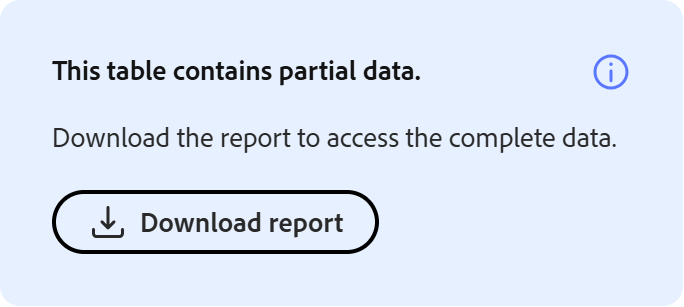

# O que é o Insights Agent?

O Insights Agent é um recurso viabilizado por IA no Adobe Learning Manager que permite que os administradores consultem dados de aprendizado usando linguagem natural. Em vez de baixar relatórios e manipular planilhas, você digita uma pergunta, como “Quantos cursos foram criados nos últimos 3 meses na conta? Dê-me um relatório mensal.” e o agente do Insights recupera e apresenta os dados diretamente. Você pode exibir os resultados como texto, marcadores ou tabelas, ou baixá-los como um arquivo CSV.

O Agente do Insights foi projetado para reduzir as etapas entre fazer uma pergunta sobre os dados e obter uma resposta. Os administradores que atualmente dependem de tabelas dinâmicas do Excel, equipes de BI ou vários relatórios combinados podem usar o Agente do Insights para obter respostas mais rapidamente.

## O que o Agente do Insights pode fazer

Você pode usar o Agente do Insights para:

- Verificar métricas de conclusão e conformidade por região, departamento ou grupo de usuários
- Analisar tendências de inscrição em cursos ou caminhos de aprendizado
- Exibir dados de progresso de um curso ou caminho de aprendizado específico

Cada consulta retorna uma tabela formatada ou um arquivo CSV para download, juntamente com uma explicação em linguagem simples de como os resultados foram calculados.

## O que o Data Insights Agent não suporta

Os seguintes tipos de dados estão fora do escopo do Agente do Insights atualmente:

- Comentários e dados da pesquisa
- Pontos e medalhas de gamificação
- Histórico de auditoria e logs de alteração

As consultas que referenciam esses tipos de dados não retornarão resultados. Por exemplo, “Quantos pontos de gamificação foram concedidos no último trimestre?” ou “Quais alunos receberam um emblema de conformidade?” retornará um erro ou dados incompletos.

## Como o Agente do Insights funciona

Quando você insere uma pergunta, o Agente do Insights a processa em quatro estágios:

1. **Interpretação**: o agente analisa sua pergunta para identificar quais dados são necessários. Se qualquer parte da pergunta for ambígua, o agente fará uma pergunta esclarecedora antes de continuar

2. **Abordagem**: o agente descreve as etapas necessárias para localizar sua resposta. Esta seção ajuda a verificar se os dados foram recuperados da maneira desejada, especialmente em consultas complexas.

3. **Resultados**: o agente apresenta seus dados como texto, marcadores ou uma tabela, dependendo da natureza dos resultados. Um resumo em linguagem simples é incluído com os resultados. Quando os resultados contiverem 50 ou menos linhas, o resumo incluirá insights analíticos sobre os dados. Quando os resultados contiverem mais de 50 linhas, o resumo fornecerá estatísticas em nível de coluna.

4. **Baixar**: você pode baixar os resultados como um arquivo CSV. Relatórios grandes podem levar mais tempo; o agente notifica quando o arquivo estiver pronto.

A seção **Abordagem** é particularmente útil para consultas complexas. Ela mostra a lógica que o agente usou, semelhante ao que um analista de BI explicaria se executasse a consulta manualmente. Revisar a abordagem ajuda a confirmar se o resultado é confiável antes de agir com ele.

## Fazer perguntas usando o Agente do Insights

Use o Agente do Insights no Adobe Learning Manager para consultar dados de aprendizado com perguntas simples e obter resultados como texto, tabelas ou arquivos CSV para download.

O Agente do Insights está disponível para administradores no painel Assistente do AI no Learning Manager. O painel é redimensionável. É possível expandi-lo para facilitar a leitura dos resultados. Por padrão, o modo **Obter Insights** é selecionado quando você abre o painel. Um modo separado do **Aprendizado** também está disponível para perguntas instrucionais sobre como usar o produto. O modo **Aprender** responde a perguntas instrucionais sobre como usar o Learning Manager. Por exemplo, “Como criar um caminho de aprendizado?” Ele não consulta dados do aluno.

### Fazer uma pergunta

Quando o modo **Obter Insights** estiver selecionado por padrão, você poderá começar imediatamente a consultar dados de aprendizado sem precisar ajustar o modo toda vez que acessar o assistente. No entanto, se você alternar para o modo **Aprender** para perguntas instrucionais, selecione novamente **Obter Insights** antes de enviar uma consulta.

1. Selecione o ícone do assistente do AI no Learning Manager para abrir o painel do assistente. A opção **Obter Insights** já está selecionada por padrão.

   

2. Digite sua pergunta no campo de texto. Usar linguagem simples. Por exemplo: **Quantos cursos foram criados nos últimos 3 meses?**

3. Selecione **Enviar** ou pressione **Enter** para enviar sua pergunta.

### Examinar a resposta

Depois de enviar sua pergunta, o Agente do Insights processa sua solicitação e retorna uma resposta com até quatro partes:

1. **Desambiguidade (se necessário):** se a sua pergunta contiver um termo ambíguo, como “atividade de aprendizado” ou “desempenho”, ou “Fornecer dados de desempenho dos últimos três meses”, o assistente exibirá uma lista de opções e solicitará que você selecione uma antes de continuar. Selecione a opção que melhor corresponde ao que você está procurando. Depois da pergunta inicial, não será possível digitar instruções adicionais. Selecionar entre as opções fornecidas é a única interação disponível até que você inicie uma nova consulta usando a interface de consulta. Você só pode responder à desambiguação selecionando uma das opções fornecidas; o acompanhamento de texto livre não está disponível nesta versão.

   

2. **Abordagem:** a seção **Abordagem** descreve as etapas que o agente realizou para recuperar seus dados. Aparece como um painel rolável abaixo da pergunta. Selecione o ícone de expansão para ver a abordagem completa. A revisão desta seção ajuda a confirmar se a lógica corresponde à sua intenção, especialmente em consultas complexas. Por exemplo, se você solicitar “todos os alunos inscritos no último ano”, o agente poderá retornar a inscrição mais recente de cada aluno em vez de cada registro de inscrição. A seção **Abordagem** explica as decisões tomadas pelo agente ao recuperar seus dados. Se a lógica não corresponder à sua intenção, inicie uma nova consulta com termos mais específicos.

   

3. **Resultados:** o Agente do Insights gera resultados como texto ou tabela. Para pontos de dados que são melhor interpretados em um formato tabular, o Agente do Insights retorna uma tabela. O Agente do Insights não gera gráficos. Para visualizar os dados, baixe o CSV e abra-o na ferramenta de sua preferência. Um resumo em linguagem simples é incluído com os resultados. Quando os resultados contiverem 50 ou menos linhas, o resumo incluirá insights analíticos sobre os dados. Quando os resultados contiverem mais de 50 linhas, o resumo fornecerá estatísticas em nível de coluna. Por exemplo, “Quais cursos não têm menos de 5 inscrições criadas no último ano e quem são os autores?”

   

E a resposta contém o seguinte resumo:

***Resumo***

- *Cursos correspondentes: 102*
- *Intervalo de contagem de registros: 24 a 2019*
- *Média de inscrições por curso correspondente: 589,6*
- *Inscrições medianas por curso correspondente: 553,5*

*Um link de download para o relatório completo será fornecido assim que a exportação estiver pronta.*

>[!NOTE]
>
>O formato do resumo varia de acordo com a natureza dos dados. Veja a seguir um exemplo de uma resposta resumida. Seu resumo real será diferente dependendo da consulta.

>[!NOTE]
>
>O agente do Insights é probabilístico. Se você executar a mesma consulta duas vezes, a frase da resposta ou a ordenação do resultado poderão ser ligeiramente diferentes.

### Baixar o relatório

Selecione **Baixar relatório** para exportar seus resultados como um arquivo CSV. Para conjuntos grandes de resultados, o download pode levar mais tempo. O agente exibe uma mensagem quando o arquivo está pronto; você também recebe uma notificação.

## Iniciar uma nova consulta

Cada sessão do agente do Insights lida com uma pergunta de cada vez. Depois de revisar seus resultados, selecione **Nova pergunta** para fazer uma pergunta diferente. Você também pode selecionar **Novo bate-papo** a qualquer momento, inclusive antes de receber uma resposta, se desejar abandonar a consulta atual e começar do zero. Você não pode digitar uma pergunta de acompanhamento na mesma sessão ou pedir ao agente para refinar ou expandir os resultados retornados.

>[!TIP]
>
>Se quiser explorar dados relacionados, inicie uma nova consulta que incorpore o que você aprendeu desde a primeira etapa. Por exemplo, depois de ver os totais de inscrição por região, inicie uma nova consulta para aprofundar-se nas regiões com baixo desempenho.

## Fornecer feedback

Após cada resposta, selecione o ícone de miniaturas para cima ou para baixo para classificar o resultado. Você também pode especificar se o resultado foi impreciso, difícil de entender ou se demorou muito para retornar. Esse feedback ajuda a melhorar o agente ao longo do tempo.

## Práticas recomendadas

- Comece com uma pergunta específica em vez de uma pergunta ampla. “Qual é a taxa de conclusão do curso de Treinamento em Segurança no grupo de usuários da América do Norte?” retorna resultados mais úteis do que \”Mostrar dados de conclusão.”
- Use termos exatos do Adobe Learning Manager ao nomear conteúdo e grupos de alunos. O guia de gravação de consultas lista os termos corretos a serem usados.
- Se o agente fizer uma pergunta esclarecedora, trate-a como um sinal para refinar sua consulta original da próxima vez. Quanto mais específica for a sua pergunta, menos esclarecimentos serão necessários.
- Revise a seção **Abordagem** antes de agir nos resultados para confirmar se a lógica do agente corresponde à sua intenção.
- **Especifique se deseja incluir alunos na lista de espera.** Por padrão, as consultas de contagem de inscrições retornam apenas os alunos com uma inscrição ativa confirmada - os alunos em lista de espera são excluídos, de acordo com a lista de alunos inscritos disponível na página do curso ou caminho de aprendizado. Se quiser que os alunos da lista de espera sejam incluídos na contagem, diga isso explicitamente em sua consulta. Por exemplo: “Quantos alunos estão inscritos diretamente no curso de treinamento de segurança, incluindo alunos na lista de espera?” A seção Abordagem indicará se os alunos da lista de espera foram incluídos nos resultados.
<!--
- **Specify whether to include or exclude waitlisted learners**. By default, enrollment count queries include learners who are on a waitlist alongside active, confirmed enrollments. If you need only active participants, explicitly exclude waitlisted learners in your query. For example: "How many learners are directly enrolled in the Safety Training course, excluding waitlisted learners?" The agent will disclose in the Approach section that the exclusion was applied. Without this instruction, enrollment totals may include a significant proportion of waitlisted learners who have not yet started the content.
-->
- **Contagens de inscrições diretas e indiretas**: ao consultar os dados de inscrição ou conclusão de um curso ou caminho de aprendizado, o Agente do Insights distingue entre inscrições diretas (alunos inscritos especificamente nesse curso ou caminho de aprendizado) e indiretas (alunos que acessaram o mesmo conteúdo como parte de um caminho de aprendizado ou certificação). Se você solicitar especificamente inscrições diretas ou indiretas, o agente retornará a contagem correta para cada tipo. Se sua consulta não especificar direta ou indireta, o agente pode retornar uma contagem combinada. Para obter contagens separadas, inclua a distinção explicitamente na sua consulta. Por exemplo: “Quantos alunos estão inscritos diretamente versus inscritos indiretamente no curso de treinamento de segurança?”

## Como o Insights Agent difere do Report Builder

Os dois recursos usam os mesmos dados de aprendizado subjacentes, mas funcionam de forma diferente. O agente do Insights é conversacional. Você descreve o que deseja e o agente o recupera. O Report Builder está estruturado. Você seleciona conjuntos de dados, colunas e filtros para criar relatórios reutilizáveis.

| **Caso de uso** | **Recomendação** |
|---|---|
| Faça uma pergunta rápida sobre dados | Agente de insights |
| Explore dados sem conhecer o esquema | Agente de insights |
| Criar um relatório estruturado e repetível | Criador de relatórios |
| Combine vários conjuntos de dados com junções personalizadas | Criador de relatórios |
| Agendar assinaturas de relatório | Criador de relatórios |
| Combine conjuntos de dados com junções personalizadas ou modelagem de dados avançada | Criador de relatórios |

## Gravar consultas eficazes para o Agente do Insights

A qualidade de sua consulta afeta diretamente a qualidade dos resultados que o Agente do Insights retorna. Uma consulta bem-formada inclui três ingredientes: contexto, por exemplo, qual conteúdo e quais alunos, escopo, por exemplo, status, intervalo de tempo e estado do usuário, e colunas, por exemplo, os campos exatos que você deseja na saída. Saiba como usar a terminologia, a estrutura de consultas e as consultas de exemplo corretas como pontos de partida.

### A fórmula de consulta em três partes

Cada consulta efetiva do Agente do Insights contém estes três componentes:

| **Componente** | **O que pode significar** | **Exemplo** |
|---|---|---|
| **Contexto** | O conteúdo e os alunos sobre os quais você está perguntando | “...o caminho de aprendizado Nova contratação integrada, para alunos associados a vendas no local 101...” |
| **Escopo** | Status de inscrição, intervalo de tempo e estado do usuário | “...inscritos, mas ainda não concluídos, nos últimos 90 dias...” |
| **Colunas** | Cada campo desejado na saída | “...mostrar nome, email, local e data de inscrição” |

A ausência de qualquer um desses componentes pode levar a resultados ambíguos ou a uma pergunta esclarecedora por parte do agente.

### Use os termos corretos do ALM

O Agente do Insights corresponde sua consulta ao modelo de dados da Adobe Learning Manager. O uso do termo errado pode retornar resultados incorretos ou nenhum resultado. Use os termos na coluna à esquerda abaixo.

| **Usar este termo** | **Não** |
|---|---|
| **Caminho de Aprendizado** | Programa/curso/currículo |
| **Curso** | Módulo/classe/lição |
| **Certificação** | Medalha/certificado |
| **Aluno** | Aluno/funcionário |
| **Sessão** | Classe/data programada |
| **Grupo de usuários** | Equipe/departamento/coorte |
| **Campo ativo** | Campo/atributo personalizado |
| **Inscrição** | Registro/atribuição |
| **Conclusão** | Concluído/concluído/aprovado |
| **Etiqueta de catálogo** | Categoria/grupo de tags |

O Agente do Insights não diferencia maiúsculas de minúsculas, mas a correspondência exata de termos aumenta a precisão.

### Consultar usando a terminologia personalizada da sua organização

Se o administrador renomeou termos padrão usando Terminologia do Produto em **Configurações > Geral**, o Agente do Insights reconhece os termos personalizados da sua organização no lugar dos padrões listados acima. Por exemplo, se sua organização renomeou o **Curso** para **Capítulo**, você poderá perguntar “Quantos capítulos foram concluídos no mês passado?” e o Insights Agent entende a pergunta e rotula os resultados usando **capítulos** nos cabeçalhos de resposta e coluna.

A terminologia personalizada se aplica em qualquer lugar dentro da janela de bate-papo do Insights Agent, incluindo como a sua consulta é interpretada, a explicação da abordagem, o resumo dos resultados e os cabeçalhos de tabela ou coluna mostrados no bate-papo. **O arquivo CSV baixado não reflete a terminologia personalizada.** Os cabeçalhos e o conteúdo das colunas no arquivo exportado usam os termos padrão do Adobe Learning Manager, independentemente de como sua organização os personalizou.

- O Agente do Insights reconhece as formas singular e plural de um termo personalizado, conforme configurado no arquivo CSV da Terminologia do produto.
- Você ainda pode usar o termo padrão do Adobe Learning Manager em sua consulta mesmo depois que sua organização o personalizar. O Agente do Insights reconhece o termo padrão e responde usando o termo personalizado da sua organização. Por exemplo, se sua organização renomeou o **Curso** para **Capítulo**, você ainda poderá perguntar “Quantos capítulos foram concluídos no mês passado?” usando o termo original. O Agente do Insights entende a pergunta e responde usando o termo personalizado da sua organização, **capítulos**, na resposta.
- Se a sua consulta incluir um termo com ortografia incorreta ou não reconhecido, o Agente do Insights fará uma pergunta esclarecedora e sugerirá o termo ou termos correspondentes mais próximos disponíveis em sua conta.
- Se o administrador redefinir a terminologia personalizada, o Agente do Insights não reconhecerá mais os termos personalizados anteriormente e reverterá para os termos padrão.

>[!NOTE]
>
>O suporte à terminologia personalizada não se estende aos módulos e guias que o agente do Insights não consulta atualmente, como Aprendizado social, Ajudas de tarefa, Fórum de discussão, Gamificação e Comunicados.

<!--
### Query using your organization's custom terminology

If your administrator has renamed standard terms using **Product Terminology** in **Settings** > **General**, Insights Agent recognizes your organization's custom terms in place of the defaults listed above. For example, if your organization renamed **Module** to **Training**, you can ask "How many Trainings were completed last month?" and Insights Agent understands the question and labels the results using **Training** in the response and column headers.

- Insights Agent recognizes both the singular and plural forms of a custom term, as configured in the Product Terminology CSV file.
- You can still use the default Adobe Learning Manager term in your query even after your organization customizes it. Insights Agent recognizes the default term and responds using your organization's custom term.
- If your query includes a misspelled or unrecognized term, Insights Agent asks a clarifying question and suggests the closest matching term available in your account.
- If your administrator resets the custom terminology, Insights Agent no longer recognizes the previously customized terms and reverts to the default terms.

>[!NOTE]
>
>Custom terminology support does not extend to modules and tabs that Insights Agent does not currently query, such as Social Learning, Job Aids, Discussion Forum, Gamification, and Announcements.
-->

### Ancorar seu conteúdo

Fornecer uma âncora de conteúdo ajuda o agente a saber quais itens de aprendizado examinar. É possível ancorar por qualquer uma das seguintes opções:

| **Tipo de âncora** | **Exemplo** |
|---|---|
| Nome | “...o caminho de aprendizado Integração de Novas Contratações” |
| Catálogo | “...todos os caminhos de aprendizado no catálogo de integração” |
| Etiqueta de catálogo | “...todos os cursos em que a etiqueta de catálogo Region = North” |
| Etiqueta | “...todos os cursos rotulados Conformidade” |
| Habilidade | “...todos os cursos mapeados para a habilidade no Atendimento ao cliente” |
| Rótulo de conformidade | “...todas as certificações com rótulo de conformidade” |
| Tipo de conteúdo | “...todos os cursos publicados” / “...todas as certificações” |

### Ancorar os alunos

Se uma consulta estiver relacionada a um aluno, use um destes métodos:

- **Valor de campo ativo** — “alunos em que campo ativo Cargo = Associado de Vendas” ou “alunos em que campo ativo Local = 101”
- **Grupo de usuários** — “alunos no grupo de usuários Associados de Vendas”
- **Sessão** — “alunos inscritos na sessão de 15 de junho do curso de Segurança do Local de Trabalho”

### Defina seu escopo

A omissão dos detalhes do escopo pode levar a resultados mais amplos do que o pretendido.

| **Tipo de escopo** | **Opções** |
|---|---|
| Status da inscrição | inscrito/concluído/não inscrito/vencido |
| Intervalo de tempo | todas as horas / últimos 30 dias / últimos 90 dias / intervalo de datas específico |
| Estado do usuário | somente usuários ativos (padrão) / adicionar “incluir usuários excluídos” para inativos |

### Nomear cada coluna de saída

Se você não especificar colunas, o Agente do Insights as escolherá para você. Nomeie cada campo desejado na saída.

| **Vago** | **Específico** |
|---|---|
| “Mostrar números de localização” | “Para cada local: total de alunos, contagem de inscritos, contagem de não inscritos” |
| “Mostrar taxas de conclusão” | “Para cada caminho de aprendizado: nome, total inscrito, total concluído, % de conclusão” |
| Mostre-me quem falhou | “Mostrar nome do aluno, e-mail, nome do curso e status de conclusão dos alunos que falharam” |

### Consultas de exemplo

Use-os como ponto de partida. Adapte-os substituindo os nomes de conteúdo, grupos de usuários e intervalos de tempo que se aplicam à sua conta.

**Conclusão e conformidade**

- “Qual é a taxa de conclusão do curso de Treinamento em Segurança no grupo de usuários da América do Norte?”
- “Mostrar a taxa de conclusão por grupo de usuários para todos os cursos de conformidade. Inclua o nome do grupo de usuários, o total inscrito, o total concluído e a porcentagem de conclusão.”
- “Qual é a taxa de conformidade para todos os alunos em que o campo ativo Cargo = VP?”

**Análise de registro**

- “Quantos alunos estão inscritos no caminho de aprendizado Integração de Novas Contratações, por local?”
- “Mostrar inscrições por região para os últimos 90 dias. Inclua o nome da região e a contagem de inscrições.”
- “Liste todos os alunos inscritos no curso de Segurança no local de trabalho, mas ainda não concluídos — inclua o nome, o email e a data de inscrição.”

**Progresso do programa e do curso**

- “Qual é a divisão do status de conclusão do caminho de aprendizado Desenvolvimento de liderança? Mostrar contagens concluídas, em andamento e não iniciadas.”
- “Quantos alunos concluíram o curso de privacidade de dados no mês passado?”

**Exibições organizacionais**

- “Mostrar taxa de conclusão para todas as certificações rotuladas como de tipo de conformidade, agrupadas por departamento. Inclua o nome do departamento, o total de inscrições e a porcentagem de conclusão.”
- “Qual é a distribuição de matrículas por região nos últimos 30 dias?”

### Erros comuns a serem evitados

| **Evitar** | **Em vez disso, faça isso** |
|---|---|
| Sem âncora de conteúdo (”mostre-me tudo”) | Nomeie o caminho, curso, catálogo, tag ou habilidade específico |
| Métrica vaga (”por que as conclusões são baixas?”) | Faça uma pergunta mensurável: “Quais programações de aprendizado têm taxa de conclusão abaixo de 30%, por local?” |
| Estado de usuário não especificado | Adicionar “somente usuários ativos” ou “incluir usuários excluídos” explicitamente |
| Pedir previsões | Perguntar o que os dados atuais mostram, não o que acontecerá |
| Perguntar sobre dados não compatíveis (feedback, habilidades, medalhas) | Usar relatórios existentes na seção Relatórios |
| Fazer várias perguntas em uma consulta (”Mostrar inscrições por região e também listar quem não concluiu o Treinamento de Segurança”) | Faça uma pergunta direcionada por consulta. O agente pode responder apenas parte de uma consulta composta, sem nenhuma garantia de que o restante seja tratado. |

## Limitações na versão

**Não há suporte para consultas enviadas em scripts não latinos**

O Agente do Insights oferece suporte a consultas escritas em idiomas do alfabeto inglês e latino, como francês e espanhol. As consultas enviadas usando scripts não latinos, incluindo japonês, chinês, árabe, coreano, hindi e russo, não são processadas. O agente exibirá uma mensagem indicando que a consulta não pôde ser concluída. Se você enviar uma consulta em um desses idiomas, inicie uma nova consulta e a reformule em inglês.
