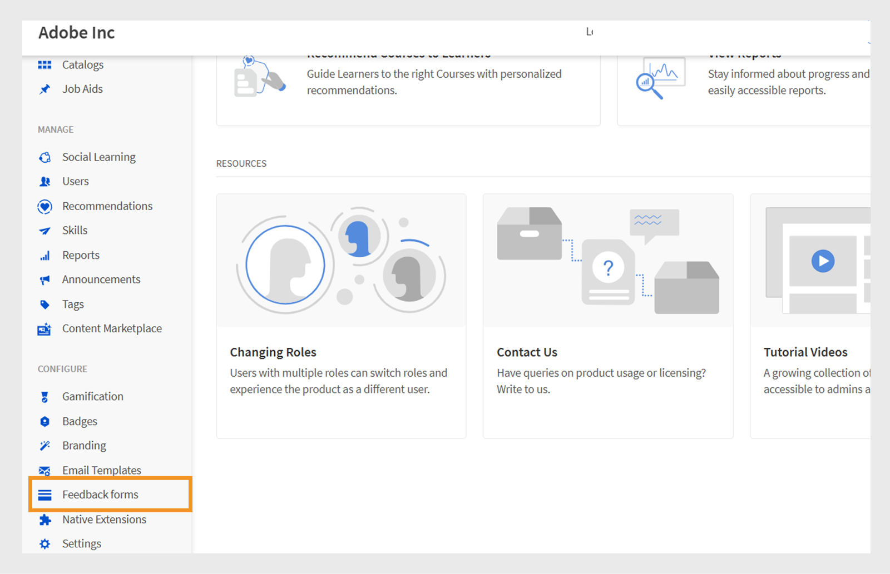
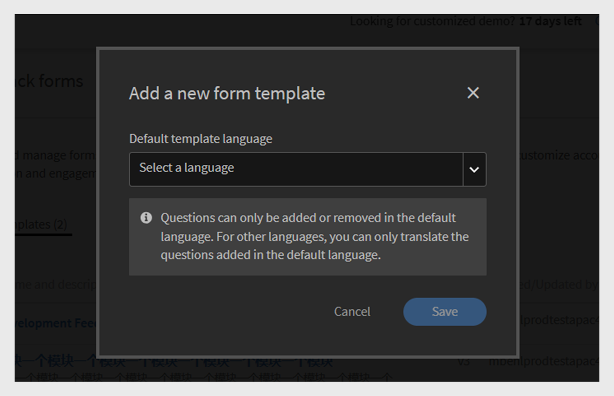
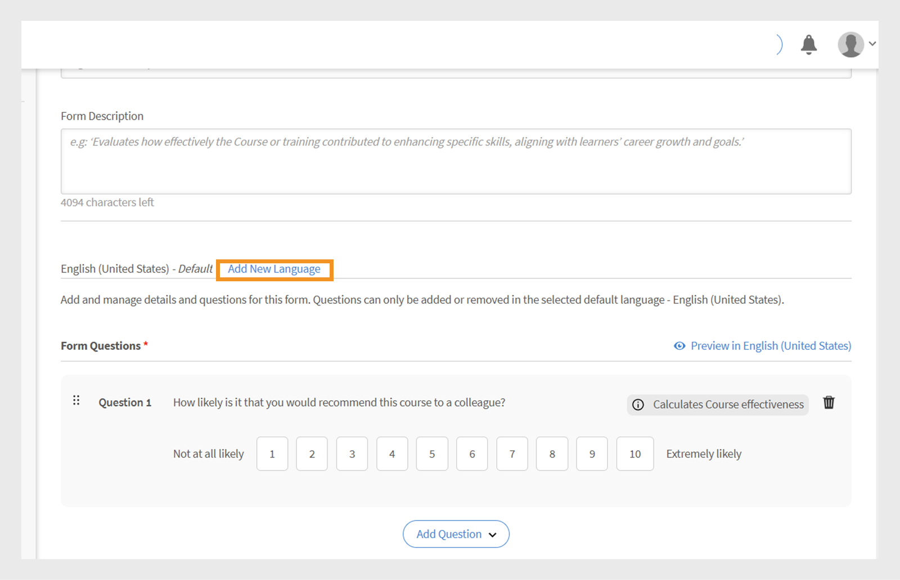
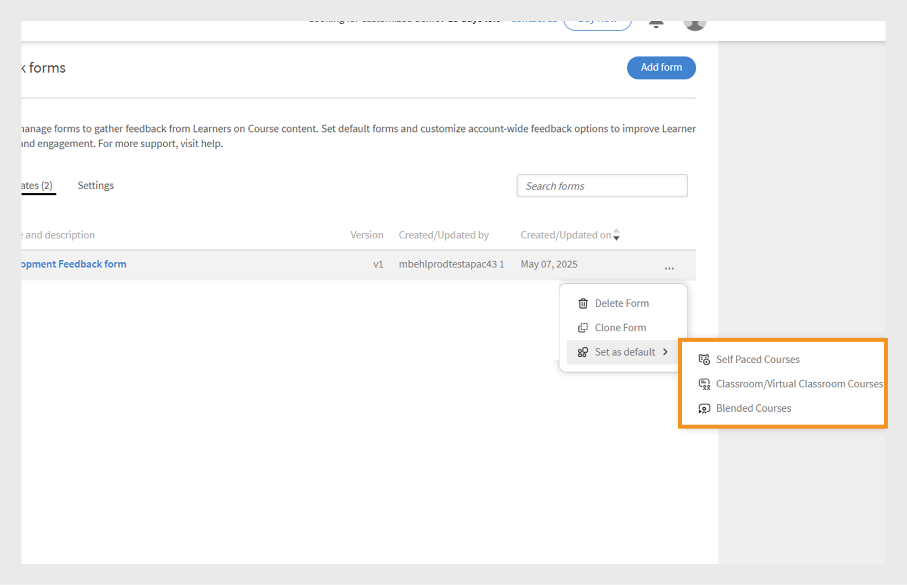

# Formulário de feedback L1

>[!IMPORTANT]
>
>O recurso aprimorado Feedback N1 está sendo lançado para clientes selecionados. Se você não vir esse recurso em sua conta, Exiba [Adicionar feedback N1 e N3](/help/migrated/administrators/feature-summary/courses.md#add-l1-and-l3-feedback) para obter mais informações sobre o recurso de feedback existente.
>
>Entre em contato com sua equipe de gerente de sucesso do cliente (CSM) para ativar o novo sistema de feedback e saber mais sobre o cronograma da migração.

O recurso de feedback de Nível 1 (L1) no Adobe Learning Manager permite que os alunos compartilhem seus comentários após concluírem um curso ou caminho de aprendizado. Esse feedback ajuda os administradores a avaliar a qualidade do curso, a eficácia do professor e a experiência de aprendizado geral.

Agora, os administradores podem criar e gerenciar vários formulários de feedback reutilizáveis e atribuí-los a cursos e caminhos de aprendizado específicos.

O recurso fornece maior flexibilidade, permitindo que os administradores:

* Criar formulários de feedback reutilizáveis
* Personalizar feedback para diferentes cursos ou programações de aprendizado
* Atribua formulários personalizados conforme necessário

O **[!UICONTROL Relatório de Comentários N1]** e o **[!UICONTROL Relatório de Comentários]** (Relatório Personalizado) agora incluem duas novas colunas: Nome do Formulário de Comentários e Versão de Comentários. Estas colunas fornecem detalhes sobre os formulários de feedback usados.

## Criar formulário de feedback L1

Os administradores podem criar vários formulários de feedback L1 no nível da conta e atribuir o formulário certo a um curso, caminho de aprendizado ou certificação.

Para criar um formulário de feedback L1:

1. Faça logon no Adobe Learning Manager como administrador.
2. Selecione **[!UICONTROL Formulários de comentários]**.

   
   _Página inicial do administrador exibindo a opção de formulários de Comentários para criar e gerenciar formulários de comentários_
3. Selecione **[!UICONTROL Adicionar formulário]**.

   
   _Tela de formulários de comentários exibindo o botão Adicionar formulário para criar os formulários de Comentários_
4. Escolha o **[!UICONTROL Idioma padrão do modelo]** e selecione **[!UICONTROL Salvar]**.

   
   _Adicionar novo prompt de modelo mostrando a opção de selecionar o idioma padrão_
5. Digite o título e a descrição do formulário.

   
   _Adicionar página de formulário de comentários exibindo opção digite o Título do Formulário e a Descrição do Formulário_
6. No menu **[!UICONTROL Adicionar pergunta]**, selecione um tipo de pergunta entre os seguintes:

   a. **[!UICONTROL Texto livre]**: permite que os alunos forneçam respostas em suas próprias palavras.

   * Digite sua pergunta no campo de texto **[!UICONTROL Pergunta]**.
   * Para tornar a pergunta obrigatória, selecione a alternância **[!UICONTROL Obrigatória]**.
     
     _Adicionar uma pergunta de texto livre ao formulário de comentários_

   b. **[!UICONTROL Escala numérica/NPS]**: os alunos podem classificar a satisfação ou a probabilidade do curso ao recomendar o curso usando uma escala numérica (geralmente de 1 a 10).

   * Digite sua pergunta no campo de texto **[!UICONTROL Pergunta]**.
   * Selecione o intervalo de classificação (1 a 10).
   * Para tornar a pergunta obrigatória, selecione a alternância **[!UICONTROL Obrigatória]**.
     \
     _Adicionar uma pergunta sobre escala numérica/NPS ao formulário de comentários_

   c. **[!UICONTROL Escala Likert]**: os alunos podem especificar o quanto concordam com uma instrução, de Discordo totalmente para Concordo totalmente.

   * Digite sua pergunta no campo de texto **[!UICONTROL Pergunta]**.
   * Para tornar a pergunta obrigatória, selecione a alternância **[!UICONTROL Obrigatória]**.
     
     _Adicionar uma pergunta da Escala Likert ao formulário de comentários_

   d. **[!UICONTROL Pontuação de eficácia do curso]**: uma escala para medir a eficácia com que um curso influencia os alunos, usando um sistema de classificação relativo.

   * Uma pergunta predefinida com uma escala Likert de 1 a 10 será adicionada ao formulário de feedback.
   * Você pode adicionar apenas uma pergunta de **[!UICONTROL Pontuação de eficácia do curso]** e ela não pode ser editada
     
     _Adicionar pergunta de pontuação de eficácia do curso ao formulário de feedback_
7. Selecione **[!UICONTROL Salvar]**. É possível visualizar os formulários criados na seção Forms de feedback.

### Visualizar o formulário de feedback

Você pode visualizar o formulário de feedback selecionando Visualizar em inglês (Estados Unidos). Se tiver criado o formulário em vários idiomas, você também poderá visualizá-lo em cada um dos respectivos idiomas. Exiba esta [seção](/help/migrated/administrators/feature-summary/l1-feedback-form.md#add-feedback-forms-in-other-languages) para saber como adicionar formulários de comentários em outros idiomas.

_Tela de formulários de comentários exibindo a opção de visualização para exibir o formulário de comentários no idioma padrão_

### Adicionar formulários de feedback em outros idiomas

Crie traduções para as perguntas no formulário de feedback em vários idiomas. No entanto, você só pode adicionar ou remover perguntas no idioma padrão (como inglês). Para outros idiomas, você só pode traduzir as perguntas que foram adicionadas inicialmente no idioma padrão. Não é possível adicionar ou remover perguntas diretamente nas versões traduzidas.

1. Selecione **[!UICONTROL Adicionar Novo Idioma]** no formulário de comentários.

   
   _Adicionar uma nova versão de idioma ao formulário de comentários_
2. Escolha o idioma desejado e selecione **[!UICONTROL Salvar]**.
3. Navegue até a guia do idioma adicionado.
4. Selecione **[!UICONTROL Traduzir]** ao lado de cada pergunta para adicionar sua tradução.

   
   _Tela de formulário de comentários exibindo a opção Traduzir para traduzir as perguntas nos respectivos idiomas_

   >[!NOTE]
   >
   >A pergunta de Pontuação de eficácia do curso é convertida automaticamente.

5. Após adicionar as traduções, selecione **[!UICONTROL Salvar]**.

## Definir um formulário de feedback como padrão

Os administradores podem estabelecer formulários de feedback padrão para cursos em ritmo individualizado, sala de aula, sala de aula virtual e cursos mistos. Depois que um formulário padrão é definido, ele é aplicado automaticamente a todos os cursos recém-criados. Os alunos verão este formulário após concluírem qualquer curso. Os administradores podem atribuir um formulário de feedback diferente para cursos específicos, se necessário.

_Tela de formulários de feedback exibindo a opção de definir o formulário de feedback padrão_

## Definir configurações de feedback do aluno

Os administradores podem definir as seguintes configurações na seção Feedback do aluno:

* **[!UICONTROL Habilitar formulário para capturar o feedback dos alunos para este curso]**: habilite esta opção para coletar feedback dos alunos para o curso. Quando ativado, os alunos serão solicitados a fornecer feedback após concluir o curso.
* **[!UICONTROL Configuração do formulário]**: quando ativado, o formulário de feedback é aberto automaticamente para os alunos imediatamente após a conclusão do curso, facilitando a coleta de feedback pontual.

_Tela de comentários do aluno exibindo as configurações de feedback do aluno_

>[!NOTE]
>
>As instâncias do curso usam o formulário de feedback padrão no nível do curso. Ao criar novas instâncias, elas também usam o formulário padrão do nível do curso, em vez do nível da conta.

### Alterar o formulário de feedback padrão de um curso

O formulário de feedback padrão se aplica a todos os cursos. Como administrador, você pode criar um novo formulário ou escolher um da lista existente. Para alterar os formulários de feedback padrão, o feedback do aluno deve estar ativado para este curso.

Para alterar o formulário de feedback padrão:

1. Selecione **[!UICONTROL Cursos]** na página inicial do administrador.
2. Selecione qualquer curso na seção **[!UICONTROL Curso]**.
3. Selecione **[!UICONTROL Exibir curso]** e selecione **[!UICONTROL feedback do aluno]**.

   
   _As telas de comentários do aluno mostram a opção Editar para alterar o formulário_
4. Selecione **[!UICONTROL Editar]** na seção **[!UICONTROL Comentários do aluno]**,.
5. Selecione **[!UICONTROL Alterar formulário]**.

   
   _As telas de comentários do aluno mostram a opção Alterar formulário para alterar o formulário de comentários do curso_
6. Escolha outro formulário de comentários no menu ou selecione **[!UICONTROL Começar com um formulário em branco]** para criar um novo.

   
   _Adicionar uma tela de formulário exibindo a opção de selecionar do modelo disponível ou criar novo formulário_
7. Selecione **[!UICONTROL Salvar]** para aplicar suas alterações.

Se um curso estiver usando o formulário de feedback padrão e o formulário padrão for atualizado no nível da conta, todos esses cursos refletirão automaticamente o novo formulário. No entanto, se um administrador alterar o formulário ou atribuir um novo formulário no nível do curso, as alterações futuras no formulário padrão não afetarão o formulário de feedback desse curso.

A instância usará o formulário de feedback no nível do curso como padrão. Se um administrador alterar o formulário de feedback no nível do curso, ele não afetará o formulário já definido no nível da instância. No entanto, qualquer nova instância criada após a alteração usará o formulário atualizado de feedback no nível do curso por padrão.

Siga as mesmas etapas para alterar os formulários de feedback padrão de um caminho de aprendizado.

>[!NOTE]
>
>Se você não alterar o formulário, o curso usará o formulário de feedback padrão.

