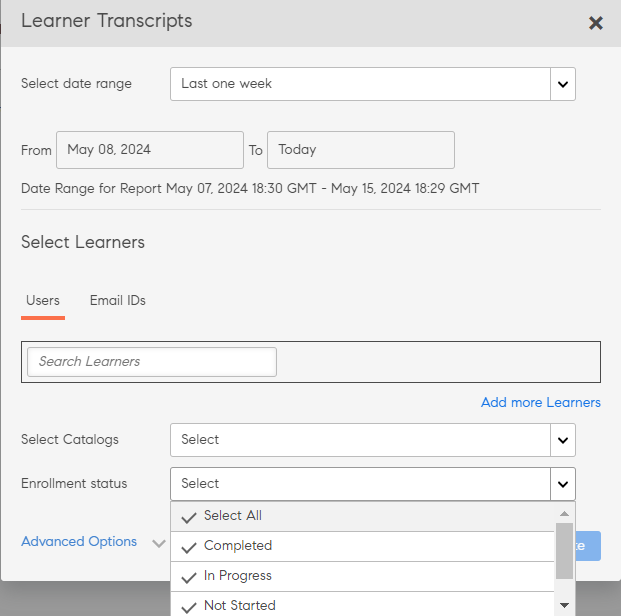

# Transcrições do aluno

Baixar transcrição do aluno e gerenciar relatórios usando o Learning Manager.

O Adobe Learning Manager permite que os administradores de uma empresa gerem transcrições associadas aos alunos.

## Gerar transcrições do aluno {#generatelearnertranscripts}

1. Para gerar transcrições do aluno, clique em **[!UICONTROL Relatórios]** no painel esquerdo de logon do administrador.

   O administrador navega até a guia **[!UICONTROL Relatórios Personalizados]** > **[!UICONTROL Relatórios do Excel]** dentro da página **[!UICONTROL Relatórios]**.

1. Clique no link **[!UICONTROL Transcrições do aluno]**.

   A página de histórico **[!UICONTROL Transcrição do aluno]** é exibida com a mensagem- **Nenhuma transcrição do aluno foi gerada ainda** ou uma lista de downloads que foram acionados após a implementação da página de histórico de transcrições de aprendizado.

   <!---->

   É exibida a caixa de diálogo Transcrições do aluno. Escolha o intervalo de datas das quais você precisa que a transcrição seja gerada.

   >[!NOTE]
   >
   >Por padrão, a data inicial é a data de registro do aluno e a data final é sempre a data atual. É possível modificar apenas a data inicial a partir de quando você precisa dos dados.

1. Escolha os nomes dos alunos no campo **[!UICONTROL Selecionar alunos]** e clique em **[!UICONTROL Gerar].**
1. É possível escolher um único aluno ou grupos de alunos. Para adicionar mais de um aluno, clique em **[!UICONTROL Adicionar novos alunos]**

   

   *Adicionar mais alunos*

1. Você pode escolher catálogos específicos ativando a caixa de seleção. Somente a transcrição dos catálogos especificados é baixada. Você pode escolher catálogos específicos selecionando o catálogo na lista suspensa **[!UICONTROL Selecionar catálogos]**.

   

1. Ao exportar transcrições do aluno, há uma opção **[!UICONTROL Status de inscrição]**. Essa lista suspensa contém as seguintes opções:

   * Selecionar tudo
   * Concluído
   * Em andamento
   * Não iniciado
   * Não inscrito

   

   *Selecionar o catálogo*

1. Você também pode baixar as transcrições dos alunos que foram excluídos de uma conta.

   Para baixar as transcrições dos alunos de usuários excluídos, clique na seta **[!UICONTROL Opções Avançadas]** e habilite a caixa de seleção **[!UICONTROL Incluir dados de alunos excluídos]**.

   

   *Baixar transcrições de alunos excluídos*

1. Você pode optar por baixar as informações de nível do módulo na transcrição do aluno ao habilitar a caixa de seleção “**[!UICONTROL Habilitar informações de nível do módulo]**”. Nesse caso, os nomes dos módulos e o tempo gasto em cada módulo são obtidos como parte da transcrição, se esta opção estiver ativada.
1. Você pode optar por baixar dados de habilidades e folhas de resumo habilitando a opção “**[!UICONTROL Incluir dados de habilidades e folhas de resumo]**”.

   As transcrições são geradas e baixadas no computador como arquivos .zip quando os dados da habilidade não estão incluídos. Se a caixa de seleção de dados sobre habilidades estiver marcada, as transcrições são geradas e baixadas em arquivos .xls.

## Gerar transcrição do aluno usando copiar e colar

Obter transcrições do aluno se torna um processo tedioso, pois podem ser obtidas apenas para um aluno ou grupo de usuários, um de cada vez. Aqui, com o recurso copiar e colar, você pode copiar a lista de IDs de e-mail do aluno e colá-la de uma só vez.

1. Faça logon como **[!UICONTROL Administrador]** ou **[!UICONTROL Gerente]**.
1. Vá para **[!UICONTROL Relatórios]** em **[!UICONTROL Gerenciar]**. Isso carrega a página **[!UICONTROL Atividade do Usuário]**.
1. Clique em **[!UICONTROL Relatórios Personalizados]** no painel esquerdo e selecione **[!UICONTROL Transcrições do aluno]** na lista.
1. Na página **[!UICONTROL Transcrições do aluno]**, clique no botão **[!UICONTROL Gerar novo]** no canto superior esquerdo.
1. Selecione as datas preferenciais clicando no menu suspenso **[!UICONTROL Selecionar intervalo de datas]**. Clique na guia **[!UICONTROL IDs de email]** para inserir a lista copiada de IDs de email exclusivas.

   

   *Copiar e colar IDs de email*

1. Use **[!UICONTROL Validar IDs de e-mail]** para verificar se a ID inserida está correta.

   

   *Validar as IDs de email*

   Caso a ID de e-mail inserida esteja incorreta, ela será destacada em vermelho juntamente com uma mensagem de validação como acima.

   O Botão **[!UICONTROL Gerar]** não estará disponível a menos que todas as IDs de email inseridas estejam corretas.

   

   *Gerar as transcrições do aluno*

1. Clique no botão **[!UICONTROL Gerar]** para gerar transcrições do aluno para todas as IDs de e-mail mencionadas. Você receberá uma mensagem de confirmação, como abaixo, informando a geração do relatório.

   

   *Mensagem de confirmação do relatório sendo gerado*

   Gerar transcrições do aluno pode ser combinado para IDs de e-mail inseridas na guia **[!UICONTROL Usuários]** e **[!UICONTROL IDs de e-mail]**.

## Histórico de downloads da transcrição do aluno {#ltdownload}

Na página de download da **[!UICONTROL Transcrição do aluno]**, para gerar um relatório, ao clicar no botão **[!UICONTROL Gerar nova]**, a caixa de diálogo Transcrições do aluno é exibida.

*Gerar um relatório de todas as transcrições do aluno*

Clique em **[!UICONTROL Opções Avançadas]** e expanda o painel.

Escolha os usuários e o catálogo ao qual pertencem. Depois de clicar no botão **[!UICONTROL Gerar]**, é exibida uma caixa de diálogo que exibe o tempo aproximado para baixar o relatório. Para gerar o relatório, clique em **[!UICONTROL Gerar]**.

*Selecione o botão Gerar*

A transcrição é gerada em segundo plano e você pode continuar com suas tarefas no Learning Manager. Depois que a transcrição é gerada, você pode baixar a transcrição da lista.

Como administrador, você pode exibir todas as transcrições geradas por qualquer pessoa no sistema.

*Exibir histórico de downloads*

A lista de download exibe os seguintes atributos:

* **Alunos:** os alunos/grupos de alunos cujas transcrições devem ser baixadas.
* **Dados adicionais incluídos:** depende dos dados adicionais que o administrador deseja baixar da opção Avançado na caixa de diálogo modal Adicionar transcrição do aluno
* **Status:** Baixado, enfileirado ou em andamento.
* **De** e **Para**: duração das transcrições a serem baixadas.
* **Filtros aplicados:** se você aplicou os filtros para Status de inscrição.
* **Gerado por:** a ID do usuário do Learning Manager que solicitou o download.
* **Status:** Baixado, enfileirado ou em andamento.

Você pode cancelar o download a qualquer momento. Se um trabalho for cancelado pelo administrador, o Learning Manager enviará uma notificação no aplicativo ao usuário que acionou a transcrição do aluno.

*Fila de download da transcrição do aluno*

Você pode **cancelar** o download a qualquer momento. Se uma tarefa for cancelada, o Learning Manager enviará uma notificação no aplicativo ao usuário que cancelou a tarefa.

## Dados de alunos excluídos {#dataofdeletedlearners}

Você pode incluir os dados dos alunos excluídos na lista Transcrição do aluno. Na caixa de diálogo Transcrições do aluno, ative a opção **[!UICONTROL Incluir dados de alunos excluídos]**.

Depois de ativar a opção e clicar em **[!UICONTROL Gerar]**, os dados dos alunos excluídos aparecem na página de download Transcrição do aluno, conforme mostrado abaixo:

*Exibir dados de alunos excluídos*

## Personalizar colunas {#customize-columns-lt}

Um administrador pode personalizar as colunas exportadas em um relatório de transcrição do aluno. Administradores, administradores personalizados e gerentes podem configurar as colunas antes de exportar o relatório.

Na caixa de diálogo **[!UICONTROL Transcrições do aluno]**, clique em **[!UICONTROL Opções Avançadas]**. Na seção **[!UICONTROL Configurar Formato de Exportação]**, escolha as colunas que deseja exportar.

*Personalizar colunas para exportar*

A personalização é permitida somente quando um usuário baixa a transcrição do aluno no formato .CSV. Quando baixada no formato .XLSX, a seleção de preferência de coluna não será honrada e todas as colunas padrão serão exportadas.

## Conteúdo do arquivo de transcrição do aluno {#learnertranscriptfilecontent}

Um arquivo típico de transcrição do aluno consiste em seis planilhas do Excel em um único arquivo. As folhas de transcrição do aluno fornecem uma visão geral dos dados, incluindo o número de alunos envolvidos por curso, suas habilidades, a porcentagem de conclusão com base no curso ou aluno e um painel de conformidade. Estes são os painéis disponíveis nas transcrições do aluno:

**Transcrição do aluno**

Na planilha do Excel de transcrição do aluno, junto com os detalhes do perfil sobre o aluno, são fornecidos detalhes recomendáveis de realização do objeto de aprendizado, como data de inscrição, data inicial, classificação alcançada, pontuação obtida no questionário. Se os cursos fizerem parte de qualquer programa de aprendizado, eles serão listados separadamente, além dos detalhes individuais de consumo do curso.

**1 - Painel da atividade de aprendizado**

Nesse painel específico do objeto de aprendizado, é possível ver o número de alunos de cada curso, programa de aprendizado ou certificação. Você pode visualizar a planilha de progresso dos alunos de um objeto de aprendizado específico. Esta página exibe dados como o número de alunos que concluíram o curso ou o programa de aprendizado, os alunos em andamento e as datas de vencimento dos alunos.

O progresso dos usuários para o curso especificado é calculado com base nos Campos de entrada, onde você especifica os limites da porcentagem da data de vencimento e do progresso. Por exemplo, se você especificar 7 dias e 70% como valores no campo de entrada, é exibido o progresso do curso para os cursos vencidos em 7 dias, e para os cursos que têm mais de 70% de progresso. Você também pode alterar o período nesta planilha, na qual os dados modificados são automaticamente exibidos nesse painel.

**2 - Painel da atividade de aprendizado**

Esse painel de aprendizado exibe os dados de um usuário específico. Nesse painel, é possível visualizar os tutoriais, os programas de aprendizado ou as certificações em que um determinado usuário se inscreveu. A tabela também exibe os dados sobre os objetos de aprendizado concluídos pelo usuário, os objetos de aprendizado em andamento e as próximas datas de vencimento do usuário.

O progresso dos usuários para cada curso é calculado com base nas entradas que você especificar. Isto é, os valores de porcentagem da data de vencimento e do progresso. Por exemplo, se você especificar 7 dias e 70% como valores no Campo de entrada, é exibido o progresso de cursos diferentes para os cursos vencidos em sete dias, e para os cursos que têm mais de 70% de progresso.

**Habilidade**

Na planilha Habilidades, são fornecidos o nome e o nível de habilidade, os créditos exigidos, os créditos necessários, a porcentagem de conclusão e outros detalhes do perfil. Para referência, é fornecido abaixo um instantâneo de exemplo da planilha do Excel de habilidades.

*Amostra da planilha de habilidades do Excel*

**1 - Painel de habilidade**

Nesse painel, é possível ver se a sua organização está equipada em várias habilidades. No caso de uma habilidade específica, você pode verificar o número de usuários de uma empresa que deve ter essa habilidade em comparação com o número de usuários que realmente possui essa habilidade. Esse painel também especifica os usuários que precisam atualizar suas habilidades. Esse valor é calculado com base na entrada inserida no campo de entrada. Por exemplo, se você inserir 50 dias como entrada, o painel fornece dados sobre os usuários que precisam atualizar suas habilidades após o período de 50 dias.

**2 - Painel de habilidade**

Este painel de habilidades é mais específico do usuário. É possível filtrar um usuário específico ou vários usuários e visualizar seu nível de habilidade como um painel. Esta página pode ajudar os gerentes e administradores a controlarem o grau de habilidade de cada aluno em comparação ao que se espera dele. O painel Habilidade também ajuda a identificar os alunos que precisam atualizar suas habilidades. A lista de atualização de alunos é calculada com base no número de dias inserido no campo de entrada.

**Painel de conformidade**

O painel de conformidade tem duas partes: relatório de conformidade por usuário e relatório de conformidade por treinamento. No relatório baseado em usuário, você pode usar o painel de conformidade para controlar os usuários cujas datas de vencimento de iniciativas importantes de conformidade estão próximas. No relatório baseado em treinamento, você pode filtrar por certificação ou programa de aprendizado.

Em ambos os relatórios de conformidade, filtre pela data de vencimento para ver os dados apropriados.

### Colunas de hora e data na transcrição {#datetime}

Os valores nas seguintes colunas têm minutos arredondadas até o minuto e segundo mais próximos a 00:

* Data de inscrição (fuso horário UTC)
* Data de início (fuso horário UTC)
* Data de conclusão (fuso horário UTC)

*Colunas de data e hora na planilha do Excel*

### Colunas de duração do módulo e ID na transcrição {#moduledurationandidcolumnsinthetranscript}

A transcrição do aluno também exibe as colunas - **[!UICONTROL Duração do módulo]** e **[!UICONTROL ID]**.

*Colunas de duração do módulo e ID na transcrição*

### OUTRAS colunas na transcrição {#ModuledurationandIDcolumnsinthetranscript-1}

| **Coluna** | **Descrição** |
|---|---|
| Depois | Número de alunos que alcançaram a habilidade antes do número de dias inserido (valor) que precisa ser atualizado |
| Habilidade | Os nomes das habilidades atribuídos aos alunos |
| Nome do gerente | O nome do gerente cujos dados de envolvimento de habilidade subordinados devem ser exibidos na tabela de resumo Habilidade |
| Rótulos de linha | O nome do aluno com a lista de habilidades atribuídas |
| Número de habilidades que cada usuário deve ter | Número de habilidades atribuídas ao aluno |
| Número de habilidades que cada usuário possui | Número de habilidades obtidas pelo aluno |
| Número de habilidades que precisam de atualização | Número de alunos cuja habilidade precisa ser atualizada |
| Porcentagem de conformidade | A porcentagem de progresso da habilidade atribuída |
| Caminho incorporado | Essas linhas mostrarão o nome do programa de aprendizado incorporado. |
| ID do caminho incorporado | Essas linhas mostrarão as IDs do programa de aprendizado incorporado |
| Idioma do caminho incorporado | Essas linhas exibirão o idioma em que o programa de aprendizado foi criado. |
