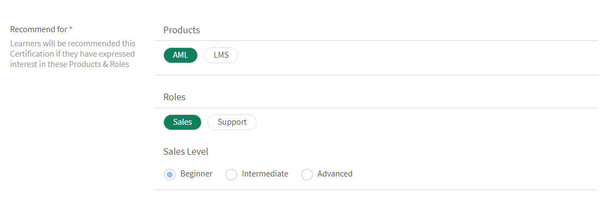

# Caminhos de aprendizado

## O que é um caminho de aprendizado?

Frequentemente, os administradores estão interessados em elaborar um currículo detalhado que ofereça conhecimentos aprofundados de um tópico específico ou de uma área de especialização. Também pode ser uma sequência de cursos de treinamento que os funcionários ou clientes devem concluir. Isso requer o agrupamento de um conjunto de cursos e programas para criar um pacote de treinamento completo.

É aqui que o Caminho de aprendizado entra em cena. Um caminho de aprendizado é uma jornada pela qual um aluno deve passar para dominar algum assunto ao longo do tempo. Os alunos controlam sua experiência de treinamento e podem adquirir e manter o conhecimento em ritmo individualizado com maior eficácia.

Por exemplo, quando se admite novos funcionários, uma organização realiza treinamento sobre políticas e procedimentos, cultura, história e assim por diante. Um caminho de aprendizado configura os cursos de acordo com as necessidades dos funcionários, para que eles possam se inscrever nos cursos de acordo com o caminho de aprendizado definido para eles. você escolhe e pode inscrever usuários nesse caminho para que eles possam progredir de um curso para o outros.

## Criar e configurar Caminhos de aprendizado

Neste treinamento, você aprenderá a criar um caminho de aprendizado, adicionar um curso a ele, publicar e desativar um caminho de aprendizado e configurar instâncias em um caminho de aprendizado.

Se você não conseguir iniciar o treinamento, escreva para <almacademy@adobe.com>.

## Vantagens de um caminho de aprendizado

Os caminhos de aprendizado tornam o fornecimento de um programa de treinamento prático e sem complicações. Estes são alguns dos principais benefícios de um caminho de aprendizado:

1. Atribua uma habilidade e um nível de habilidade a um caminho de aprendizado diretamente. Não há necessidade de corresponder aos créditos de habilidade. Depois que o aluno finaliza um caminho de aprendizado, ele atinge o nível de habilidade mencionado.
1. Capacidade de incorporar um caminho de aprendizado existente em um novo caminho de aprendizado. O recurso de incorporação só está disponível para o 1 nível de incorporação. Assim, um Caminho de aprendizagem que já contém um Demarcador incorporado não pode ser incorporado em um novo Demarcador.
1. Capacidade de adicionar pré-requisitos, ajudas de tarefa e recursos em um nível de caminho de aprendizado.
1. Capacidade de criar seções. Cada seção pode ter um título.
1. Capacidade de tornar seções obrigatórias e de configurar critérios de conclusão.

## Adicionar um caminho de aprendizagem no Gerenciador de aprendizagem

No Gerenciador de aprendizagem, no aplicativo do administrador, clique **[!UICONTROL em Caminho]** do aprendizado no painel esquerdo.

Na página **[!UICONTROL Caminho de aprendizado]**, clique em **[!UICONTROL Adicionar]**. Insira os detalhes.

*Adicionar um novo Caminho de Aprendizado*

Na opção **Tipo de Inscrição**, selecione **Autoinscrição** ou **Inscrição do Administrador**.

>[!NOTE]
>
>Se você selecionar a opção **Inscrição do administrador**, os alunos verão apenas os cursos indicados ou aprovados pelo gerente. Os alunos não poderão ver o caminho de aprendizado na seção de recomendação.

Depois de criar um caminho de aprendizado, selecione o caminho de aprendizado recém-criado e adicione os cursos no caminho.

Você pode adicionar habilidades e atribuir uma medalha ao Caminho de aprendizado. Para adicionar uma habilidade, selecione a habilidade ou habilidades necessárias na lista suspensa **[!UICONTROL Escolher uma habilidade]**. Selecione também o nível para a habilidade ou habilidades.

*Adicionar uma habilidade*

Atribua uma medalha ao Caminho de aprendizado. Escolha uma medalha da lista de medalhas disponíveis.

Selecione o nível de produtos, funções e funções na **[!UICONTROL seção Recomendar para]** sugerir esse caminho de aprendizado para os usuários que manifestaram interesse por esses produtos e funções.

*Recomendação*

Escolha o tipo de sequência para as seções e o treinamento como Ordenado ou Não solicitado com base em sua preferência.

Se optar por Ordenado, os cursos serão exibidos na mesma sequência em que foram criados. Se optar por Não ordenado, os cursos não são organizados em sequência. Os alunos podem finalizar os cursos em qualquer ordem.

Para adicionar um curso no caminho do aprendizado, clique **[!UICONTROL em Adicionar cursos ou caminhos]** de aprendizado.

Na caixa de diálogo exibida, escolha o treinamento que deseja adicionar ao Caminho de aprendizado.

*Adicionar treinamento ao Caminho de Aprendizado*

Você pode classificar os cursos de acordo com as habilidades atribuídas, a data modificada e a eficácia do curso.

Depois de selecionar os cursos ou o Caminho do aprendizado, clique **[!UICONTROL em Salvar]**.

No Caminho de aprendizado, você pode executar o seguinte:

**Criar e configurar uma Seção:** Uma Seção é criada para agrupar vários cursos de treinamento, o que completa uma área ou um componente substancial do treinamento. Cada seção pode ter um título. Cada seção também pode ser marcada como Obrigatória com requisitos específicos de conclusão.

**Torne os cursos obrigatórios em cada seção:** habilite ou desabilite a caixa de seleção Obrigatório se você deseja/não deseja tornar os treinamentos obrigatórios dentro do Caminho de Aprendizado. Se você ativar a caixa de seleção, poderá tornar todos os treinamentos obrigatórios ou alguns dos treinamentos obrigatórios.

*Tornar os cursos obrigatórios em cada seção*

**Reorganize a ordem:** você pode mover os cursos para cima ou para baixo e alterar sua ordem.

*Reorganizar a ordem do treinamento*

**Remover um curso:** no cartão do curso, clique em X e remova o curso do caminho do aprendizado.

*Remover um curso do caminho de aprendizagem*

Após fazer as alterações, para publicar o Caminho do aprendizado, clique em Publicar.

## Caminho de aprendizagem aninhado ou aprimorado

Um caminho de aprendizagem aninhado ou aprimorado é um caminho de aprendizagem que contém diversos caminhos de aprendizagem. Para inserir um caminho de aprendizado, siga o mesmo processo que adicionar um curso em um caminho de aprendizado.

*Caminho de Aprendizado aninhado ou aprimorado*

## Configurações do Caminho de aprendizado

Na seção Configurações, você pode adicionar os pré-requisitos e as ajudas de tarefa que um aluno deve aceitar antes de iniciar o Caminho de aprendizado. Você também pode adicionar recursos úteis ao aluno.

*Alterar configurações de um caminho de aprendizagem*

## Instâncias

As instâncias do Caminho de aprendizado exibem um bloco adicional: **[!UICONTROL Caminhos de aprendizado]**. O mosaico exibe o número. de programas de aprendizado adicionados a um Caminho de aprendizado.

No bloco **Cursos**, você pode ver as instâncias do curso que estão visíveis para os alunos inscritos nesta instância.

A caixa de seleção **[!UICONTROL Permitir que os alunos escolham instâncias (Caminho de Aprendizado Flexível)]** só se aplica aos cursos. Todos os Caminhos de aprendizado filho terão a opção de mapear uma instância do Programa de aprendizado com o Caminho de aprendizado. Por padrão, o mapeamento é definido como Instância padrão.

*Instâncias do caminho de aprendizado*

## Notificações

Há três opções:

1. **[!UICONTROL Todos os cursos de níveis de habilidade e caminhos de aprendizado (selecionados por padrão)]:** o aluno recebe notificações de qualquer curso incompleto, independentemente do nível dentro de um caminho de aprendizado.
1. **[!UICONTROL Caminho de Aprendizado Raiz]:** o aluno recebe notificações de qualquer curso incompleto pertencente a um caminho de aprendizado pai.
1. **[!UICONTROL Caminho de aprendizado + somente] primeiras crianças do nível de habilidade:** o aluno recebe notificações de qualquer curso incompleto que seja filho de um caminho de aprendizagem pai.

Os lembretes de notificação são acionados com base na opção. Por padrão, a opção **[!UICONTROL Todos os cursos e Caminhos]** de aprendizado em Todos os Níveis está ativada em uma instância.

## Assinaturas

Você pode se inscrever nos caminhos de aprendizado individuais para receber dados abrangentes, incluindo pontuações dos questionários e o status do aluno diretamente na sua caixa de entrada.

Siga as etapas abaixo:

1. Vá para qualquer Caminho de aprendizado > Assinaturas.
1. Selecione Adicionar mais.
1. Selecione os detalhes e digite a ID de e-mail para receber os relatórios.

*Assine o caminho de aprendizado individual*

## Observação importante

Observe que o recurso existente dos Programas de aprendizado será renomeado para Caminho do aprendizado imediatamente após a versão. Caso queira continuar a chamá-los de Programas de aprendizado, recomendamos que você use o recurso “Terminologias” para aplicar a terminologia desejada. Dessa forma, você pode usar o termo Programa de aprendizado.

Os Caminhos de aprendizado trazem para você uma variedade de funcionalidades. Algumas delas ficam disponíveis imediatamente após o lançamento da versão. Administradores/autores podem começar a usá-los. Recursos estendidos, como “Seções”, “adição do Caminho de aprendizado em outro caminho” etc. estão desativadas e podem ser ativadas marcando a caixa de seleção mencionada abaixo.

Os alunos podem continuar a usar os Programas de aprendizado (agora chamados de Caminhos de aprendizado) e os autores/administradores também podem continuar a criá-los. Para aproveitar as funcionalidades estendidas do Caminho de aprendizado mencionadas acima, o administrador deve ativar a configuração conforme mencionado abaixo. Uma vez ativado, todos os novos recursos estendidos do Caminho de aprendizado estarão disponíveis.

A página **[!UICONTROL Configurações]** > **[!UICONTROL Geral]** tem uma nova opção para habilitar os Caminhos de Aprendizado. Se essa opção estiver ativada, você pode adicionar cursos e programas de aprendizado em um caminho de aprendizado. Não é possível alterar a opção depois de ativada.

<!-- ## Other Learning Path-related details 

### Learning Path option is disabled/unchecked in Admin Settings

**Accounts using Native Web apps**

**Learners**

* By default, learners will notice a change in terminology from "Learning Program" to Learning Path". This has been done to make the interface more intuitive. If you do not want this change, refer to the below points.  

* This change however will not be reflected in the UI if you have already used the 'Custom Terminology" function to replace the terminology "Learning Programs" with some custom text. 
* In case you had not used the Custom Terminology function yet but now wish to retain "Learning Programs" as the terminology, you can do so via the 'Custom Terminology' feature post the release.

* The overall cosmetic look and feel of erstwhile 'Learning Programs' will get updated to a more visually rich look and feel.

**Authors and Admins**

* The terminology within the Admin/Author apps is the same as that of learners.
* The UI for Authors and Admins to create, update the erstwhile 'Learning Program' objects will now be updated to the new UI. There is no loss of functionality, just that the User Interface to do the operation will be much more intuitive. These UI changes will reflect in your account, even if you have chosen not to enable 'Extended Features of Learning Path', with no loss in functionality. 

* Note that any existing Learning Program objects will not change so there is no impact on learners (other than the terminology point noted above). Authors/Admins might notice a default grouping called "Section" within their existing objects, which would be of no material impact as far as functionality goes. Authors/Admins will also see added functionalities like Skills, Job Aids etc. But as you haven't used it yet, it will not create any impact on the learner side till you actually start using it.

**Reporting**

* If you do not enable the option, Learning Path , there are no changes in the Learner Transcript report structure due to Learning Path. But as communicated in earlier notice (refer to the table shared in earlier communication); one new column will get added to the extreme right of the Learner Transcript immediately after the release.

**Accounts using Headless LMS**

**Learners**

* There are no changes for learners in headless interface. APIs as well that are used to generate the reports does not have immediate changes. 

**Authors and Admins**

* Same changes as that of Authors/Admins stated above.

**Reporting**

* Same changes as that of Reporting stated above.

### Learning Paths option is enabled/checked in Admin Settings

**Accounts using Native Web apps**

**Learners**

* Same changes as that of Learners when the option is disabled.
* As you start using the extended functionality of Learning Paths, Learners will benefit from seeing more elaborate paths with embedded paths and sections, Skills and badges being earned on path completion, resources at path level, and other benefits.

**Authors and Admins**

* Same changes as that of Authors and Admins when the option is disabled.

* Users will get more functionality in crafting elaborate paths. You can define Skill-Levels that would automatically be achieved by a learner on completion of path (not have to focus on the arithmetic of Credits for the levels). Resources can be added at the path level (Not possible as of today). Sections can be created with each section having the ability to have X of Y options. One can embed a Learning Path within another Learning Path (one level of hierarchy supported)

**Reporting**

* A few new columns will get added to the 'Learner Transcript' and 'Content Report' structures to incorporate the new feature of embedding of paths within paths. This may impact integration code that you may have written to export this data to your custom data warehouse/DB outside Learning Manager. This information is communicated in the table provided in earlier communication.

**Accounts using Headless LMS**

**Learners**

* There is no change for your learners, unless you make changes to your headless LMS implementation, as the APIs on which you have built your headless interface will not be changing.
* If you do start using the extended features of Learning Paths by creating new Learning Paths, however you will have to make changes to the headless LMS implementation to reflect those on your learner app. The Learning Manager APIs will allow you to do that.

**Authors and Admins**

* Same changes as that of Authors/Admins stated above.

**Reporting**

* Same changes as that of Reporting stated above. -->
