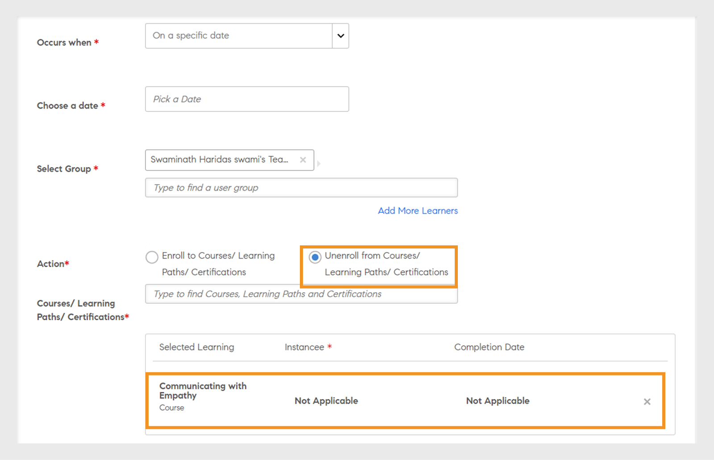
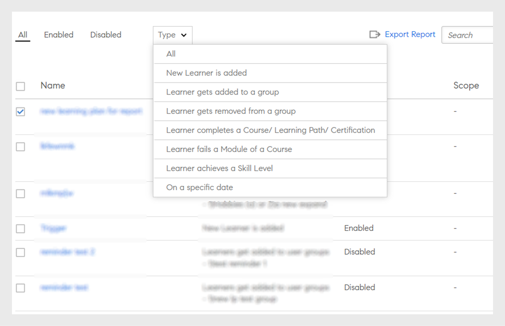

# Planos de aprendizado

Criação de planos de aprendizado para administradores no Learning Manager.

## Visão geral {#overview}

Um plano de aprendizado é um conjunto de regras que serve para inscrever alunos em treinamentos especificados com base em determinados critérios.

Um plano de aprendizado permite que um administrador atribua automaticamente cursos, programas de aprendizado ou certificações baseados na existência de determinados eventos como a contratação de um novo funcionário ou a alteração na designação ou no local dos funcionários.

Por exemplo, quando um funcionário entra em uma empresa, o programa de orientação para novos funcionários é atribuído automaticamente ao funcionário. Da mesma forma, se um funcionário é promovido a gerente, o programa de orientação para novos gerentes é atribuído automaticamente ao funcionário.

É possível inscrever alunos a todos os cursos e programas de aprendizado automaticamente com base em um conjunto predefinido de eventos. É possível criar caminhos de aprendizado para os alunos atribuindo automaticamente uma atividade de acompanhamento do aprendizado depois que o aluno conclui uma habilidade, curso ou programa de aprendizado.

## Criar planos de aprendizado {#createlearningplans}

Para criar um plano de aprendizado, é preciso fazer logon como administrador.

1. No painel esquerdo, clique em **[!UICONTROL Planos de aprendizado]**. Se houver eventos, eles são listados na página. No entanto, se você estiver configurando o recurso do plano de aprendizado pela primeira vez, passe para a próxima etapa.
1. No canto superior direito da página, clique em **[!UICONTROL Adicionar]**. Na caixa de diálogo **[!UICONTROL Adicionar plano de aprendizado]**, digite o nome do plano de aprendizado que um funcionário deve realizar.

   

1. Na lista suspensa **[!UICONTROL Ocorre quando]**, escolha o evento necessário. As opções determinam quando um aluno faz o curso. Depois de selecionar o tipo de evento, selecione o treinamento, os cursos, o programa de aprendizado ou a certificação apropriados.

>[!NOTE]
>
> Os administradores e os autores podem criar eventos de inscrição automática.

Os eventos são:

**1 - Novo aluno adicionado:** Quando um novo usuário ou funcionário entra na organização.

**2 - O aluno é adicionado a um grupo:** Quando um novo usuário ou funcionário ingressa em um grupo.  Insira e selecione o grupo de usuários na lista suspensa, ao qual este evento é aplicável. É possível escolher vários grupos. Além disso, você pode atribuir esse evento a todos os membros desses grupos selecionando a opção.

Este plano de aprendizado está destinado especificamente para usuários do ***Grupo personalizado***. Digite o nome do grupo no campo e, usando a pesquisa com preenchimento automático, escolha o grupo ou grupos.

**3 - O aluno é removido de um grupo:** O evento é acionado quando um usuário ou aluno é removido de um grupo. Insira e selecione o grupo de usuários na lista suspensa, ao qual este evento é aplicável. É possível escolher vários grupos.

**4 - O aluno conclui um curso/caminho de aprendizado/certificação:** O evento é acionado quando um aluno conclui qualquer objeto de aprendizado, como curso, programa de aprendizado e assim por diante. Selecione o objeto de aprendizado ao qual se aplica este evento. Selecione o status de conclusão do evento. Como opção, você também pode escolher o grupo de usuários ao qual esse aluno pertence. Insira o número de dias que, depois de concluir o objeto de aprendizado, esse evento será acionado. Selecione a opção se quiser atribuir esse evento a usuários existentes que já concluíram esse objeto de aprendizado.

**5 - Aluno reprovado em um módulo de um curso:** O evento é acionado quando um aluno falha em qualquer objeto de aprendizado, como curso, programa de aprendizado e assim por diante. Selecione o objeto de aprendizado ao qual se aplica este evento. Você também pode escolher o grupo de usuários ao qual este aluno pertence.

**4 - O aluno atinge um nível de habilidade:** Insira o nome da habilidade e selecione o nível de habilidade. Você também pode escolher o grupo de usuários ao qual esse aluno pertence. É opcional. Insira o número de dias que, depois de concluir a habilidade, esse evento será acionado. Selecione a opção se deseja atribuir esse evento aos alunos que já obtiveram essa habilidade.

Além disso, defina o número de dias após o qual o plano de aprendizado deve ser atribuído aos alunos.

**5 - Em uma data específica:** Quando os eventos devem ocorrer em uma data específica. Selecione a data na qual o evento deve ser atribuído. Selecione os grupos de usuários para os quais o evento precisa ser atribuído automaticamente. Selecione as instâncias que precisam ser atribuídas e opcionalmente insira o número de dias após o qual o evento deve ser acionado.

1. Em todos os eventos, é possível selecionar a instância na lista suspensa **[!UICONTROL Instância]**. Também é possível selecionar instâncias do aprendizado atribuído em qualquer evento.

   

   No Learning Manager, um plano de aprendizado cria sua própria instância, Automático. Quando você escolhe um grupo, por exemplo, Todos os participantes, todos os alunos do plano de aprendizado por padrão são inscritos automaticamente na instância.

   Quando você salva o plano de aprendizado, a instância automática aparece como opção na lista suspensa **[!UICONTROL Selecionar instância]** na seção Alunos de um curso.

1. Para salvar o plano de aprendizado, clique em **[!UICONTROL Salvar]**.

## Cancelar inscrição no treinamento {#unenroll-training}

Ao adicionar um plano de aprendizado, um administrador pode cancelar a inscrição de usuários de treinamentos específicos com base em determinados acionadores.

No aplicativo de administração, clique em **[!UICONTROL Planos de aprendizado]** > **[!UICONTROL Adicionar]**.

As próximas seções representam os acionadores nos quais a opção **[!UICONTROL Cancelar inscrição no treinamento]** foi adicionado.

## O aluno é removido de um grupo {#learnergetsremovedfromagroup}

1. Adicione um ou mais grupos de usuários. No caso de vários grupos serem selecionados, o plano é acionado quando um aluno é removido de qualquer um dos grupos mencionados.
1. Escolha a ação como **[!UICONTROL Cancelar inscrição no treinamento]**.

   1. O administrador pode escolher os treinamentos dos quais o usuário será cancelado quando removido do grupo de usuários.
   1. A Instância e a Data de Conclusão não serão aplicáveis neste cenário.

## O aluno conclui um treinamento {#learnercompletesatraining}

1. Adicione um ou mais grupos de usuários. Caso vários grupos sejam selecionados, o plano é acionado quando um aluno conclui o treinamento especificado.
1. Escolha a ação como **[!UICONTROL Cancelar inscrição no treinamento]**.

   1. O administrador pode escolher os treinamentos dos quais o usuário será cancelado quando adicionado ao grupo de usuários.
   1. A Instância e a Data de Conclusão não serão aplicáveis neste caso.

## O aluno é reprovado em um módulo de um curso

1. Adicione um ou mais grupos de usuários. No caso de vários grupos serem selecionados, o plano é acionado quando um aluno falha no treinamento especificado.
1. Escolha a ação como **[!UICONTROL Cancelar inscrição no treinamento]**.

   1. O administrador pode escolher os treinamentos dos quais o usuário será cancelado quando adicionado ao grupo de usuários.
   1. A Instância e a Data de Conclusão não serão aplicáveis neste caso.

## O aluno é adicionado a um grupo {#learnergetsaddedtoagroup}

1. Adicione um ou mais grupos de usuários. No caso de vários grupos serem selecionados, o plano é acionado quando um aluno é adicionado a qualquer um dos grupos mencionados.
1. Escolha a ação como Cancelar inscrição no treinamento.

   1. O administrador pode escolher os treinamentos dos quais o usuário será cancelado quando adicionado ao grupo de usuários.
   1. A Instância e a Data de Conclusão não serão aplicáveis neste caso.

## O aluno alcançou um nível de habilidade {#learnerachievesaskilllevel}

1. Especifique a habilidade a ser obtida.
1. Adicione um ou mais grupos de usuários. Caso vários grupos sejam selecionados, o plano é acionado quando um aluno obtém a habilidade selecionada.

## Em uma data específica {#onaspecificdate}

1. Escolha a data na qual os alunos devem ter suas inscrições canceladas.
1. Adicione um ou mais grupos de usuários. Caso vários grupos sejam selecionados, o plano é acionado na data e cancela a inscrição dos usuários que fazem parte dos grupos selecionados.
1. Escolha a ação como Cancelar inscrição no treinamento.

   1. O administrador pode escolher os treinamentos dos quais o usuário terá a sua inscrição cancelada quando não estiver inscrito na data especificada.
   1. A Instância e a Data de Conclusão não serão aplicáveis neste caso.

## Editar um plano de aprendizado {#editalearningplan}

Após a criação de um plano de aprendizado, o administrador pode editar/atualizar o plano de aprendizado a qualquer momento. Para editar, selecione o nome do plano de aprendizado e modifique os valores na **[!UICONTROL Editar plano de aprendizado]** caixa de diálogo pop-up que aparece.  Selecione **[!UICONTROL Salvar]**.

>[!NOTE]
>
>Você não pode modificar o **[!UICONTROL Ocorre quando]** na caixa de diálogo **[!UICONTROL Editar plano de aprendizado]** pop-up.

## Ativar um plano de aprendizado {#enablealearningplan}

Por padrão, todos os planos de aprendizado novos criados estão no estado desativado. Você deve ativar um plano ao qual um aluno será atribuído. Quando você ativa a caixa de seleção **[!UICONTROL Alunos atuais]**, o evento é ativado sozinho.

Para ativar um plano de aprendizado,

1. Na lista Planos de aprendizado, escolha o plano que deseja ativar.

   

1. No canto superior direito da página, clique em **[!UICONTROL Ações]** > **[!UICONTROL Habilitar]**. Isso ativa o plano de aprendizado.

## Excluir um plano de aprendizado {#deletealearningplan}

Para excluir um plano de aprendizado,

1. Na lista Planos de aprendizado, escolha o plano que deseja excluir.
1. No canto superior direito da página, clique em **[!UICONTROL Ações]** > **[!UICONTROL Excluir]**.

## Desativar um plano de aprendizado {#disablealearningplan}

Para desativar um plano de aprendizado,

1. Clique na guia **[!UICONTROL Ativado]**.
1. Na lista Planos de aprendizado, escolha o plano que deseja desativar.
1. No canto superior direito da página, clique em **[!UICONTROL Ações]** > **[!UICONTROL Desativar]**. Isso move o plano para a guia **[!UICONTROL Desativado]**.

## Filtrar um plano de aprendizado {#filteralearningplan}

Você pode filtrar os planos de aprendizado de acordo com o tipo de evento usado para criar um plano de aprendizado. Clique em **[!UICONTROL Tipo]** e escolha qualquer opção para exibir os Planos de aprendizado que correspondem à seleção.

## Perguntas frequentes {#frequentlyaskedquestions}

1. Como configuro o Learning Manager para configurar inscrições automáticas para os novos funcionários contratados?

   No menu **[!UICONTROL Ocorre quando]** , escolha a opção **[!UICONTROL Novo aluno adicionado]**. A seguir, atribua os objetos de aprendizado, a instância e a data de conclusão do aluno. Administradores e autores podem criar eventos de inscrição automática. Ative o evento depois de criá-lo.

1. Como configurar um plano de aprendizado/inscrição automática para o curso em sala de aula e sala de aula virtual?

   Recomenda-se configurar a instância do curso com os detalhes necessários da sessão. Em seguida, configure um plano de aprendizado e mapeie-o para a instância do curso, que já foi criada.

1. Como visualizar a lista de alunos inscritos em um plano de aprendizado específico?

   Quando a instância, Automático, for criada, clique em **[!UICONTROL Curso]** > **[!UICONTROL Alunos]** e escolha a instância necessária no menu **[!UICONTROL Instância]** lista suspensa.
