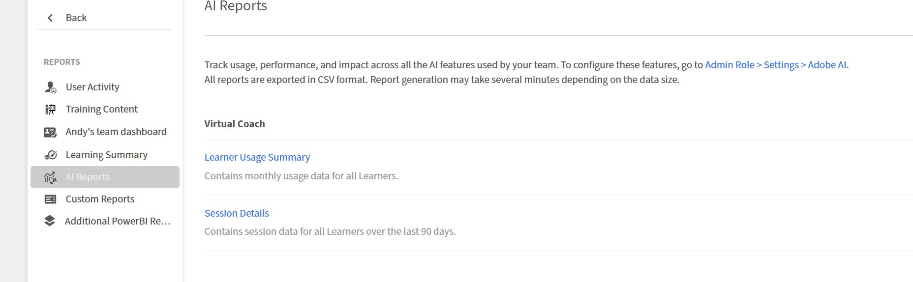

# Monitorar o uso do Virtual Coach

Visualize dados de uso de Virtual Coach (ônibus virtuais), acompanhe o consumo de crédito do MAU (Monthly Ative User, usuário ativo mensal) e acesse relatórios de desempenho do aluno no Adobe Learning Manager.

## Ative o Virtual Coach para sua conta

O Virtual Coach está disponível como um complemento do Adobe Learning Manager. Após a compra, o provisionamento gera uma chave de ativação que é enviada por email ao administrador da conta.

1. Faça logon no Adobe Learning Manager como administrador.
2. Navegue até a página **Faturamento** no painel de navegação esquerdo.
3. Na seção **Treinador virtual**, insira a chave de ativação recebida por email.
4. Selecione **Aplicar**. O Virtual Coach está habilitado para sua conta.
   

Depois de ativado, você receberá uma notificação no aplicativo confirmando que o recurso está ativo. Quatro exemplos de cenários de reprodução de papel são adicionados automaticamente à Biblioteca de conteúdo para que os autores possam começar imediatamente.

>[!NOTE]
>
>A chave de ativação é gerada automaticamente durante o provisionamento e compartilhada por e-mail. Se você não tiver a chave de ativação, entre em contato com seu Gerente de sucesso do cliente (CSM) da Adobe Learning Manager.

## Exibir o saldo de crédito do MAU

Créditos do Usuário Ativo Mensal (MAU) contam o número de alunos exclusivos que usam o Treinador Virtual a cada mês.

1. Navegue até a página **Faturamento**.
2. Na seção **Treinador virtual**, selecione **Exibir detalhes de uso**.
3. Use o menu suspenso **Selecionar período** para escolher o intervalo de datas que deseja revisar.
   

   A tabela **Uso Geral** mostra:

   a) **Disponível:** Total de créditos MAU comprados\
   b) **Usados:** créditos consumidos até a data\
   c) **Restantes:** créditos disponíveis para o restante do período do contrato

   A tabela **Uso Mensal** mostra o número de alunos ativos exclusivos por mês do calendário.

4. Selecione **Baixar Relatório Detalhado** para exportar os dados de uso completo.

## Como os créditos MAU são consumidos

Um crédito MAU é consumido quando um aluno conclui uma sessão de Treinador virtual em um mês do calendário. As sessões adicionais do mesmo aluno no mesmo mês não consomem créditos adicionais.

| Cenário | MAUs consumidos |
|----------|--------------|
| Um aluno conclui 5 sessões em janeiro | 1 |
| O mesmo aluno usa o Virtual Coach em janeiro e fevereiro | 2 (1 por mês) |
| 100 alunos concluíram cada uma 1 sessão em janeiro | 100 |

_Os créditos do MAU são contados por aluno único por mês do calendário, independentemente de quantas sessões cada aluno conclui._

Os créditos não utilizados no final do período do contrato caducam e não transitam.

### Exemplo 1: aluno único, várias sessões

Cenário: Sarah completa cinco sessões de Virtual Coach em janeiro.

* Sessões em janeiro: 5
* MAUs consumidos: 1
* Por que: Sarah é contada como um único usuário único para o mês de janeiro, independentemente de quantas vezes ela pratica.

### Exemplo 2: mesmo aluno, vários meses

Cenário: Sarah usa o Virtual Coach em janeiro e fevereiro.

* Sessões em janeiro: 3
* Sessões em fevereiro: 2
* MAUs consumidos: 2 (1 para janeiro + 1 para fevereiro)
* Por que: cada mês do calendário é contado separadamente.

### Exemplo 3: vários alunos, mesmo mês

Cenário: 100 representantes de vendas concluíram cada um uma sessão de orientação virtual em janeiro.

* Total de sessões: 100
* MAUs consumidos: 100
* Por que: cada aluno único conta como um MAU para esse mês.

### Exemplo 4: prática em equipe ao longo do tempo

Cenário: Sua equipe de 50 pessoas usa o Virtual Coach durante todo o ano.

| Mês | Alunos ativos | MAUs Consumidos Este Mês | MAUs cumulativas |
|------|----------------|--------------------------|-----------------|
| janeiro | 0 | 0 | 0 |
| fevereiro | 5 (5 pessoas não praticaram) | 5 | 5 |
| Março | 0 (todos os 50 ganhos praticados) | 0 | 45 |
| Abril | 0 | 0 | 75 |

## Exibir relatórios de Treinamento Virtual

A página **Gerenciar** seção > **Relatórios** seção > **Relatórios de IA** fornece dados de uso e desempenho para todas as atividades de Treinador Virtual em sua organização. Dois relatórios estão disponíveis no cabeçalho **Virtual Coach**.

Todos os relatórios são exportados em formato CSV. A geração de relatórios pode levar vários minutos, dependendo do tamanho dos dados.

### Resumo de uso do aluno

Contém dados de uso mensal para todos os alunos. Use esse relatório para controlar quantos alunos estão usando o Virtual Coach a cada mês, monitorar o consumo de crédito do MAU e identificar tendências de engajamento ao longo do tempo.

### Detalhes da sessão

Contém dados no nível da sessão de todos os alunos nos últimos 90 dias. Use este relatório para revisar pontuações de sessão individuais, a cobertura de tópico e as métricas de estilo em sua população de alunos e para identificar lacunas de habilidades que podem exigir treinamento ou conteúdo adicional.

## Acessar e baixar um relatório

1. Faça logon no Adobe Learning Manager como administrador.
2. Selecione **Relatórios** no painel de navegação esquerdo.
3. Selecione **Relatórios de IA**.
4. Na seção **Treinador Virtual**, selecione o relatório que deseja baixar, **Resumo do Uso do Aluno** ou **Detalhes da Sessão**.
   
5. Selecione o intervalo de datas quando solicitado e, em seguida, selecione **Continuar**.
6. O relatório é baixado automaticamente como um arquivo CSV.
