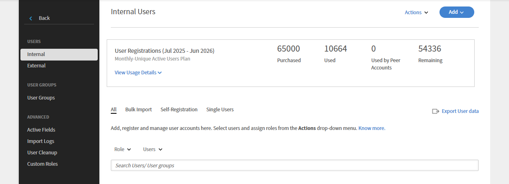

# Contas entre parceiros

Leia este artigo para saber como criar e gerenciar contas entre parceiros no Learning Manager.

O Learning Manager oferece a capacidade de compartilhar licenças compradas usando o recurso de conta entre parceiros. Com contas entre parceiros no Learning Manager, um administrador pode compartilhar as licenças compradas com as contas entre parceiros às quais o administrador está associado. Além disso, o administrador que iniciou o compartilhamento de licenças pode visualizar os relatórios das contas entre parceiros.

## Adicionar uma conta entre parceiros {#addapeeraccount}

1. No painel Administrador, clique em **[!UICONTROL Configurações]** > **[!UICONTROL Contas entre parceiros]**.
1. No canto superior direito, clique em **[!UICONTROL Adicionar]**.

   

   *Adicionar conta entre parceiros*

1. No campo **[!UICONTROL Subdomínio da conta]**, especifique o subdomínio com o qual você deseja estabelecer uma conta entre parceiros.

   

   *Adicionar um subdomínio*

>[!NOTE]
>
>Para localizar o subdomínio de outra conta, verifique o URL da conta. O subdomínio aparece antes do domínio principal e ajuda a identificar a conta específica.
>
>Por exemplo:
>
>Na URL [https://www.learningmanager.com/accountname](https://www.learningmanager.com/accountname), o subdomínio é **accountname**.
>
>Na URL [https://www.accountname.learningmanager.com](https://www.accountname.learningmanager.com), o subdomínio também é **accountname**.
>
>O subdomínio é exclusivo para cada conta e é usado para acessar a respectiva instância do Learning Manager.

1. Insira a ID de e-mail do administrador que aceita ou rejeita a solicitação da conta entre parceiros.
1. Especifique o número de licenças que deseja compartilhar com o seu parceiro. Quando você compartilha licenças com a conta entre parceiros, a conta entra no estado Ativo com as licenças recebidas ou com as próprias licenças compradas pelo parceiro.

   Se você inserir um número maior que as licenças disponíveis, o sistema exibirá um aviso.

1. Marque a caixa de seleção se quiser exibir os relatórios de inscrição e de catálogo compartilhado dos seus parceiros.
1. Clique em Adicionar para adicionar à conta entre parceiros.

   Se um administrador compartilha licenças com um parceiro, ele não pode compartilhá-las com mais ninguém. No entanto, o parceiro pode comprar algumas licenças separadamente e compartilhá-las.

## Exibir as licenças compartilhadas por contas entre parceiros

Os administradores podem exibir o número de licenças compartilhadas pelas contas entre parceiros na interface do administrador.

Para exibir as licenças compartilhadas pela conta entre parceiros:

1. Faça logon no Adobe Learning Manager como administrador.
2. Selecione **[!UICONTROL Usuários]** e selecione **[!UICONTROL Internos]**.

_Seção Usuários mostrando o número de licenças compartilhadas pela conta entre parceiros_

## Exibir relatórios associados a contas entre parceiros {#viewreportsassociatedwithpeeraccounts}

Depois de estabelecer uma conta entre parceiros, você também pode criar relatórios para as contas entre parceiros. Como administrador, se iniciar a solicitação de conta entre parceiros, você poderá visualizar os relatórios da conta entre parceiros.

Se o parceiro também quiser exibir os relatórios do administrador, ele deverá enviar uma solicitação de conta entre parceiros separada ao administrador.

Para saber como gerar e exibir os catálogos compartilhados da conta entre parceiros, consulte [Visualizando relatórios de parceiros](reports.md#main-pars_header_894271250).

## Excluindo contas entre parceiros {#deletingpeeraccounts}

Se você não deseja mais compartilhar licenças ou compras com uma conta, é possível excluir a conta entre parceiros.

1. No aplicativo de administrador do Learning Manager, clique em Configurações > Contas entre parceiros.
1. Selecione a(s) conta(s) entre parceiros que deseja excluir.
1. Siga um destes procedimentos:

   * Clique em Excluir no canto superior direito da página.
   * Clique no ícone Excluir próximo à conta entre parceiros que deseja excluir.

   Após excluir uma conta entre parceiros, as licenças recebidas não estarão mais disponíveis. Se a conta entre parceiros tiver recebido apenas licenças e nenhuma licença comprada, a conta será exibida em um estado Inativo.

## Relatório de usuário para contas entre parceiros {#download-peer-account}

O administrador pode exibir o relatório de usuário da conta entre parceiros. O administrador da conta principal pode solicitar acesso ao relatório e, depois que o administrador da conta entre parceiros aceitar isso, o administrador pai poderá exibir o número de usuários registrados na conta entre parceiros e poderá baixar o relatório de usuário para a conta entre parceiros.

1. Na página Contas entre Parceiros, clique em **[!UICONTROL Adicionar]**.
1. Habilite a opção **[!UICONTROL Solicitar permissão para baixar relatórios de usuário para a conta inteira]**.

*Exibir relatório de usuário de uma conta entre parceiros*

Para baixar os relatórios de contas entre parceiros, clique em **[!UICONTROL Baixar]**.

## Perguntas frequentes {#frequentlyaskedquestions}

+++Como compartilhar licenças de uma conta para outra?

Ao adicionar uma conta entre parceiros, especifique o número de licenças que você pode compartilhar com outra conta entre parceiros.

*Compartilhar licenças de uma conta para outra*
+++
