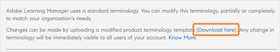

# Terminologia do produto

>[!IMPORTANT]
>
>A terminologia do produto está disponível somente para a versão em inglês do Adobe Learning Manager.

## O que é a Terminologia do produto no Adobe Learning Manager

O Adobe Learning Manager usa um conjunto padrão de terminologias na interface do usuário. Como administrador, você pode modificar as terminologias para atender às necessidades da sua organização.

Usando o recurso Terminologia do produto, você pode renomear essas terminologias e ser consistente com os padrões de aprendizado da sua organização.

## Baixe o arquivo csv de terminologia

Para alterar as terminologias, siga as etapas abaixo:

1. Como administrador, selecione **[!UICONTROL Configurações]** > **[!UICONTROL Geral]**.
1. Na **[!UICONTROL Terminologia do Produto]**, selecione **[!UICONTROL Editar]**.

   
   _Terminologia do Produto_

1. Selecione **[!UICONTROL Baixar Aqui]** e baixe o modelo das terminologias.

   
   _Baixar o modelo_

## Alterar as terminologias

1. Depois de baixar o CSV, altere as terminologias necessárias na segunda coluna. Por exemplo, você pode alterar Módulo para Treinamento ou Quadro de Classificação para Classificação.

   
   _Editar o csv_

1. Salve as alterações.

## Carregar o CSV atualizado

1. Na seção **[!UICONTROL Terminologia do Produto]**, selecione o link para carregar o CSV.

   
   _Carregar o csv_

1. Carregue o CSV atualizado.
1. Selecione **[!UICONTROL Salvar]**.

As alterações nas terminologias agora refletem um autor, aluno, gerente, professor ou administrador personalizado para essa conta.

## Redefinir as terminologias

Depois de carregar o CSV com as novas terminologias, você pode redefinir as terminologias padrão.

Selecione **[!UICONTROL Redefinir terminologia do produto]**.

_Redefinir a terminologia do produto_

Ao clicar no link, você pode ver uma mensagem pop-up de confirmação.

_Prompt de confirmação_

As terminologias são revertidas para seus nomes originais.

## O que não é alterado

As alterações de terminologia não se aplicam a:

* Modelos de email (**[!UICONTROL Administrador]** > **[!UICONTROL Modelos de Email]**)
* Relatórios (**[!UICONTROL Administrador]** > **[!UICONTROL Relatórios]**)

