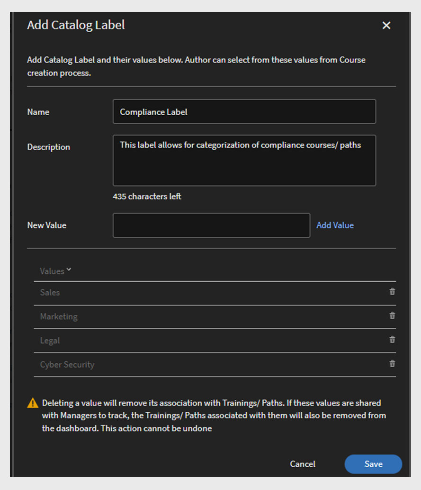

# Relatórios

Saiba mais sobre os relatórios associados à função de administrador no aplicativo Learning Manager.

O Adobe Learning Manager lhe permite criar relatórios variados para acompanhar, monitorar e gerenciar as atividades do Aluno. As atividades dos Alunos são acompanhadas e capturadas automaticamente no banco de dados. Os relatórios de Gerente e Administrador são gerados a partir do banco de dados.

## Visão geral {#overview}

O processo de geração de relatórios é o semelhante para o administrador e para o gerente. Os Gerentes podem ver os relatórios que correspondem aos seus subordinados enquanto que o Administrador pode vir todos os relatórios no âmbito da organização.

Os relatórios são agregados em um painel. Um relatório deve existir dentro de um painel. Um **[!UICONTROL painel]** padrão existe por padrão na página Relatórios. Qualquer relatório adicionado por você é movido para este painel padrão. Para adicionar relatórios a painéis individuais, use a seta suspensa e escolha **[!UICONTROL Adicionar relatório]**. Para obter mais informações sobre como criar painéis, consulte a seção Painéis nesta página.

## Tipos de relatórios {#typesofreports}

O Adobe Learning Manager é compatível com quatro tipos principais de relatório, por exemplo, conclusão, tempo gasto, habilidades e eficácia. Você pode usar os seguintes tipos de relatórios para gerar mais de 300 variações:

* Estatísticas de entrega do curso para Alunos
* Relatório da eficácia dos cursos
* Relatório baseado na habilidade do aluno
* Estatísticas de inscrição no programa de aprendizado para Alunos
* Tempo gasto no aprendizado pelos Alunos
* Pontuação do aluno
* Conclusão da certificação

## Painéis de atividades do usuário {#useractivitydashboards}

Veja um resumo de todas as atividades do usuário na plataforma ao longo do tempo. Configure grupos de usuários e aplique filtros.

O painel de atividades do usuário exibe a atividade dos usuários na conta. Os três relatórios listados são:

* **Usuários registrados:** este relatório fornece informações sobre o número de usuários registrados em sua conta semana após semana. Para contas com licenciamento de unidades ativas mensais, o relatório mostra as unidades do MAU.

* **Relatório de visitas de usuários:** este relatório fornece informações sobre o número de usuários que acessam a plataforma diariamente. O relatório mensal também está disponível.

* **Relatório Tempo gasto no aprendizado:** este relatório fornece informações sobre o tempo de aprendizagem gasto na plataforma no dia a dia. O relatório mensal também está disponível.

### Usuários registrados {#registeredusers}

O Learning Manager registra o número de usuários registrados no sistema todas as semanas. Os administradores podem visualizar este relatório para entender a contagem de usuários registrados naquele dia da semana. Uma vez armazenada por uma semana, a contagem registrada não se altera. Portanto, a contagem histórica registrada não está relacionada ao conjunto atual de alunos no sistema.

Este relatório fornece informações sobre o número de usuários registrados em sua conta, semana após semana.

Para contas com licenciamento de unidades ativas mensais, o relatório mostra as unidades do MAU.

*Relatório de usuários registrados*

***Para contas da unidade de acesso mensal:***

**Relatório mensal de usuários ativos**

Este relatório mostra a contagem de alunos ativos na plataforma de aprendizado todos os meses. O usuário é considerado ativo para o mês se executar alguma das ações de aprendizado mencionadas aqui. As unidades ativas mensais são contadas dessa forma.

A contagem mensal ativa, uma vez contada e armazenada por um mês, não se altera. Portanto, a contagem histórica exibida não está relacionada ao conjunto atual de alunos no sistema.

### Visitas do usuário {#uservisits}

Este relatório mostra o total de alunos acessando o sistema diária ou mensalmente. Navegar na plataforma de aprendizado sem realizar nenhum aprendizado também é considerado como &#39;acessar&#39; a plataforma de aprendizado. Isso ajuda o administrador a entender o conjunto total de usuários acessando o sistema. No primeiro dia do mês, o Learning Manager cria um registro do total de usuários acessando a plataforma no mês anterior. Também captura as informações do grupo de usuários para esses usuários.

Somente os grupos de usuários configurados pelo administrador são gravados. Isso permite que os administradores apliquem filtros a grupos de usuários para dados mensais históricos. Observe que a configuração de grupos de usuários incase foi modificada e o Gerenciador de aprendizado não registrou dados para esse grupo de usuários nos últimos meses, então o Gerente de aprendizado não pode exibir os dados dos grupos de usuários recém-configurados nos meses anteriores.

Este relatório contém usuários que acessam a plataforma usando todos os formatos, como a Web, aplicativos para dispositivos móveis, soluções personalizadas sem cabeçalho e assim por diante. O gráfico de uso do aplicativo de dispositivo menciona especificamente apenas os usuários que acessam a plataforma usando o aplicativo do dispositivo do Learning Manager. Isso ajuda os administradores a identificar o uso do aplicativo móvel em suas contas

*Relatório da Visita do usuário*

### Relatório de tempo gasto no aprendizado {#learningtimespentreport}

Aqui, você pode ver um gráfico de linhas de eixo duplo que mostra o tempo total gasto no aprendizado para todos os alunos em um período de 12 meses. O segundo eixo representa o tempo mediano gasto no aprendizado para um indivíduo.

O tempo gasto para diferentes objetos de aprendizado, como programas e certificações de aprendizado, é calculado para o seguinte:

* Curso em um ritmo individualizado com conteúdo estático e interativo
* Cursos de atividades com URL.
* Sessões de fim de semana com o sinalizador de fim de semana habilitado.
* Sessão de conexão da VC na qual a presença é marcada automaticamente.
* O tempo gasto em diferentes objetos de aprendizado, como programas e certificações de aprendizado
* Instruções de xAPI de um curso de atividade de xAPI.

Você pode exportar o gráfico como uma planilha do Excel.

É fornecido um filtro para escolher a configuração do grupo de usuários, o que ajudará na visualização dos dados em relação a diferentes grupos de usuários.

A data selecionada e o filtro do grupo de usuários são aplicados a todos os gráficos relevantes no painel.

>[!NOTE]
>
>Para as **[!UICONTROL Visitas do usuário]** e o **[!UICONTROL Tempo gasto no aprendizado]** os dados padrão (quando nenhum grupo de usuários está configurado) exibidos serão para toda a conta.

## Painel de conteúdo de treinamento {#trainingcontentdashboard}

O painel de conteúdo de treinamento oferece informações sobre os treinamentos disponíveis na plataforma. Você pode visualizar treinamentos populares ou acompanhar todos os treinamentos disponíveis.

### Relatórios de treinamento {#trainingsreport}

Este relatório fornece informações do total de treinamentos disponíveis na plataforma (no estado publicado) mês a mês. Ele fornece uma indicação do número de treinamentos oferecidos ao longo do tempo.

*Relatório de treinamento*

### Relatório de treinamentos ativos {#activetrainingsreport}

Este relatório fornece informações sobre os treinamentos ativos no intervalo de tempo selecionado. Treinamentos ativos são treinamentos registrados, visualizados no reprodutor ou concluídos no tempo determinado.

Para treinamentos ativos, os dados de todos os grupos internos de usuários raiz (com função de gerente) estarão disponíveis para seleção quando nenhuma configuração de grupo de usuários for feita. Além dos grupos de usuários raiz, você pode configurar mais 10 grupos de usuários, se necessário.

*Relatório de treinamentos ativo*

>[!NOTE]
>
>Os dados não são exibidos como esperado quando **[!UICONTROL Todos os usuários]** e **[!UICONTROL 12 meses]** de filtros são selecionados, mas os dados são exibidos quando você seleciona **[!UICONTROL Todos os grupos] de usuários internos.**

<table>
 <tbody>
  <tr>
   <td>
    
<b>Referência</b>
</td>
   <td>
    
<b>Métrica</b>
</td>
   <td>
    
<b>Descrição</b>
</td>
  </tr>
  <tr>
   <td>
    
1
</td>
   <td>
    
Taxa de início (%)
</td>
   <td>
    
Proporção do número de alunos que iniciaram o curso e do número de matrículas.
</td>
  </tr>
  <tr>
   <td>
    
2
</td>
   <td>
    
Taxa de conclusão (%)
</td>
   <td>
    
Proporção do total de usuários que concluíram o curso e do total de usuários que iniciaram o curso. 
</td>
  </tr>
  <tr>
   <td>
    
3
</td>
   <td>
    
Feedback do aluno
</td>
   <td>
    
Média de todas as respostas de feedback L1 recebidas em uma escala de 1 a 10, arredondadas até o número inteiro mais próximo. 
</td>
  </tr>
  <tr>
   <td>
    
4
</td>
   <td>
    
Feedback do gerente
</td>
   <td>
    
Média de todas as respostas de feedback L3 recebidas em uma escala de 1 a 5, arredondadas até o número inteiro mais próximo. 
</td>
  </tr>
 </tbody>
</table>

O relatório de treinamento tem duas colunas adicionais:

1. Classificação de estrelas média de um curso.
1. Número de alunos que avaliaram o curso.
1. Caminho incorporado
1. ID do caminho incorporado
1. ID do curso incorporado

>[!NOTE]
>
>A taxa de início, a taxa de conclusão, o feedback do aluno e o feedback do gerente não são afetados pelos filtros aplicados. Os filtros afetam apenas a inscrição, as visualizações e as conclusões.

>[!NOTE]
>
>Para ambos os relatórios (Conteúdo de treinamento, Atividade do usuário), você pode configurar no máximo 10 grupos de usuários. Pode levar até 24 horas para o processamento ser concluído e disponibilizar os filtros recém-configurados.

## Painéis de resumo do aprendizado {#dashboards}

### Gerar relatórios do painel

>[!INFO]
>
>Neste treinamento, você aprenderá como gerar relatórios do painel a partir do banco de dados.    

Se você não conseguir iniciar o treinamento, escreva para <almacademy@adobe.com>.

Veja um relatório resumido de todas as atividades de aprendizado na plataforma. Nesta página, você pode ver as seguintes informações de resumo para a equipe do usuário raiz selecionado e os perfis externos. O intervalo de tempo também pode ser selecionado:

* Resumo do aprendizado na forma de Inscrições, Exibições e Conclusões
* Principais habilidades
* Resumo da conformidade

*Gráficos de resumo*

Se houver gerentes internos de nível raiz, eles serão exibidos um após o outro.

Todos os perfis externos serão listados após os perfis internos (usuários de nível raiz interno).

Se um perfil externo tiver um Gerente, a hierarquia do Gerente será exibida na **[!UICONTROL lista suspensa Mostrar dados para]** . O usuário será listado na hierarquia do Gerente em todas as páginas de detalhes (resumo do aprendizado, conformidade e status da habilidade)

Caso contrário, todos os detalhes de usuários individuais serão exibidos na lista.

Para ver mais detalhes granulares das inscrições de várias equipes internas, clique **[!UICONTROL em Detalhes]** do resumo da aprendizagem.

*Detalhes do resumo do aprendizado*

Ao clicar em qualquer inscrição, você pode ver os alunos de cada gerente e inscrição em quais objetos de aprendizado. Você também pode ver os detalhes da progressão e da conclusão de cada aluno.

*alunos atribuídos a um gerente*

Clique em qualquer equipe e exporte seu relatório como CSV. Um administrador pode exportar o relatório para qualquer um do grupo de usuários ou de um usuário individual selecionando o grupo de usuários ou um usuário individual e, em seguida, exportar os detalhes da **[!UICONTROL lista suspensa Ação]** .

Além disso, você pode ver uma exibição do gráfico de barras de habilidades em andamento e que foram alcançadas. Você pode adicionar/remover habilidades que deseja destacar no gráfico.

*Gráfico de barras empilhadas com status da habilidade*

### Painel de conformidade

**O Adobe Learning Manager** oferece um painel de conformidade para todos os administradores e gerentes. Os administradores podem criar um painel de conformidade e compartilhá-lo com os gerentes. Os gerentes poderão ver o painel recentemente compartilhado em seu aplicativo e podem controlar com facilidade a conformidade dos membros da equipe para um treinamento específico. O painel de conformidade permite que os administradores categorizem cursos de conformidade personalizados em categorias específicas (por exemplo, Vendas, Marketing e Jurídico). As categorias de conformidade personalizada são oferecidas pela **[!UICONTROL Catalog Labels]**.

_Exibição do painel de conformidade como administrador_

Os administradores também podem verificar o status da conformidade para a equipe de cada gerente selecionando **[!UICONTROL Ir para o painel]** de conformidade. Os administradores podem compartilhar um conjunto de cursos de treinamento com gerentes individualmente ou com um grupo. Isso ajuda os gerentes a controlar com facilidade a conformidade de seus companheiros de equipe no treinamento especificado.

#### Fluxo de trabalho de administrador

##### Criar rótulos de conformidade personalizados

Um rótulo de conformidade é um tipo de rótulo de catálogo que categoriza cursos/caminhos de aprendizado/certificações como um tipo de conformidade.
Para criar um rótulo de conformidade personalizado, siga estas etapas:

1. No aplicativo do administrador, vá para **[!UICONTROL Configurações]** > **[!UICONTROL Geral]**.
1. Selecione **[!UICONTROL a opção tipo]** de Conformidade personalizada para habilitar o rótulo de conformidade personalizado.

   
   _Habilitar conformidade personalizada_

   >[!NOTE]
   >
   >Esse novo rótulo de catálogo foi introduzido para categorizar os cursos, os caminhos de aprendizado e as certificações como um tipo de conformidade. Para ativar a opção **[!UICONTROL tipo]** de Conformidade personalizada, é necessário ativar primeiro a opção **[!UICONTROL Mostrar rótulo]** do catálogo na mesma página.

1. Vá até **[!UICONTROL Configurações]** > **[!UICONTROL rótulo]** do catálogo e selecione o **[!UICONTROL tipo]** de Conformidade.
1. Digite os valores (por exemplo, Legal, Vendas) na **[!UICONTROL caixa de texto Valor]** e selecione **[!UICONTROL Adicionar valor]**.

   
   _Adicionar valores para conformidade personalizada_

1. Selecione **[!UICONTROL Salvar]**.

>[!NOTE]
>
>O autor deve adicionar esses rótulos de conformidade ao criar/editar os cursos em seus aplicativos. Consulte [Adicionar rótulos de conformidade a um curso/caminho de aprendizagem/certificação](/help/migrated/authors/feature-summary/courses.md#add-compliance-labels-to-courselearning-pathcertification).

##### Criar e compartilhar um painel de conformidade

Para criar e compartilhar um painel de conformidade, siga estas etapas:

1. Vá para **[!UICONTROL Relatórios]** > **[!UICONTROL resumo]** do aprendizado.
1. **[!UICONTROL Na seção Painel]** de conformidade, selecione **[!UICONTROL Compartilhado com gerentes]**.
1. Selecione **[!UICONTROL Compartilhar painel]** e selecione os rótulos criados no **[!UICONTROL menu suspenso Conformidade personalizada]** .

   
   _Selecione o tipo de Conformidade_

1. Digite e selecione o nome do gerente na **[!UICONTROL caixa de texto Compartilhar com]** .
1. Selecione **[!UICONTROL Compartilhar]** para enviar o painel ao gerente selecionado.

>[!NOTE]
>
>Compartilhar o novo painel substituirá o painel existente no aplicativo do gerente selecionado. Os gerentes poderão ver o painel recentemente compartilhado pelos administradores.

<!--In the final visualization, you can check the compliance status of learners, and take appropriate action.

Also, an Admin can view individual training data in the **[!UICONTROL Compliance Dashboard]**.

For instance, the Administrator has identified three trainings to track compliance. Learning Manager provides the compliance snapshot for all three trainings at once.

Now an Admin can click on any training and quickly view the compliance for the selected training.

*View Compliance dashboard*

You can also see the compliance status for each internal team.

Click the link **[!UICONTROL Compliance Status Details]** on the bottom of the visualization. 

You can see that, for a team, the number of learners in the team are violating or honoring the learning compliance.

*Compliance status of a team*

### Share training with managers

Learning Manager offers compliance dashboard to all Administrators and Managers. Managers find it very useful to track compliance of their team members for a particular training. At the same time, Administrators would like all Managers to add compliance trainings to their dashboard and track it. 

In Learning Manager, the **[!UICONTROL Share with Managers]** workflow allows Administrators to share training with Managers, so that they can get added to a manager's Compliance Dashboard. Thus, Managers do not need to take any action and can start tracking compliance immediately. 

An Administrator can share a set of training courses with managers individually or with a group. This sharing can help a manager easily track the compliance of his/her team for the specified training.

The Administrator can "push" a default list of compliance training to be viewed in the manager's compliance dashboard.

### Share training

1. In **[!UICONTROL Reports]** > **[!UICONTROL Learning Summary]**, scroll down, and click the tab **[!UICONTROL Share with Managers]**. 

   
   *Share training with managers*

1. To add training or multiple training, click **[!UICONTROL Share more]**.   

1. In the **[!UICONTROL Share with Managers]** dialog, choose the training(s) and the manager(s).

   
   *Select training to share with managers*

1. Click **[!UICONTROL Share]**.

The training is now shared with the specified manager.

### View training

In the list of shared training, click **[!UICONTROL View]**. You can view the training that is assigned to a manager or some managers.

### Withdraw training

1. To withdraw training from a manager, click **[!UICONTROL Withdraw]**.  

1. Click **[!UICONTROL Proceed]**. This withdraws previously shared training from the Manager's compliance dashboard.-->

## Relatórios personalizados

Os administradores podem gerar relatórios específicos usando o modelo personalizado disponível na **[!UICONTROL seção Relatórios]** .

### Relatórios de amostra {#samplereports}

A guia **[!UICONTROL Relatórios de amostra]** mostra alguns relatórios indicativos que estão baseados em pontos de dados de amostra. Explore esses relatórios para ter uma ideia dos diferentes tipos de relatórios com recursos avançados que você pode gerar usando os dados da sua conta.

### Relatórios do painel {#dashboardreports}

Um painel é uma coleção de relatórios. Os relatórios podem ser agrupados em um painel de acordo com a sua escolha. Para exibir todos os quadros que você criou, clique nessa guia do painel. **[!UICONTROL Na lista suspensa Exibir painel]**, você pode selecionar o painel padrão ou um painel que você criou.

### Relatórios do Excel {#excelreports}

A guia **[!UICONTROL Relatórios do Excel]** permite exportar relatórios no formato de arquivo XLS.

Estes são os tipos de relatório disponíveis para download.

* Relatórios do curso
* Transcrições do aluno
* Relatório de comunicados
* Relatório de ajudas de tarefa
* Registro de auditoria do conteúdo
* Registro de auditoria do usuário
* Relatório de logon/acesso
* Transcrições da gamificação
* Trilha de Auditoria de Gamificação

### Transcrições do aluno {#learnertranscripts}

As transcrições do aluno nos relatórios do Excel exibem as colunas Créditos necessários e Créditos obtidos em números decimais.

### Relatórios do curso {#coursereports}

Como administrador, você pode baixar relatórios dos cursos. Siga estas etapas:

1. Abra **[!UICONTROL Relatórios]** > **[!UICONTROL relatórios personalizados]** > **[!UICONTROL relatórios]** do Excel > **[!UICONTROL relatórios]** do curso.
1. A caixa de diálogo **[!UICONTROL Relatório do curso]** é exibida. Selecione o curso do que deseja obter o relatório e clique em **[!UICONTROL Mostrar]**.

   
   *Relatórios do curso*

1. Você será redirecionado para a página do curso. Você pode exportar a pontuação do questionário por usuário e por pergunta com base em cada inscrição, escolhendo o tipo específico de inscrição.
1. Selecione **[!UICONTROL Exportar pontuação do questionário]** para exportar o relatório. É exibida a caixa de diálogo **[!UICONTROL Gerar solicitação de relatório]**. Clique em **[!UICONTROL OK]** para confirmar.

   
   *Gerar solicitação de relatório*

   >[!NOTE]
   >
   >O relatório exportado da pontuação do questionário conterá os detalhes da pontuação de cada tentativa se a opção de várias tentativas estiver configurada no módulo.

### Transcrições do aluno {#LearnerTranscripts-1}

O Adobe Learning Manager permite que os administradores de uma organização gerem transcrições associadas aos alunos. O relatório de transcrição do aluno contém o seguinte:

1. Transcrição do aluno: Painel da atividade de aprendizado
1. Habilidade: Painel de habilidade
1. Painel de conformidade

As transcrições do aluno nos relatórios do Excel exibem as colunas Créditos necessários e Créditos obtidos em números decimais.

Para obter informações sobre como gerar relatórios de transcrição do aluno e mais informações, consulte Transcrições do aluno.

### Relatórios de comunicados {#announcementsreports}

Como administrador, você pode gerar um relatório de todos os comunicados que você enviou. O relatório traz detalhes sobre:

* Tipo de comunicado
* Nome do comunicado
* Data do comunicado
* Estado do comunicado
* Nome do aluno

Para baixar um relatório, siga qualquer uma dessas etapas:

1. Abra **[!UICONTROL relatórios]** > **[!UICONTROL relatórios personalizados]** > **[!UICONTROL relatórios]** do Excel > **[!UICONTROL relatório]** de comunicados. A **[!UICONTROL caixa de diálogo Gerar solicitação]** de relatório é aberta. Clique em OK.
1. [!UICONTROL **Comunicados**] > [!UICONTROL **Ações**] > [!UICONTROL **Exportar relatório**].

   
   *Relatório de comunicados*

1. Você pode extrair um relatório para um comunicado específico clicando em Exportar **[!UICONTROL relatório]** no ícone de configurações.

   
   *Relatório de comunicados específicos*

### Relatório de ajudas de tarefa {#jobaidsreport}

As ajudas de tarefa são um conteúdo de treinamento a que os alunos podem ter acesso sem ter de se inscrever em um objeto de aprendizado específico, como um curso ou programa de aprendizado. Os administradores podem extrair e baixar relatórios das ajudas de tarefa.

O relatório extraído inclui informações sobre o seguinte:

* Nome
* Tipo de ajuda de tarefa
* Estado da ajuda de tarefa (publicada ou retirada)
* Data da inscrição
* Data de conclusão
* Data de download
* Nome do aluno
* Nome do gerente
* Criado por

Para baixar um relatório, siga um destes procedimentos:

* Abra  **[!UICONTROL relatórios]** > **[!UICONTROL relatórios]** personalizados > **[!UICONTROL relatórios]** do Excel > **[!UICONTROL relatórios]** de ajuda de tarefa. É exibida a caixa de diálogo **[!UICONTROL Gerar solicitação de relatório]**. Clique em **[!UICONTROL Ok]**.
* Abra **[!UICONTROL a ajuda]** de tarefa > **[!UICONTROL ações]** > **[!UICONTROL Exportar relatório]**.

*Relatório das ajudas de tarefa*

* Você também pode extrair um relatório de uma ajuda de tarefa específica clicando em **[!UICONTROL Exportar relatório]** no ícone de configurações.

*Relatório da ajuda de tarefa específica*

### Relatório de ajudas de tarefa

Depois de selecionar **[!UICONTROL o Relatório]** das ajudas de tarefa na lista, você verá duas opções:

*de ajudas de tarefa Baixar relatório de inscrição nas ajudas de tarefa*

**Todas as ajudas de tarefa**: se o número de ajudas de tarefa na conta for inferior a 10 milhões, o relatório gerado conterá informações de inscrição de todas as ajudas de tarefa. Esta será a seleção padrão. Se o número de linhas exceder 10 milhões, será exibido um erro e você deverá selecionar manualmente as ajudas de tarefa necessárias.

**Ajudas de tarefa selecionadas**: se você selecionar essa opção, é possível inserir as ajudas de tarefa para as quais deseja gerar o relatório. Você pode selecionar no máximo 10 ajudas de tarefa. O Adobe Learning Manager verifica se o número de ajudas de tarefa excede 10 milhões.

*Selecionar uma ajuda de tarefa*

**Relatório das ajudas de tarefa**

Se você selecionar essa opção, os detalhes de todas as ajudas de tarefa presentes no sistema, juntamente com seus metadados e treinamento, serão baixados.

O relatório baixado consiste nos seguintes campos:

* Nome da ajuda de tarefa
* Idioma(s)
* ID
* Tipo
* Duração (minutos)
* Estado
* Data de publicação (Fuso horário central da Europa)
* Criado por nome
* Criado por e-mail
* Criado por ID exclusiva do usuário
* Catálogo(s)
* Caminho(s) de aprendizado
* Curso(s)
* Marca(s)
* Habilidade(s)

**Relatório de inscrição do usuário das ajudas de tarefa**

O relatório de inscrição contém detalhes sobre a inscrição do usuário e outras informações.

O relatório baixado consiste nos seguintes campos:

* Nome da ajuda de tarefa
* Tipo
* Estado
* Data de inscrição (fuso horário UTC)
* Data de conclusão (fuso horário UTC)
* Data de download (fuso horário UTC)
* Nome do aluno
* Email
* ID exclusiva do usuário
* Nome do gerente
* E-mail do gerente
* ID exclusiva do usuário do gerente
* Atribuído por nome
* Atribuído por e-mail
* Atribuído por ID exclusiva do usuário
* Criado por nome
* Criado por e-mail
* Criado por ID exclusiva do usuário
* Código da tarefa
* Novo campo
* Perfil

### Relatórios de registros de auditoria do conteúdo {#contentaudittrailreports}

Use o gerador de relatório da **[!UICONTROL trilha]** de auditoria de conteúdo para gerar um relatório de todas as alterações e edições feitas a um curso no sistema. O relatório gerado tem as seguintes informações.

* ID do objeto
* Nome do objeto
* Tipo de objeto
* Tipo de modificação
* Descrição
* ID do objeto referenciado
* Nome do objeto referenciado
* Modificados pelo nome de usuário
* Modificado por ID de usuário
* Data da modificação (fuso horário do Horário Universal Coordenado)

**Na coluna tipo** Modificação, você obterá os seguintes detalhes:

| Tipo de modificação | Descrição |
| --- | --- |
| Criar  | Curso criado |
| Adição de certificação | Certificação adicionada ao catálogo |
| Remoção da certificação | Certificação removida do catálogo |
| Adição de conteúdo | Conteúdo adicionado ao módulo |
| Adição de curso | Curso adicionado ao caminho da aprendizagem |
| Remoção do curso | Curso removido do caminho de aprendizado |
| Adição de rótulo personalizado | Rótulo personalizado adicionado ao catálogo |
| Remoção personalizada do rótulo | Rótulo personalizado removido do catálogo |
| Excluir | Catálogo excluído |
| Adição da ajuda de tarefa | Ajuda de tarefa adicionada ao catálogo |
| Remoção da ajuda de tarefa | Ajuda de tarefa removida do catálogo |
| Adição do caminho de aprendizado | Caminho de aprendizagem adicionado ao catálogo |
| Remoção do caminho de aprendizado | Caminho do aprendizado removido do catálogo |
| Adição de conteúdo do módulo | Módulo adicionado ao curso (seção Conteúdo) |
| Remoção de conteúdo do módulo | Módulo removido do curso (seção Conteúdo) |
| Publicado | Caminho do aprendizado ou curso publicado e adicionado ao catálogo padrão |
| Republicado | Curso publicado novamente |
| Adição de recursos | Recurso adicionado ao curso |
| Remoção de recurso | Recurso removido do curso |
| Aposentado | Curso retirado |
| Adicionar catálogo compartilhado | Catálogo compartilhado no catálogo |
| Remoção do catálogo compartilhado | Compartilhamento do catálogo removido do catálogo |
| Atualização de catálogo compartilhado | Estado de compartilhamento de catálogo: ativo |
| Atualização | Caminho do aprendizado ou curso atualizado |
| Adição de grupo de usuários | Grupo de usuários adicionado ao catálogo |
| Remover grupo de usuários | Grupo de usuários removido do catálogo |

As informações que dizem respeito aos metadados não são obtidas no relatório gerado.

Para gerar um relatório de registro de auditoria do curso, siga estas etapas.

1. Selecione **[!UICONTROL Relatório]** > **[!UICONTROL relatórios]** do Excel > **[!UICONTROL trilha]** de auditoria do curso. É exibida a caixa de diálogo **[!UICONTROL Registro de auditoria do conteúdo]**.

   
   *Registro de auditoria do curso*

1. Selecione o curso, o programa de aprendizado e a certificação para os quais deseja baixar o relatório. Se não especificado, todos os relatórios são baixados por padrão.
1. Selecione um intervalo de datas para o relatório e clique **[!UICONTROL em Gerar]**.
1. O relatório é gerado e você é notificado de que o relatório de auditoria do conteúdo está pronto. Você pode baixar o relatório.

### Relatórios de registros de auditoria do usuário {#useraudittrailreports}

O registro de auditoria do usuário captura o ciclo de vida dos usuários, dos grupos de usuários e dos perfis de autorregistro. Adições, exclusões, alterações de usuários no Gerente, são todas capturadas. A criação e exclusão de perfis de autorregistro também são registradas. Você também pode pausar e continuar o perfil de autorregistro.

Nos perfis externos é possível adicionar, habilitar, desabilitar, pausar ou continuar enquanto que no autorregistro é possível adicionar, excluir, pausar e continuar. Os uploads de CSV também são capturados.

1. Selecione  **[!UICONTROL Relatório > relatório do Excel > User Trail]**. A caixa de diálogo Registro de auditoria do usuário é exibida.
1. É exibida a caixa de diálogo Registro de auditoria do usuário. Selecione o intervalo de data no menu pop-up. Você pode optar por gerar o relatório da última semana, do último mês ou pode selecionar uma data personalizada.

   
   *Registro de auditoria do usuário*

1. Clique em **[!UICONTROL Gerar]** para gerar o relatório.

Há dois filtros na caixa de diálogo **[!UICONTROL Relatório de registro de auditoria do usuário]**.

**Filtro de raiva de datas:** escolha a faixa de datas para as quais você deseja gerar o relatório. Há três opções:

* Última semana
* Último mês
* Data personalizada

Selecionar o filtro Alunos: pesquise por um usuário ou um grupo de usuários.

O relatório exportado conterá dados de usuários que atenderem aos critérios de pesquisa especificados.

*Registro de auditoria do usuário*

>[!NOTE]
>
>Quando uma habilidade é atribuída ou removida, ela pode ser rastreada para o Relatório de auditoria do usuário para atribuída ou removida.

### Relatório de configuração de extensão

Este relatório fornece informações sobre os detalhes de configuração de todas as extensões nativas adicionadas, incluindo seu estado de ativação. Saiba como baixar o relatório de extensão, consulte [o relatório](native-extensibility.md#download-extension-report) de extensão de download.

### Relatório de atividades da xAPI

Esses relatórios fornecem os dados de todas as instruções xAPI gravadas e geradas durante os módulos de atividade da xAPI.

Para baixar este relatório, siga estas etapas:

1. Selecione  **[!UICONTROL Relatório > relatório do Excel > Relatório]** de atividade da xAPI. A caixa de diálogo Relatório de atividade do xAPI é exibida.
1. Selecione o intervalo de data no menu pop-up. Você pode optar por gerar o relatório da última semana, do último mês ou pode selecionar uma data personalizada.
1. Selecione os alunos e a atividade no menu suspenso.
1. Selecione **[!UICONTROL Gerar]** para gerar o relatório.

### Relatórios de gamificação {#gamification}

Os administradores podem baixar a transcrição da gamificação no formato CSV. Você pode baixar o relatório para usuários individuais ou grupos de usuários. Nome de usuário, email do usuário, UUID do usuário, total de pontos de usuário obtidos, detalhamento dos pontos obtidos, nome dos grupos em que o usuário é reproduzido, nome do gerente e valores de campo ativos são todos analisados no relatório. Os administradores podem usar esse relatório para avaliar e entender as classificações do usuário no âmbito da empresa ou em um grupo específico.

1. Selecione Relatório > relatório do Excel > relatório Gamificação.

   
   *Relatório de gamificação*

1. É exibida a caixa de diálogo Transcrições da gamificação. Selecione alunos usando seu nome, perfil, grupos de usuários, ID de e-mail ou UUID.

   
   *Caixa de diálogo Transcrições de gamificação*

1. Clique  **[!UICONTROL em Gerar]** para gerar o relatório.

   Após gerar o relatório de um aluno, você deve poder exportar as informações atuais e obtidas para todos os usuários (interno, externo ou excluído) na conta. Você também pode verificar as datas dos níveis atingidos por um aluno:

   * Data de obtenção do bronze
   * Data de obtenção da prata
   * Data de obtenção do ouro
   * Data de obtenção da platina

   Essas colunas contêm as datas em que o nível foi atingido pela primeira vez. A coluna **[!UICONTROL Nível]** atual exibe o nível atual do aluno.

   Quando o administrador redefine a gamificação, todos os pontos do aluno são redefinidos adequadamente.

### Relatório da Trilha de auditoria de gamificação {#gamification-audit-trail}

Este relatório contém o histórico e os motivos dos pontos de gamificação dos alunos obtidos para cada regra.

### Baixe o relatório

1. Selecione o URL da trilha de auditoria de gamificação.
1. **No pop-up Trilha** de auditoria de gamificação, selecione o intervalo de datas.
1. Selecione **Gerar**.

O relatório é baixado como um arquivo CSV. O arquivo contém as seguintes colunas:

* Nome
* Email/UUID,
* Status
* Ação
* Pontos
* Pontos de Equilíbrio
* Regra/tarefa
* Subtask Regra/Tarefa,
* Detalhes da regra/tarefa
* Tipo
* Nome
* Nome da instância alcançada (fuso horário UTC)
* Hora de início da regra/tarefa
* Tempo de término da regra/tarefa

### Relatório de inscrição e cancelamento de inscrição {#enrollmentandunenrollmentreport}

Os administradores e os gerentes podem extrair um relatório dos alunos que se inscreveram e cancelaram a inscrição. Como administrador, você pode ver qualquer aluno, administrador ou gerente que se inscreveu ou cancelou a inscrição em uma instância de um curso, de um programa de aprendizado ou de uma certificação, bem como exportar o relatório. Enquanto, como gerente, você só pode obter um relatório dos membros da sua equipe. Como um manjedoura, você não pode ver os alunos excluídos ou seu próprio nome no aplicativo do gerente como um aluno inscrito ou não inscrito.

Para baixar um relatório, siga estas etapas: Abra o  **[!UICONTROL curso/programa de aprendizado/certificação]** > **[!UICONTROL alunos]** > **[!UICONTROL ação]** > **[!UICONTROL relatório]** Exportar.

*Relatório de cancelamento de inscrição*

### Relatório de feedback {#feedback-report}

Como administrador, você pode buscar o feedback do aluno (L1) e o feedback do gerente (L3) para treinamentos selecionados por um período especificado.

Você pode exportar os dados da interface do usuário ou por meio do conector PowerBI para análise detalhada.

Os relatórios de feedback N1 e N3 fornecem uma opção para baixar um relatório de feedback consolidado para as respostas N1 e N3 para treinamentos selecionados para um intervalo de um **ano** ou para até 10 treinamentos selecionados para qualquer intervalo de datas.

Faça logon como administrador, clique **[!UICONTROL em Relatórios]** > **[!UICONTROL Relatórios personalizados]** e, na lista de relatórios, clique **[!UICONTROL em Relatório]** de feedback.

*Baixar relatório de feedback*

Ao clicar no download após selecionar os filtros, você receberá uma notificação para baixar o relatório no formato CSV.

O relatório baixado terá detalhes como nome e tipo de treinamento, nome da instância, nome e email do aluno, Tipo de feedback: N1 ou N3, Datas do feedback enviado para novos dados.

Para os dados existentes antes da implementação deste recurso, a data de conclusão do LO será exibida, a data de conclusão do LO, o texto real da pergunta do Feedback N1 e o Texto da sala de classe em colunas diferentes, as respostas do Feedback N1, o nome do gerente e o email, o valor de feedback N3 e a data de envio, Campos ativos.

Você também pode exportar os dados da interface do usuário ou do Power BI, o que oferece suporte a todos os treinamentos para qualquer intervalo de datas para análises mais detalhadas

### Relatórios de treinamento {#training-report}

O Gerente de aprendizado oferece suporte ao Relatório de treinamento, que permite que os administradores baixem detalhes do treinamento e seus metadados associados, como autor, data de publicação, habilidades, rótulos do catálogo etc.

No aplicativo do administrador, clique **[!UICONTROL em Relatórios]** > **[!UICONTROL relatórios]** personalizados > **[!UICONTROL Relatório]** do Excel > **[!UICONTROL relatório]** de treinamentos.

Você pode baixar relatórios dos seguintes itens:

* Treinamentos selecionados (10 no limite) - Seleciona um ou vários treinamentos (até 10) de qualquer catálogo.
* Os treinamentos no catálogo selecionado (5 no limite) - (a seleção do catálogo estará disponível para até cinco catálogos).
* Todos os treinamentos - (todos os treinamentos na conta).

*Baixar relatório de treinamento*

Na seção Opções avançadas, as seguintes opções estão disponíveis:

* Incluir mapeamentos de cursos com programa de aprendizado/certificação
* Incluir informações de nível do módulo

Depois de selecionar os filtros e clicar em Baixar, você receberá uma notificação para baixar o relatório no formato CSV.

O relatório terá os seguintes campos:

*Nome do catálogo, Tipo de treinamento, ID de treinamento, ID exclusiva de treinamento, Nome de treinamento, Sub-treinamentos, Módulos, Treinamento ou Duração do módulo, Formato, Status de treinamento, Habilidades, Autor, Data de última publicação, Data de conclusão final, Contagem de inscrição dos professores, Contagem de inscrição, Contagem de conclusão, pontuação Avg N1, pontuação Avg L2, pontuação Avg L3, respostas N1 recebidas, respostas N2 recebidas, respostas N3 recebidas, Rótulos de catálogo > Tags.*

*Opções adicionais*

### Relatório de resumo da sessão {#session-summary-report}

O relatório de resumo da sessão contém todas as sessões planejadas para um aluno dentro de uma data especificada.

Isso permite que o administrador exporte todos os detalhes da sessão virtual e de sala de aula dentro do intervalo de datas fornecidos. O administrador também pode exportar o relatório da sessão em relação a treinamentos ou professores específicos.

Isso também ajudará o administrador a entender as sessões planejadas mensalmente e identificar a agenda dos professores e as sessões já entregues.

Como administrador, clique **[!UICONTROL em Relatórios personalizados]** > **[!UICONTROL relatório]** de resumo da sessão.

Na caixa de diálogo a seguir, escolha o intervalo de datas e o treinamento ou o professor para obter um resumo.

*Relatório de resumo da sessão*

O csv baixado contém os seguintes campos:

* Data e hora de início
* Data e hora de término

* Nome do módulo
* Duração da sessão (em minutos)
* Número de vagas
* Localização
* Nome da instância
* Nome do curso
* ID do curso
* Nome do professor
* E-mail do professor
* Número de inscrições
* Tipo de sessão
* Limite de listas de espera
* Número de listas de espera
* E-mail do usuário da lista de espera
* Informações do Local
* Região do local

### Relatório de Utilização do Professor

Este relatório captura o tempo (em minutos) gasto diariamente por um professor ensinando sessões atribuídas. O relatório pode ser baixado por um período de três meses a partir da data de início selecionada.

Para baixar o relatório, clique **[!UICONTROL em Relatórios]** > **[!UICONTROL Relatórios]** personalizados > **[!UICONTROL Relatório]** de utilização do professor.

Selecione um professor ou vários e o intervalo de datas.

*baixar o relatório de utilização do professor*

O relatório baixado contém os seguintes campos:

* Nome do professor
* ID do professor
* Nível de competência
* Datas como colunas. Se o professor for utilizado em uma data, o número de sessões será listado. Se o professor não for utilizado em um dia, o valor exibirá zero.

O relatório contém registros de três meses a partir do mês selecionado.

Para recuperar registros de todos os professores, deixe o campo Professor em branco.

Além disso, um administrador personalizado com permissão para gerar relatórios pode recuperar este relatório.

### Relatório de Trilha de Auditoria do Usuário

Este relatório captura informações sobre os alunos que alternaram instâncias, &quot;de instância&quot; para &quot;para instância&quot;, alternadas por hora, data etc..

Selecione os alunos ou um grupo de usuários.

Para baixar o relatório, clique **[!UICONTROL em Relatórios]** > **[!UICONTROL Relatórios personalizados]** > **[!UICONTROL Relatório]** da trilha de auditoria do usuário.

*Baixar o relatório da trilha de auditoria do usuário*

### Relatório do plano de aprendizado

Este relatório contém detalhes de todos os planos de aprendizado em uma conta, por exemplo, grupos de usuários relacionados, status e informações sobre o acionador.

O relatório contém o seguinte:

* Nome do plano de aprendizado
* Tipo (ocorre quando)
* Treinamento (concluído)
* Habilidade (obtida)
* Data (na data)
* Ação
* Status, criado por
* Data de criação
* Data da última modificação
* Grupo de usuários (aplica-se a)
* Grupo de usuários (adicionar a)
* Inscrever-se depois
* Tipos de elemento de aprendizado
* Elementos de aprendizado
* Instâncias do elemento de aprendizado
* Elemento de aprendizado
* Data de conclusão
* Lembrete do elemento de aprendizado
* Escopo/Catálogo
* Escopo/Grupo de usuários

## Assinaturas de e-mail {#emailsubscriptions}

Você pode obter seus relatórios favoritos por e-mail inscrevendo-se para recebê-los.

### Configurar assinaturas de email

>[!INFO]
>
>Neste treinamento, você aprenderá como configurar assinaturas de e-mail para relatórios do painel.    

Se você não conseguir iniciar o treinamento, escreva para <almacademy@adobe.com>.

Na **[!UICONTROL página Relatórios]** , clique na  **[!UICONTROL guia Assinatura]** . A página de inscrição no relatório é exibida.

Para selecionar o nome do relatório na lista suspensa, comece a digitar o nome do relatório no campo Relatórios. Escolha a frequência de e-mail na lista suspensa. Você pode adicionar o assunto do e-mail e fornecer uma ID de e-mail de backup.

É possível editar e excluir assinaturas.

## Relatórios históricos

Relatórios históricos no Adobe Learning Manager (ALM) referem-se aos relatórios que capturam dados e atividades históricas dentro da plataforma de aprendizado. Esses relatórios fornecem insights sobre atividades do aluno anterior, conteúdo de treinamento, desempenho de grupo de usuários e outros dados relevantes. Os relatórios históricos permitem que os administradores monitorem, monitorem e analisem o progresso e a eficácia das iniciativas de aprendizagem ao longo do tempo.

### Relatórios de acesso ao curso

Os relatórios de acesso ao curso fornecem informações sobre a revisão de cada curso.

Para baixar este relatório, siga estas etapas:

1. Vá até **[!UICONTROL Relatórios]** > **[!UICONTROL Relatórios personalizados]** > **[!UICONTROL Relatórios históricos]**.
1. Selecione **[!UICONTROL o relatório]** de acesso ao curso. A caixa de diálogo Gerar solicitação de relatório é aberta.
1. Selecione o ano e o trimestre no menu suspenso.
1. Selecione **[!UICONTROL Gerar]**.

### Relatórios de logon/acesso

Os relatórios de logon/acesso fornecem informações sobre logons e acessos do usuário. É possível gerar relatórios que contêm dados de três meses por vez.

Para baixar este relatório, siga estas etapas:

1. Vá até **[!UICONTROL Relatórios]** > **[!UICONTROL Relatórios personalizados]** > **[!UICONTROL Relatórios históricos]**.
1. Selecione **[!UICONTROL o relatório de logon]**/acesso. A caixa de diálogo Gerar solicitação de relatório é aberta.
1. Selecione o ano e o trimestre no menu suspenso.
1. Selecione **[!UICONTROL Gerar]**.

## Criar um painel {#createadashboard}

1. Para começar a criar seus próprios painéis, clique em Adicionar painel no lado direito da página.

   
   *Adicionar painéis*

1. Forneça o nome e a descrição do painel.
1. Se você deseja compartilhar o painel com qualquer Gerente, escolha-o no **[!UICONTROL campo Compartilhar com]** . Você pode usar todos os critérios de seleção normal nesta operação.
1. Clique em **[!UICONTROL Salvar].**

Você pode visualizar o painel criado recentemente na guia **[!UICONTROL Relatórios de painel]**.

Para adicionar relatórios ao painel, clique na lista suspensa no canto superior direito da janela do painel e clique **[!UICONTROL em Adicionar relatório]**. O relatório que você cria desta forma é associado ao seu painel.

>[!NOTE]
>
>Os relatórios que você cria clicando em Adicionar no canto superior direito da página Relatórios são adicionados ao painel padrão.

## Painéis compartilhados {#shareddashboards}

Os relatórios compartilhados são uma conjunto de relatórios que foram compartilhados com você por outros usuários da sua empresa. Todos os relatórios que você adiciona a um painel compartilhado são compartilhados automaticamente com outros usuários que têm acesso a esse painel.

Você pode compartilhar o quadro de duas maneiras:

* Ao inserir usuários no **[!UICONTROL campo Compartilhar]** com o qual o painel é compartilhado.
* Escolha Editar painel na lista suspensa e insira detalhes do usuário para compartilhar o painel.

>[!NOTE]
>
>Um gerente pode ver somente os relatórios dos membros da sua equipe em um painel compartilhado.

## Downloads {#downloads}

A planilha exportada dos relatórios do painel fornece informações detalhadas em vez de um resumo do relatório. O relatório baixado segue o formato de uma Transcrição do aluno.

## Criar relatórios {#report}

1. Clique em Relatórios no painel esquerdo. A página de resumo de relatório será exibida.

   >[!NOTE]
   >
   >Por padrão, são exibidos pelo menos três relatórios de amostra na guia Painel de amostra. Você pode ver apenas os relatórios de amostra para ter uma ideia de como é possível criá-los e personalizá-los.

1. No canto superior direito da página, clique em **[!UICONTROL Adicionar]**.
1. Na caixa de diálogo **[!UICONTROL Adicionar relatório]**, na lista suspensa Tipo, você pode escolher um dos relatórios predefinidos ou pode selecionar **[!UICONTROL Personalizado]**. Se você selecionar um relatório predefinido, é possível ver o formulário é preenchido. Você pode fazer alterações posteriores a qualquer um dos campos e clicar em **[!UICONTROL Salvar]**. Isso adiciona o relatório ao painel padrão.

   
   *Criar relatório*

   Em **[!UICONTROL Tipo de relatório]**, você pode escolher um conjunto predefinido de relatórios ou escolher valores personalizados. Você pode exibir os seguintes relatórios como parte do conjunto predefinido de relatórios:

   * Conhecimentos atribuídos e alcançados
   * Cursos inscritos e concluídos
   * Eficácia dos cursos
   * Programas de aprendizado inscritos e concluídos
   * Tempo gasto no aprendizado por curso
   * Tempo gasto no aprendizado por trimestre
   * Conclusão da certificação

1. Escolha o **[!UICONTROL Eixo Y]** para o relatório nas opções suspensas. Para qualquer um dos critérios selecionados, você pode escolher um ou vários estados nas opções de estados. Por exemplo, para o critério principal das estatísticas de inscrição em um curso, os estados podem ser concluído, incompleto e inscrito. Os dados da faixa principal são representados na forma de gráficos de barra no relatório.

   
   *Eixos para relatórios*

1. Escolha o critério/intervalo do **[!UICONTROL eixo Y]** do seu relatório nas opções suspensas. Por exemplo, na opção de inscrição em um programa de aprendizado, escolha um ou vários estados na caixa suspensa Estados. Os dados da faixa secundária são representados na forma de gráficos de linha no relatório.
1. Escolha os critérios de X**-axis** apropriados para seu relatório nas opções suspensas. Se o eixo X for selecionado como uma data, então, estará disponível uma opção para agrupar o critério do eixo X por dia, mês, trimestre e ano.
1. Na seção Intervalo de tempo, escolha a opção apropriada suspensa. As opções disponíveis são:

   * Último mês
   * Trimestre
   * Ano
   * Início do trimestre até a data atual (últimos 90 dias)
   * Início do ano até a data atual (últimos 365 dias)
   * Intervalo de datas. Forneça os valores nos campos de data **[!UICONTROL De]** e **[!UICONTROL A]**.

   

1. **Seção Filtros**

   Os filtros são exibidos na caixa de diálogo Adicionar na parte inferior com base nos tipos de relatórios que você escolheu. Alguns filtros importantes são mencionados abaixo.

   * **Gerente:** você pode escolher qualquer um dos gerentes com base na hierarquia. Para alguns gerentes, pode haver gerentes subordinados e vários funcionários se comunicando com cada gerente subordinado.
   * **Perfil:** escolha a designação para seu funcionário. Seria útil ver os relatórios dos funcionários com base em seu perfil/designação. Por exemplo, informático, engenheiro.
   * **Grupo de usuários:** escolha o grupo de usuários para o qual deseja filtrar os relatórios. O Learning Manager pega os grupos de usuário definidos para sua conta a partir do recurso Usuários.
   * **Conteúdo:** você pode filtrar o relatório com base em qualquer curso escolhendo-os na lista suspensa.

   Expanda esta seção e escolha os filtros necessários.

   
   *Escolher filtros*

1. Clique **[!UICONTROL em Salvar]** para concluir a criação do relatório.

   
   *Relatório de amostra*

## Editar um relatório {#editareport}

No relatório, clique na seta suspensa e selecione a opção **[!UICONTROL Editar relatório]**.

*Editar um relatório*

Faça as alterações necessárias no relatório. Para salvar as alterações, clique em **[!UICONTROL Salvar]**.

## Mover um relatório para um painel {#moveareporttoadashboard}

Escolha essa opção para mover o relatório atual para um painel. Para mover o relatório, clique na opção **[!UICONTROL Mover para o painel]**.

*Mover um relatório para um painel*

Escolha o painel para o qual deseja mover o relatório e clique em **[!UICONTROL Mover]**.

## Criar uma cópia de um relatório {#createacopyofareport}

Para criar uma cópia do relatório, selecione a opção **[!UICONTROL Criar uma cópia]**.

*Criar uma cópia de um relatório*

Escolha o painel no qual você deseja copiar o relatório. Para iniciar a cópia, clique em **[!UICONTROL Copiar]**.

## Excluir um relatório {#deleteareport}

Para excluir um relatório, escolha a opção **[!UICONTROL Excluir relatório]**. Após excluir o relatório, você não pode restaurar o relatório. O processo é irreversível. Tenha cuidado ao excluir um relatório.

*Excluir um relatório*

## Baixar um relatório {#downloadareport}

Para baixar o relatório, selecione a opção **[!UICONTROL Baixar relatório]**.

*Baixar um relatório*

## Redimensionar um relatório {#resizeareport}

Você pode redimensionar seus relatórios para os tamanhos 1 × 1 (médio) e 1 × 2 (grande). Isso oferece uma melhor forma de visualizar os relatórios. Além disso, você pode facilmente aplicar zoom ou panorâmica nesses relatórios.

## Filtros {#filters}

Os filtros são exibidos na caixa de diálogo **[!UICONTROL Adicionar]** na parte inferior com base nos tipos de relatórios que você escolheu. Alguns filtros importantes são mencionados abaixo.

**Gerente** Você pode escolher qualquer um dos gerentes com base na hierarquia. Para alguns gerentes, pode haver gerentes subordinados e vários funcionários se comunicando com cada gerente subordinado.

**Perfil** Escolha a designação para seu funcionário. Seria útil ver os relatórios dos funcionários com base em seu perfil/designação. Por exemplo, informático, engenheiro.

**Grupo de usuários** Escolha o grupo de usuários com base no qual você deseja filtrar os relatórios. O Learning Manager pega os grupos de usuário definidos para sua conta a partir do recurso Usuários.

**Curso** Você pode filtrar seu relatório com base em qualquer curso escolhendo-os na lista suspensa.

*Filtrar um relatório*

Acima da legenda do gráfico, você pode exibir uma caixa de zoom. Mova o cursor do mouse sobre ela, clique e arraste a barra transversal sobre qualquer parte da área do gráfico da caixa de zoom para aplicar o zoom.

Você pode exibir os valores do eixo Y secundário na forma de uma linha entre as barras no gráfico. Por exemplo, na amostra acima, você pode ver os valores para a Eficiência na linha cinza através do gráfico.

## Relatórios de grupo de usuários {#user-group-reporting}

Acompanhe o desempenho de grupos, tal coo departamento, parceiros externos e funções, em comparação com outros grupos ou em relação a outros objetivos de aprendizado.

### Grupos de usuários {#usergroups}

Para gerar relatórios com base nos grupos de usuários, escolha Grupo ]**de usuários**[!UICONTROL  no eixo x na lista de opções suspensa, conforme mostrado na captura de tela abaixo.

*Relatórios de grupo de usuários*

Para selecionar um grupo de usuários, digite o nome do grupo. Você pode ver os grupos sugeridos exibidos de acordo com a string inserida. Quando a lista de grupos for exibida, escolha o grupo de usuários necessário.

Você também pode escolher vários grupos de usuários com a ajuda da pesquisa com preenchimento automático.

Após salvar e gerar este relatório, se tiver selecionado vários grupos de usuários, o relatório é gerado com todos os grupos de usuários representados no gráfico de barras ao lado um do outro no eixo X.

Este relatório do grupo de usuários permite comparar o desempenho de um departamento/divisão/função em relação ao outro para avaliar as suas realizações de aprendizagem.

### Atributos personalizados de grupos de usuários/usuário {#customusergroupsuserattributes}

Você também pode criar grupos de usuários personalizados usando o recurso Adicionar usuários/grupos de usuários no Learning Manager. Após criar os grupos de usuários, você pode gerar relatórios para esses grupos de usuários personalizados com a ajuda de uma lista de atributos, tal como local, filial.

No eixo x, escolha a opção de atributo do usuário e selecione o atributo na **lista suspensa selecionar** ao lado. Para criar um relatório personalizado do grupo de usuários com base nesses atributos, também é necessário escolher o grupo de usuários apropriado no filtro.

## Exibição de relatórios {#viewingreports}

Na página Relatórios, você pode exibir todos os relatórios. Você pode minimizar cada relatório clicando no ícone de menos (-) no canto superior direito de cada relatório. Clique no ícone de mais (+) para exibir novamente seu relatório.

## Exibição rápida com diferentes datas {#quickviewwithdifferentdates}

Você pode alterar o intervalo/valor da data de todos os relatórios e exibir rapidamente em uma data diferente sem modificar nem salvar o relatório. Clique no ícone Editar (como mostrado com uma seta na captura de tela abaixo) ao lado da faixa de datas, como O QTD, do último ano. Para confirmar a alteração, selecione o novo valor no menu pop-up e clique na marca de seleção. Você pode cancelar a alteração clicando na marca X.

>[!NOTE]
>
>O valor da data que você usa para exibir o relatório é temporário. Essa exibição do relatório não é baixada quando você escolhe a opção de download. Esta exibição é apenas uma exibição temporária.

*Exibir contagem do aluno*

## Exibição rápida com diferentes gerentes {#quickviewwithdifferentmanagers}

Se houver múltiplos Gerentes que se reportam a você, poderá exibir os relatórios rapidamente para cada Gerente. Para exibir o relatório exclusivo de cada gerente, escolha o nome do gerente na lista suspensa.

>[!NOTE]
>
>Os valores do gerente que você usa para exibir o relatório são temporários. Essa exibição de relatório não é baixada quando você escolhe a opção de download. Esta exibição é apenas uma exibição temporária.

## Exibir relatórios do curso {#viewcoursereports}

### Gerar relatórios do curso

>[!INFO]
>
>Neste treinamento, você aprenderá como exportar relatórios do curso e configurar assinaturas de e-mail para esses relatórios.    

Se você não conseguir iniciar o treinamento, escreva para <almacademy@adobe.com>.

Você pode exibir relatórios específicos para cada curso seguindo as etapas abaixo:

1. Clique **[!UICONTROL no link Exibir relatórios]** do curso na guia Meus painéis, na página Relatórios.\
   Uma caixa de diálogo suspensa será exibida. Um campo de entrada de texto é exibido onde você pode inserir o curso obrigatório e sugerir que os nomes dos cursos sejam exibidos na lista suspensa. Escolha o curso na lista exibida.

   

   *Exibir relatórios do curso*

1. Selecione o curso da sua escolha na lista suspensa e clique em Mostrar.
1. Você será redirecionado para a página de resultados da pontuação do questionário do curso selecionado para visualizar o relatório específico do curso.

**Editar/Mover para o painel/Criar uma cópia/Excluir/Redimensionar relatório**

Para ver as opções da lista suspensa, tal como Editar/Mover para o painel/Criar uma cópia/Excluir/Redimensionar, clique na seta suspensa no canto superior direito de cada relatório.

*Editar/Mover para o painel/Criar uma cópia/Excluir/Redimensionar relatórios*

**[!UICONTROL Editar]** para voltar aos valores iniciais ao modificar os dados, clique em Redefinir. Clique em Salvar após modificar os valores.

**[!UICONTROL Mover para o painel]** Você pode mover o relatório atual para outro painel, que é selecionado na lista de painéis.

**[!UICONTROL Crie uma cópia]** . Você pode copiar o relatório para o mesmo ou para outro painel, que é selecionado na lista de painéis.

**[!UICONTROL Excluir]** clique em Excluir para remover o relatório. Uma mensagem de advertência/confirmação aparece antes que você possa excluir o relatório.

**[!UICONTROL Redimensionar]** os relatórios em tamanhos 1×1 (médio) e 2×2 (grande).

## Gerar e exibir relatórios de contas entre parceiros {#generateandviewreportsforpeeraccount}

Como administrador, além de gerar relatórios da sua conta, você também pode gerar e visualizar relatórios das contas entre parceiros definidas por você.

Ao definir uma conta entre parceiros com outro usuário, você pode exibir os relatórios dessa conta na página **[!UICONTROL Relatórios]**. Ao criar um relatório, encontra-se o campo **[!UICONTROL Selecionar conta]**. Na lista suspensa, que lista todas as contas entre parceiros às quais você está associado, selecione a conta para a qual você deseja visualizar os relatórios compartilhados.

Ao criar uma conta entre parceiros, se a opção Compartilhar catálogo não tiver sido selecionada, não será possível visualizar essa conta entre parceiros nessa lista.

*Gerenciar relatórios para conta entre parceiros*

1. Selecione o eixo X e o eixo Y, e a data desse relatório.
1. Observe que, no campo de filtros, o botão Catálogos compartilhados é habilitado automaticamente. É obrigatório. Se a opção Catálogo compartilhado não estiver habilitada, significa que você não poderá gerar ou visualizar relatórios da conta entre parceiros.
1. Na lista suspensa abaixo de Catálogo compartilhado, selecione o catálogo compartilhado para o qual você deseja exibir o relatório.
1. Clique em [!UICONTROL **Salvar**].

   
   *Selecionar catálogo compartilhado para a conta entre parceiros*

1. Depois de clicar **[!UICONTROL em Salvar]**, é possível visualizar a representação gráfica dos relatórios no painel padrão. Nesse painel, você pode filtrar o relatório por gerente para obter a conta específica do colega.
1. Se houver alguma alteração no catálogo pro sua parte, as alterações são refletidas imediatamente nos relatórios e no painel gerados pelo colega. No entanto, quando o colega modificar o catálogo, as alterações não serão exibidas no seu painel automaticamente.
1. Se desejar que o seu painel seja atualizado automaticamente, o colega deve enviar uma nova solicitação a você.

   >[!NOTE]
   >
   >Os gerentes não podem visualizar relatórios entre parceiros.

## Perguntas frequentes {#frequentlyaskedquestions}

+++Como compartilhar um painel personalizado com um gerente?

Ao criar um painel, insira o nome e a descrição. Para compartilhar com gerentes, insira o nome do gerente no campo **[!UICONTROL Compartilhar com]**.

*Compartilhar um painel*
+++
