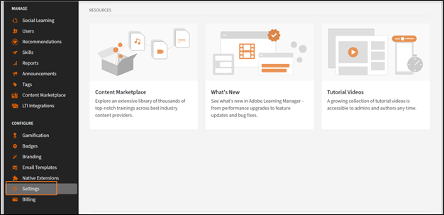
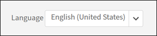
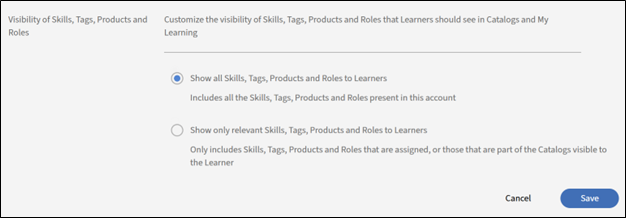

# Configurações básicas no Adobe Learning Manager

## Visão geral

A seção Informações básicas serve como base para a configuração do Adobe Learning Manager, contendo parâmetros organizacionais essenciais que definem como sua plataforma de aprendizado opera em diferentes regiões, idiomas e contextos de negócios.

## Principais benefícios

* Fornece fornecimento de conteúdo específico para a região e experiência do usuário.
* Padroniza exibições de tempo, formatos de data e representações de moeda.
* Fornece ajustes automáticos de horário de verão para fusos horários selecionados.
* Reduz a necessidade de ajustes manuais na plataforma.

## Definir configurações básicas

### Acessar configurações de informações básicas

1. Faça logon no Adobe Learning Manager como administrador.
2. Selecione **[!UICONTROL Configurações]** na barra de navegação esquerda.

   

3. Selecione **[!UICONTROL Informações Básicas]** na categoria **[!UICONTROL Básicas]**.

   

4. Selecione **[!UICONTROL Alterar]** para modificar as configurações básicas.

### Alterar configurações básicas

**País/Região**

O menu suspenso País/região nas configurações de administrador do Adobe Learning Manager permite especificar o país ou a região associada à organização. Essa configuração é usada para fins de localização, garantindo que a plataforma esteja alinhada com as preferências regionais, requisitos de conformidade e fusos horários.

**Fuso horário**

A lista suspensa Fuso horário permite definir o fuso horário padrão da plataforma. Isso garante que todas as atividades sensíveis ao tempo, como programações de cursos, prazos e relatórios, estejam alinhadas com precisão à hora local da organização ou dos alunos.

**Localidade**

Local se refere ao idioma e às configurações regionais da conta. O menu suspenso Local permite que os administradores configurem o idioma em que a interface e o conteúdo da plataforma são exibidos aos usuários. Essa opção garante que alunos e administradores possam interagir com a plataforma em seu idioma preferido.

**O exercício financeiro começa a partir de**

Essa opção permite definir o mês de início do exercício financeiro da organização. Por exemplo, se o exercício financeiro da sua organização começar em dezembro, você pode definir essa opção para dezembro. Os relatórios e análises serão alinhados a esse período fiscal.

**Moeda**

A opção Moeda permite definir a moeda padrão da conta. Essa moeda é usada para precificar objetos de aprendizado, como cursos, caminhos de aprendizado e certificações. Por exemplo, se a sua organização opera nos Estados Unidos, você pode definir a moeda como USD ($). Da mesma forma, para operações na Europa, você pode selecionar EUR (€).

### Alterar configurações de feedback

As configurações de feedback no Adobe Learning Manager fornecem aos administradores ferramentas para coletar e gerenciar feedback dos alunos (N1) e gerentes (N3). Essas configurações garantem que os cursos e os objetivos de aprendizado sejam avaliados de forma eficaz, permitindo melhoria contínua.

Antes de começar a coletar insights valiosos dos alunos, você precisa ativar o recurso de feedback L1 e definir seus parâmetros. Essa primeira etapa envolve navegar até a área Configurações de feedback e ativar o recurso para todos os cursos novos, bem como escolher o idioma principal dos formulários de feedback.

### Ativar feedback L1

Na guia Feedback N1, localize a opção de alternância chamada Ativar feedback N1 para o curso e o caminho de aprendizado recém-criados. Selecione a chave para ligá-lo. Isso incluirá automaticamente um formulário de feedback L1 para todos os novos cursos criados.

**Selecione um idioma padrão**

Use o menu suspenso Idioma para selecionar o idioma padrão dos formulários de feedback. Isso garante que as perguntas sejam apresentadas aos alunos no idioma correto.

**Configurar questionários para diferentes tipos de cursos**

O Adobe Learning Manager permite que você personalize as perguntas com base no fato de o seu curso ser um módulo em ritmo individualizado ou uma sessão de sala de aula ministrada por instrutor. Isso garante que o feedback recebido seja específico e relevante. Nesta etapa, você selecionará e refinará as perguntas dos Cursos de ritmo individualizado e Cursos de sala de aula para coletar os dados mais significativos.

**Para Cursos De Ritmo Individualizado**:

* **Pergunta obrigatória**: o questionário inclui uma pergunta obrigatória: “Qual a probabilidade de você recomendar este curso a um colega?”. Esta é uma pergunta padrão do Net Promoter Score (NPS) que fornece uma métrica importante para a satisfação geral do curso.
* **Personalizar perguntas**: revise a lista de perguntas fornecidas. Para incluir uma pergunta no formulário de feedback, certifique-se de que o botão de alternância ao lado dele esteja definido como Sim. Para remover uma pergunta, alterne a opção para Não.
* **Adicionar perguntas personalizadas**: se você tiver perguntas adicionais específicas ao seu conteúdo individualizado, selecione o link Adicionar Mais para criar e adicionar novas instruções personalizadas ao questionário.

**Para Cursos Em Sala De Aula**:

* **Personalizar perguntas**: revise a lista de perguntas personalizadas para treinamento em sala de aula. Alterne a opção ao lado de cada pergunta para Sim para incluí-la ou Não para excluí-la do formulário de feedback.
* **Adicionar perguntas personalizadas**: para adicionar novas perguntas específicas ao seu ambiente de sala de aula ou estilo de facilitação, selecione o link Adicionar Mais para criá-las e adicioná-las à lista.

**Configurar lembretes de comentários**

Para maximizar suas taxas de resposta, é uma boa prática configurar lembretes automatizados. Esta etapa mostra como configurar e agendar esses lembretes, definindo quando eles são enviados, com que frequência se repetem e por quanto tempo. Ao lembrar os alunos de forma proativa, você pode aumentar significativamente a quantidade de feedback coletada.

1. **Adicionar novo lembrete**: na seção **[!UICONTROL Lembretes de Comentários N1]**, selecione **[!UICONTROL Adicionar Novo Lembrete]**.

   

2. **Definir agendamento de lembrete**: no painel **Configurações de Lembrete** que aparece, use os menus suspensos e os campos de entrada para configurar o lembrete:

   a. **[!UICONTROL Quando enviar]**: selecione se o lembrete será enviado **[!UICONTROL Na conclusão do curso]** ou **[!UICONTROL Após a conclusão do curso]**.
   b. **[!UICONTROL Recorrência]**: selecione a frequência do lembrete (por exemplo, Toda semana).
   c. **[!UICONTROL Para]**: especifique a duração total (em semanas) para a qual os lembretes serão enviados (por exemplo, 4 semanas).

3. **[!UICONTROL Salve o lembrete]**: selecione o ícone de marca de seleção azul para salvar a nova configuração de lembrete. Você pode repetir esse processo para adicionar mais lembretes, se necessário.

   

4. Selecione **[!UICONTROL Salvar]** no canto superior direito da página para aplicar as configurações de feedback L1.

### Ativar feedback N3

Antes de coletar feedback do gerente de um aluno, você precisa definir as configurações de feedback N3. A primeira etapa envolve navegar até a página Configurações de feedback e selecionar a guia Feedback N3. Aqui, você pode definir o idioma da solicitação de feedback e revisar a pergunta principal que será enviada ao gerente.

**Selecione a guia Feedback N3**

Selecione a guia Feedback N3 na página Configurações de feedback.

**Revisar a instrução de comentários**

O feedback N3 é solicitado ao gerente do aluno como uma única declaração com a qual ele pode concordar ou discordar. A instrução padrão fornecida é: “O desempenho do funcionário mostrou melhoria nítida após realizar o treinamento.” Você pode editar essa declaração para melhor atender às necessidades da sua organização.

**Selecione um idioma padrão**

Selecione a lista suspensa Idioma para selecionar o idioma padrão para a solicitação de feedback.

**Configurar lembretes de comentários**

Para garantir que os gerentes forneçam feedback oportuno, você precisa configurar lembretes automatizados. Essa etapa envolve configurar quando esses lembretes são enviados e com que frequência eles se repetem. A captura de tela mostra que os lembretes de feedback N3 podem ser configurados para serem enviados uma vez na conclusão do curso, mas você pode adicionar mais lembretes, se necessário.

1. **[!UICONTROL Adicionar novo lembrete]**: para criar um novo lembrete, selecione o link **[!UICONTROL Adicionar Novo Lembrete]**.
2. **[!UICONTROL Definir agendamento de lembrete]**: no painel **[!UICONTROL Configurações de Lembrete]**, selecione os menus suspensos e os campos de entrada para configurar o lembrete:
a. **[!UICONTROL Quando enviar]**: selecione quando o lembrete for enviado. As opções são: **[!UICONTROL Na conclusão do curso]** e **[!UICONTROL Após a conclusão do curso]**.
b. **[!UICONTROL Recorrência]**: selecione a frequência do lembrete. Se a recorrência for **[!UICONTROL Uma vez]**, isso significa que o gerente receberá uma notificação para fornecer feedback. As opções disponíveis são: Uma vez, Todos os dias, Toda semana e Todo mês.
3. Depois de definir o agendamento, selecione o ícone de marca de seleção azul para salvar a configuração do lembrete. O lembrete é exibido na lista de lembretes existentes.

   

4. Selecione **[!UICONTROL Salvar]** no canto superior direito da página para aplicar as configurações de feedback N3.

## Configurações gerais

### Visão geral

As configurações gerais no Adobe Learning Manager fornecem aos administradores um local centralizado para configurar a experiência geral do aluno e os processos administrativos. Essas configurações permitem ativar ou desativar vários recursos para adaptar a plataforma às necessidades específicas da sua organização.

As principais configurações gerais configuráveis incluem:

* **Eficácia e moderação do curso:** opte por exibir uma classificação de eficácia do curso para os alunos e habilitar um recurso de moderação do curso que requer aprovação do administrador para todas as alterações do curso.
* **Recursos de envolvimento do aluno:** você pode habilitar ou desabilitar recursos como o **Quadro de Discussão** para comentários do curso, as habilidades de fontes externas para alunos e os **Emails de Resumo** para manter os alunos informados sobre novos conteúdos e progresso.
* **Gerenciamento de conteúdo e curso:** as configurações permitem configurar **Várias Tentativas** para e-learning interativo, adicionar **IDs exclusivas de objetos de aprendizado** ao conteúdo e definir o comportamento padrão para **Atualizações de versão de módulo**.
* **Gerenciamento de usuários:** habilite **Registrar usuários automaticamente** para adicionar novos usuários ao sistema e **Excluir automaticamente usuários internos** que ficaram inativos por um período especificado.
* **Personalização e exibição**: você tem controle sobre o que os alunos veem, como habilitar ou desabilitar os **Painéis de Filtro** para pesquisa, mostrar os **Rótulos de Catálogo** e personalizar até três **Links de Rodapé**.

### Moderação do curso

A moderação do curso permite supervisionar e gerenciar as atualizações feitas nos cursos pelos autores. Isso garante que quaisquer alterações no conteúdo do curso sejam revisadas e aprovadas pelos administradores antes de serem publicadas para os alunos. Selecionar a Moderação do curso exige que os autores procurem aprovação dos administradores para publicar um curso das alterações feitas no curso.

Quando um autor atualiza um curso, por exemplo, adiciona ou remove um módulo ou módulos e tenta publicar o curso,

1. Você recebe notificações sempre que o autor republica um curso com alterações.
2. Selecione a notificação para exibir as alterações feitas pelo autor.
3. Compare o conteúdo novo e o antigo.
4. Aprovar ou rejeitar alterações:
a. Aprove as alterações para republicar o curso com atualizações.
b. Rejeite as alterações para manter a versão anterior do curso ativa.
5. Os autores são notificados sobre a sua decisão, seja ela aprovação ou rejeição.

### Painel de discussão

A opção Quadro de discussão no Adobe Learning Manager permite que os alunos participem de discussões relacionadas a cursos, módulos ou programas de aprendizado. Você pode ativar e gerenciar esse recurso para promover a colaboração e o compartilhamento de conhecimento entre os alunos. Os painéis de discussão são vinculados a cursos ou módulos específicos, tornando-os contextualmente relevantes.

Como aluno, você poderá interagir com outros alunos e seus professores usando a guia Discussão. É possível exibir as postagens de qualquer curso que você vê ou no qual se inscreve. Se o administrador tiver habilitado as discussões para um curso, você poderá ver a guia Discussão ao lado da guia Notas daquele curso.

Ao selecionar a guia Discussões de um curso, você pode ver as publicações e comentários existentes para esse curso. Se você já tiver se inscrito no curso, também poderá começar a digitar postagens ou comentários para que outros usuários vejam. Depois de digitar a mensagem, clique em Publicar. Sua publicação deve conter pelo menos 10 caracteres.

A postagem é imediatamente visível na guia Discussões. Você pode classificar as publicações como Mais recentes primeiro ou Mais antigos primeiro e excluir as publicações que você escreveu. Mesmo depois de cancelar a inscrição no curso, você ainda poderá ver todas as postagens e excluir as que você escreveu.

Como administrador, você pode moderar as discussões para garantir a relevância e a adequação. Os alunos recebem notificações de respostas ou atualizações nas discussões das quais fazem parte.

### Várias tentativas

Selecionar essa opção permite que os autores definam o número de novas tentativas possíveis em um nível de curso ou módulo. Isso permite que os alunos façam novamente o curso ou a avaliação depois de concluído.  Essa configuração é útil para cursos que incluem questionários, testes ou tipos de curso que exigem avaliação.

### Visibilidade de habilidades, tags, produtos e funções

Essa opção decide se os alunos veem apenas as habilidades ou as tags atribuídas, as que fazem parte dos catálogos visíveis para os alunos ou todas as habilidades e tags. Isso inclui habilidades, etiquetas, produtos e funções associadas aos cursos ou caminhos de aprendizado.

Selecione **[!UICONTROL Editar]** para restringir o que um aluno pode ver:

Em seguida, os alunos exploram habilidades e etiquetas visíveis para eles e se inscrevem nas habilidades de sua escolha.

### IDs exclusivas do objeto de aprendizado

A opção permite atribuir um identificador exclusivo a cada objeto de aprendizado (como cursos, caminhos de aprendizado, certificações ou ajudas de tarefa). Isso garante que cada objeto de aprendizado tenha uma ID distinta, o que pode ser útil para acompanhamento, relatórios e integração com sistemas externos.

Quando ativado, os autores veem um campo para adicionar a ID do objeto de aprendizado ao criar um objeto de aprendizado. Eles podem adicionar as IDs adequadamente. As IDs exclusivas são adequadas para integração com sistemas de terceiros, incluindo LRS (Armazenamento de Registros de Aprendizagem) e LMS (Sistema de Gerenciamento de Aprendizagem). As IDs exclusivas também facilitam a pesquisa de objetos de aprendizado específicos por você ou um autor e o rastreamento deles por meio de transcrições do aluno.

### Mostrar painéis de filtro

Essa opção permite controlar quais opções de filtro estão disponíveis para os alunos no aplicativo do aluno. Esses filtros ajudam os alunos a refinar os resultados da pesquisa nas seções Meu aprendizado e Catálogo de um aluno. As seguintes opções de filtro estão disponíveis para seleção:

* Grupos
* Catálogos
* Tipo
* Formato
* Duração
* Habilidades
* Níveis de habilidade
* Tags
* Preço
* Faixa de preços
* Locais
* Produtos
* Níveis de Recomendação

>[!NOTE]
>
>Os filtros **[!UICONTROL Formato]** e **[!UICONTROL Duração]** estão desativados por padrão e não aparecem para os alunos imediatamente. Você deve selecioná-los explicitamente.

### Terminologia do produto

O Adobe Learning Manager tem determinada terminologia de produto para definir Objetos de aprendizado, como cursos, caminhos de aprendizado ou ajudas de tarefa. Você pode personalizar a terminologia em inglês e francês, com base em sua preferência. Baixe o modelo de terminologia do produto e substitua, por exemplo, o Plano de aprendizado pela Regra prescritiva. Da mesma forma, altere entradas semelhantes em francês. Em seguida, faça upload do modelo modificado e clique em Salvar para atualizar as terminologias no produto.

Consulte Terminologia do produto no Adobe Learning Manager para obter mais informações.

### Créditos

Quando ativados, autores e professores podem gravar o número de créditos instrucionais para cada sessão ou módulo. Os créditos representam o tempo de instrução que um aluno será creditado por concluir a atividade. Os valores de crédito aparecem nas transcrições do aluno, nos relatórios de aprendizado e contribuem para os cálculos da duração total dos Caminhos de aprendizado. Se você desabilitar essa configuração, os valores de crédito inseridos anteriormente serão mantidos e restaurados se a configuração estiver ativada novamente.

### Atualização da versão do módulo

Essa opção permite que os administradores atualizem o conteúdo de um módulo sem interromper o progresso dos alunos que já estão inscritos nos cursos que contêm esse módulo. Isso garante que os alunos possam continuar sua jornada de aprendizado sem problemas, enquanto os autores podem manter o conteúdo atualizado. Com a opção ativada, os autores podem fazer upload de uma nova versão de um módulo (por exemplo, pacotes SCORM, AICC ou xAPI) para substituir a versão existente.

* Os alunos que já iniciaram o módulo continuarão com a versão em que foram inscritos.
* Novos alunos acessarão automaticamente a versão atualizada.
* O Adobe Learning Manager controla as diferentes versões do módulo para fins de relatórios e auditoria.

### Registrar usuários automaticamente

Essa opção permite registrar automaticamente os usuários em catálogos ou conteúdo de aprendizado específicos quando são adicionados ao sistema. Isso garante que os usuários tenham acesso imediato a materiais de aprendizado relevantes sem exigir intervenção manual.

* Novos usuários são automaticamente registrados em catálogos ou cursos predefinidos ao serem adicionados ao sistema.
* Os administradores podem definir regras para determinar para quais catálogos ou cursos os usuários são registrados automaticamente, com base em atributos de usuário como funções, grupos ou outros critérios. Consulte [Planos de Aprendizado no Adobe Learning Manager](/help/migrated/administrators/feature-summary/learning-plans.md) ou [Inscrever automaticamente grupos de usuários externos em cursos após o registro](https://elearning.adobe.com/2024/05/automatically-enroll-external-user-groups-in-courses-upon-registration/) para obter mais informações.

### Excluir usuários internos automaticamente

Essa opção exclui usuários se eles não acessarem o Adobe Learning Manager por uma duração especificada.  Especifique por quantos dias um usuário pode ter acesso sem fazer logon no Adobe Learning Manager. Usando essa opção, você também pode remover automaticamente usuários internos inativos do sistema após um período especificado. Isso ajuda a manter um banco de dados de usuários limpo e organizado, removendo usuários que não estão mais ativos.

* Os usuários internos que ficaram inativos por uma duração definida são excluídos automaticamente.
* Os usuários são notificados antes da exclusão, dando-lhes a oportunidade de fazer logon e impedir a remoção.
* Para que seu acesso seja restaurado, um usuário excluído deve entrar em contato com o administrador da conta.

### Remoção Automática de Usuários Excluídos

Remova do sistema, de forma automática e permanente, os usuários que estiveram no estado de excluídos por um período especificado. Após remover, todos os dados associados do usuário são removidos permanentemente e não podem ser recuperados.

### Mostrar rótulos de catálogo

Essa opção permite que um autor defina etiquetas de catálogo ao criar um Objeto de aprendizado. Um aluno vê as etiquetas do catálogo na seção Catálogo do aplicativo do aluno. Esses rótulos ajudam os alunos a identificar e diferenciar entre vários catálogos disponíveis. Se a opção estiver desmarcada, os cursos ou objetos de aprendizado serão movidos para o catálogo padrão.

### Tipo de conformidade personalizado

Essa opção permite que um autor defina e gerencie tipos de conformidade personalizados para os requisitos específicos de sua organização ao criar objetos de aprendizado. Os autores podem adicionar um rótulo de conformidade e um prazo para o curso que estão criando.
Isso é particularmente útil para controlar e aplicar o treinamento de conformidade para funcionários com base em políticas organizacionais exclusivas.

### Alunos podem visualizar suas pontuações

Selecionar essa opção garante que os alunos possam visualizar as pontuações do questionário nas transcrições do aluno. Nas transcrições, as colunas Quiz_score, Quiz_score_max, Highest_Quiz_score_e Highest_Quiz_score_max ajudam um aluno a ver suas pontuações de avaliação. Essas pontuações ajudam os alunos a controlar o progresso e a entender o desempenho.

Se você desmarcar a opção, as pontuações do quiz não serão exibidas nas transcrições do aluno dos alunos.

### E-mail do resumo

Essa opção permite enviar e-mails de resumo aos alunos, fornecendo atualizações sobre as atividades de aprendizado, o progresso e os futuros prazos. Esses e-mails são projetados para manter os alunos informados e envolvidos com seus programas de treinamento. Esses e-mails capturam as atividades dos alunos, como cursos concluídos.

Você pode alterar a frequência dos emails nas configurações do Modelo de email. Além disso, você pode personalizar o conteúdo dos e-mails de resumo para incluir detalhes específicos relevantes para os alunos.

>[!NOTE]
>
>* Para contas ativas, os e-mails de resumo serão desativados por padrão e você pode ativá-los manualmente.
>* Para contas de avaliação, a opção para e-mails de resumo permanecerá desativada e você não poderá ativar a opção.

### Ativar curso/caminho de aprendizado/certificação/cartão de ajuda de tarefa

Essa opção permite que os autores adicionem imagens de capa nos cartões do curso do aluno para diferentes tipos de conteúdo de aprendizado. Essas imagens ajudam os alunos a identificar facilmente o tipo de conteúdo (por exemplo, curso, caminho de aprendizado, certificação ou ajuda de tarefa) à primeira vista. Ao criar um Objeto de aprendizado, os autores podem adicionar imagens de capa aos cursos.

Se você não selecionar a opção, os cartões não exibirão nenhum ícone.

### Links de rodapé

Essa opção permite personalizar a seção de rodapé do aplicativo do aluno adicionando links para recursos externos, sites da empresa ou outras páginas relevantes. Esses links aparecem na parte inferior da interface do aplicativo do aluno e podem ser usados para fornecer acesso rápido a informações importantes. Os links podem direcionar os alunos a sites externos, páginas de ajuda ou políticas da empresa. Eles fornecem aos alunos acesso fácil a recursos adicionais diretamente do aplicativo.

Veja como personalizar os links do rodapé:

1. **[!UICONTROL Adicionar links]**: selecione **[!UICONTROL Adicionar Mais]** e insira o nome e a URL ou ID de email nos campos especificados. Verifique se o URL tem o prefixo http:// ou https://.
2. **[!UICONTROL Replicar entre localidades]**: selecione **[!UICONTROL Replicar]** para propagar as alterações em cascata entre todas as localidades, garantindo que todos os idiomas recebam o mesmo nome e URL.
3. Selecione **[!UICONTROL Salvar]** para aplicar as alterações.

**Opções adicionais:**

* Redefinir valores padrão: selecione o ícone Redefinir para reverter para os valores padrão nos campos Ajuda e Entrar em contato com o administrador.
* Personalizar para todos os idiomas: selecione um idioma na lista suspensa e, em seguida, adicione o nome e o URL desse idioma. Salve as alterações para atualizar os links do rodapé para o idioma selecionado.

### Fuso horário do relatório

Essa opção permite definir uma preferência em nível de conta para exportar o relatório de transcrições de aprendizado e resumo da sessão em fusos horários específicos. As opções disponíveis são:

* UTC (comportamento padrão)
* Preferência de fuso horário no nível da conta

Essa opção também garante que a transcrição do aluno baixada usando a API Trabalhos reflita o fuso horário selecionado.

### Integração do Badgr

Selecionar a opção permite que os alunos:

* Carregue as medalhas no site do Badgr.
* Compartilhe as medalhas nas redes sociais.

Como funciona:

* Selecione a opção na seção Integração do Badgr.
* Os alunos fazem logon na conta do Badgr no Adobe Learning Manager.
* As medalhas obtidas no Adobe Learning Manager são carregadas automaticamente na conta do Badgr.

>[!NOTE]
>
>* A Adobe Learning Manager não fornece uma conta do Badgr como parte da integração. Os alunos devem criar sua própria conta do Badgr.
>* Os alunos podem configurar suas contas do Badgr diretamente na página Medalhas no aplicativo do aluno.

Consulte [Suporte para medalhas do Badgr](/help/migrated/learners/feature-summary/badges.md#support-for-badgr-badges) para obter mais informações.

### Mostrar notas

Essa opção permite ativar ou desativar a exibição das classificações do curso no aplicativo do aluno. Quando ativada, os alunos podem ver as classificações dos cursos, o que os ajuda a tomar decisões informadas sobre a inscrição em um curso.

* Se a opção Eficácia do curso estiver selecionada, os alunos poderão ver apenas o valor da eficácia do curso. A eficácia do curso é calculada com base no feedback do aluno (N1), nas pontuações do quiz (N2) e no feedback do gerente (N3).
* Se a opção Classificação por estrelas estiver selecionada, os alunos poderão ver apenas a classificação por estrelas média e o número de alunos que classificaram o curso. A classificação por estrelas é a média de todas as classificações fornecidas pelos alunos ao concluírem um curso.

Para novas contas, a seção Mostrar classificações terá a opção Classificação por estrelas ativada por padrão.

Para contas existentes, se a conta tinha a opção Eficácia do curso ativada anteriormente, a seção Mostrar classificações será ativada com a opção Eficácia do curso selecionada. Se a opção Eficácia do curso estiver desativada, a seção Mostrar classificações também será desativada. Quando a seção Mostrar classificações estiver ativada, a opção Classificação por estrelas será ativada por padrão.

### Exibição padrão (função do aluno)

Essa opção se refere à exibição dos alunos do catálogo de cursos. Marque a caixa de seleção Exibição em lista para alterar a exibição dos alunos da exibição de grade padrão para a exibição em lista.

### Caminhos de aprendizado

Se selecionar **[!UICONTROL Habilitar recursos estendidos do Caminho de Aprendizado]**, você poderá incluir os Caminhos de Aprendizado nos Caminhos de Aprendizado e combinar esses Caminhos de Aprendizado com Cursos. A opção é irreversível.

### Gestão de instrutores

Esta opção garante que os autores possam selecionar professores para uma sessão de sala de aula virtual ou sala de aula a partir de uma lista predeterminada.

**Principais recursos:**

* Restringir seleção de professor: somente usuários com a função de professor podem ser atribuídos a sessões.
* Impacto nos fluxos de trabalho de migração: essa restrição não se aplica a fluxos de trabalho de migração.

### Visualização do módulo

Se selecionar Ativar, os autores podem visualizar um curso como alunos após criarem o curso.

### Ativar preços para cursos/caminhos de aprendizado/certificações

Essa opção permite ativar a funcionalidade de comércio eletrônico para cursos, caminhos de aprendizado e certificações. Esse recurso é usado principalmente para integrar o Adobe Learning Manager ao Adobe Commerce, permitindo que as organizações monetizem suas ofertas de treinamento.
Depois que você ativa o recurso, o campo Moeda aparece na página Informações básicas.

Quando os cursos são cobráveis, os autores podem especificar o curso, o caminho de aprendizado ou o preço da certificação. Os alunos podem comprar treinamento diretamente do Adobe Learning Manager ou de [sites AEM personalizados](/help/migrated/integrate-aem-learning-manager.md).

>[!NOTE]
>
>Certos tipos de treinamento, como certificações recorrentes e cursos aprovados pelo gerente, não podem ser adquiridos.

### Ativar carrinho com SKU de vários itens

Essa opção permite que os alunos adicionem vários itens de treinamento (cursos, caminhos de aprendizado, certificações) a um carrinho de compras e os comprem juntos. Esse recurso faz parte da funcionalidade de comércio eletrônico integrada ao Adobe Commerce.

Esse recurso é particularmente útil para organizações que vendem vários itens de treinamento e desejam simplificar o processo de compra para alunos.

**Principais recursos:**

* Várias compras: os alunos podem adicionar vários itens ao carrinho e comprá-los em uma transação. Consulte Carrinho de vários itens para obter mais informações.
*Finalização simplificada: reduz a necessidade de os alunos fazerem compras separadas para cada item de treinamento.
* Gerenciamento de SKUs: os administradores podem gerenciar SKUs para cursos, programações de aprendizado e certificações para garantir o acompanhamento e a emissão de relatórios adequados.

### Cursos/caminhos alternativos

Quando os alunos concluem um curso/caminho, outro conjunto especificado de cursos/caminhos pode ser marcado como concluído por meio de alternativo. Isso é útil quando os cursos abrangem conteúdo equivalente ou sobreposto. Por exemplo, quando um novo curso substitui uma versão mais antiga ou quando existem variantes regionais do mesmo treinamento. Os alunos não são inscritos automaticamente nos cursos/caminhos marcados como concluídos por meio de alternativos e receberão apenas créditos, medalhas e pontos para o curso/caminho que efetivamente concluíram. As conclusões alternativas aparecem na transcrição do aluno e contam para qualquer caminho de aprendizado ou certificação que inclua o curso alternativo.

**Ativar conclusões retroativas (Irreversível)**
Se os alunos concluíram um curso/caminho anteriormente e outro curso/caminho foi adicionado posteriormente em Cursos/caminhos alternativos, eles também serão marcados como concluídos por meio de alternativos para os alunos. Isso se aplica retroativamente a todas as conclusões passadas — não apenas às inscrições futuras. Use-a quando quiser que conclusões históricas contem para cursos alternativos recém-adicionados. Uma vez ativado, não pode ser desativado.

**Ativar inclusões retroativas (Irreversível)**
Se um curso/caminho for removido dos cursos/caminhos alternativos, os alunos que foram marcados anteriormente como concluídos por meio de alternativos serão marcados como incompletos. Isso afeta todos os alunos cuja conclusão foi baseada apenas na alternativa, não os alunos que concluíram o curso diretamente. A transcrição refletirá o status incompleto atualizado. Uma vez ativado, não pode ser desativado.

### Visibilidade do quadro de notas {#gradebookvisibility}

Quando ativado, os autores podem controlar a visibilidade do catálogo de notas no nível do curso, permitindo que os alunos visualizem suas pontuações ponderadas no módulo, agreguem a pontuação do curso e o status de aprovação/reprovação diretamente no reprodutor do curso. Se essa configuração estiver desativada no nível da conta, os alunos não poderão ver o livro de notas em nenhum curso, independentemente de como os cursos individuais estão configurados. As pontuações e os cálculos do gradebook continuam a ser executados em segundo plano para fins de relatórios do administrador, mesmo quando a visibilidade do aluno está desativada.

**Habilitar exibição Gradebook para alunos**

Ativa a permissão no nível da conta que permite aos autores mostrar ou ocultar o livro de notas por curso. Uma vez ativado, os autores veem uma opção Mostrar livro de notas aos alunos no editor do curso. Os alunos verão uma guia Caderno no reprodutor do curso para qualquer curso onde o autor o ativou. Desativar essa configuração no nível da conta substitui todas as configurações no nível do curso. Os alunos não verão o livro de notas em nenhum curso até que a configuração seja reativada. Para obter mais informações, consulte [Gradebook para administrador](/help/migrated/administrators/feature-summary/alm-admin-gradebook.md).

### Aprendizado externo

Quando ativadas, os alunos podem enviar e acompanhar atividades de aprendizado concluídas fora do Adobe Learning Manager — como certificações, workshops, conferências e cursos externos, diretamente do painel do aluno. Os envios são revisados e aprovados pelo gerente direto do aluno antes de serem gravados. Depois de aprovada, a atividade de aprendizado externa é adicionada à transcrição do aluno e é contabilizada no registro de aprendizado geral do aluno. Os administradores podem configurar os campos que os alunos devem preencher ao enviar uma atividade de aprendizado externa, incluindo campos personalizados específicos da sua organização.

**Habilitar**

Ativa o recurso Aprendizado externo para todos os alunos da conta. Uma vez ativado, um formulário de envio fica disponível no painel do aluno. Os alunos podem inserir detalhes como o nome do treinamento, a duração, a data, a pontuação e a prova de conclusão. O envio é enviado ao gerente dele para revisão e aprovação. Os envios aprovados aparecem na transcrição do aluno e nos relatórios do administrador. Os envios rejeitados não são registrados na transcrição.

>[!NOTE]
>
>Ativar essa configuração adiciona novas colunas à transcrição do aluno para envios de aprendizado externos. Se a sua organização usa fluxos de trabalho automatizados ou integrações que processam dados de transcrição do aluno, revise-os antes de ativar para garantir a compatibilidade com a estrutura de transcrição atualizada.

Aprendizado externo é um tipo de atividade de aprendizado para treinamento fora da plataforma. Os alunos o usam para registrar um treinamento que não existe no Adobe Learning Manager, como um exame de certificação do setor, uma conferência profissional, uma sessão de mentoreamento ou um curso acadêmico.

1. Um **aluno** preenche um formulário de envio com detalhes sobre seu treinamento externo e, opcionalmente, carrega o comprovante de conclusão.

2. O **gerente** do aluno recebe uma notificação para revisar o envio e o aprova ou rejeita com um comentário opcional.

3. Na aprovação, o envio é adicionado à **Transcrição do aluno**, onde os administradores podem exibi-la e relatá-la.

Esse fluxo de trabalho permite que as organizações combinem o treinamento obrigatório de conformidade na plataforma com o aprendizado ad-hoc e autodirigido que seus funcionários realizam no mundo real, e monitorem ambos em um único sistema.

O aprendizado externo é um recurso configurável. Os administradores controlam se ele está disponível para os alunos, quais campos aparecem no formulário de envio e se cada campo é obrigatório ou opcional. Campos personalizados podem ser adicionados para capturar informações específicas da organização, como um tipo de treinamento ou um número de referência do certificado.

### Ciclo de vida do status do envio

Cada envio de aprendizado externo passa por um conjunto definido de status:

| **Status** | **Significado** |
|-------------------|--------------------------------------------------------------------------------|
| Aguardando Aprovação | O aluno enviou a solicitação; ela está com revisão do gerente pendente. |
| Aprovado | O gerente aprovou o envio; ele aparece na transcrição do aluno. |
| Rejeitado | O gerente rejeitou o envio. O aluno pode enviar uma nova solicitação. |

Um aluno pode editar um envio enquanto ele está no status **Aguardando Aprovação**. Depois que um gerente executa uma ação, o envio não pode mais ser editado. Se um envio for rejeitado, o aluno enviará uma nova solicitação de aprendizado externa em vez de editar a rejeitada.

### Disponibilidade e visibilidade dos recursos

Os administradores controlam a disponibilidade de aprendizado externo por meio de uma única configuração no nível da conta:

**Quando o aprendizado externo estiver habilitado:**

* Os alunos veem a guia **Aprendizado externo** na navegação e podem enviar novas solicitações
* Os gerentes veem a guia **Aprendizado Externo** em seu painel de equipe e podem revisar os envios
* As transcrições do administrador e do aluno incluem dados de aprendizado externos para envios aprovados

**Quando o aprendizado externo está desabilitado:**

* Os alunos que não têm envios anteriores não veem nenhuma interface de aprendizado externa

* Os alunos que têm envios anteriores ainda podem exibir seu histórico e status de envio, mas não podem criar novos envios

* Os gerentes mantêm o acesso à guia Aprendizado externo se sua equipe tiver envios anteriores; caso contrário, a guia é removida

* Os dados de transcrição existentes para envios aprovados não são afetados

#### Campos principais

Esses campos estão disponíveis para todas as contas por padrão. Os administradores podem escolher quais campos mostrar no formulário de envio do aluno e marcar cada um como obrigatório ou opcional.

| **Campo** | **Tipo** | **Notas** |
| --- | --- | --- |
| Título | Texto | O nome do aprendizado, curso ou certificação externo. |
| Descrição/observações | Texto | O aluno pode adicionar detalhes sobre o provedor de treinamento ou o contexto. |
| Data/intervalo de datas | Data/hora | Data inicial e/ou data final. Oferece suporte a horas, minutos, semana, mês, dias ou ano. |
| Duração | Duração (horas) | Tempo gasto no treinamento externo. |
| Pontuação | Número | A pontuação que o aluno recebeu, se aplicável. |
| Anexos | Upload de arquivo | Prova de conclusão. O aluno pode enviar um certificado, uma transcrição ou outra documentação. |

#### Campos personalizados

Os administradores podem adicionar até 10 campos personalizados para capturar informações adicionais específicas da organização. Os campos personalizados oferecem suporte aos seguintes tipos:

| **Tipo** | **Descrição** |
|------------|------------------------------------------------------------------|
| Texto | Entrada de texto livre. |
| Número | Entrada numérica. |
| Caixa de seleção | Alternância única de sim/não. |
| Lista suspensa | Seleção única em uma lista de opções definida pelo administrador. |

### Comprovante dos requisitos do arquivo de conclusão

* **Tipos de arquivos compatíveis:** PDF, DOC, DOCX, PNG, JPEG, JPG

* **Tamanho máximo do arquivo:** 50 MB por anexo

#### O que os administradores controlam no aprendizado externo

O aprendizado externo está **desabilitado por padrão** para todas as contas. Você deve ativá-la explicitamente para que os alunos possam enviar solicitações ou os gerentes possam ver a guia Revisão.

Ao ativar o aprendizado externo:

* Os alunos obtêm acesso à guia **Aprendizado externo** e podem enviar novas solicitações

* Os gerentes obtêm acesso à guia de revisão do **Aprendizado Externo**

* As transcrições do administrador e do aluno obtêm as colunas de relatórios para atividades de aprendizado externas aprovadas. Depois que o aprendizado externo é ativado, ele pode afetar os relatórios de transcrição do aluno. Se a sua empresa usa dados de transcrição do aluno para automação, revise e atualize quaisquer fluxos de trabalho dependentes para considerar os novos campos e registros de aprendizado externos.

Ao desativar o aprendizado externo após ele ter sido usado:

* Os envios de novos alunos estão bloqueados

* Os alunos com aprovação pendente enviada podem ser editados

* Os gerentes com envios anteriores ainda podem agir em solicitações pendentes

* Os dados de transcrição para envios aprovados anteriormente permanecem inalterados

* Você pode reativar o recurso a qualquer momento. Nenhum dado é perdido quando o recurso é desativado.

#### Ativar ou desativar aprendizado externo

**Cuidado:** a habilitação do Aprendizado Externo adiciona novas colunas à Transcrição do Aluno Administrador: **Nome do Aprendizado Externo**, **Comentário de Conclusão** e todos os campos personalizados configurados para sua conta. As colunas do campo personalizado aparecem no final da transcrição.

Se sua organização usa a transcrição do aluno em pipelines de relatórios downstream ou fluxos de trabalho automatizados, atualize esses sistemas para manipular as novas colunas antes de ativar esse recurso.

1. Faça logon no Adobe Learning Manager como administrador.

2. No painel de navegação esquerdo, selecione **Configurações**.

3. Selecione **Geral**.

4. Role até a seção **Aprendizado Externo**.

5. Marque a caixa de seleção **Habilitar Aprendizado Externo** para habilitar o recurso.

6. Selecione **Salvar**.

Os alunos agora podem enviar solicitações externas de aprendizado. Seus gerentes receberão notificações na plataforma quando os envios forem criados.

Para desativar o recurso, siga os mesmos passos e desative a opção.

#### Configurar o formulário de aprendizado externo

Depois de ativar o recurso, configure quais campos aparecerão no formulário de envio do aluno.

1. Em **Configurações > Geral**, abra a seção **Aprendizado Externo**.

2. Em **Configuração do Formulário**, revise a lista de campos padrão.

3. Marque a caixa de seleção ao lado de cada campo para exibi-lo ou ocultá-lo no formulário do aluno.

4. Para cada campo visível, selecione **Obrigatório** para controlar se os alunos devem concluí-lo antes de enviar.

5. Selecione **Salvar**.

**Observação:** o campo **Título** é sempre obrigatório e não pode ser ocultado nem se tornar opcional.

O formulário de envio do aluno reflete imediatamente suas alterações. Os envios existentes não são afetados por alterações na configuração do formulário.

#### Adicionar e gerenciar campos personalizados

Você pode adicionar até 10 campos personalizados para capturar informações específicas da sua organização.

**Adicionar um campo personalizado**

1. Em **Configurações > Geral**, abra a seção **Aprendizado Externo**.

2. Expanda **Campos personalizados**.

3. Selecione **Novo campo**.

4. Selecione um **Tipo de Campo**: **Texto**, **Número**, **Caixa de Seleção** ou **Suspenso**.

   1. Se você selecionar **Suspenso**, insira a lista de valores que os alunos podem escolher. É possível adicionar até 100 valores suspensos.

   2. Digite o nome do campo e, opcionalmente, sua descrição.

5. Marque ou desmarque a opção **Obrigatório** para os novos campos personalizados.

6. Selecione **Salvar**.

O novo campo aparece imediatamente no formulário de envio do aluno.

**Editar um campo personalizado**

1. Em **Configurações > Geral**, abra a seção **Aprendizado Externo**.

2. Ao lado do campo personalizado que você deseja editar, selecione **Editar**.

3. Atualize o nome do campo ou, para campos suspensos, adicione, edite ou remova valores.

4. Selecione **Salvar**.

Editar um nome de campo ou valores suspensos não altera os dados já capturados nos envios existentes. Somente os novos envios usam as etiquetas e opções atualizadas.

**IMPORTANTE**

Depois de adicionar um campo personalizado, você não pode excluí-lo. Você só pode editá-lo. Se quiser que um campo não apareça em um formulário do aluno, desmarque o campo.

### Configurações do reprodutor

Essa opção permite que os autores personalizem o Fluidic Player para diferentes cursos no nível do curso. Os autores podem configurar como o conteúdo do treinamento é exibido aos alunos no reprodutor. Isso inclui configurações relacionadas ao idioma do conteúdo, preferências de interface e opções de reprodução.

### Gerentes podem marcar como concluído

Essa opção permite que os gerentes marquem o curso, a certificação ou a conclusão do Caminho de Aprendizado para sua equipe. Esse recurso é útil em cenários em que os alunos tenham concluído um treinamento fora da plataforma ou precisem de intervenção manual para atualizar o progresso.
Os gerentes podem marcar a conclusão do curso por meio de:

* Módulo de lista de verificação: o módulo de lista de verificação permite que os gerentes avaliem o desempenho dos alunos com base em tarefas ou critérios específicos. Os autores devem ativar esse módulo durante a criação do curso e atribuir gerentes como revisores.
* Página Curso: na página do curso:
a. Selecione a guia **[!UICONTROL Alunos]** no painel esquerdo.
b. Selecione o aluno cuja participação você deseja marcar.
c. Selecione **[!UICONTROL Ações]** > **[!UICONTROL Marcar Conclusão]**.

**Observações adicionais:**

* Os gerentes também podem exportar a lista de alunos para fins de relatório.
* Se um curso incluir várias instâncias, os gerentes podem exibir e gerenciar os alunos separadamente para cada instância.

### Retirar

Essa opção permite que os autores retirem conteúdo de treinamento (cursos, programações de aprendizado, certificações) que não é mais relevante ou necessário. O conteúdo retirado é removido do catálogo do aluno, mas permanece acessível em relatórios e dados históricos para fins de controle. Você tem duas opções:

1. Uma vez retirados, os alunos inscritos poderão exibir e executar ações, mas os alunos ainda não inscritos perderão o acesso:
a. Alunos inscritos:
i. Os alunos que já estão inscritos no curso ou caminho de aprendizado retirado ainda podem acessar o conteúdo.
ii. Eles podem continuar a executar ações, como concluir o curso ou visualizar o material.
b. Alunos ainda não inscritos:
i. Os alunos que não se inscreveram no curso ou no caminho de aprendizado antes de ele ser desativado não verão mais o conteúdo no catálogo.
ii. Eles perderão totalmente o acesso ao conteúdo retirado.
2. Uma vez retirados, os alunos inscritos e ainda não inscritos perderão o acesso:
a. Alunos inscritos:
i. Os alunos que já estavam inscritos no curso ou no caminho de aprendizado perderão o acesso ao conteúdo assim que for retirado.
ii. Eles não poderão mais exibir ou executar nenhuma ação no conteúdo desativado.
b. Alunos ainda não inscritos:
i. Os alunos que não se inscreveram no curso ou no caminho de aprendizado também perderão acesso, pois o conteúdo não aparecerá mais no catálogo.

### Desativação Automática

Essa opção permite que os autores definam uma data específica para um curso ser desativado automaticamente. Quando um curso é desativado, ele não está mais disponível para novas inscrições, mas os alunos já inscritos ainda podem acessar e concluir o curso.

Principais observações:

* Uma vez que a data de desativação automática é definida, o curso passará automaticamente para o estado Desativado na data especificada.
* Os cursos retirados não são visíveis no catálogo de cursos para novos alunos, mas os alunos existentes ainda podem acessá-los e concluí-los.

### Mostrar todos os cursos inscritos nos resultados da pesquisa

Essa opção permite que os alunos visualizem cursos nos resultados de pesquisa mesmo se fizerem parte do caminho de aprendizado ou da certificação inscritos.

### Importação de habilidades

Essa opção permite importar habilidades de fontes externas, como LinkedIn Learning e Go1, usando os respectivos conectores. Essa funcionalidade integra Nuvens de Habilidades e Sistemas de Gerenciamento de Talentos externos ao Adobe Learning Manager, aprimorando a capacidade da plataforma de gerenciar e utilizar habilidades de forma eficaz.

As habilidades de provedores de conteúdo externos são adicionadas ao repositório de habilidades definido pelo administrador no Adobe Learning Manager. Essas habilidades se tornam disponíveis para os autores durante o fluxo de trabalho de criação do curso.

1. Selecione **[!UICONTROL Habilitar]**.

   

2. Selecione um provedor de conteúdo na lista suspensa **[!UICONTROL Selecionar fonte de habilidades]**.
3. Selecione **[!UICONTROL Salvar]**.
Observe que, depois que a opção é ativada, a ação é irreversível. Você não pode desativar ou mudar para outra fonte mais tarde.
