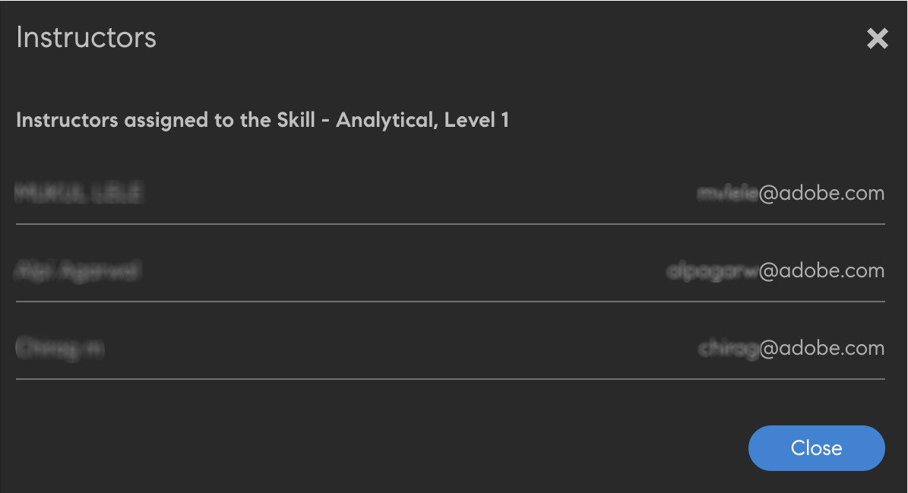

# Criar e modificar habilidades e níveis

Criar, atribuir e modificar habilidades e níveis.

Mapa de habilidades é um agrupamento de conjuntos de habilidades, conhecimento e características de um funcionário em uma organização. Esses mapas de habilidades ajudam as empresas/organizações a definir ou aumentar as expectativas de desempenho para seus funcionários. As habilidades permitem que os funcionários alinhem seus comportamentos às expectativas organizacionais.

O Adobe Learning Manager permite mapear o desempenho dos alunos com base em seu conjunto de habilidades através do mapa de habilidades. Quando os alunos terminam de realizar alguns cursos, eles podem saber sua classificação em relação a cada habilidade visualizando o mapa de habilidades.

O objetivo fundamental das habilidades no LMS do Learning Manager é fornecer ao administrador uma ferramenta que alinhe a aprendizagem com os objetivos comerciais.

## Adicionar uma habilidade {#addaskill}

Como administrador, você pode executar o seguinte:

* Mapeie um domínio para uma habilidade.
* Adicione vários níveis de uma habilidade.
* Adicionar uma medalha a um nível.

Para adicionar uma habilidade, siga as etapas abaixo:

1. No painel esquerdo, clique em **[!UICONTROL Habilidades]**. Dê um nome e uma descrição à habilidade.

   

   *Adicionar nome e descrição de uma habilidade*

1. Atribua um domínio à habilidade. Ao criar uma habilidade, você pode mapeá-la com os domínios de habilidade mais relevantes suportados pelo Learning Manager. Para obter mais informações, consulte [***Mapear habilidades com domínios***](/help/migrated/administrators/feature-summary/curation-skills.md).

   Comece a digitar o domínio no campo e veja as recomendações. Escolha a opção ou opções que sejam relevantes para a habilidade.

   

   *Adicionar um domínio*

1. Atribua os níveis à habilidade. Para adicionar um nível, clique em **[!UICONTROL Adicionar]**.

   Você pode criar e atribuir Habilidades aos funcionários. Há vários níveis de habilidades e cada nível requer um certo número de créditos para ser obtido.

   Você pode atribuir no máximo três níveis a uma habilidade. O caminho de aprendizado é o de inscrever alunos em vários objetos de aprendizado, que se traduzem em um certo número de créditos que atendem aos requisitos dos vários níveis de uma habilidade.

   Uma vez que esses objetos de aprendizado (LOs) e níveis foram alcançados, o aluno agora está equipado para executar em um nível mais produtivo do que antes.

   

   *Adicionar níveis de habilidade*

   Ao adicionar uma habilidade, você também pode atribuir decimais aos créditos. Os créditos são exibidos com até duas casas decimais.

   O suporte a decimais está disponível apenas em inglês.

1. Escolha uma medalha para o nível. Na guia **[!UICONTROL Medalha]** selecione uma imagem que deve ser usada como um emblema para esse nível.
1. Para salvar as alterações, clique em **[!UICONTROL Salvar]**.

   Depois que a habilidade for criada, você poderá localizar a habilidade recém-criada no **[!UICONTROL Habilidade]** página. Você também pode ver os domínios e a breve descrição da habilidade. Você também pode ver os níveis e créditos que foram atribuídos a cada nível.

   

   *Exibir lista de habilidades de if*

## Atribuir a habilidade aos alunos {#assigntheskilltolearners}

Os administradores podem atribuir as habilidades aos alunos.

Depois de criar suas habilidades e salvá-las, elas são listadas na página de habilidades. Agora, você pode começar a atribuir essas habilidades aos alunos da seguinte maneira:

1. Na guia **[!UICONTROL Habilidade]** clique no hiperlink com o número de alunos inscritos na habilidade. Para uma habilidade recém-criada, o número de alunos de todos os níveis é zero.

   

   *Exibir alunos atribuídos a uma habilidade*

   Para este exemplo, adicione alunos do Nível 1. Clique no hiperlink próximo ao Nível 1.

1. Na caixa de diálogo Alunos, clique em **[!UICONTROL Adicionar alunos]**.

   

   *Adicionar alunos*

1. Pesquise alunos e adicione-os. Você também pode adicionar grupos de usuários.

   

   *Pesquisar e adicionar alunos*

1. Para salvar as alterações, clique em **[!UICONTROL Salvar]**.

   Depois de atribuir os alunos, todos os alunos em um grupo de usuários, se houver, são inscritos automaticamente na habilidade, por padrão. Você pode fazer com que os alunos recusem a inscrição automática clicando no **[!UICONTROL Inscrição Automática]** botão.

   

   *Desabilitar inscrição automática*

   Alunos individuais podem se inscrever automaticamente ou podem ser inscritos pelo administrador em um programa de aprendizado.

1. Depois de clicar em **[!UICONTROL Fechar]**, você pode ver o número total de alunos atribuídos à habilidade criada.

   Neste exemplo, há dois alunos individuais e três alunos em um grupo de usuários.

   

   *Número de alunos atribuídos a uma habilidade*

## Atribuir a habilidade a um curso {#assignskilltocourse}

Depois de criar a habilidade, um autor pode criar um curso e atribuir a habilidade ao curso.

*Atribuir habilidades a um curso*

Depois que o autor publica o curso, no **[!UICONTROL Habilidade]** , você pode ver a contagem dos cursos associados a um nível de habilidade, que é incrementada quando você atribui a habilidade a um novo curso.

*Número de cursos associados a um nível de habilidade*

## Atribuir uma ajuda de tarefa à habilidade {#assignajobaidtotheskill}

As ajudas de tarefa são conteúdos de treinamento que um aluno pode acessar sem se inscrever em qualquer objeto de aprendizado específico, como um curso ou programa de aprendizado.

Ao criar uma ajuda de tarefa, um autor pode associar um nível de habilidade a ela. Criar uma ajuda de tarefa sem habilidades e associá-la a um curso com uma habilidade não vincula a habilidade à ajuda de tarefa.

*Criar uma ajuda de tarefa*

Na guia **[!UICONTROL Habilidade]** , você pode ver o número de ajudas de tarefa associadas a esse nível de habilidade.

*Número de ajudas de tarefa de uma habilidade*

## Pesquisar uma habilidade {#searchskill}

Pesquise qualquer habilidade digitando o nome da habilidade e escolhendo a habilidade nas opções presentes. A pesquisa com preenchimento automático também é aplicável aqui.

Você pode pesquisar habilidades em ambas as **[!UICONTROL Ativo]** e **[!UICONTROL Retirado]** seções da página Habilidades.

## Editar uma habilidade {#editaskill}

Na guia **[!UICONTROL Habilidade]** clique na habilidade que deseja modificar. No menu **[!UICONTROL Editar habilidade]** faça as alterações necessárias, por exemplo,

* Adicionar ou excluir um domínio de habilidade.
* Editar o nome e a descrição da habilidade.
* Adicionar um nível de habilidade ou modificar um nível existente.
* Adicionar ou excluir uma medalha para uma habilidade.

Depois de fazer as alterações, clique em **[!UICONTROL Salvar]**.

## Aposentar uma habilidade {#retireaskill}

Para aposentar uma habilidade, no **[!UICONTROL Habilidade]** , selecione a habilidade que deseja aposentar.

Na guia **[!UICONTROL Ações]** no canto superior direito da página, clique em **[!UICONTROL Desativar]**.

Quando você retira uma habilidade, ela não aparece mais no curso.

Quando uma habilidade é desativada, ela não pode ser associada a mais cursos ou ajudas de tarefa ou atribuída aos alunos até que seja republicada. As associações e atribuições existentes não são afetadas pela retirada da habilidade.

## Republicar uma habilidade {#republishaskill}

Após aposentar uma habilidade, ela será exibida na caixa **[!UICONTROL Retirado]** guia. A guia exibe a lista de todas as habilidades que são desativadas.

Para republicar uma habilidade desativada, escolha a habilidade e, na caixa de diálogo **[!UICONTROL Ações]** , clique em **[!UICONTROL Republicar]**.

Isso restaura a habilidade e você pode vê-la novamente no **[!UICONTROL Ativo]** guia.

## Excluir uma habilidade {#deleteaskill}

Você só pode excluir uma habilidade que foi desativada anteriormente.

No menu **[!UICONTROL Retirado]** selecione a habilidade que deseja excluir e, na guia **[!UICONTROL Ações]** , clique em **[!UICONTROL Excluir]**.

Você pode excluir uma habilidade somente quando não estiver associada a alunos, cursos ou ajudas de tarefa.

## Atribuir habilidades aos professores

Adicione um arquivo CSV que consiste nas habilidades dos professores. Essas habilidades são então adicionadas à lista de habilidades.

1. No canto superior direito da tela, selecione **[!UICONTROL Adicionar]** > **[!UICONTROL Atribuir habilidades ao professor]**.
1. Faça upload de um csv. As colunas no CSV são:

   * Nome da habilidade
   * Nível da habilidade
   * E-mail do professor ou UUID do professor

   Para contas habilitadas para UUID, substitua a coluna E-mail do professor pela UUID do professor.

   Clique em Salvar.

   

   *Adicionar habilidades de professor de um CSV*

1. Você verá uma mensagem pop-up de confirmação.

   Observação: a seguinte mensagem de erro será exibida se o CSV tiver campos incorretos.

   

   *Mensagem de erro para campos incorretos*

### Página Habilidades

Na página Habilidades, há uma coluna chamada Professores, que indica o número de professores atribuídos a uma habilidade. Se você clicar no número de professores, verá uma janela pop-up, que exibe os professores atribuídos à habilidade.

*Página Habilidades*

### Baixar o CSV de atribuição de habilidades

1. Na página Habilidades, clique em **[!UICONTROL Adicionar]** > **[!UICONTROL Atribuir habilidades ao professor]**.
1. Na caixa de diálogo, clique em **[!UICONTROL Atribuição adicionada anteriormente]**.
1. O último CSV que você carregou será baixado.

>[!NOTE]
>
>Recomendamos que você baixe primeiro o CSV de atribuição de habilidades, edite-o e faça upload do arquivo.

## Perguntas frequentes {#frequentlyaskedquestions}

+++Como posso remover um aluno de uma habilidade?

Não é possível remover um aluno de uma habilidade. No entanto, você pode adicionar novos alunos ou grupos de usuários à habilidade.
+++

+++Como inscrever automaticamente os alunos em uma habilidade?

O recurso de registro automático é somente para grupos de usuários. Quando você inscreve um grupo de usuários, por exemplo, Todos os autores, em uma habilidade e a salva, por padrão, a Inscrição automática é habilitada. Portanto, a habilidade também é atribuída a qualquer nova adição ao grupo de usuários Todos os autores.

Se você interromper a inscrição automática para esse nível de habilidade para Todos os autores, a habilidade não será atribuída a nenhum novo usuário adicionado ao grupo de usuários Todos os autores.
+++

+++Como reiniciar o registro automático?

Inscreva novamente o mesmo grupo de usuários no nível de habilidade para o qual a Inscrição Automática foi interrompida.

Isso reinicia a inscrição automática e também os alunos adicionados ao grupo quando esse recurso estava desativado recebem a habilidade agora.

Ou seja, sempre que você reinscrever um grupo de usuários para iniciar a Inscrição Automática, ele atualizará os membros do grupo de usuários e atribuirá a habilidade a todos os membros atuais.
+++

+++Como posso atribuir uma habilidade a um curso?

Consulte a seção [Atribuir habilidades a um curso](skills-levels.md#assignskilltocourse) para obter mais informações sobre o procedimento.
+++

+++Como alterar um nível de habilidade?

Para alterar um único ou mais níveis em uma habilidade, edite a habilidade e modifique as propriedades dos níveis existentes.
+++

+++Como ativar medalhas e habilidades para que estejam vinculadas à conclusão do curso?

As habilidades podem ser vinculadas à conclusão do curso ao criar um curso como autor. Na seção Configurações, você pode definir os critérios de habilidade para a conclusão do curso.

Para ativar medalhas para a conclusão do curso, na **[!UICONTROL Instâncias]** do aplicativo Autor, ative a medalha necessária.
+++

+++Um administrador pode marcar uma medalha como concluída mesmo se a medalha mostrar “Em andamento”?

Um administrador pode marcar um objeto de aprendizado como concluído. A habilidade e as medalhas são associadas ao Objeto de aprendizado e não podem ser marcadas **[!UICONTROL Concluído]** separadamente.

Em outras palavras, para obter a medalha, **é necessário concluir o objeto de aprendizado associado**.
+++

### Mais itens similares

* [Habilidades e Adobe do Learning Manager](https://elearning.adobe.com/2018/11/skills-captivate-prime/)
