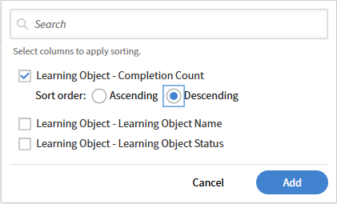

# Classificar colunas do relatório no Report Builder

## Visão geral

A classificação determina a ordem das linhas no arquivo de relatório baixado. Aplique a classificação sempre que um resultado consistente for importante.

## Adicionar uma classificação

Neste exemplo, você encontrará os cursos com as conclusões mais altas.

1. Inicie o Report Builder e selecione **Criar Relatório**.
2. Digite o nome e a descrição do relatório.
3. Selecione as seguintes colunas: <dataset>:<column name>

   * Objeto de aprendizado - Nome do objeto de aprendizado
   * Objeto de aprendizado - Status do objeto de aprendizado
   * Objeto de aprendizado - Contagem de conclusão

4. Na seção Classificação, selecione **Adicionar classificação**.
5. Selecione **Objeto de Aprendizado - Contagem de Conclusão**.
6. Selecione uma ordem de classificação- **Crescente** ou **Decrescente**

   

7. Selecione **Adicionar**.
8. Selecione **Salvar Relatório** e selecione **Ações** > **Baixar** para baixar o relatório.

O relatório baixado lista todos os registros, classificados pelo número de conclusões do curso.

## Adicionar classificação de várias colunas

Neste exemplo, você gerará um relatório para medir o desempenho entre gerentes.

Para classificar por mais de uma coluna:

1. Inicie o Report Builder e selecione **Criar Relatório**.
2. Digite o nome e a descrição do relatório.
3. Selecione as seguintes colunas: <dataset>:<column name>

   * Usuário - Nome
   * Usuário - Nome do Gerente
   * Transcrição do módulo - Status
   * Transcrição do módulo - Percentual de andamento

4. Adicione os seguintes agregados:

   * Agrupar por Nome do Gerenciador de Usuários
   * Contar nome de usuário distinto
   * Contar se = Transcrição do módulo CONCLUÍDA - Status
   * Transcrição Média do Módulo - Percentual de Progresso

   

5. Na seção Classificar, adicione a seguinte classificação de várias colunas:

   * Transcrição do módulo - Status: Decrescente
   * Usuário - Nome do Gerente: Crescente

   

6. Selecione **Salvar Relatório** e selecione **Ações** > **Baixar** para baixar o relatório.

O relatório baixado fornece um resumo do desempenho do gerente, mostrando contagens distintas de alunos, contagens de inscrições baseadas no status e porcentagens médias de progresso. Ele destaca os níveis de participação e o progresso do treinamento nos diferentes grupos de gerentes.
