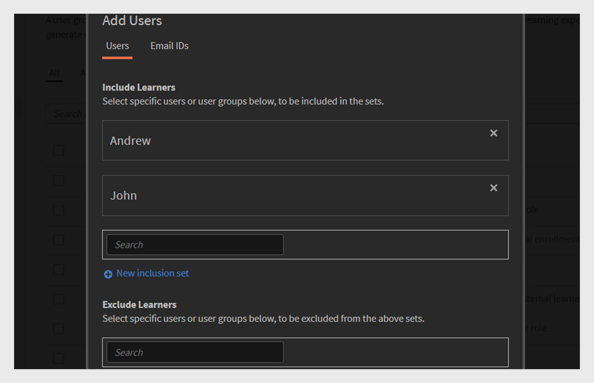
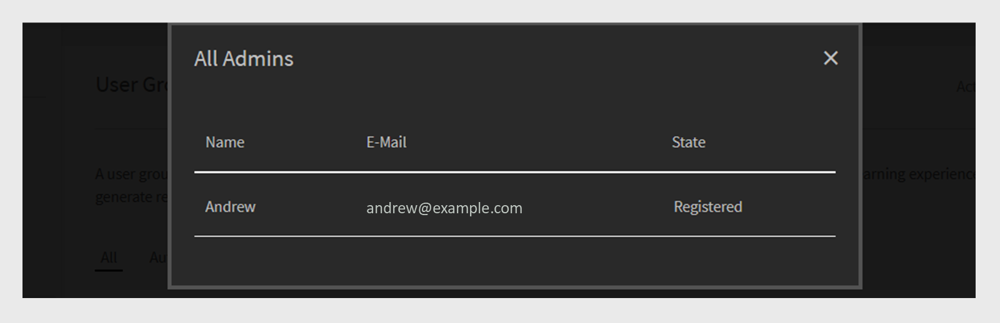

# Grupos de usuários no Adobe Learning Manager

Os grupos de usuários no Adobe Learning Manager ajudam a organizar os alunos com base em atributos comuns, como departamento, local ou função. Agrupar usuários facilita a atribuição de cursos, o gerenciamento de permissões e o acompanhamento do progresso do aprendizado para vários usuários ao mesmo tempo.

>[!INFO]
>
>Assista a este treinamento do ALM Academy para saber como criar um grupo de usuários por nomes, IDs de e-mail e combinar vários grupos de usuários gerados automaticamente.   

## Tipos de grupos de usuários

O Adobe Learning Manager oferece suporte aos seguintes grupos de usuários:

1. **Grupos de usuários gerados automaticamente:** no Adobe Learning Manager, o sistema cria automaticamente alguns grupos de usuários com base nas funções e atributos dos usuários. Esses grupos definidos pelo sistema incluem Todos os autores, Todos os administradores, Todos os alunos e Todos os gerentes. O Adobe Learning Manager gera esses grupos para ajudar a organizar os usuários por função. Não é possível renomear ou excluir esses grupos definidos pelo sistema.

2. **Grupos de usuários personalizados:** no Adobe Learning Manager, os administradores podem criar grupos de usuários personalizados para organizar os alunos com base em critérios específicos. Esses grupos são dinâmicos, adicionando automaticamente usuários que atendem às condições definidas. Grupos personalizados ajudam a atribuir caminhos de aprendizado direcionados, aplicar marcas personalizadas e gerar relatórios focados. Eles são uma ferramenta flexível para gerenciar e personalizar a experiência de aprendizado.

## Criar um grupo de usuários personalizado

Os administradores criam grupos de usuários manualmente para organizar os usuários com base em atributos definidos. Esses grupos podem ser dinâmicos, adicionando automaticamente usuários que atendem aos critérios especificados. Os grupos de usuários simplificam tarefas como atribuir caminhos de aprendizado, aplicar marcas personalizadas e gerar relatórios direcionados.

Para criar um grupo de usuários personalizado:

1. Selecione **Usuários** na home page do administrador.
2. Selecione **Grupos de Usuários** e selecione **Adicionar**.

   
   _Botão para adicionar um novo grupo de usuários na página Grupos de Usuários_

3. Digite o nome e a descrição do grupo.

   
   _Insira os campos para inserir o nome do grupo e a descrição opcional_

## Adicionar usuários ao grupo de usuários

Os administradores podem adicionar usuários a um grupo de usuários de duas maneiras:

### seção Usuários

Os administradores podem usar os conjuntos de inclusão e exclusão para adicionar ou remover usuários ou grupos de usuários na seção Usuários.

* **Conjuntos de Inclusões** adicionam usuários a um grupo de usuários personalizado. Você pode incluir um ou mais grupos de usuários e o Adobe Learning Manager usa a lógica (E/OU) para decidir qual usuário incluir. Consulte esta [seção](#_Inclusion_and_exclusion) para saber mais sobre a lógica AND/OR.
* Os **Conjuntos de Exclusões** removem usuários do grupo, mesmo que façam parte do conjunto de inclusão. Isso refina a lista de usuários do grupo.

Para adicionar usuários ao grupo:

1. Pesquise e selecione usuários ou grupos de usuários existentes no campo **Incluir alunos**.

_Configurações de inclusão para adicionar usuários ou grupos específicos a um grupo de usuários personalizado_

### Seção de IDs de e-mail

1. Digite os endereços de email do usuário em um formato separado por vírgula, ponto-e-vírgula ou quebra de linha para adicionar os usuários ao grupo.

2. Selecione **Validar Ids De Email**.

   
   _Selecione Validar IDs de email para validar as IDs de email inseridas_

   Você verá um erro se a Adobe Learning Manager não tiver a ID de e-mail ou se a ID de e-mail estiver incorreta.

   
   _Campo para inserir vários endereços de email manualmente para adicionar usuários a um grupo_

3. Selecione **Salvar** para criar o grupo.

## Excluir usuários do grupo

Os administradores podem excluir usuários específicos de um grupo de usuários mesmo que eles atendam aos critérios do grupo. Isso é útil quando você deseja fazer exceções, como impedir que determinados usuários recebam cursos atribuídos ou apareçam em relatórios vinculados a esse grupo.

Para excluir usuários específicos ou grupos de usuários inteiros ao criar um grupo de usuários personalizado:

1. Selecione qualquer **Grupo de Usuários** e selecione **Adicionar**.
2. Navegue até a seção **Excluir alunos**.
3. Selecione os usuários ou grupos que deseja excluir.

_Configurações de exclusão para remover usuários ou grupos de um grupo personalizado_

## Exibir membros do grupo

Os administradores podem exibir uma lista de usuários em um grupo de usuários, incluindo detalhes como nome, ID de email e estado. Para exibir a lista de usuários:

1. Selecione **Usuários** e selecione **Grupos de Usuários**.
2. Selecione um grupo e, em seguida, selecione o valor no **Não. da coluna Pessoas**.

_Lista de usuários atualmente incluídos em um grupo de usuários selecionado_

_Lista de usuários disponíveis no grupo de usuários selecionado_

## Baixar membros do grupo

Os administradores podem baixar uma lista de membros do grupo para revisar os detalhes do usuário, incluindo nome, email, status, data de adição (fuso horário UTC), data de exclusão (fuso horário UTC) e data do último logon (fuso horário UTC). Isso ajuda no acompanhamento, na emissão de relatórios e na auditoria da associação de grupo.

1. Selecione **Usuários** e selecione **Grupos de Usuários**.
2. Selecione o ícone de download ao lado de um grupo para exportar o relatório como um arquivo CSV.

_Ícone de download para exportar dados de membros do grupo como um arquivo CSV_

Estas são as colunas do relatório de membro de grupo:

* **Nome**: nome do usuário
* **Email**: ID de email do usuário
* **Status**: status do usuário (registrado ou não registrado).
* **Data de Adição (Fuso Horário UTC)**: data em que o usuário foi adicionado ao fuso horário UTC.
* **Data de exclusão (Fuso horário UTC)**: data em que o usuário foi excluído do fuso horário UTC.
* **Data do último logon (Fuso horário UTC)**: data do último logon do usuário no fuso horário UTC.

_O CSV de exemplo contém os detalhes do usuário_

## Editar um grupo de usuários

Os administradores podem editar um grupo para alterar seu nome, descrição ou outros detalhes.

Para editar um grupo de usuários:

1. Selecione **Usuários** na home page do administrador.
2. Selecione **Grupos de Usuários**.
3. Selecione o grupo de usuários que deseja editar.
4. Faça as alterações necessárias, como atualizar o nome, a descrição ou outros detalhes.
5. Selecione **Salvar** para aplicar as alterações. As alterações serão aplicadas ao grupo de usuários.

_Campos para modificar o nome, a descrição ou as regras de associação do grupo de usuários_

## Excluir um grupo de usuários

Os administradores podem excluir grupos de usuários que não são mais necessários para manter a lista de grupos organizada e atualizada.

Para excluir um grupo de usuários:

1. Selecione **Usuários** e selecione **Grupos de Usuários**.
2. Selecione o grupo que deseja excluir.
3. Selecione **Ações** e selecione **Excluir**.

   
   _Opção Excluir no menu Ações para remover um grupo de usuários_

4. Confirme a exclusão quando solicitado. O grupo de usuários será excluído.

## Baixar relatório de grupo de usuários

Os relatórios de grupos de usuários da Adobe Learning Manager fornecem aos administradores e gerentes insights sobre o desempenho de diferentes grupos de usuários, como departamentos, funções ou parceiros externos. Esses relatórios permitem comparações entre grupos para avaliar o progresso do aprendizado, as taxas de conclusão do curso e os níveis de envolvimento.

Para baixar o relatório:

1. Selecione **Usuários** e selecione **Grupos de Usuários**.
2. Selecione **Ações** e selecione **Baixar Relatório de Grupo de Usuários**.

_Opção para baixar informações e metadados em nível de grupo do menu Ações_

Esse relatório inclui:

| Coluna | Descrição |
|---|---|
| Tipo de grupo de usuários | A categoria do grupo de usuários, como grupo gerado automaticamente ou grupo personalizado. |
| Nome | O nome atribuído ao grupo de usuários. |
| Descrição | Uma breve explicação da finalidade ou do escopo do grupo de usuários. |
| Criado por (Nome) | O nome completo do administrador que criou o grupo. |
| Criado por (Email) | O endereço de email do administrador que criou o grupo. |
| Criado em (Fuso horário UTC) | A data e a hora em que o grupo foi criado, mostradas em Tempo Universal Coordenado (UTC). |
| Número de usuários | O número total de usuários atualmente incluídos no grupo. |

_O relatório de grupo de usuários contém todos os campos_

## Regras de inclusão e exclusão para criar grupos de usuários personalizados

Ao criar um **grupo de usuários personalizado** adicionando grupos de usuários gerados automaticamente ou existentes, o Adobe Learning Manager aplica **regras de inclusão e exclusão** específicas com base na **lógica AND/OR**. Essas regras dependem de como os grupos de usuários são combinados nos conjuntos de inclusão e exclusão.

Você pode adicionar um ou mais grupos de usuários gerados automaticamente ao conjunto de inclusão. A lógica aplicada depende de como você seleciona esses grupos:

### Usar a lógica AND nos grupos de usuários

Se você selecionar vários grupos de usuários no mesmo conjunto de inclusão, os usuários deverão atender a todas as condições para serem incluídos.

Por exemplo,

* Grupo de equipe de vendas: 120 usuários
* Grupo Location (Bangalore): 80 usuários
* Usuários comuns em **ambos** grupos: 40 usuários

O Adobe Learning Manager usa a lógica AND para criar um grupo com apenas 40 usuários. Esses usuários fazem parte da Equipe de vendas e também estão localizados em Bangalore, atendendo às duas condições.

_Exemplo que mostra vários grupos combinados usando a lógica AND_

### Usar a lógica OR em grupos de usuários

Se você adicionar grupos de usuários em conjuntos de inclusões separados, os usuários que atenderem a qualquer condição serão incluídos. Por exemplo:

* Grupo de equipe de vendas: 120 usuários
* Grupo Location (Bangalore): 80 usuários
* Total de usuários em qualquer grupo: 160 usuários (Alguns usuários podem estar em ambos os grupos)

Quando você usa a lógica OR, o Adobe Learning Manager adiciona usuários que estão na Equipe de vendas ou localizados em Bangalore. Isso significa que ela inclui usuários que correspondem a uma das duas condições. Como resultado, o grupo inclui 160 usuários após a remoção de duplicatas.

_Exemplo que mostra vários grupos combinados usando a lógica OR_
