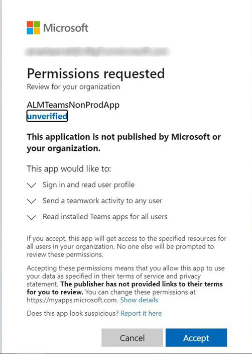

# Aplicativo Adobe Learning Manager para Microsoft Teams

## Como configurar

A configuração do ALM no MS Teams envolve três etapas e precisa da ajuda do administrador do ALM e do administrador do Microsoft Azure. Em algumas organizações, o administrador do Azure e os administradores de equipes da MS não são os mesmos e, portanto, também exigem administradores de equipes adicionais da MS.

**Administrador do ALM - A função de administrador de integração aprova o aplicativo do Teams**

Depois que o administrador de integração aprovar o aplicativo do MS Teams, o aplicativo Adobe Learning Manager estará disponível na loja de aplicativos do MS Teams e seus alunos poderão acessá-lo. No entanto, o aplicativo não terá notificações, logon silencioso e não será fixado para os alunos no MS Teams.

**O administrador do Microsoft Azure aprova a permissão para o aplicativo ALM no painel do Azure**

O administrador do Azure terá que aprovar as permissões necessárias para o aplicativo ALM. Isso permitirá que o aplicativo ALM envie notificações para o MS Teams e permita logon silencioso. No logon silencioso, os usuários não precisam fazer logon separadamente no Adobe Learning Manager no navegador.

**O administrador do MS Teams cria uma política para as equipes do ALM**

O administrador do MS Teams, no Centro de Administração, deve fixar o aplicativo ALM para todos os seus usuários e permitir isso como uma política global. Caso o ALM seja usado somente por um determinado grupo na empresa, o administrador do MS Teams deverá escolher uma política personalizada e aplicá-la somente a esse grupo específico.

## A função de administrador de integração aprova o aplicativo do Teams

Siga as etapas abaixo:

1. No aplicativo do administrador de integração, selecione **[!UICONTROL Aplicativos]** > **[!UICONTROL Aplicativos em destaque]** e selecione **[!UICONTROL Aplicativo ALM para equipes]**.

   
   *Selecionar o aplicativo ALM para equipes*

1. No canto superior direito da tela, selecione **[!UICONTROL Aprovar]**.

   
   *Selecione Aprovar na página de configurações do aplicativo*

1. Selecionar **[!UICONTROL OK]** na caixa de diálogo exibida.

   
   *Selecionar OK após a aprovação*

1. Depois de aprovado, você poderá ver “Aplicativo do ALM Teams” na seção Aplicativos externos.

   
   *O aplicativo ALM para equipes aparece na página Aplicativos*

Agora, os usuários podem acessar o aplicativo ALM no MS Teams.

## O administrador do Microsoft Azure aprova a permissão do aplicativo ALM no painel do Azure

Siga as etapas abaixo:

1. Como administrador do Azure, navegue até a seção Gerenciar o Azure Ative Diretory no painel do Azure.

   
   *Iniciar painel do Azure*

1. Cole o seguinte link em uma janela separada do navegador:

   `https://login.microsoftonline.com/<tenantIdTobeReplaced>/oauth2/authorize?client_id=8d349d9f-bf59-4ece-8022-a41e87d81903&response_type=code&redirect_uri=https://learningmanager.adobe.com`

1. No link acima, substitua `<tenantIdTobeReplaced>` com a id do locatário disponível na página Visão geral abaixo. Insira o novo URL.

1. Adicione o aplicativo Adobe Learning Manager aos seus aplicativos do Azure.

   
   *Adicionar ao Azure*

1. Selecione a guia Aplicativos Empresariais e selecione Todos os Aplicativos. Você verá ALMTeamsApp listado aqui.

   
   *Exibir o aplicativo ALM*

1. Clique no aplicativo e navegue até a guia Permissões.

   
   *Exibir a guia Permissões*

1. Na guia Permissões, selecione &#39; **[!UICONTROL Conceder consentimento de administrador para a MSFT]**&#39; para conceder permissões de aplicativo para equipes do ALM.

   
   *Selecionar Permissões*

1. Selecionar **[!UICONTROL Aceitar]**.

   
   *Selecionar Aceitar*

1. Depois de concedidas, essas permissões fornecerão o aplicativo ALM para permitir logons silenciosos e enviar notificações aos alunos no aplicativo MS Teams.

   
   *Acesso concedido*

## O administrador do MS Teams cria uma política para o aplicativo Teams

Siga as etapas abaixo:

1. Como administrador do MS Teams, no centro de administração, crie uma política para adicionar o aplicativo Teams ao aplicativo Equipes dos alunos.

   
   *Criar uma política*

1. Navegue até a seção Configurar políticas. Crie uma política global e selecione **[!UICONTROL Adicionar aplicativos]** na subseção Aplicativos Fixos.

   
   *Adicionar a política*

1. Na caixa de diálogo a seguir, pesquise por **[!UICONTROL Adobe Learning Manager]** e adicione o aplicativo. Isso adiciona o Adobe do Learning Manager na seção Aplicativos instalados.

   
   *Instalar o aplicativo*

1. Salve esta política. Isso disponibiliza o aplicativo para todos na organização.

Como alternativa, os administradores podem criar uma política personalizada em vez de uma política global. Adicione o Adobe Learning Manager a essa política personalizada e, em seguida, aplique a política personalizada somente aos conjuntos de usuários que precisam acessar o Adobe Learning Manager.
