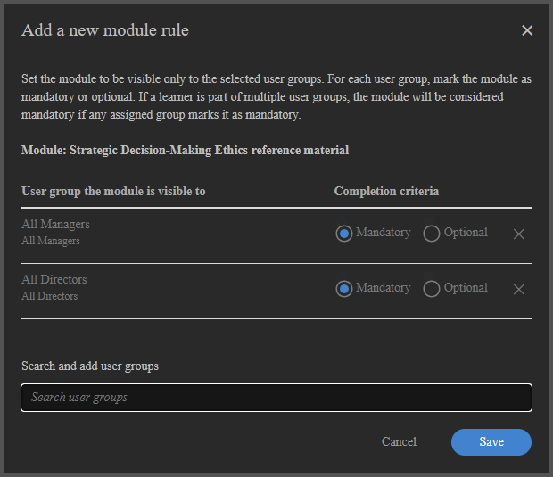
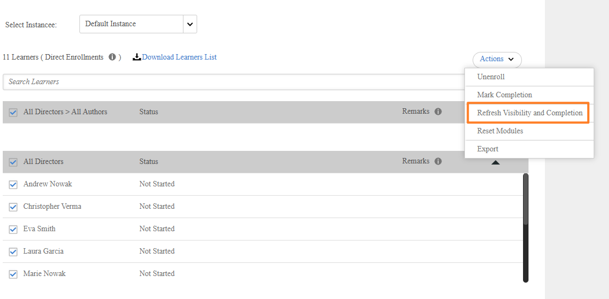

# Cursos adaptativos para autores

## Criar e configurar um curso adaptável

Crie um curso com visibilidade por módulo e regras de conclusão para que diferentes alunos vejam e concluam conteúdos diferentes com base em seus grupos de usuários.

>[!NOTE]
>
>O tipo de curso adaptável estará disponível somente se as **Regras de visibilidade e conclusão** tiverem sido habilitadas para sua conta. Se não encontrar a opção para criar um curso adaptável, peça ao administrador para ativar o aprendizado adaptável.

### Criar um curso adaptável

1. Faça logon no Adobe Learning Manager como autor.

   

2. Na navegação à esquerda, selecione **Cursos**. Depois, selecione **Adicionar**.
3. Insira o nome do curso, a descrição e outros detalhes.
4. Selecione a alternância **Visibilidade de conteúdo e regras de conclusão**.

   

5. Selecione **Sim** na caixa de diálogo de confirmação.

   

   **Adicionar módulos a um curso adaptável**

   Adicione os módulos necessários. Adicione módulos de conteúdo fazendo upload de conteúdo, selecionando-os na biblioteca de conteúdo ou adicionando sessões de sala de aula ou sala de aula virtual.

   **Tipos de módulos que oferecem suporte a regras adaptáveis (módulos de conteúdo):**

   * E-learning em ritmo individualizado
   * Sessões de sala de aula
   * Sessões de sala de aula virtual
   * Módulos de atividade

   **Tipos de módulos que NÃO dão suporte a regras adaptativas:**

   * **Módulos de pré-trabalho:** mostrados a todos os alunos antes do início do conteúdo principal. Não é possível definir regras de visibilidade ou conclusão.
   * **Módulos de teste:** disponíveis para todos os alunos. Concluir um teste externo conclui todo o curso, independentemente do status do módulo de conteúdo. Não é possível definir regras de visibilidade ou conclusão.
   * **Ajudas de tarefa:** Visível para todos os alunos inscritos o tempo todo.

6. Selecione **Adicionar**.

### Configurar visibilidade e regras de conclusão para cada módulo

Depois de adicionar um módulo de conteúdo, configure suas regras adaptáveis:

1. Selecione o módulo que deseja configurar.
2. Nas configurações do módulo, localize a seção **Regras de visibilidade e conclusão**.

   

3. Selecione **Adicionar regras** para adicionar os grupos de usuários que podem ver este módulo.

   

   

   Os alunos desses grupos veem o módulo no curso, mas não precisam concluí-lo, a menos que também estejam em Obrigatório.

4. Selecione **Salvar**.
5. Repita o processo para cada módulo de conteúdo no curso.

**Regras-chave:**

* Um aluno pertencente a vários grupos de usuários obtém o resultado mais restritivo: se qualquer grupo tornar um módulo obrigatório, ele será obrigatório para esse aluno.
* Você deve configurar pelo menos um módulo como **Obrigatório** para pelo menos um grupo de usuários antes de poder publicar. O sistema bloqueia a publicação até que essa condição seja atendida.

### Curso em estado de rascunho

Quando um curso está no estado de rascunho, ele representa a fase em que toda a estrutura adaptativa pode ser totalmente projetada, configurada e refinada antes de ser bloqueada para os alunos. Nesta etapa, os autores podem definir se o curso deve funcionar como um curso adaptativo ou um curso regular, e essa decisão permanece reversível até que o curso seja publicado. Isso torna a fase de rascunho crítica, pois é o único ponto onde a natureza adaptativa central do curso pode ser estabelecida ou alterada.

No rascunho, os autores têm controle total sobre a estrutura do curso. Eles podem adicionar, remover e reordenar módulos livremente para moldar o fluxo de aprendizado pretendido. Ao mesmo tempo, eles podem configurar o comportamento adaptativo em um nível granular, definindo regras de visibilidade para cada módulo. Essas regras determinam quais grupos de usuários podem acessar módulos específicos, permitindo que o curso ofereça experiências de aprendizado personalizadas posteriormente. Além da visibilidade, os autores também podem definir regras de conclusão, marcando os módulos como obrigatórios ou opcionais para diferentes grupos de usuários. O sistema exige que pelo menos um módulo seja obrigatório para garantir critérios de conclusão significativos.

O estado de rascunho também permite a edição irrestrita da lógica adaptável. Os autores podem adicionar, modificar ou remover regras de forma iterativa sem quaisquer restrições do sistema, possibilitando experimentar diferentes configurações antes de finalizar o curso. Além da configuração adaptável, todos os elementos padrão do curso permanecem editáveis, incluindo metadados do curso, como título e descrição, bem como o conteúdo de aprendizado subjacente, incluindo módulos SCORM ou outros ativos.

É importante entender que a configuração adaptável no rascunho se aplica somente aos módulos principais do curso. Outros componentes, como conteúdo de pré-trabalho ou de teste final, não oferecem suporte a regras adaptáveis e não são afetados pela visibilidade ou pelas configurações de conclusão.

Finalmente, o estado de rascunho serve como a última oportunidade para validar a configuração do curso antes da publicação. Depois que o curso é publicado, a configuração adaptável se torna permanente e não pode ser revertida.

### Visualizar como aluno

Selecionar **Visualizar como aluno** mostra todos os módulos do curso, independentemente das regras do grupo de usuários. Isso fornece aos autores e administradores uma visão completa da estrutura do curso. Os alunos em produção veem apenas os módulos que seus grupos de usuários tornam visíveis.

### Publish um curso adaptável

A publicação de um curso adaptável segue o mesmo fluxo de trabalho de publicação de um curso regular.

Depois de configurar todos os módulos e suas regras, selecione **Publish**.

Depois de publicado, o curso está disponível para inscrição. Os alunos veem apenas os módulos configurados para seus grupos de usuários ao abrir o curso.

>[!IMPORTANT]
>
>Depois da publicação, não é possível alternar o curso de Adaptável para Regular ou vice-versa. Verifique sua configuração antes de publicar.

### Atualizar um curso adaptável publicado

Você pode atualizar um curso adaptável publicado a qualquer momento. As alterações entram em vigor para os alunos inscritos quase em tempo real.

Observe que não é mais possível alterar as configurações de visibilidade no curso adaptável. Você não pode tornar o curso não adaptável.

### Adicionar ou modificar módulos

1. Abra o curso publicado.
2. Selecione **Editar**.
3. Adicione, edite ou remova módulos e ajuste suas regras de visibilidade e conclusão.
4. Republique o curso.

**Impacto:**

| Alterar | Efeito nos alunos em andamento inscritos |
|---|---|
| Novo módulo obrigatório adicionado (visível para um grupo de usuários do aluno) | Um módulo é adicionado ao seu requisito de conclusão. Se o módulo for uma sessão de sala de aula ou sala de aula virtual sem vagas restantes, o aluno ficará em lista de espera nesse módulo. |
| Módulo removido ou ocultado para o grupo de usuários de um aluno | Módulo removido de seu requisito de conclusão. Se este era o último módulo obrigatório, o curso será concluído automaticamente para o aluno. |
| O módulo mudou de obrigatório para opcional para um grupo de usuários do aluno | O módulo permanece visível; o aluno não precisa mais concluí-lo para a conclusão do curso. |
| Novo módulo obrigatório adicionado (o aluno já concluiu o curso) | O módulo se torna visível para o aluno, mas ele não recebe uma vaga automaticamente nem o acessa. O novo módulo se torna acessível somente quando uma conclusão de atualização é acionada. |

### Comportamento de alternância de instância

Um aluno que alterna instâncias de um curso adaptável leva o progresso adiante:

* Os módulos que eles já concluíram permanecem concluídos na nova instância.
* As vagas são consumidas somente para módulos visíveis não concluídos na nova instância.
* Se os módulos visíveis na nova instância não tiverem licenças disponíveis, o aluno será colocado em lista de espera nessas sessões.

## Gerenciar limites de vagas e listas de espera em cursos adaptáveis

Os cursos adaptáveis no Adobe Learning Manager impõem limites de vagas no nível individual da sala de aula ou da sessão de sala de aula virtual. Diferentemente dos cursos regulares, nos quais uma sessão completa bloqueia a inscrição inteira, um curso adaptável inscreve o aluno imediatamente e os lista de espera apenas nas sessões específicas em que não há vagas disponíveis. O aluno pode acessar todos os outros módulos sem interrupção.

### Como funcionam os limites das vagas em cursos adaptáveis

Quando um aluno se inscreve em um curso adaptável que inclui módulos de sala de aula ou sala de aula virtual, o sistema verifica a disponibilidade das vagas apenas para sessões visíveis ao aluno com base em seus grupos de usuários.

* Se todas as sessões visíveis da sala de aula ou da sala de aula virtual tiverem vagas disponíveis, o aluno será inscrito e terá acesso total imediatamente.
* Se uma ou mais sessões visíveis não tiverem vagas disponíveis, o aluno será inscrito e ficará imediatamente em lista de espera somente nessas sessões específicas. Eles podem iniciar e avançar por todos os outros módulos imediatamente.

A tabela a seguir descreve todos os cenários de estações e listas de espera para cursos adaptáveis.

| Condição na inscrição | Resultado |
|---|---|
| Todas as sessões CR/VC visíveis têm licenças disponíveis | Inscrito com acesso total a todos os módulos |
| Uma ou mais sessões CR/VC visíveis estão cheias | Inscrito; em lista de espera somente em sessões completas; todos os outros módulos acessíveis imediatamente |
| Aluno já inscrito; o autor adiciona uma nova sessão CR/VC obrigatória sem vagas | O aluno está na lista de espera da nova sessão; o progresso e o acesso existentes não são afetados |
| O aluno cancela as inscrições | Todas as vagas retidas são liberadas imediatamente; os próximos alunos na lista de espera são liberados na ordem de data de inscrição |
| A alteração do grupo de usuários remove uma sessão do conjunto visível do aluno | Vaga liberada imediatamente |
| O aluno conclui o curso; as novas sessões obrigatórias de CR/VC ficam visíveis | Módulo visível, mas sem assento atribuído automaticamente. O aluno deve acionar a conclusão da atualização para acessar a sessão. |
| O administrador ou professor aloca licenças | Todas as sessões CR/VC em lista de espera para esse aluno são limpas simultaneamente |

### Exibir a lista de espera

1. Abra o curso adaptável na visualização do administrador.
2. Selecione **Alunos**.
3. Selecione a guia **Lista de espera**.

A guia Lista de espera lista os alunos que estão na lista de espera de um ou mais módulos. Para cursos adaptáveis, o relatório está no nível curso-instância-módulo em vez do nível curso-instância, pois um aluno pode estar em andamento em alguns módulos enquanto está em lista de espera em outros simultaneamente.

### Limpar a lista de espera e alocar licenças

Quando uma vaga fica disponível devido ao cancelamento da inscrição de um aluno, a um aumento do limite de vagas ou à alocação manual, os alunos na lista de espera são liberados na ordem de data de inscrição (primeira data de inscrição mais antiga).

Para alocar manualmente vagas para um ou mais alunos:

1. Abra o curso adaptável.
2. Selecione a guia **Alunos** > **Lista de espera**.
3. Marque a caixa de seleção ao lado do aluno ou alunos para os quais deseja alocar vagas.
4. Selecione **Alocar Licenças**.

Selecionar Alocar vagas limpa o aluno selecionado da lista de espera em todas as sessões da lista de espera simultaneamente, não apenas na sessão que você está visualizando atualmente. O sistema presume que a cadeira foi física ou virtualmente organizada para o aluno.

**Acionadores de liberação de lista de espera:**

A lista de espera é processada automaticamente quando ocorrer qualquer uma das seguintes situações:

* Um aluno cancela a inscrição no curso (liberando sua vaga em todas as sessões retidas)
* O limite de vagas para uma sessão foi aumentado
* Um aluno alterna instâncias
* Um administrador ou professor aloca licenças

>[!NOTE]
>
>Ao criar uma nova instância de um curso adaptável, a opção **Notificar alunos na lista de espera** não está disponível. Esse é um comportamento esperado e difere dos cursos regulares.

Em um curso regular, a lista de espera é rastreada no nível da instância, para que o sistema possa solicitar que você notifique os alunos em espera quando uma nova instância é aberta. Em um curso adaptável, as listas de espera são rastreadas no nível da sala de aula individual ou da sala de aula virtual **sessão**, não no nível da instância. Não há nenhuma lista de espera em nível de instância para notificar quando uma nova instância é criada, portanto, o prompt não aparece e nenhuma notificação automática é enviada.

## Acionar a conclusão da atualização para um curso adaptável

Atualizar a conclusão no Adobe Learning Manager permite que a conclusão adaptável do curso de um aluno seja reavaliada quando os requisitos de aprendizado mudam. Isso é relevante quando o grupo de usuários de um aluno é alterado, quando um autor atualiza as regras do módulo ou quando um aluno deseja refazer um curso adaptável em seu perfil atual.

### O que a conclusão da atualização faz

Em um curso adaptável, o conjunto de módulos obrigatórios de um aluno é determinado por seus grupos de usuários no momento em que ele conclui o curso. Se os grupos de usuários forem alterados posteriormente ou se o autor adicionar novos módulos obrigatórios, o aluno poderá precisar concluir conteúdo adicional para atender aos requisitos do novo perfil.

A conclusão da atualização faz duas coisas:

1. Reverte a conclusão do curso existente do aluno se ele agora tiver novos módulos obrigatórios que estão incompletos.
2. Cria um novo registro na transcrição do aluno que representa o requisito de conclusão atualizado.

O registro de conclusão original é preservado na transcrição do aluno como uma entrada histórica. Os módulos concluídos anteriormente permanecem concluídos. O aluno não precisa repeti-los, a menos que sejam módulos obrigatórios novos específicos que não estavam visíveis ou não foram concluídos antes.

### Quando a conclusão da atualização se aplicar

**Cenário 1: a alteração do grupo de usuários adiciona novos módulos obrigatórios**

Um aluno conclui um curso adaptável. Seu grupo de usuários é alterado posteriormente, e o novo grupo de usuários torna os módulos ocultos ou opcionais obrigatórios.

* A entrada de conclusão existente permanece na transcrição do aluno.
* Se o aluno tiver novos módulos obrigatórios não concluídos, uma nova linha de transcrição do aluno será criada e o curso será exibido como em andamento.
* O aluno deve concluir os novos módulos obrigatórios para obter uma nova conclusão.

**Cenário 2: a alteração do grupo de usuários não resulta em novos módulos obrigatórios**

Um aluno conclui um curso adaptável. O grupo de usuários é alterado, mas os requisitos do novo grupo de usuários já foram atendidos pelas conclusões existentes.

* O curso permanece em um estado concluído.
* Nenhuma nova linha de transcrição do aluno é criada.
* Nenhuma ação é necessária do aluno.

**Cenário 3: retomada iniciada pelo aluno**

Um aluno que já tenha concluído um curso adaptável pode optar por refazer para concluí-lo em seu perfil atual do grupo de usuários. Isso é útil quando a função de um aluno é alterada desde a conclusão original.

1. O aluno abre o curso adaptável concluído.
2. O aluno seleciona a opção de refazer ou reiniciar o curso.
3. O curso é reavaliado usando seus grupos de usuários atuais para determinar o novo conjunto de módulos obrigatório.
4. Uma nova linha de transcrição do aluno é criada.

**Cenário 4: Comportamento do módulo de teste**

Se um aluno concluiu um módulo de teste externo antes da conclusão da atualização ter sido acionada, a conclusão do teste ainda será válida após a atualização. Depois que o sistema avalia a conclusão do curso (acionada por qualquer conclusão de módulo ou ação do aluno), o curso será concluído automaticamente novamente porque o teste já foi feito, a menos que o curso tenha módulos de conteúdo obrigatórios adicionais que agora são necessários e incompletos.

>[!NOTE]
>
>Se uma nova sessão de sala de aula ou sala de aula virtual for adicionada ao curso adaptável depois que um aluno a tiver concluído por meio de teste final e uma conclusão de atualização for acionada subsequentemente, o aluno poderá não aparecer automaticamente na guia **Presença e pontuação** ou na **Lista de espera** da nova sessão. Isso ocorre porque a conclusão do teste-out mantém o curso em um estado concluído e a lógica de atribuição de vagas não é acionada novamente. Se você precisar rastrear a participação de um aluno em teste em uma sessão recém-adicionada, aloque sua vaga manualmente na guia **Lista de espera**. Observe que os módulos de teste não são a abordagem recomendada para cursos adaptativos.

**Cenário 5: atualização acionada pelo administrador**

Um administrador pode acionar uma conclusão de atualização em nome de um aluno se o perfil do aluno tiver sido alterado e o administrador determinar que o registro de conclusão existente não reflete mais os requisitos atuais.

>[!CAUTION]
>
>Se o curso adaptável fizer parte de uma certificação recorrente, a conclusão da atualização se aplica somente à inscrição do aluno no ciclo de certificação raiz. Os ciclos recorrentes subsequentes contêm uma instância separada do curso adaptativo que não é afetada pela atualização. Os alunos inscritos em um ciclo recorrente não veem as atualizações do módulo nem suas conclusões são revertidas. Se a sua organização usa cursos adaptáveis em certificações recorrentes, comunique essa limitação aos administradores antes de acionar a conclusão da atualização

1. Abra o perfil do aluno ou a guia Aluno do curso na visualização Administrador.
2. Localize a inscrição do aluno.
3. Selecione **Atualizar Visibilidade e Conclusão**.

O ALM reavalia módulos obrigatórios com base nos grupos de usuários atuais do aluno e reverte a conclusão se houver novos módulos obrigatórios.
