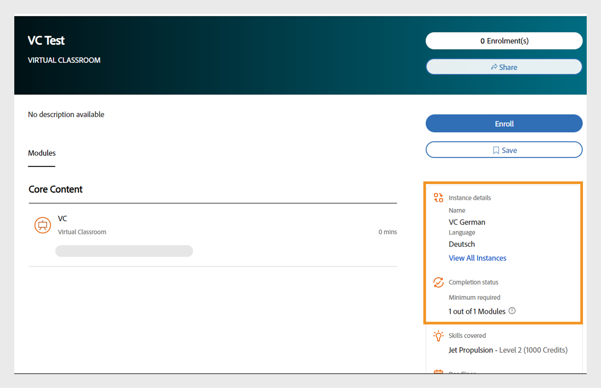

# Adicionar objetos de aprendizado em diferentes locais

Leia este tópico para saber como adicionar cursos, certificações e planos de aprendizado em diferentes idiomas.

Como autor, você pode criar objetos de aprendizado, como cursos, certificações e planos de aprendizado. Você também pode criar esses objetos de aprendizado em diferentes idiomas.

O Learning Manager permite criar objetos de aprendizado em vários idiomas. Você pode adicionar o conteúdo e/ou os metadados em idiomas adicionais ao criar o objeto de aprendizado. Você também pode editar os detalhes do objeto de aprendizado a qualquer momento e oferecer o objeto de aprendizado em idiomas adicionais.

Para adicionar um novo idioma, clique no curso, certificação ou plano de aprendizado para o qual deseja adicionar novos locais. Na página Informações básicas, clique em Adicionar novo idioma na parte superior.

*Adicionar um novo idioma*

Na caixa de diálogo pop-up, selecione o idioma ou os idiomas adicionais que deseja oferecer aos alunos e clique em Salvar.

*Selecione um idioma*

Republique o curso para que as alterações tenham efeito.

## Suporte a vários idiomas para instâncias CR/VC com marcação de idioma

O Adobe Learning Manager (ALM) permite que os autores criem instâncias específicas do idioma usando a marcação de idioma nos módulos Sala de aula e Sala de aula virtual. Esse recurso permite que os alunos acessem módulos CR/VC em seu idioma preferido. Por exemplo, um autor pode criar um módulo CR/VC com duas instâncias: uma em inglês e outra em francês. Os alunos podem selecionar as instâncias em seu idioma preferido.

### Fluxo de trabalho (WRK)

Primeiro, o autor cria e publica um curso em vários idiomas, ativando as opções de idioma na página de criação da instância. O autor pode criar instâncias diferentes selecionando um idioma para cada uma. Os alunos podem escolher a instância com base no idioma mapeado para eles.

### Criar um curso com vários idiomas

Siga estas etapas para criar um curso com vários idiomas:

1. Faça logon como **[!UICONTROL Autor]**.
2. Selecione **[!UICONTROL Cursos]** > **[!UICONTROL Adicionar]** para criar um curso.
3. Digite o **[!UICONTROL Nome]** e a **[!UICONTROL Descrição]** do curso.
4. Selecione **[!UICONTROL Adicionar Novo Idioma]** e selecione os idiomas necessários. Isso criará várias guias para cada idioma.

   
   _Adicionar novo idioma - Curso_
5. Vá para as respectivas guias de idiomas e digite o **[!UICONTROL Nome]** e a **[!UICONTROL Descrição]** do curso.
6. Na guia Inglês (Estados Unidos), selecione **[!UICONTROL Adicionar Módulo]** > **[!UICONTROL Módulo de Sala de Aula Virtual]**.

   >[!NOTE]
   >
   >O procedimento também será o mesmo para o módulo Sala de aula.

   
Adicionar novo idioma para o módulo VC

7. Digite o **[!UICONTROL Título]** e a **[!UICONTROL Descrição]** em cada guia de idioma e selecione **[!UICONTROL Adicionar]**.
8. Insira os detalhes necessários para o curso e publique-o.

### Criar instâncias para cada idioma

Você pode criar as instâncias para cada idioma nos aplicativos Administrador e Autor. Siga estas etapas para criar as instâncias do aplicativo Autor:

1. Faça logon como **[!UICONTROL Autor]**.
2. Selecione **[!UICONTROL Cursos]** e selecione o curso multilíngue.
3. Selecione **[!UICONTROL Instâncias]** > **[!UICONTROL Adicionar Nova Instância]** para criar as instâncias.
4. Digite o **[!UICONTROL Nome da Instância]** e selecione o **[!UICONTROL Prazo de Conclusão]**.
5. Selecione **[!UICONTROL Mostrar Mais Opções]** para ver as outras opções.
6. Selecione o idioma necessário na lista suspensa **[!UICONTROL Idioma]**.

   
   _Selecione o idioma da instância_

7. Insira os outros detalhes e selecione **[!UICONTROL Salvar]**.
8. Crie instâncias para outros idiomas usando as mesmas etapas. Os alunos poderão ver todas as instâncias de idioma do curso.

### Selecione a instância e o fluxo de trabalho Inscrever-se - Aluno

Os alunos podem ver essas instâncias de idioma em seu aplicativo. Eles podem escolher sua instância de idioma preferida, se inscrever e participar das sessões de CR/VC nesse idioma.

Siga estas etapas para selecionar a instância e se inscrever:

1. No aplicativo do aluno, vá para o **[!UICONTROL Catálogo]** e selecione o curso.
2. Você pode ver a tela a seguir com várias instâncias.

   
   _Módulo de aula virtual para alunos_

3. Você pode filtrar usando a opção Filtro de idioma. Selecione seu idioma preferido e inscreva-se no curso.
4. Depois de selecionado, você pode ver os seguintes detalhes na página de visão geral do curso.

_Detalhes da instância_

