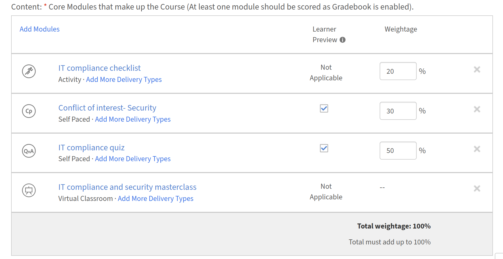

# Caderno para autores

## Configurar Gradação para um curso

Configure a pontuação ponderada para um curso no Adobe Learning Manager para que cada aluno receba uma pontuação agregada calculada a partir do desempenho do módulo e para que a conclusão do curso possa ser vinculada à obtenção de um limite mínimo de pontuação.

O Gradebook é configurado no nível do curso ao criar um novo curso. Não pode ser adicionado a um curso publicado existente.

>[!NOTE]
>
>Para que os alunos vejam o Gradebook em um curso, um administrador deve primeiro ativar a **visibilidade do Gradebook** no nível da conta.

### Ativar Gradebook para um curso

* Faça logon no Adobe Learning Manager como autor.
* Na navegação à esquerda, selecione **Cursos** e depois **Adicionar** para criar um novo curso.
* Insira o nome do curso, a descrição e outros detalhes necessários.
* Na seção **Módulos**, localize a alternância **Gradebook**.

  

* Selecione a alternância **Gradebook** para habilitá-lo. Duas opções aparecem abaixo dela. Ambos estão ativados por padrão:
  * **Mostrar Gradebook aos alunos:** os alunos veem uma guia **Gradebook** no reprodutor do curso mostrando as pontuações do módulo, a decomposição de peso e o resultado agregado. Desative essa opção para calcular as notas internamente sem expor as notas aos alunos.
  * **Incluir módulos que não contribuem para a nota final:** módulos não pontuáveis (PDF, vídeo, áudio e semelhantes) aparecem no Gradebook. Os módulos não pontuáveis não contribuem para a pontuação final do aluno.

### Adicionar módulos e atribuir peso

Depois de ativar o Gradebook, adicione seus módulos de conteúdo e atribua uma porcentagem de ponderação a cada módulo pontuável. As porcentagens de peso devem ser somadas exatamente a 100 antes de salvar a configuração.

* Selecione **Adicionar Módulos**.
* No seletor de módulos, selecione os módulos que deseja adicionar e selecione **Adicionar**. Os módulos são exibidos na seção **Conteúdo**. Módulos pontuáveis, SCORM, conteúdo do Captivate, AICC, xAPI, questionários nativos, módulos de Atividade, sessões de sala de aula e sessões de sala de aula virtual exibem um campo de entrada **Peso**. Os módulos não pontuáveis apresentam um traço na coluna de ponderação.
* Insira um valor percentual no campo **Peso** para cada módulo pontuável. Um indicador de **Peso total** é atualizado conforme você digita e deve atingir exatamente **100%** antes de salvar.

  

* Para módulos com vários tipos de entrega: o peso só poderá ser atribuído se **todos** tipos de entrega na pontuação de suporte do módulo. Se qualquer tipo de distribuição não suportar pontuação, o módulo inteiro não poderá ser ponderado.

>[!NOTE]
>
>A escala de pontuação não precisa ser compatível com todos os tipos de distribuição. Uma sessão de sala de aula com pontuação de 100 e um módulo SCORM com pontuação de 10 podem coexistir no mesmo Gradebook. A fórmula normaliza cada contribuição automaticamente.

### Definir a pontuação mínima de aprovação

* No editor de cursos, localize a seção **Critérios de aprovação**.
* No campo **Pontuação agregada mínima nos módulos**, insira uma porcentagem entre 0 e 100.
* Um valor **0** significa que o curso é concluído com base apenas na conclusão obrigatória do módulo, sem limite de pontuação agregado.
* Qualquer valor acima de 0 significa que o aluno deve concluir os módulos necessários E atender ou exceder essa pontuação agregada.
* No campo **Módulos obrigatórios**, insira o número necessário ou selecione-o na lista suspensa.

  

* Selecione **Salvar**.

A pontuação mínima de aprovação está visível para os alunos na guia **Gradebook** para que saibam o limite antes de começar.

### Definir configurações de pontuação para módulos com várias tentativas {#configurescoresettingsmultipleattempts}

Quando um módulo permitir várias tentativas, escolha qual pontuação de tentativa será usada no cálculo Gradebook.

* No editor do curso, localize um módulo que tenha várias tentativas ativadas.

  

* Localize a configuração **Pontuação a ser usada** ao lado desse módulo.
* Selecionar **Mais Recente** ou **Mais Alto**:
  * **Mais recente:** a pontuação de tentativa mais recente é sempre usada. Uma pontuação mais baixa em uma tentativa posterior substitui uma mais alta anterior.
  * **Mais alto:** a melhor pontuação de qualquer tentativa é mantida. Uma pontuação mais baixa em uma tentativa posterior não reduz a pontuação armazenada.

    

* Selecione **Salvar**.

### Publish o curso

Depois de definir todas as configurações do Gradebook, publique o curso usando o fluxo de trabalho padrão. Selecione **Salvar** e depois **Publish** para disponibilizar o curso para os alunos.

### Práticas recomendadas

* Atribua um peso que reflita a importância relativa de cada módulo. Dê porcentagens mais altas aos módulos mais críticos para o objetivo de aprendizado.
* Habilite **Mostrar Gradebook aos alunos**, a menos que haja um motivo específico para ocultar pontuações. Os alunos que podem ver seu peso e pontuação de corrida estão melhor posicionados para priorizar seu esforço.
* Defina a pontuação mínima de aprovação antes de os alunos se inscreverem. Alterá-la após as inscrições ativas pode afetar as conclusões em andamento.
* Use **O mais alto** para a configuração de várias tentativas quando os módulos forem avaliações que os alunos devem repetir. Use as **Mais recentes** quando desejar capturar o nível de conhecimento atual em vez do melhor desempenho.
* Verifique se o indicador **Peso total** mostra exatamente 100% antes de salvar.
