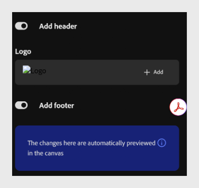

# Adicionar um cabeçalho e um rodapé

Adicione um cabeçalho e um rodapé para incluir elementos, como o logotipo.

1. Selecione **Temas** na barra de ferramentas, passe o mouse sobre o tema aplicado e selecione **Editar**.

2. Ative a alternância **Adicionar cabeçalho** para adicionar um cabeçalho ao seu curso.
   

3. Em **Logotipo**, selecione **Adicionar** para carregar um logotipo para o cabeçalho.

4. Ative a opção **Adicionar rodapé** para adicionar um rodapé ao seu curso.

>[!NOTE]
>
>O Compositor de conteúdo visualiza automaticamente as alterações na tela conforme você as faz.

