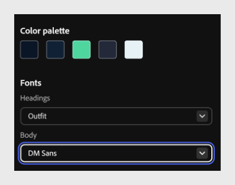

# Alterar fontes

Atualize as fontes de título e corpo para corresponder melhor ao seu conteúdo ou marca.

1. Selecione **Temas** na barra de ferramentas, passe o mouse sobre o tema aplicado e selecione **Editar**. O painel **Editar tema** é aberto, exibindo a paleta de cores e as fontes do tema.

   

2. Em **Fontes**, selecione o menu suspenso **Títulos** e escolha uma fonte para todos os títulos do curso. Por exemplo, selecione **Traje**.

   

3. Selecione a lista suspensa **Corpo** e escolha uma fonte para o corpo de texto do seu curso. Por exemplo, selecione **DM Sans**.

   

4. Selecione **Salvar** para substituir o tema existente por suas alterações ou **Salvar** **como novo** para criar um novo tema personalizado mantendo o original inalterado.

   

>[!NOTE]
>
>Os temas padrão não podem ser editados diretamente. Para personalizar um tema padrão, edite-o e selecione Salvar como novo para criar um tema personalizado com base no original.
