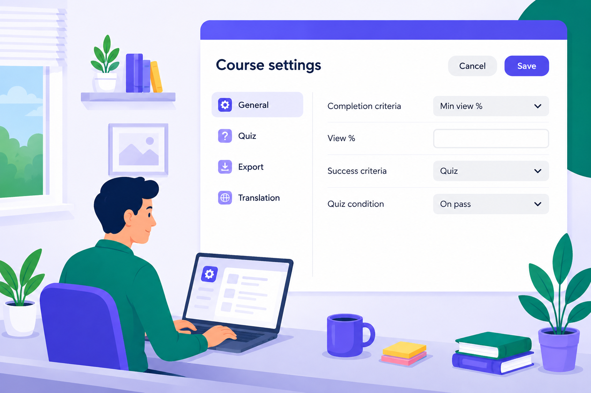

# Ajuda do Adobe Learning Manager Content Composer (Beta)

>[!IMPORTANT]
>
>Os recursos beta podem conter defeitos e são fornecidos “NO ESTADO EM QUE SE ENCONTRAM” sem garantias de nenhum tipo. o Adobe tem o único critério de disponibilizar os recursos beta para o público em geral. O Adobe não tem obrigação de manter, corrigir, atualizar, alterar, modificar ou dar suporte (por meio dos Serviços de Suporte do Adobe ou de outra forma) aos recursos beta. Caso um recurso beta se torne disponível ao público, ele pode estar sujeito a termos e condições adicionais, incluindo taxas aplicáveis. Os recursos beta estão sujeitos a alterações sem aviso prévio, incluindo a descontinuação. Recomenda-se que os clientes tenham cuidado e não dependam de forma alguma do funcionamento ou desempenho ininterrupto ou sem erros dos recursos beta. Portanto, qualquer uso dos recursos beta é inteiramente por conta e risco do Cliente. Os recursos do produto e a documentação relacionada podem mudar conforme o recurso evolui. Esta documentação reflete a experiência beta atual e não deve ser considerada uma documentação final ou completa do produto.

## Do conceito ao curso em minutos

O Adobe Learning Manager Content Composer é uma ferramenta de criação de cursos de IA que transforma um prompt de linguagem simples em um curso estruturado, pronto para publicação, incluindo lições, avaliações e mídia, sem exigir experiência prévia de design instrucional.

O compositor de conteúdo orienta os autores por meio de metas de treinamento, material de origem e objetivos de aprendizado por meio de conversas e, em seguida, gera cursos com som educacional, com a marca e prontos para publicação diretamente no Adobe Learning Manager.

**Principais destaques**

- **Criação de curso guiado por IA**: uma IA de conversação faz perguntas direcionadas para transformar metas de treinamento em objetivos de aprendizado claros e mensuráveis.
- **Geração com base em documentos**: os autores carregam documentos, políticas ou apresentações existentes. A IA gera um resumo e um esboço desse material; os autores aceitam ou editam antes de qualquer coisa ser construída.
- **Saída de som instrucional**: cursos, avaliações e mídia são gerados usando princípios de aprendizado estruturados, mantendo a saída educativamente eficaz, não apenas rápida de ser produzida.
- **Publicação direta no Adobe Learning Manager**: os cursos concluídos são publicados diretamente no Adobe Learning Manager; sem ferramenta de criação separada, sem exportação manual de SCORM.
- **Fluxo de trabalho de sistema único**: a criação do curso, o gerenciamento do aluno e os relatórios permanecem em uma plataforma, eliminando a sobrecarga de gerenciar várias ferramentas de criação e entrega.

## Antes de entrar

>[!IMPORTANT]
>
>Você deve fazer logon com uma conta válida da Adobe Creative Cloud. Se ainda não tiver uma, você pode criar uma conta gratuita por meio do Adobe Express. Para obter mais informações, consulte [Criar uma conta Adobe Express gratuita](https://helpx.adobe.com/express/web/adobe-express-subscription/free.html). Depois de criar suas credenciais de Adobe, inicie o Compositor de conteúdo e faça logon para começar a criar cursos. Se sua organização já tem uma assinatura do Creative Cloud, entre em contato com o administrador para provisionar uma conta de Creative Cloud para você antes de fazer logon no Compositor de conteúdo.

## Experimente o Compositor de conteúdo

Pronto para montar seu primeiro curso? Abra o Compositor de conteúdo e vá de um prompt em linguagem simples para um curso pronto para publicação em um piscar de olhos.

**[Experimente o Compositor de Conteúdo →](https://contentcomposer.adobe.io/)**

<!--

-->

<!---->

## Visão geral {#overview}

<table style="table-layout:auto; border:none; border-collapse:collapse;">
 <tbody>
  <tr>
   <td style="border:none;">
    
    

    <a href="what-is-content-composer.md"><strong>Introdução ao Compositor de Conteúdo</strong></a>
    

    
O que é o Compositor de conteúdo, para quem ele serve e o que você precisa antes de começar.

   </td>
   <td style="border:none;">
    
    

    <a href="write-a-prompt.md"><strong>Criar um curso</strong></a>
    

    
Passe de um prompt em linguagem simples para um curso pronto para publicação em um único fluxo de trabalho guiado.

   </td>
   <td style="border:none;">
    
    

    <a href="general-course-settings.md"><strong>Definir as configurações do curso</strong></a>
    

    
Defina critérios de conclusão, pontuação do questionário e sua conexão com o Adobe Learning Manager antes da publicação.

   </td>
  </tr>
  <tr>
   <td style="border:none;">
    
    

    <a href="apply-theme.md"><strong>Gerenciar temas de curso</strong></a>
    

    
Aplique, personalize, crie e importe temas visuais para controlar a aparência e a sensação do seu curso.

   </td>
   <td style="border:none;">
    
    

    <a href="share-collaborate.md"><strong>Compartilhar e colaborar</strong></a>
    

    
Compartilhe seu curso para revisão com colegas ou conceda aos alunos acesso direto ao curso.

   </td>
   <td style="border:none;">
    
    

    <a href="publish-to-alm.md"><strong>De Publish para Adobe Learning Manager</strong></a>
    

    
Implante seu curso concluído no Adobe Learning Manager e entenda como o Compositor de conteúdo e o ALM dividem as responsabilidades de criação, entrega e relatório.

   </td>
  </tr>
  </tbody>
</table>

## Procure coisas {#lookthingsup}

Respostas rápidas, restrições atuais e o esquema JSON completo. Tudo o que você precisa para procurar algo rapidamente.

<table style="table-layout:auto; border-collapse:collapse;" border="1" bordercolor="transparent" cellpadding="0" cellspacing="0">
 <tbody>
  <tr>
   <td style="border:1px solid transparent;">
    
    

    <a href="content-composer-beta-limitations.md"><strong>Limitações do beta</strong></a>
    

    
Uma lista completa das restrições atuais, soluções alternativas e status do roteiro. Atualizado à medida que os recursos são enviados.

   </td>
   <td style="border:1px solid transparent;">
    
    

    <a href="content-composer-faq.md"><strong>Perguntas frequentes sobre o Compositor de Conteúdo</strong></a>
    

    
Respostas rápidas para as perguntas mais comuns sobre criação, configurações, compartilhamento e publicação.

   </td>
   <td style="border:1px solid transparent;">
    
    

    <a href="theme-json-reference.md"><strong>Referência de propriedade JSON de tema</strong></a>
    

    
Cada propriedade no esquema JSON do tema do Compositor de Conteúdo, com descrições e valores de exemplo.

   </td>
  </tr>
 </tbody>
</table>

## Comece a criar {#startcreating}

Você tem tudo o que precisa. Abra o Compositor de conteúdo e crie seu primeiro curso.

[**Experimente o compositor de conteúdo**](https://contentcomposer.adobe.io/)
