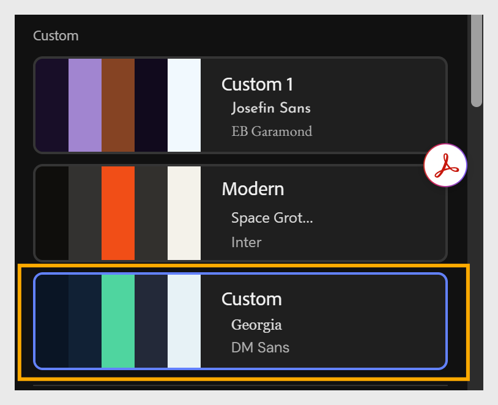

# Criar um tema

Duas maneiras de criar um tema personalizado; ambas adicionam o resultado à sua lista de temas **Personalizados**:

- **Crie do zero** usando a opção **Criar** na barra de ferramentas - configure a paleta de cores, as fontes e outras propriedades e **Salve como novo**.

- **Importar um arquivo JSON personalizado** - exporte um tema existente como JSON, edite-o em um editor de texto ou de código e, em seguida, importe-o novamente.

**Precisa de mais controle?**

Para tipografia por elemento (nomes de lições, nomes de tópicos, cabeçalhos de blocos, legendas), personalização no nível do token de cores e acesso completo ao esquema JSON - o tipo de controle que uma plataforma ou equipe de marcas normalmente deseja, consulte [Personalização avançada de temas](advanced-theme-customization.md).

## Criar um tema do zero

1. Selecione **Criar** na barra de ferramentas para abrir o painel **Temas do curso**.
   

2. Configure a paleta de cores, fontes e outras propriedades do tema conforme necessário.
   

3. Selecione **Salvar como novo** para adicionar o tema à sua lista de temas **Personalizados**.
   

## Criar um tema importando JSON

1. Selecione **Temas** na barra de ferramentas para abrir o painel **Temas do curso**.

2. Passe o mouse sobre o tema que deseja usar como base e selecione **Exportar** para baixá-lo como arquivo JSON.

3. Abra o arquivo JSON em um editor de texto ou de código e atualize suas propriedades, como raio, espaçamento, paleta de cores ou fontes.

4. Salve o arquivo JSON.

5. No Compositor de Conteúdo, selecione **Importar** no painel **Temas do curso**.

6. Escolha o arquivo JSON atualizado no seu computador.

7. Selecione **Salvar como novo** para adicionar o tema à sua lista de temas **Personalizados**.
