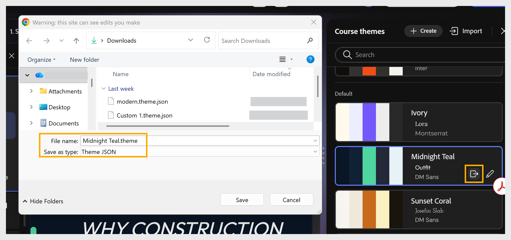

# Exportar um tema

Exporte um tema como arquivo JSON para personalizá-lo fora do Compositor de conteúdo ou compartilhe-o com outros autores.

1. Selecione **Temas** na barra de ferramentas para abrir o painel **Temas do curso**.

2. Passe o mouse sobre o tema que deseja exportar e selecione o ícone **Exportar**.
   

3. Na caixa de diálogo exibida, escolha um local, insira um **Nome do arquivo.**
