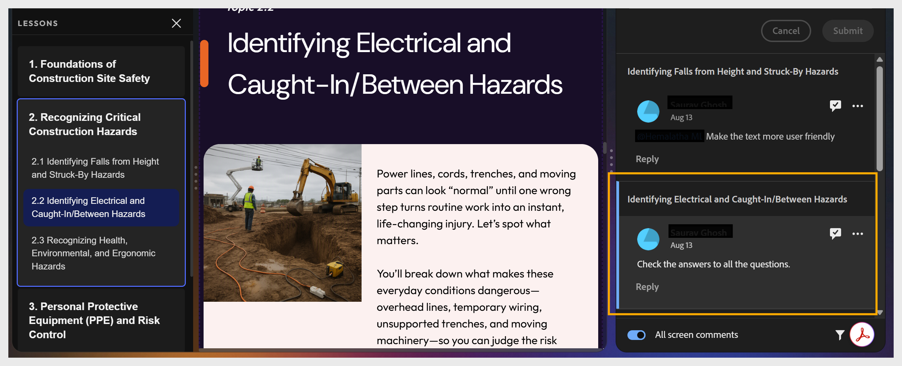

# Gerenciar e responder a comentários

Se você for o autor, poderá usar o painel **Comentários** em seu projeto para exibir e responder aos comentários.

1. Selecione **Comentários** na barra de ferramentas superior. O painel **Comentários** é aberto, mostrando todos os comentários do revisor.

   

2. Selecione qualquer comentário para visualizá-lo no contexto da tela.

   

3. Selecione o ícone de marca de seleção para marcar um comentário como resolvido ou o ícone de **Mais opções** para editá-lo ou excluí-lo.

   

4. Salve o curso atualizado.

5. Selecione **Compartilhar** para atualizar o link de revisão, para que os revisores vejam a versão mais recente.
