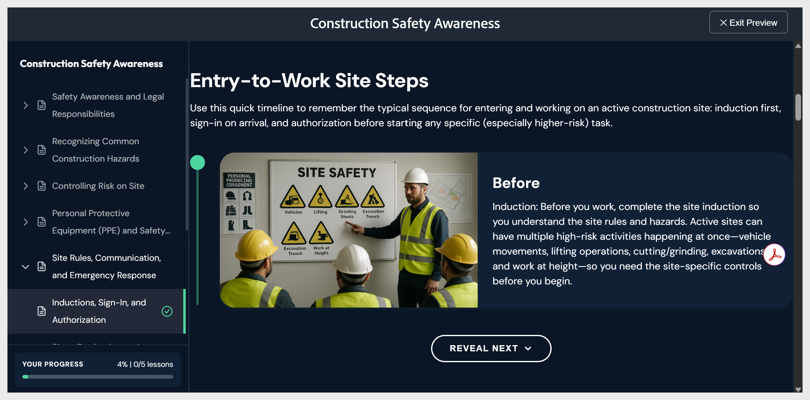

# Visualizar o curso

- Selecione **Visualizar** na barra de ferramentas superior. O curso é exibido exatamente como um aluno o verá, com o tema aplicado, os componentes interativos e o questionário no modo de resposta.

- Navegue usando **Avançar** e **Anterior** ou selecione qualquer tópico no painel de lições à esquerda. Selecione **Sair da Visualização** no canto superior direito para retornar à edição.
