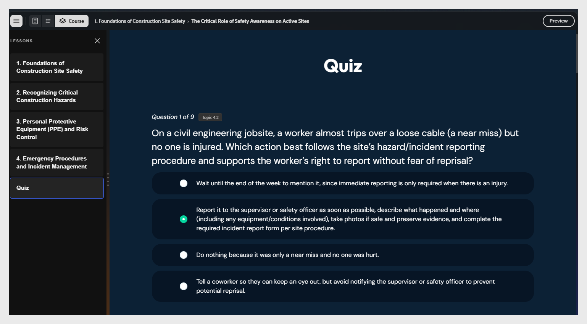

# Revisar e editar o quiz

Um questionário com notas aparecerá no final do curso. Cada pergunta é marcada com o tópico que ela testa.

>[!NOTE]
>
>As verificações de conhecimento incorporadas nas lições não são graduadas. Somente o questionário de fim de aula é classificado.

Para editar uma pergunta:

1. Selecione o texto da pergunta para editá-lo e use as opções de edição de texto para ajustar o estilo.
   

2. Selecione o botão de opção ao lado da opção que deseja marcar como correta.

3. Você também pode atribuir uma pontuação à resposta correta.
   

4. Para excluir uma pergunta, selecione **Remover opção**.

5. Para regenerar perguntas, pergunte ao assistente: “Regenerar o quiz para a Lição 1”.
